# STM32CubeMXプラグイン インストール手順

「System Workbench for STM32F」に、プロジェクト・テンプレートを生成するためのツール「STM32CubeMXプラグイン」をインストールします。

## インストール媒体取得

下記ページを開きます。

STSW-STM32095 
https://www.st.com/content/st_com/en/products/development-tools/software-development-tools/stm32-software-development-tools/stm32-configurators-and-code-generators/stsw-stm32095.html

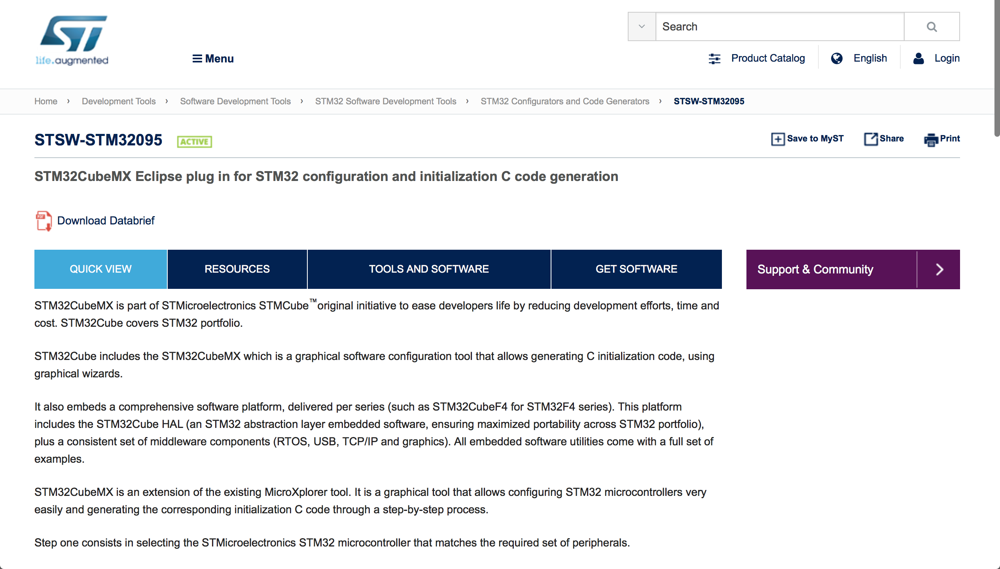

ページ下部の「Get Software」をクリックして、インストール媒体をダウンロードします。

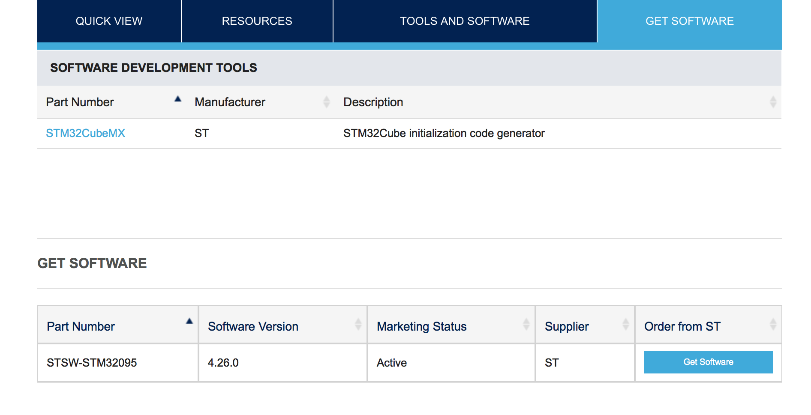

「en.stsw-stm32095.zip」というファイルがダウンロードされます。

こちらは解凍せずに、そのまま保持してください。

## インストール実行

「System Workbench for STM32F」を起動します。

Eclipseメニューから「Install New Software...」を実行します。

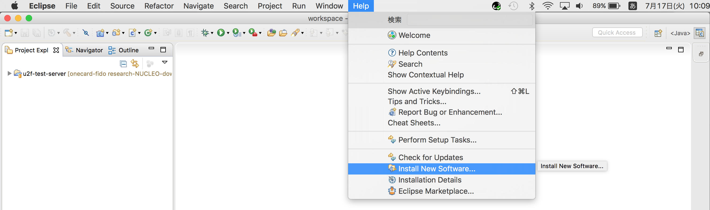

表示された画面で「Add...」ボタンをクリックします。

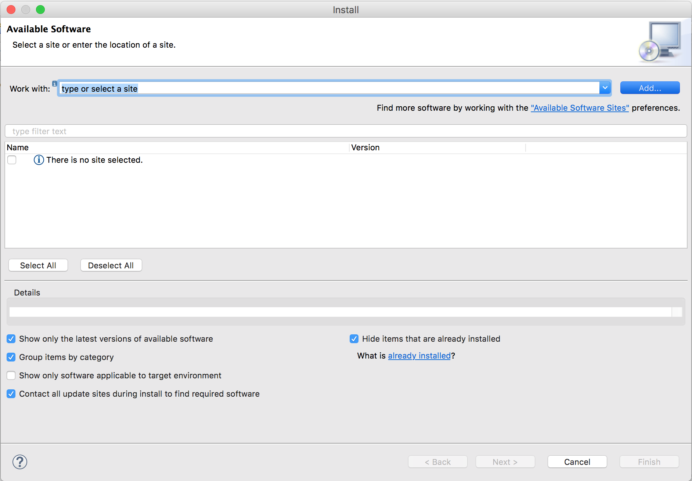

表示されたポップアップの「Archive...」ボタンをクリックします。

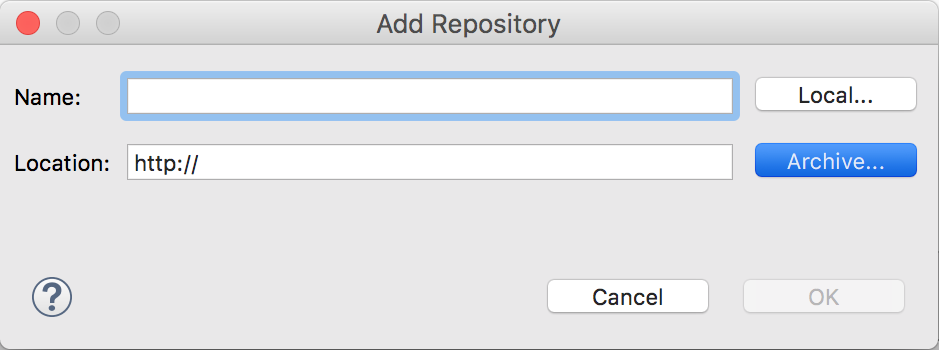

ファイル選択ダイアログで、先ほどダウンロードしたzipファイル「en.stsw-stm32095.zip」を選択します。

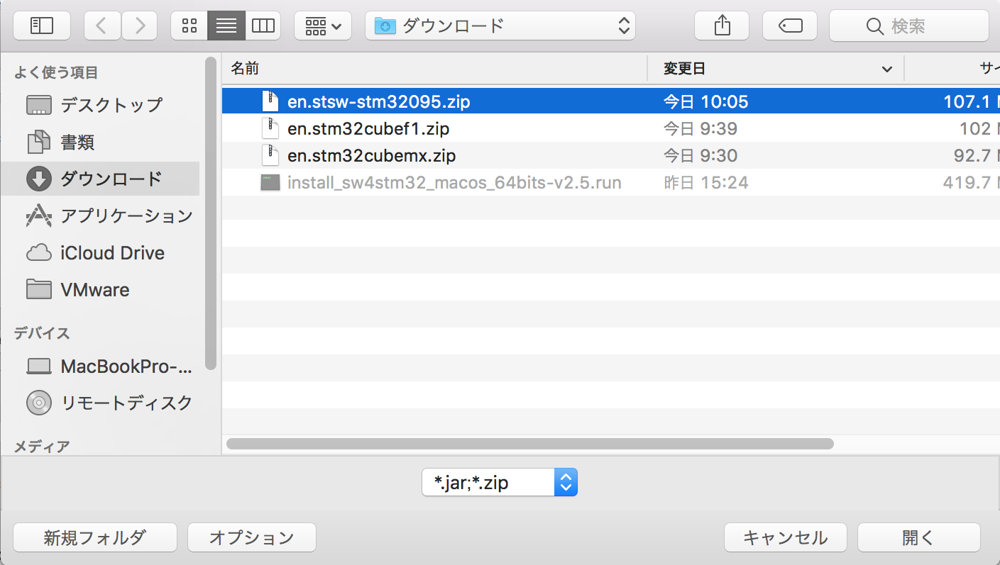

Name欄はブランクのままで「OK」ボタンをクリックします。

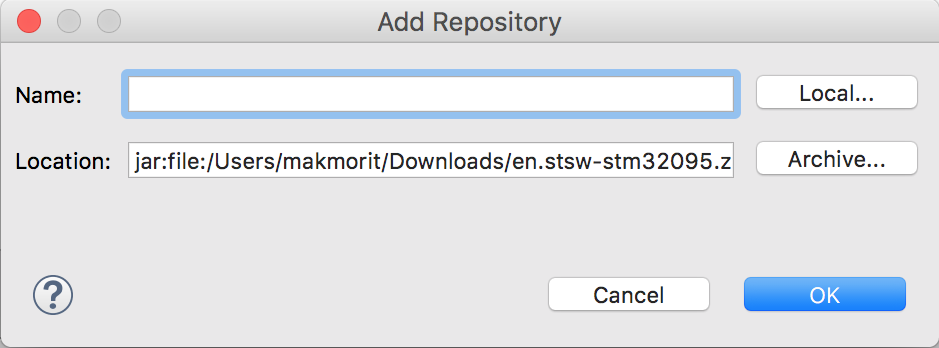

画面の一覧表の「STM32CubeMX_Eclipse_Plugin」をチェックして「Next」ボタンをクリックします。

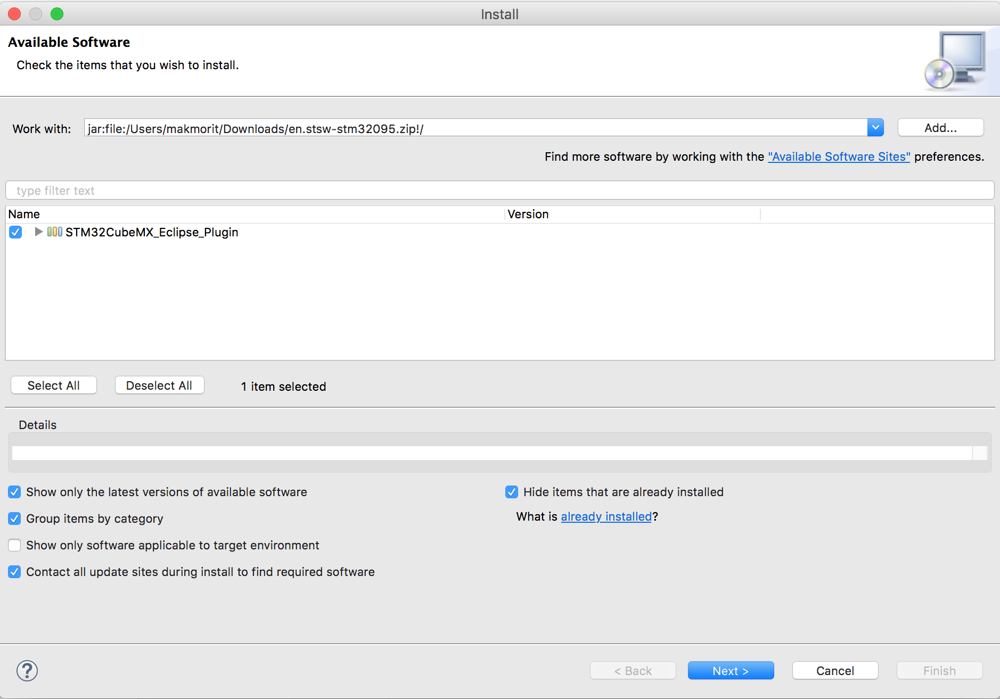

次の画面でも「Next」ボタンをクリックします。

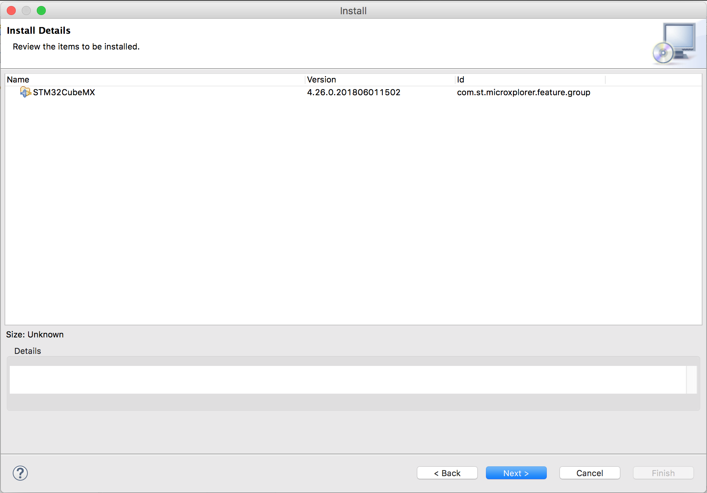

上のラジオボタンを選択して同意し「Finish」ボタンをクリックします。

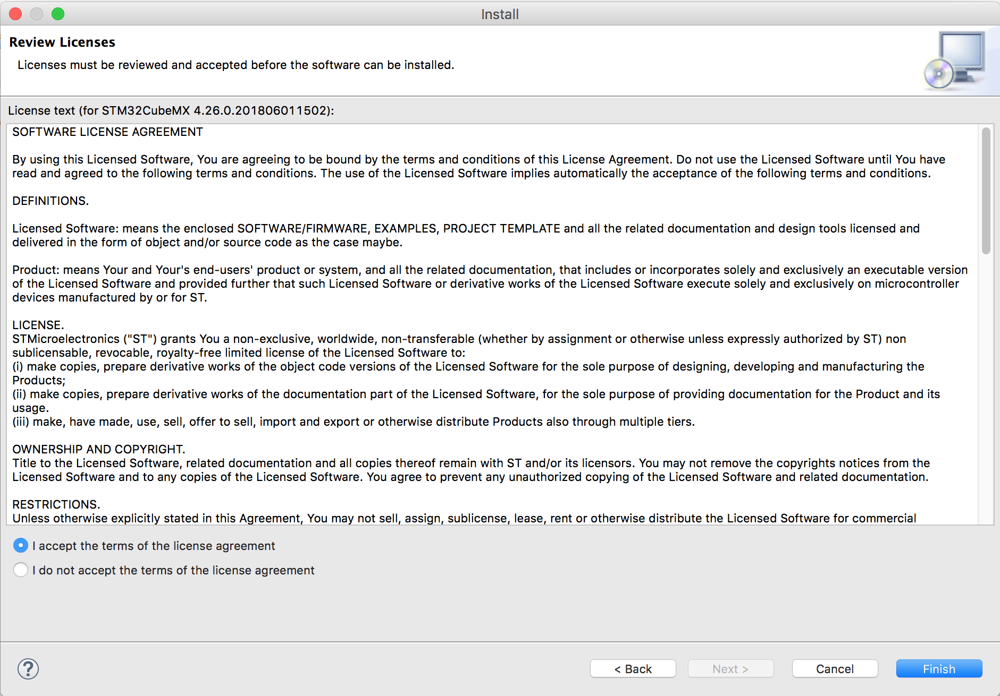

以下のような警告が表示されたら「OK」ボタンをクリックします。

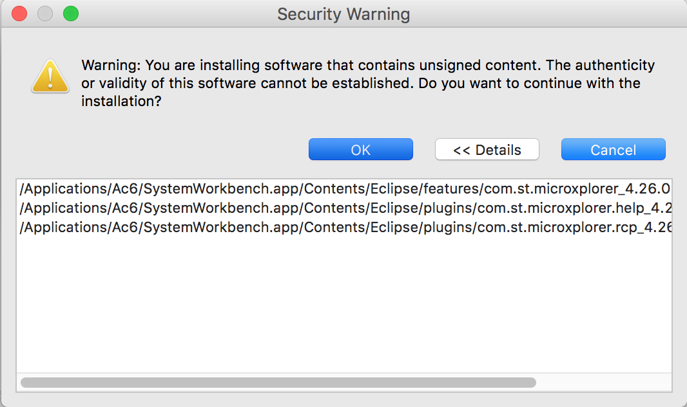

Eclipseを再起動する旨のメッセージが表示されるので「Yes」ボタンをクリックします。

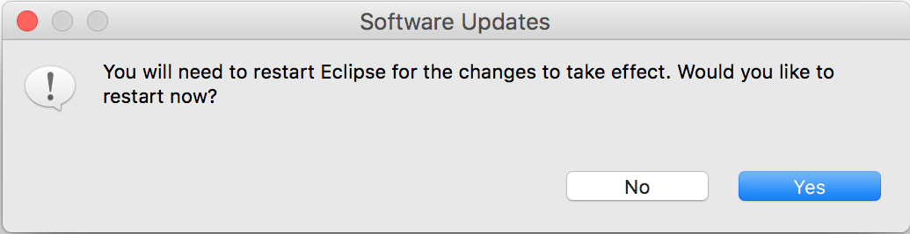

Eclipseが再起動されます。

## 起動確認

EclipseメニューでOpen Perspectiveを実行します。

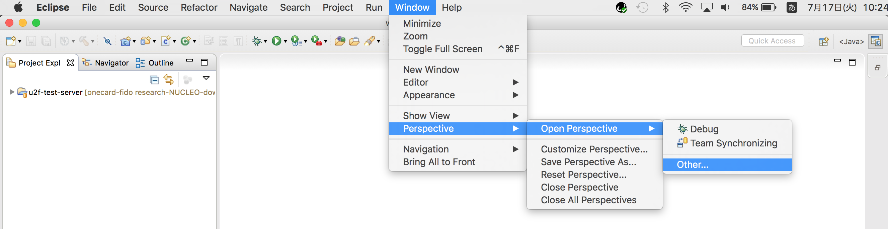

表示された一覧から「STM32CubeMX」を選択し「OK」ボタンをクリックします。

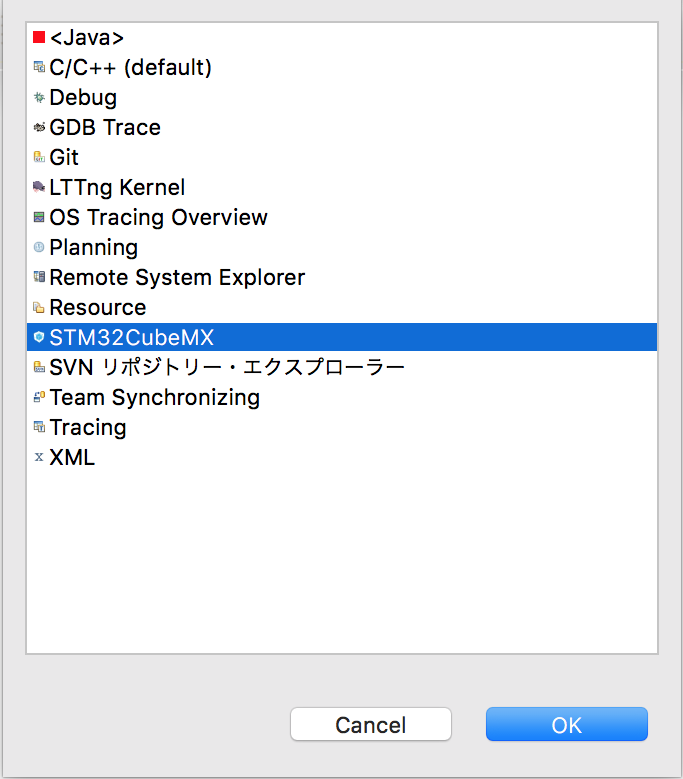

STM32CubeMXが立ち上がることを確認します。

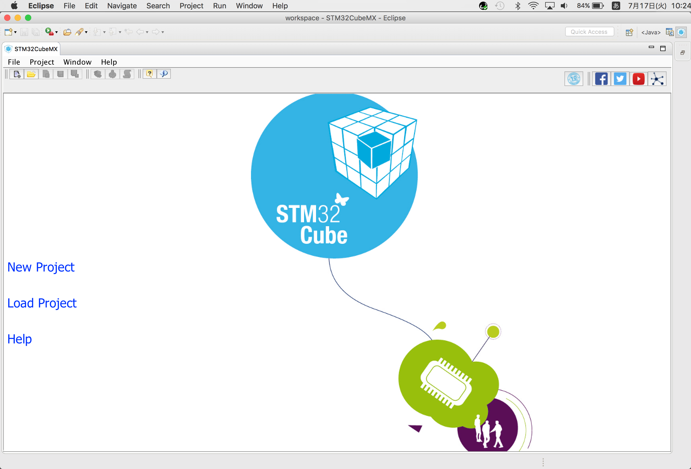

以上で、STM32CubeMXプラグインのインストールは完了です。
