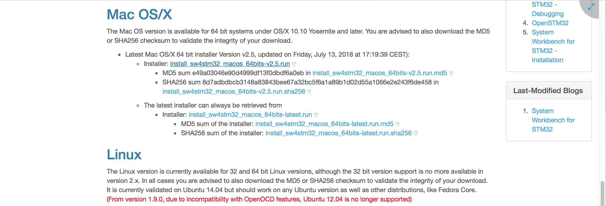
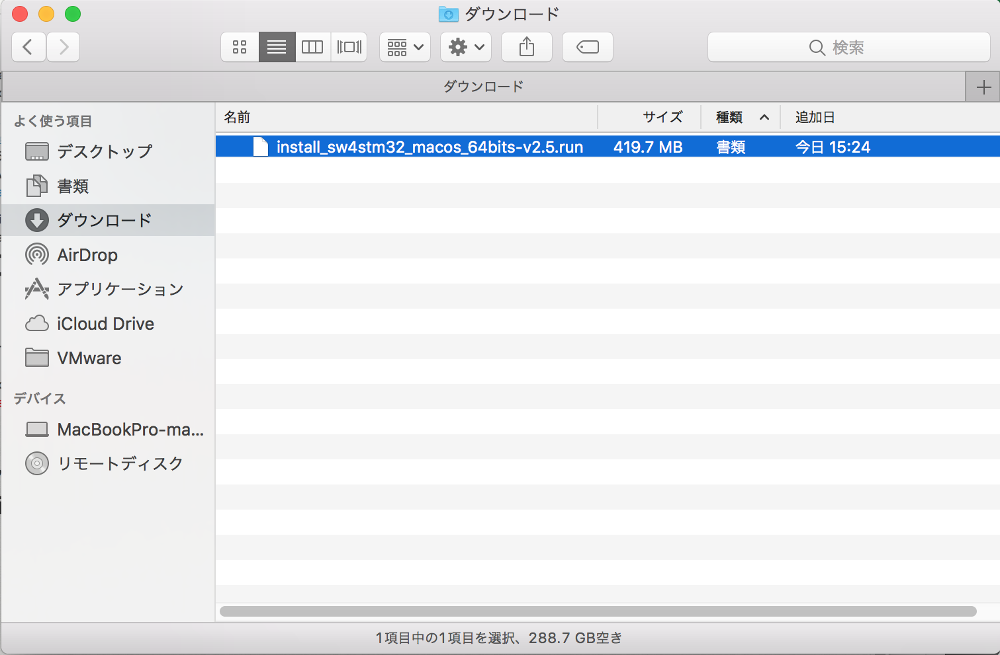
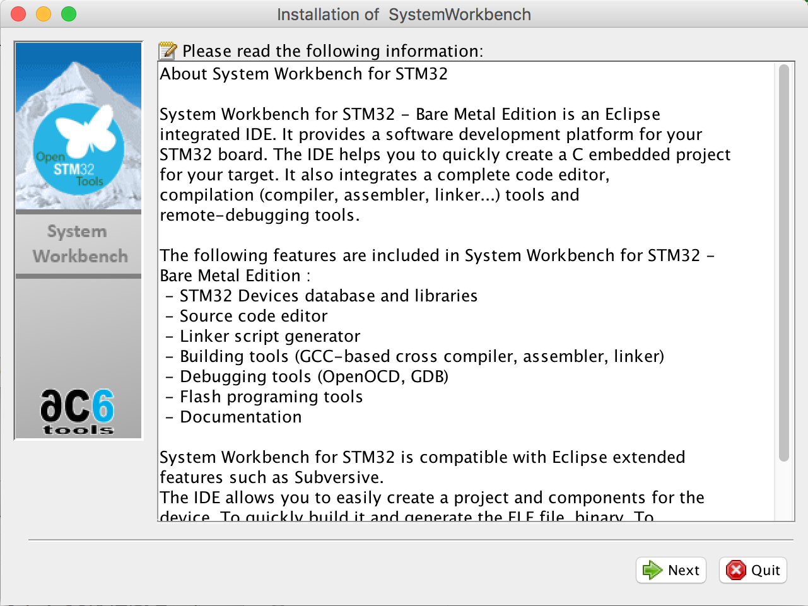
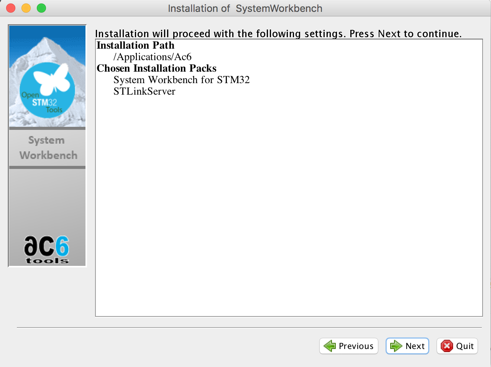
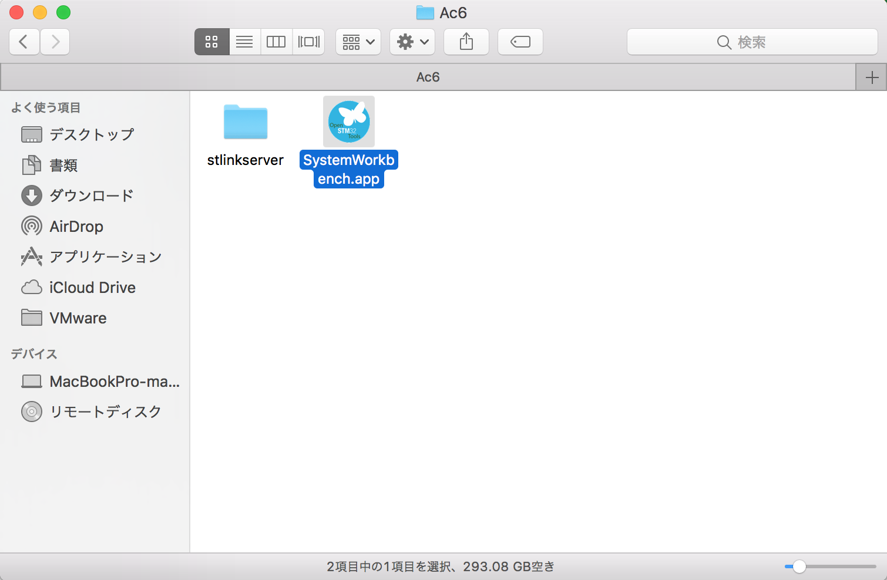

# System Workbench for STM32F インストール手順

Eclipseベースの開発環境である「System Workbench for STM32F」をインストールします。

## インストール媒体取得

下記のURLを開き、まずはユーザー登録をしておきます。<br>
http://www.openstm32.org/HomePage

ユーザー登録を完了したら、ログインを実行し、下記のページにアクセスします。<br>
http://www.openstm32.org/Downloading%2Bthe%2BSystem%2BWorkbench%2Bfor%2BSTM32%2Binstaller



Mac OS/XのInstallerをクリックしてダウンロードします。

「install_sw4stm32_macos_64bits-v2.5.run」というファイルがダウンロードフォルダーに保存されます。



## インストール実行

この「install_sw4stm32_macos_64bits-v2.5.run」というファイルは、ダブルクリックしても動作しません。<br>
以下のように、実行権限をつけた上で実行させます。

```
MacBookPro-makmorit-jp:~ makmorit$ cd /Users/makmorit/Downloads/
MacBookPro-makmorit-jp:Downloads makmorit$ ls -al
total 819784
drwx------   5 makmorit  staff        170  7 16 15:27 .
drwxr-xr-x+ 38 makmorit  staff       1292  7 16 13:34 ..
-rw-r--r--@  1 makmorit  staff       6148  7 16 15:27 .DS_Store
-rw-r--r--   1 makmorit  staff          0 12 21  2017 .localized
-rw-r--r--@  1 makmorit  staff  419717330  7 16 15:24 install_sw4stm32_macos_64bits-v2.5.run
MacBookPro-makmorit-jp:Downloads makmorit$ chmod +x install_sw4stm32_macos_64bits-v2.5.run
MacBookPro-makmorit-jp:Downloads makmorit$ ./install_sw4stm32_macos_64bits-v2.5.run
Checking integrity... (could take a while, -m to bypass)
Extracting JRE... done
Logging initialized at level 'INFO'
Commandline arguments:
Detected platform: mac_osx,version=10.12.6,arch=x86,symbolicName=null,javaVersion=1.8.0_151
MacBookPro-makmorit-jp:Downloads makmorit$
```

PCに導入されているJava Runtime Edition（JRE）により自動解凍され、下記のようなインストーラーが起動します。



画面の指示にしたがい、インストールを進めます。



インストールが終了したら、アプリケーション・フォルダー内にアイコンができていることを確認します。



今後、System Workbench起動時は、このアイコンをダブルクリックします。

以上で「System Workbench for STM32F」のインストールは完了です。
