# プロジェクト新規作成手順

「System Workbench for STM32F」上で、STM32F103用プロジェクトを新規作成する手順を掲載します。

## 手順

STM32CubeMXプラグインメニューの「New Project」を実行します。


Board Selector画面で「NUCLEO-F103RB」を選択して「Start Project」ボタンをクリックします。

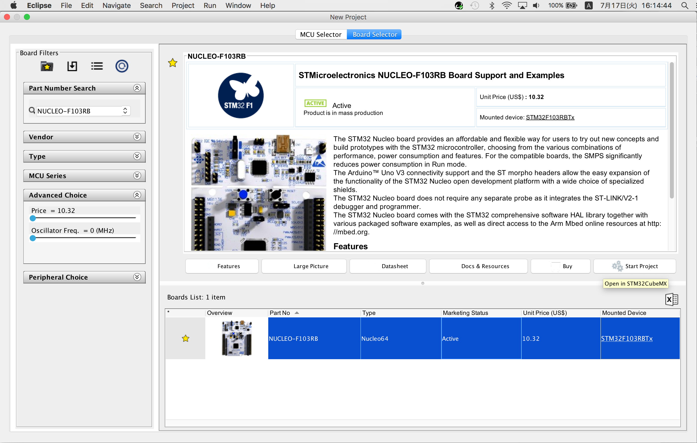

下図のようなポップアップが表示されたら「はい(Y)」ボタンをクリックします。

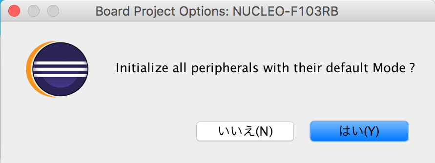

下図のような設定画面に切り替わります。

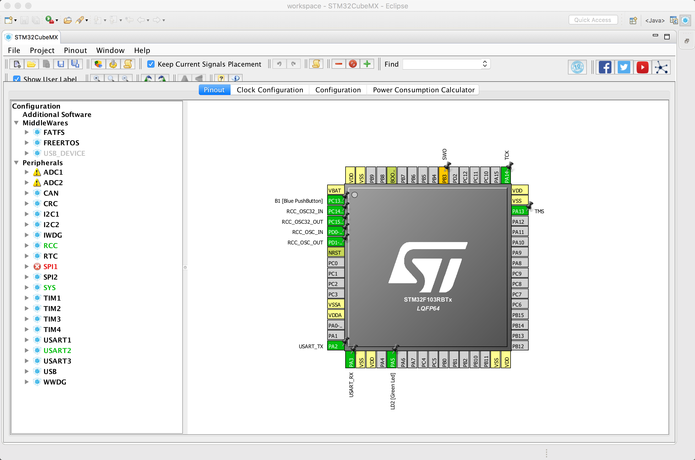

「Project --> Settings」を実行します。

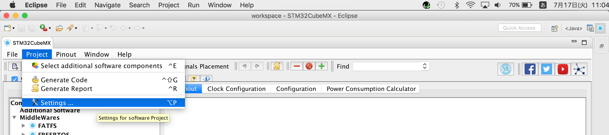

Project Name、Project Location、Toolchain / IDEを設定したのち、「OK」ボタンをクリックします。

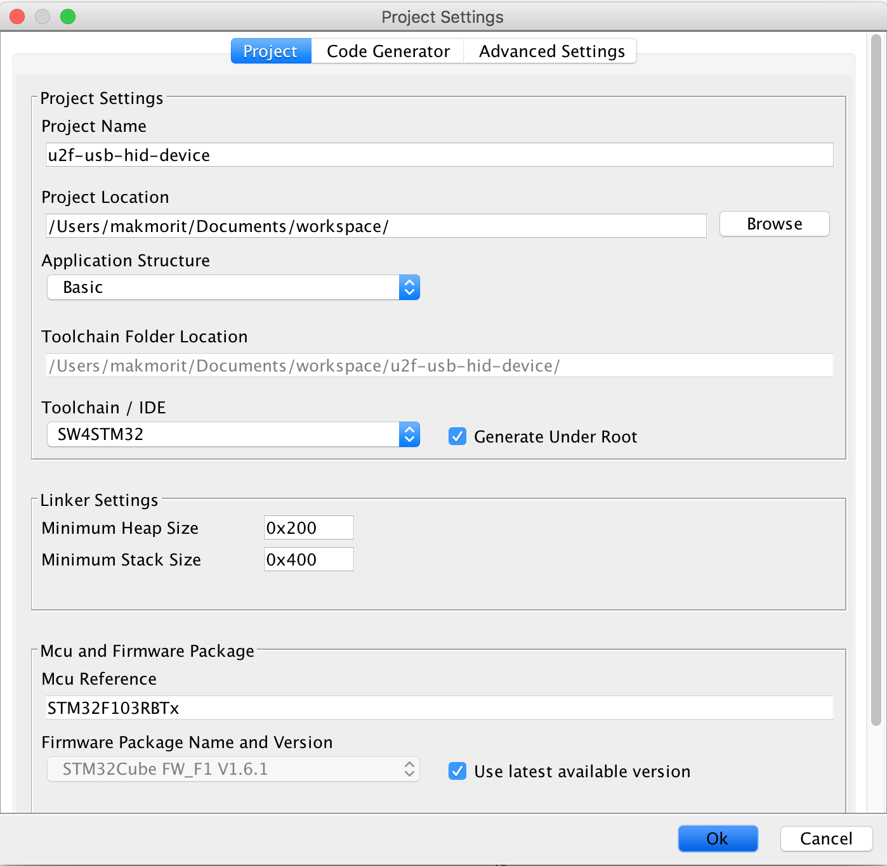

左ペインの「Peripherals」から「USB --> Device(FS)」を選択します。<br>
その後、同じく左ペインの「MiddleWares」から「USB_DEVICE --> Human Interface Device Class」を選択します。

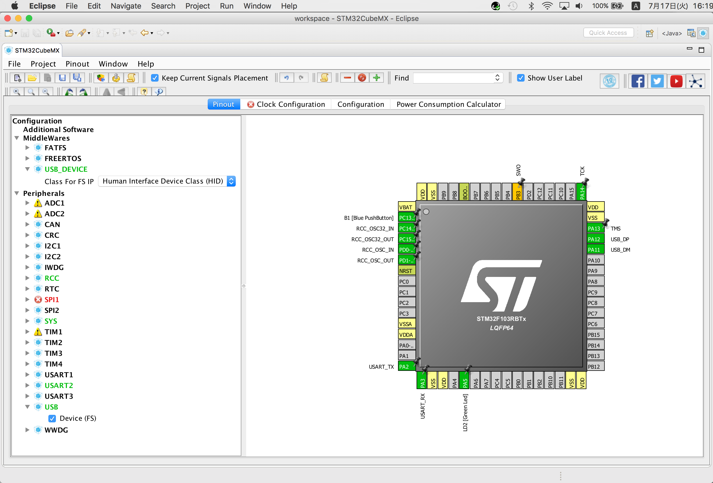

設定画面のタブ「Clock Configuration」をクリックすると、下図のようなポップアップが表示されるので「はい(Y)」ボタンをクリックします。

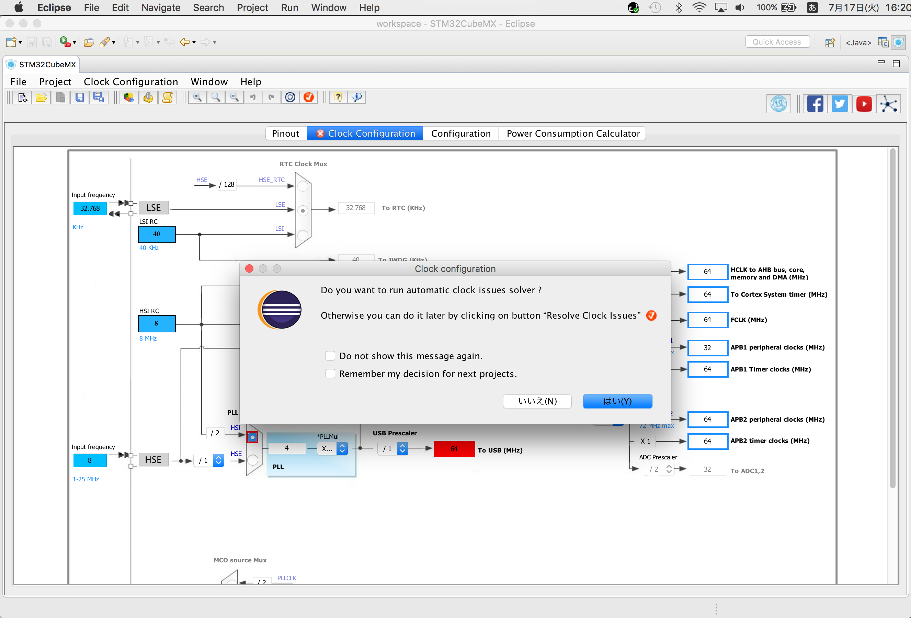

先ほどのメッセージの通り、Resolve Clock Issuesのアイコンをクリックすると、クロックが48MHzに変更されエラーが解消します。

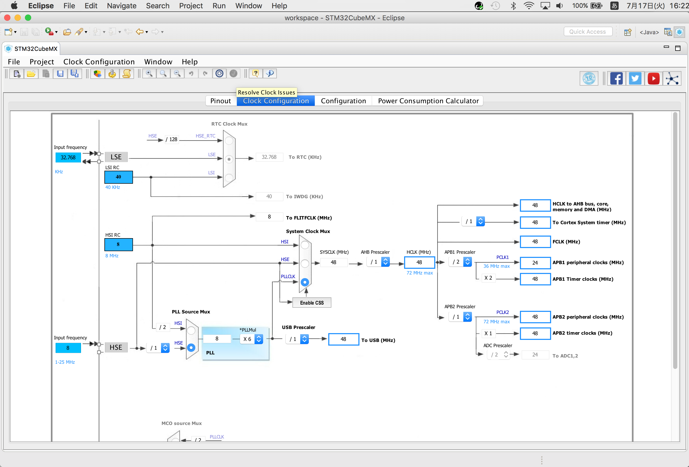

「Project --> Generate Code」を実行します。

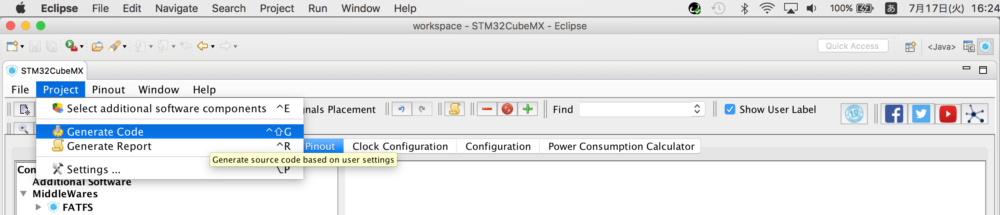

下図のようなポップアップが表示されたら「Open Project」ボタンを実行します。

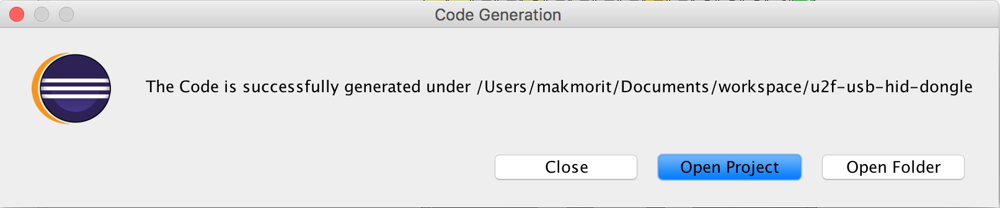

下図のようなポップアップが表示されたら「開く」を実行します。

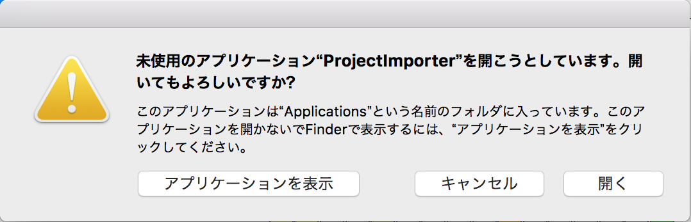

下図のようなポップアップが表示されればEclipseへのインポートは完了です。

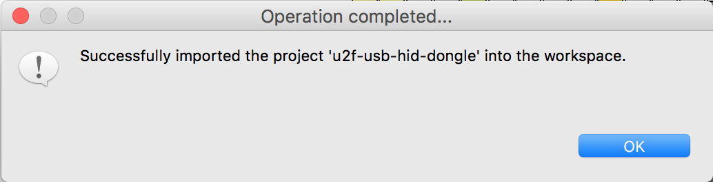

Eclipseを参照すると「u2f-usb-hid-device」プロジェクトが生成されていることが確認できます。

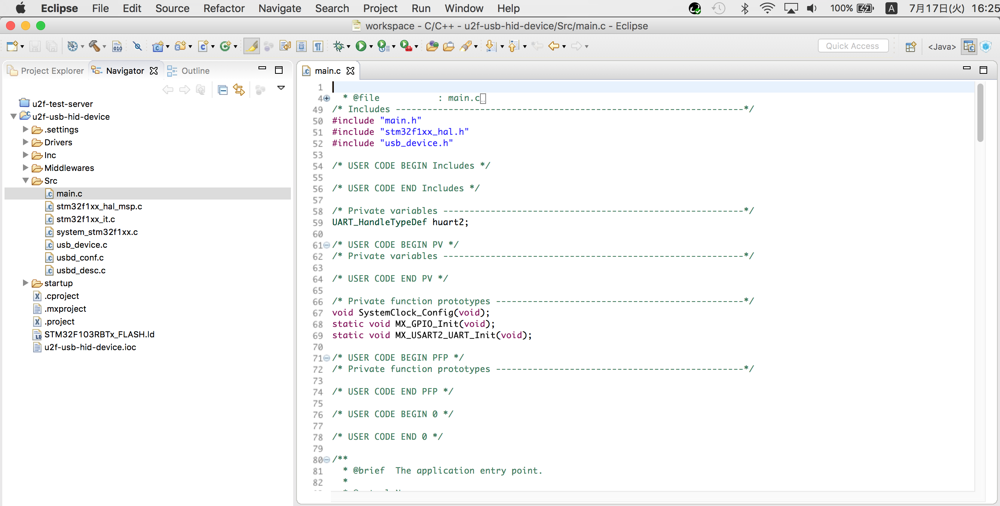

以上で、プロジェクト新規作成は完了です。

## 初期動作確認

新規作成されたプロジェクトが、NUCLEO-F103RBで動作するかどうか確認します。

### リリースビルド

Eclipseメニューバーからリリースビルドを実行してみます。

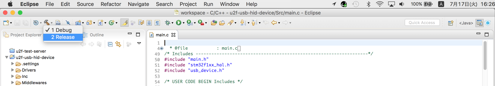

コンソールに「Build Finished」と表示されます。<br>
別段のエラーが表示されなければ、ビルドは完了です。


### NUCLEOにプログラムを書込み

NUCLEO-F103RBとPCを接続します。<br>
USB HIDデバイスとしてPCに認識させるため、別途治具を使用してUSBポートを接続します。

注意点として、USBのD+（PA12）が1.5kOhmの抵抗器でプルアップされている必要があります。

その後、Eclipseメニューバーから「Run As --> Ac6 STM32 C/C++ Application」を実行します。

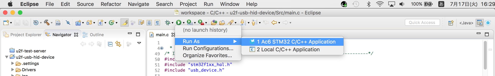

この操作により、プログラムがNUCLEOに書き込まれるようです。<br>
コンソールには以下のように表示されます。

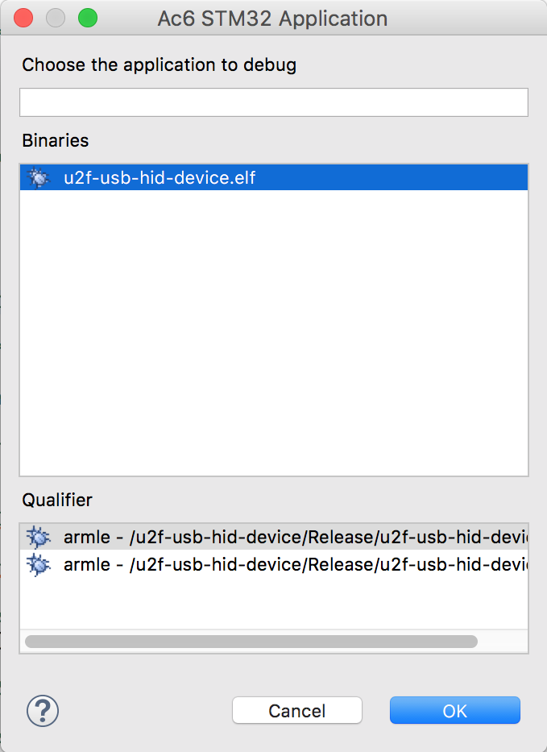

```
Info : clock speed 950 kHz
Info : STLINK v2.1 JTAG v29 API v2 M18 VID 0x0483 PID 0x374B
Info : using stlink api v2
Info : Target voltage: 3.266012
Info : Stlink adapter speed set to 950 kHz
Info : STM32F103RBTx.cpu: hardware has 6 breakpoints, 4 watchpoints
Info : Stlink adapter speed set to 950 kHz
adapter speed: 950 kHz
target halted due to debug-request, current mode: Thread
xPSR: 0x01000000 pc: 0x08002f90 msp: 0x20005000
Info : Stlink adapter speed set to 4000 kHz
adapter speed: 4000 kHz
** Programming Started **
auto erase enabled
Info : device id = 0x20036410
Info : flash size = 128kbytes
target halted due to breakpoint, current mode: Thread
xPSR: 0x61000000 pc: 0x2000003a msp: 0x20005000
wrote 13312 bytes from file Release/u2f-usb-hid-device.elf in 0.804751s (16.154 KiB/s)
** Programming Finished **
** Verify Started **
target halted due to breakpoint, current mode: Thread
xPSR: 0x61000000 pc: 0x2000002e msp: 0x20005000
target halted due to breakpoint, current mode: Thread
xPSR: 0x61000000 pc: 0x2000002e msp: 0x20005000
verified 12780 bytes in 0.203663s (61.280 KiB/s)
** Verified OK **
** Resetting Target **
Info : Stlink adapter speed set to 950 kHz
adapter speed: 950 kHz
shutdown command invoked
```

以上でプログラムの書き込みは完了です。

### 動作確認

プログラムが書き込まれたNUCLEOが、USB HIDデバイスとしてPCから認識されているか確認します。

macOSのシステムレポート画面を起動し、USB装置ツリーを表示させます。

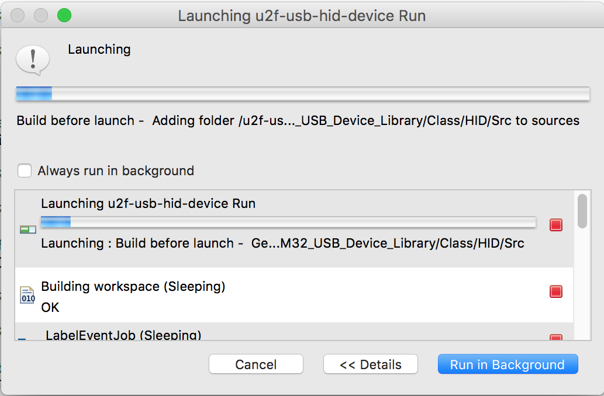


上図のように「STM32 Human interface」というデバイス名が表示されれば、動作はOKです。

今後は、本手順書により生成されたプロジェクトのコード・テンプレートをベースに、調査／開発を進めるものとします。
