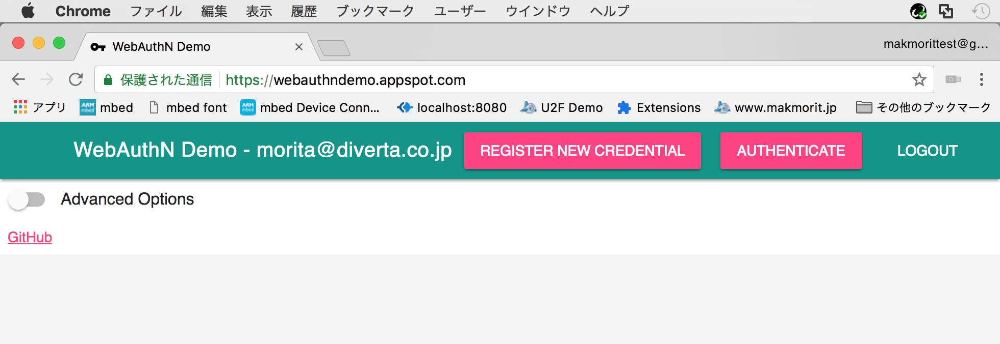
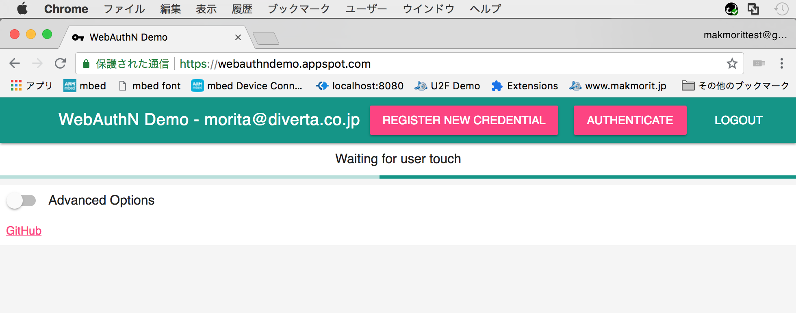
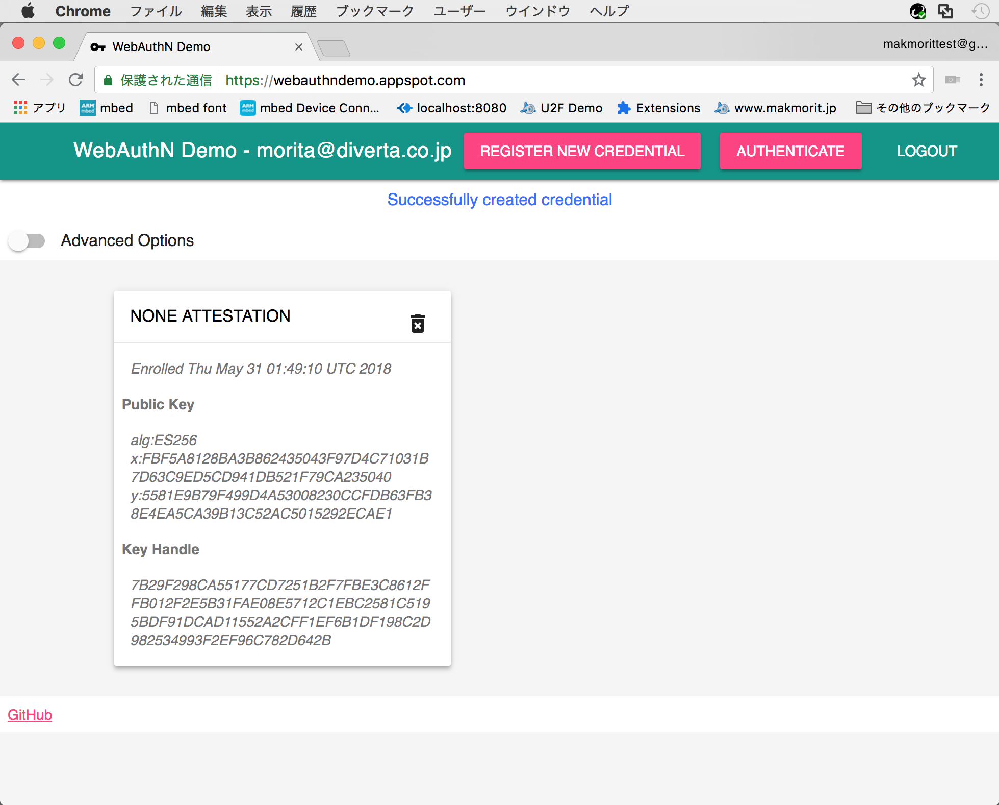
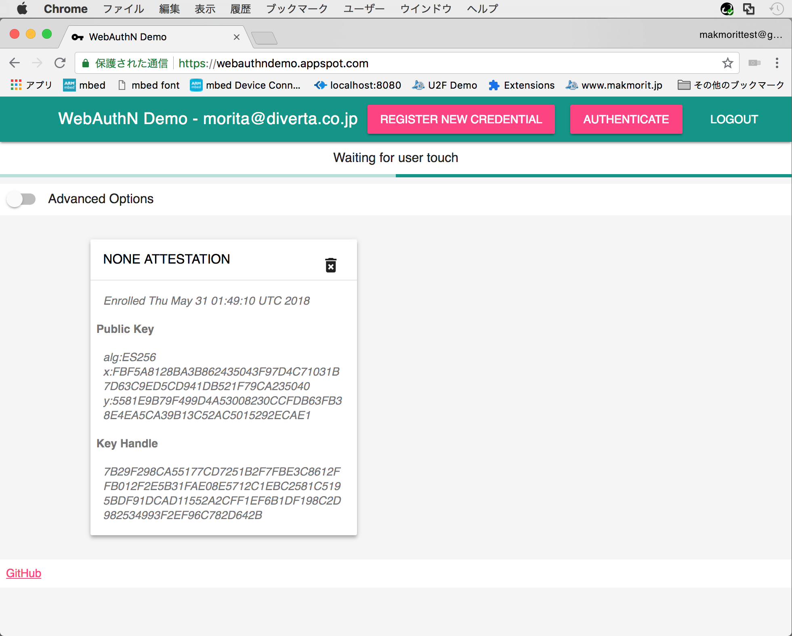
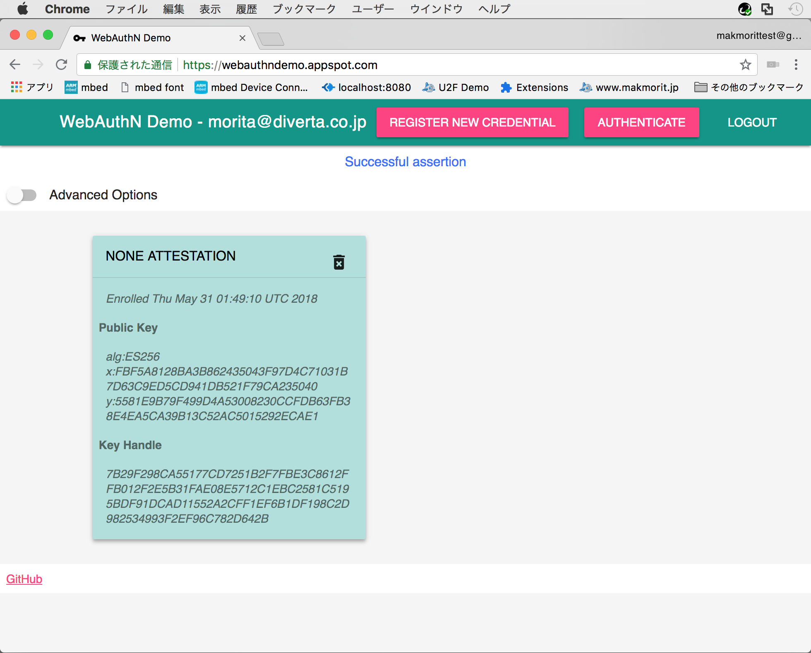

# ChromeのWebAuthnについて

Chrome 67以降で正式サポート予定のWebAuthnについて、各種調査を行います。

## デモサイトとYubikey NEOを使った確認

Chrome 67（現在の公式最新バージョン）で、[デモサイト](https://webauthndemo.appspot.com/)とYubikey NEOを使い、WebAuthnによるユーザー登録と認証を行いました。

### ユーザー登録

デモサイトページ上部の「REGISTER NEW CREDENTIAL」をクリックします。



ボタン下部のバーに「Waiting for user touch」というメッセージが表示されたら、Yubikey NEOに指を１回タッチします。



ボタン下部のバーに「Successfully created credential」というメッセージが表示されたら、ユーザー登録は成功です。



### 認証

デモサイトページ上部の「AUTHENTICATE」をクリックします。


ボタン下部のバーに「Waiting for user touch」というメッセージが表示されたら、Yubikey NEOに指を１回タッチします。



ボタン下部のバーに「Successful assertion」というメッセージが表示されたら、認証は成功です。



## ご参考：WebAuthnのJavaScript API

Chromeブラウザーで、Webページのソースコードを参照したところ、WebAuthnのJavaScript APIのコードを取得することができました。<br>
（[コード全量は、こちらに格納しています](assets02/webauthn.js)）

以下に抜粋を掲載させていただきます。

### ユーザー登録処理

デモサイトページ上部の「REGISTER NEW CREDENTIAL」をクリックすると、`addCredential()`というJavaScriptが実行されます。<br>
ここでFIDO 2.0サーバーに`/BeginMakeCredential`リクエストすると、RPやチャレンジといったサーバーで保持している情報が戻ってきます。

```
window.addEventListener('load', () => {
  onClick('#credential-button', addCredential);
  :

function addCredential() {
  :
  return _fetch('/BeginMakeCredential', {
   advanced: isChecked('#switch-advanced'),
   advancedOptions: JSON.stringify(advancedOptions)
  }).then(options => {
    :
    makeCredentialOptions.rp = options.rp;
    makeCredentialOptions.user = options.user;
    makeCredentialOptions.user.id = strToBin(options.user.id);
    makeCredentialOptions.challenge = strToBin(options.challenge);
    makeCredentialOptions.pubKeyCredParams = options.pubKeyCredParams;
    :
```
これらの情報を、FIDO 2.0デバイスやU2F HIDデバイスに引き渡して、デバイスから生成されたクレデンシャル（公開鍵／署名などの情報）を取得する流れになります。<br>
このデバイスとのやり取りは、Firefoxでの実装と同様、ブラウザー内に実装されている`navigator.credentials.create`というAPIを実行することにより行われます。

```
    :
    return navigator.credentials.create({
      "publicKey": makeCredentialOptions
      });
    }).then(attestation => {
    :
```

### 認証処理

デモサイトページ上部の「AUTHENTICATE」をクリックすると、`getAssertion()`というJavaScriptが実行されます。
ここでFIDO 2.0サーバーに`/BeginGetAssertion`リクエストすると、公開鍵やRP、チャレンジといったサーバーで保持している情報が戻ってきます。

```
window.addEventListener('load', () => {
  :
  onClick('#authenticate-button', getAssertion);
  :

function getAssertion() {
  :
  _fetch('/BeginGetAssertion').then(parameters => {
    :
    requestOptions.challenge = strToBin(parameters.challenge);
    if ('timeout' in parameters) {
      requestOptions.timeout = parameters.timeout;
    }
    if ('rpId' in parameters) {
      requestOptions.rpId = parameters.rpId;
    }
    if ('allowCredentials' in parameters) {
      requestOptions.allowCredentials = credentialListConversion(parameters.allowCredentials);
    }
    :
```
これらの情報を、FIDO 2.0デバイスやU2F HIDデバイスに引き渡して、デバイスから登録されているクレデンシャル（公開鍵／署名などの情報）を取得する流れになります。<br>
こちらも、ブラウザー内に実装されている`navigator.credentials.get`というAPIを実行することにより行われます。

```
    :
    return navigator.credentials.get({
      "publicKey": requestOptions
      });
    }).then(assertion => {
    :
```
