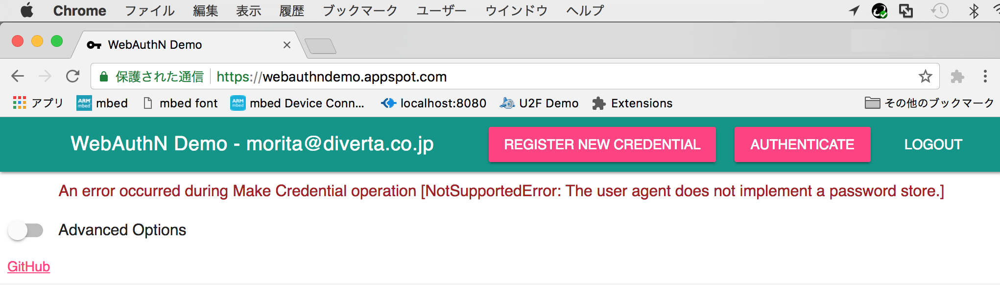

# ChromeのWebAuthnについて

Chrome 67以降で正式サポート予定のWebAuthnについて、各種調査を行います。

## デモサイトとYubikey NEOを使った確認

Chrome 66（現在の公式最新バージョン）で、[デモサイト](https://webauthndemo.appspot.com/)とYubikey NEOを使い、WebAuthnによるユーザー登録と認証を行いました。

結果としては未サポートの旨のメッセージが表示されてしまいます。

Chrome 67がリリースされ次第、あらためて再試行したいと思います。
