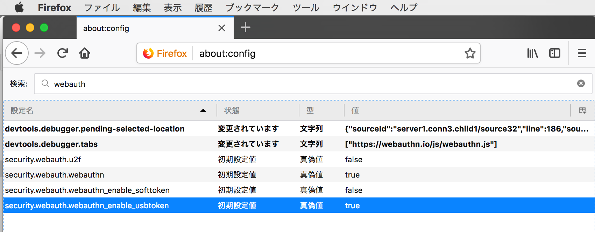
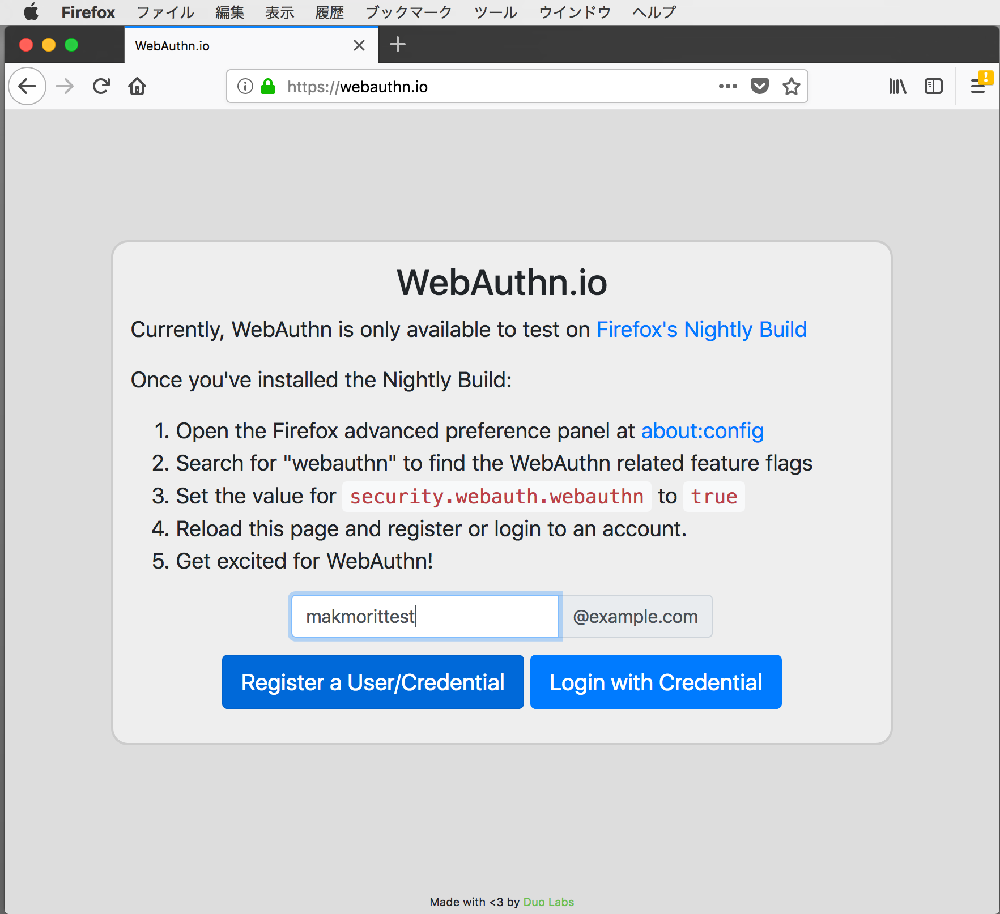
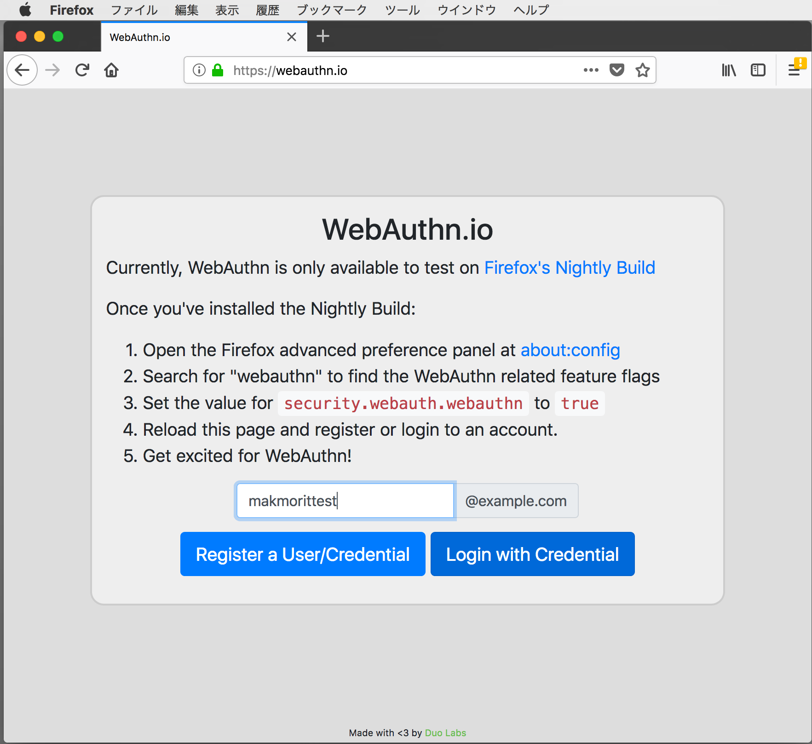

# Firefox 60のWebAuthnについて

Firefox 60で正式サポートしているWebAuthnについて、各種調査を行いました。

## FirefoxのWebAuthn関連設定

下図は、Firefoxの環境設定画面（about:config）を開き、Web Authentication関連の設定を検索したところです。

U2F関連の旧い設定と思しき「security.webauth.U2F」はデフォルトでfalse（使用不可）になっており、代わりに、新しいWebAuthn設定である「security.webauth.webauthn」がデフォルトでtrue（使用可能）になっています。

そのうえで、Yubikey NEOをはじめとするUSB HIDトークンが「security.webauth.webauthn_enable_usbtoken」の設定により使用可能となっているようです。 
こちらもデフォルトでtrue（使用可能）に設定されております。

ただし残念ながら、上記設定一覧からも確認できる通り、BLEトークンのサポートはないようです。

#### ご参考：BLEトークン・サポートについてのFIDO見解

複数デスクトップからのマルチセッション・サポートができない限り、BLEトークンをサポートすべきではないとの見解のようです。 
https://github.com/w3c/webauthn/issues/649 
https://github.com/w3c/webauthn/pull/688 
2018/05/14現在、こちらの状況は変わっていない様子です。

他方、上記スレッド主であるVASCO社では、BLEトークンをリリースしているようです。 
https://www.amazon.com/DIGIPASS-SecureClick-FIDO-U2F-Security/dp/B01M0DPK3K 
ただしよく見ると、PCでの利用は（おそらく独自制作の）USBドングルとセットになっている様子です。 
これであれば確かに、現状のFIDOのブラウザーサポート内容の範囲内、すなわち 
・デフォルトでサポートされる「USB HIDデバイス」として動作する 
・制御の仕方次第ではマルチセッション・サポートの考慮なしで動作する 
ことが可能になっているのかと存じます。 

## デモサイトとYubikey NEOを使った確認

Firefox 60でデモサイトとYubikey NEOを使い、WebAuthnによるユーザー登録と認証ができることを確認しました。

### デモサイトのページ

Yubikey NEOをUSBポートに挿したのち、Firefoxを起動します。 
起動したら、WebAuthnデモサイト（[webauthn.io](https://webauthn.io/)）を開きます。

下図のような画面が表示されます。

### ユーザー登録

画面中央のテキストボックスに、登録したいユーザー名（半角英数文字）を入力してから「Register a User/Credential」ボタンをクリックします。

「Registering...」というガイダンスが出たら、あらかじめUSBポートに挿しておいたYubikey NEOを指でタッチします。

「You're logged in!」という画面に遷移すれば、ユーザー登録は成功です。

### 認証

画面中央のテキストボックスに、先ほど登録したユーザー名（半角英数文字）を入力してから「Login with Credential」ボタンをクリックします。

「Logging In...」というガイダンスが出たら、あらかじめUSBポートに挿しておいたYubikey NEOを指でタッチします。

「You're logged in!」という画面に遷移すれば、認証は成功です。

