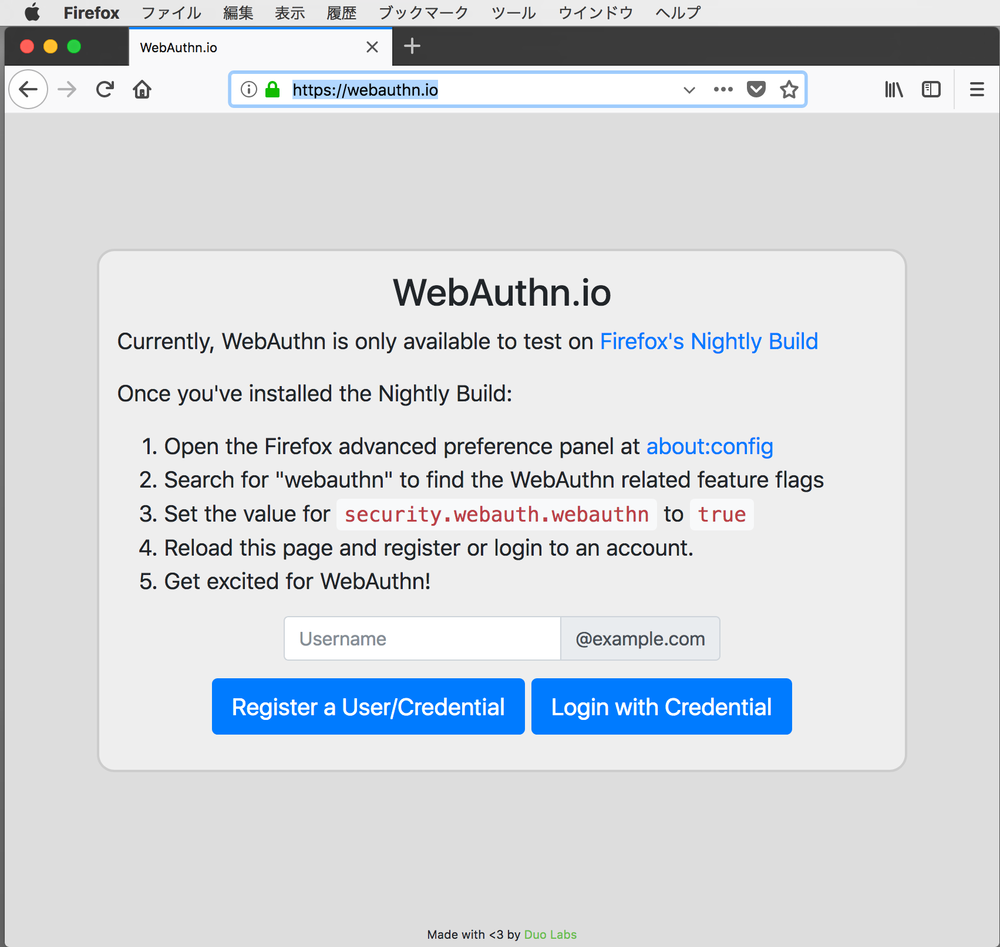
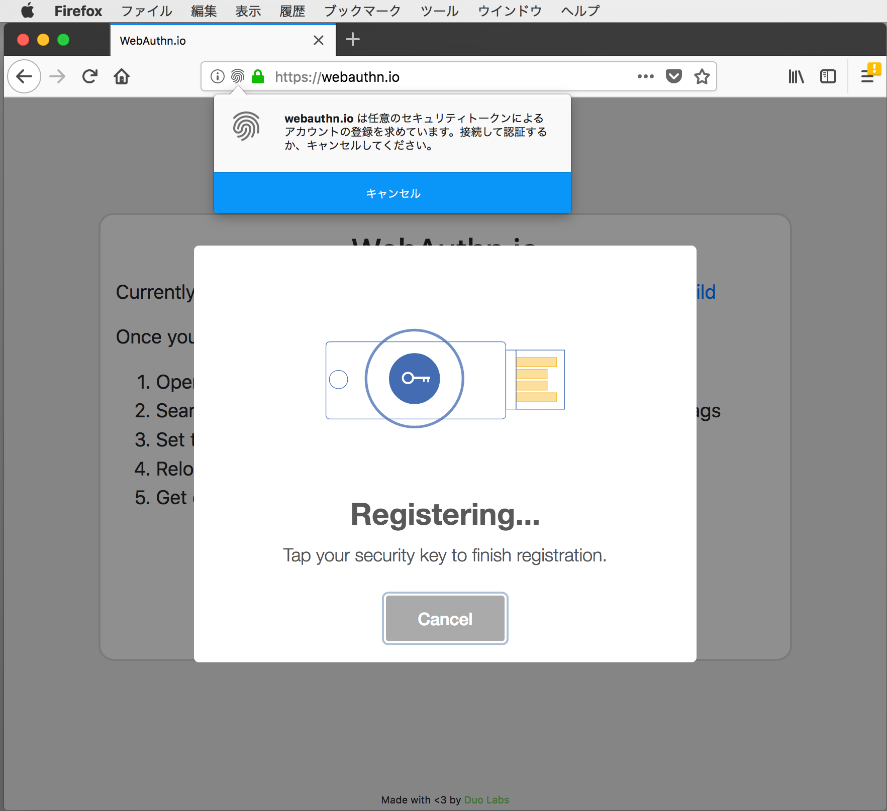
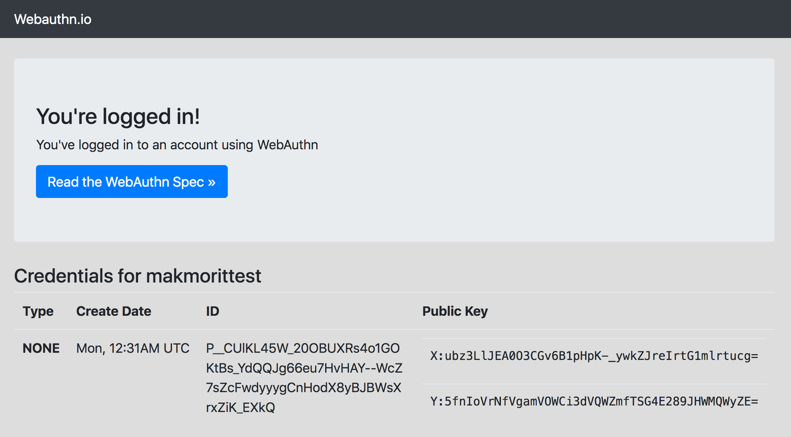
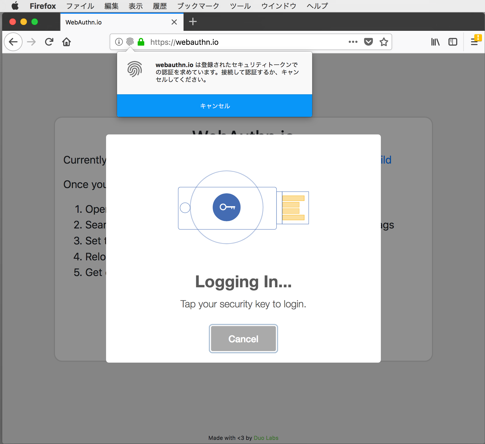
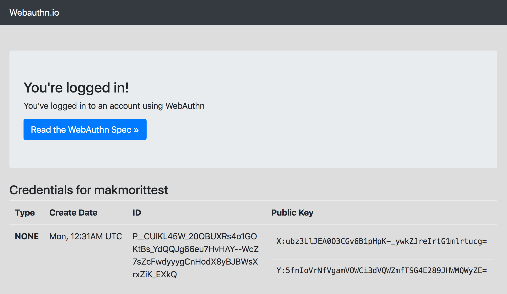

# WebAuthn実装の内部調査

FirefoxのWebAuthn実装について、デモサイトやGeckoエンジンのソースコードを参照しながら詳細調査してみました。

調査の結果、やはり使用できるハードウェアは、現在のところUSBトークンのみのようです。

なお、調査内容は2018/05/15時点でのものです。

## JavaScript API

下記画面のHTML/JavaScriptソースコードを参照します。<BR>
https://github.com/duo-labs/webauthn/blob/master/templates/login.html <br>
https://github.com/duo-labs/webauthn/blob/master/static/js/webauthn.js



２つのボタンに対応するJavaScriptは以下になります。

```
<div class="text-center buttons">                    
    <button class="btn btn-lg btn-primary" type="button" onclick="makeCredential()">Register a User/Credential</button>
    <button class="btn btn-lg btn-primary" type="button" onclick="getAssertion()">Login with Credential</button>
</div>  
```

### ユーザー登録（Register）

画面の「Register a User/Credential」ボタンをクリックすると、`makeCredential()`が呼び出されます。

```
function makeCredential() {
    :
    var credential = null;
    swal({
        title: 'Registering...',
        text: 'Tap your security key to finish registration.',
        :
    $.get('/makeCredential/' + state.user.name, {}, null, 'json')
        .done(function (makeCredentialOptions) {
            :
            // Turn the challenge back into the accepted format
            makeCredentialOptions.challenge = Uint8Array.from(atob(makeCredentialOptions.challenge), c => c.charCodeAt(0));
            // Turn ID into a UInt8Array Buffer for some reason
            makeCredentialOptions.user.id = Uint8Array.from(makeCredentialOptions.challenge)
            :
```
以下のようなポップアップを表示した直後に、画面に入力したユーザーIDを、FIDO 2.0サーバーに引き渡します。<br>



程なく、サーバーからレスポンス`makeCredentialOptions`がもどります。<br>
（`makeCredentialOptions`の中には、U2Fと同じく、ユーザーID、チャレンジが格納されています）

これらを引数とし、WebAuthnの`navigator.credentials.create()`というAPIを実行します。<br>
これはJavaScriptではなく、ブラウザー側の実装となっています。

```
            navigator.credentials.create({
                publicKey: makeCredentialOptions
            }).then(function (newCredential) {
                :
                state.createResponse = newCredential;
                registerNewCredential(newCredential);
                swal.clickConfirm()
            }).catch(function (err) {
                :
                swal.closeModal();
            });
```

`navigator.credentials.create()`では後述のとおり、USBトークン（Yubikey NEOなどのハードウェア）に対して登録データを要求します。<br>
その後、トークンが生成した登録データを受領すると、`registerNewCredential()`を実行してFIDO 2.0サーバーへ返送し、登録処理が完了します。

```
function registerNewCredential(newCredential) {
    :
    $.post('/makeCredential', {
        id: newCredential.id,
        rawId: b64enc(rawId),
        type: newCredential.type,
        attObj: b64RawEnc(attestationObject),
        clientData: b64RawEnc(clientDataJSON),
     }).done(function(response){
        if (response.success) {
            window.location.href = "/dashboard/" + state.user.displayName;
            :
```

登録処理完了後は、適宜別のページに遷移させます。<br>
（上記例では、登録結果を表示するためのページに遷移しています）




### 認証（Login）

画面の「Login with Credential」ボタンをクリックすると、`getAssertion()`が呼び出されます。

```
function getAssertion() {
    :
    setUser();
    $.get('/user/' + state.user.name, {}, null, 'json').done(function (response) {
        console.log(response);
    }).then(function() {        
        swal({
            title: 'Logging In...',
            text: 'Tap your security key to login.',
            :
    $.get('/assertion/' + state.user.name, {}, null, 'json')
        .done(function (makeAssertionOptions) {
            makeAssertionOptions.challenge = Uint8Array.from(atob(makeAssertionOptions.challenge), c => c.charCodeAt(0));
            makeAssertionOptions.allowCredentials.forEach(function (listItem) {
                var fixedId = listItem.id.replace(/\_/g, "/").replace(/\-/g, "+")
                listItem.id = Uint8Array.from(atob(fixedId), c => c.charCodeAt(0));
            });
            :
```
以下のようなポップアップを表示した直後に、画面に入力したユーザーIDを、FIDO 2.0サーバーに引き渡します。<br>



程なく、サーバーからレスポンス`makeAssertionOptions`がもどります。<br>
（`makeAssertionOptions`の中には、U2Fと同じく、チャレンジ、登録された認証データが格納されています）

これらを引数とし、WebAuthnの`navigator.credentials.get()`というAPIを実行します。<br>
これはJavaScriptではなく、ブラウザー側の実装となっています。

```
            navigator.credentials.get({ publicKey: makeAssertionOptions })
                .then(function (credential) {
                    :
                    verifyAssertion(credential);
                    swal.clickConfirm();
                }).catch(function (err) {
                    :
                    swal.closeModal();
                });
```

`navigator.credentials.get()`では後述のとおり、USBトークン（Yubikey NEOなどのハードウェア）に対して認証データを要求します。<br>
その後、トークンが生成した認証データを受領すると、`verifyAssertion()`を実行してFIDO 2.0サーバーへ返送し、認証処理が完了します。

```
function verifyAssertion(assertedCredential) {
    :
    $.post('/assertion', {
        id: assertedCredential.id,
        rawId: b64enc(rawId),
        type: assertedCredential.type,
        authData: b64RawEnc(authData),
        clientData: b64RawEnc(clientDataJSON),
        signature: hexEncode(sig),
     }).done(function(response){
        if (response.success) {
            window.location.href = "/dashboard/" + state.user.displayName;
            :
```

認証処理完了後は、適宜別のページに遷移させます。<br>
（上記例では、認証結果を表示するためのページに遷移しています）




## ブラウザー側の実装

前述、JavaScript APIから呼び出される以下のインターフェースは、ブラウザー側に実装されています。

- navigator.credentials.create() <br>
ユーザー登録（Register）で使用します。

- navigator.credentials.get() <br>
認証（Login）で使用します。

調査時は、以下の最新ソースコードを参照します。<br>
https://github.com/mozilla/gecko-dev <br>
今後、Firefox（Geckoエンジン）のアップデートがあったときのサポート状況確認に役に立つかと存じます。

### ユーザー登録（Register）

`navigator.credentials.create()`の実装体は、`CredentialsContainer.cpp`に記述されている`CredentialsContainer::Create()`のようです。

```
Navigator::Credentials() {
  if (!mCredentials) {
    mCredentials = new CredentialsContainer(GetWindow());
  }
  return mCredentials;
}

class CredentialsContainer final : public nsISupports
                                 , public nsWrapperCache {
  :
private:
  :
  RefPtr<WebAuthnManager> mManager;
};

CredentialsContainer::Create(const CredentialCreationOptions& aOptions,
                             ErrorResult& aRv) {
  :
  return mManager->MakeCredential(aOptions.mPublicKey, aOptions.mSignal);
}
```

`WebAuthnManager::MakeCredential()`で、ユーザー登録（Register）処理が行われるようです。

```
WebAuthnManager::MakeCredential(const MakePublicKeyCredentialOptions& aOptions,
                                const Optional<OwningNonNull<AbortSignal>>& aSignal) {
  :
  mTransaction = Some(WebAuthnTransaction(promise,
                                        rpIdHash,
                                        clientDataJSON,
                                        signal));
  mChild->SendRequestRegister(mTransaction.ref().mId, info);
  :
```

`WebAuthnTransactionChild`クラスの`SendRequestRegister`に呼応し、`WebAuthnTransactionParent`クラスで`RecvRequestRegister`が実行されるようです。

```
WebAuthnTransactionParent::RecvRequestRegister(const uint64_t& aTransactionId,
                                               const WebAuthnMakeCredentialInfo& aTransactionInfo)
{
  AssertIsOnBackgroundThread();
  U2FTokenManager* mgr = U2FTokenManager::Get();
  mgr->Register(this, aTransactionId, aTransactionInfo);
  return IPC_OK();
}
```

'U2FTokenManager'クラスの`Register()`では、下記の通り、`GetTokenManagerImpl()`で、使用できるU2Fトークンを選択しているようです。

```
U2FTokenManager::Register(PWebAuthnTransactionParent* aTransactionParent,
                          const uint64_t& aTransactionId,
                          const WebAuthnMakeCredentialInfo& aTransactionInfo) {
  :
  mTokenManagerImpl = GetTokenManagerImpl();
  :
    DoRegister(aTransactionInfo);
    :
```
`GetTokenManagerImpl()`では、下記のブラウザー設定をもとに、USBトークンを使用するか、ソフトウェアトークンを使用するかを決定していると考えられます。
- security.webauth.webauthn_enable_usbtoken
- security.webauth.webauthn_enable_softtoken

```
U2FTokenManager::GetTokenManagerImpl() {
  :
  auto pm = U2FPrefManager::Get();

  // Prefer the HW token, even if the softtoken is enabled too.
  // We currently don't support soft and USB tokens enabled at the
  // same time as the softtoken would always win the race to register.
  // We could support it for signing though...
  if (pm->GetUsbTokenEnabled()) {
    return new U2FHIDTokenManager();
  }

  if (pm->GetSoftTokenEnabled()) {
    return new U2FSoftTokenManager(pm->GetSoftTokenCounter());
  }

  // TODO Use WebAuthnRequest to aggregate results from all transports,
  //      once we have multiple HW transport types.

  return nullptr;
}
```
上記の通り、サポート（実装）されているU2Fハードウェアは、USBトークンのみとなっているようです。<br>
残念ながら、Bluetoothハードウェアのサポートは無い様子です。

### 認証（Login）

`navigator.credentials.get()`の実装体は、`CredentialsContainer.cpp`に記述されている`CredentialsContainer::Create()`のようです。

```
CredentialsContainer::Get(const CredentialRequestOptions& aOptions,
                          ErrorResult& aRv) {
  :
  return mManager->GetAssertion(aOptions.mPublicKey, aOptions.mSignal);
}
```

`WebAuthnManager::GetAssertion()`でも、`WebAuthnManager::MakeCredential()`と同じ流れで、使用できるトークンを選別しているようです。

```
WebAuthnManager::GetAssertion(const PublicKeyCredentialRequestOptions& aOptions,
                              const Optional<OwningNonNull<AbortSignal>>& aSignal) {
  :
  mTransaction = Some(WebAuthnTransaction(promise,
                                          rpIdHash,
                                          clientDataJSON,
                                          signal));
  mChild->SendRequestSign(mTransaction.ref().mId, info);
  :

  WebAuthnTransactionParent::RecvRequestSign(const uint64_t& aTransactionId,
                                             const WebAuthnGetAssertionInfo& aTransactionInfo) {
  :
  U2FTokenManager* mgr = U2FTokenManager::Get();
  mgr->Sign(this, aTransactionId, aTransactionInfo);
  :

U2FTokenManager::Sign(PWebAuthnTransactionParent* aTransactionParent,
                        const uint64_t& aTransactionId,
                        const WebAuthnGetAssertionInfo& aTransactionInfo) {
  :
  mTokenManagerImpl = GetTokenManagerImpl();
  :
```

認証（Login）処理でも、`GetTokenManagerImpl()`が実行され、前述ブラウザー設定をもとに、USBトークンを使用するか、ソフトウェアトークンを使用するかを決定していると考えられます。
