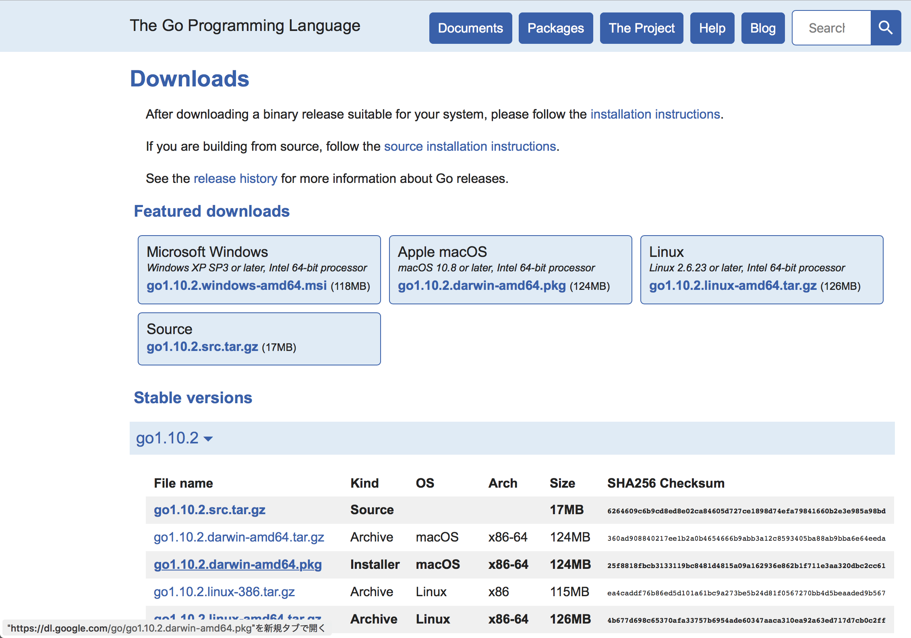
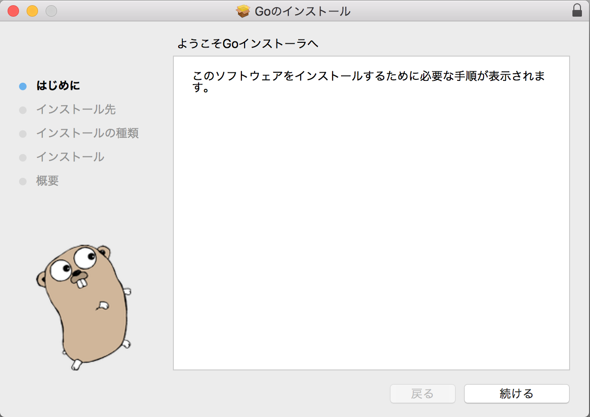
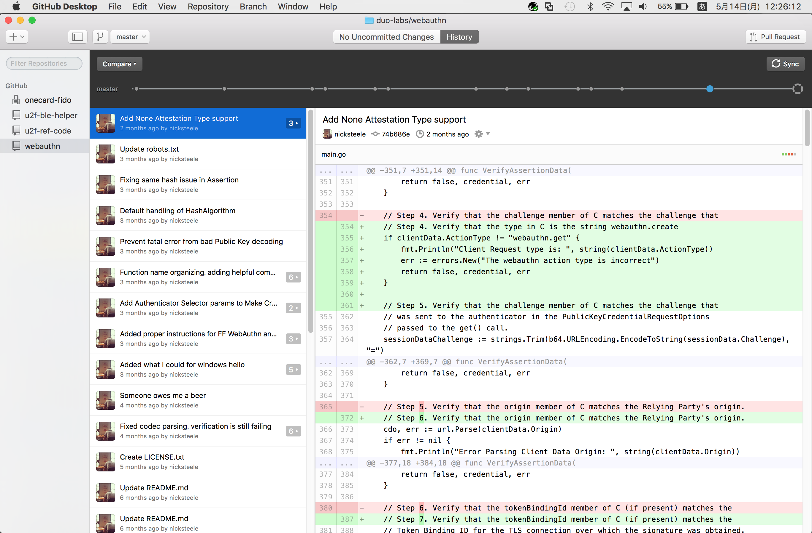
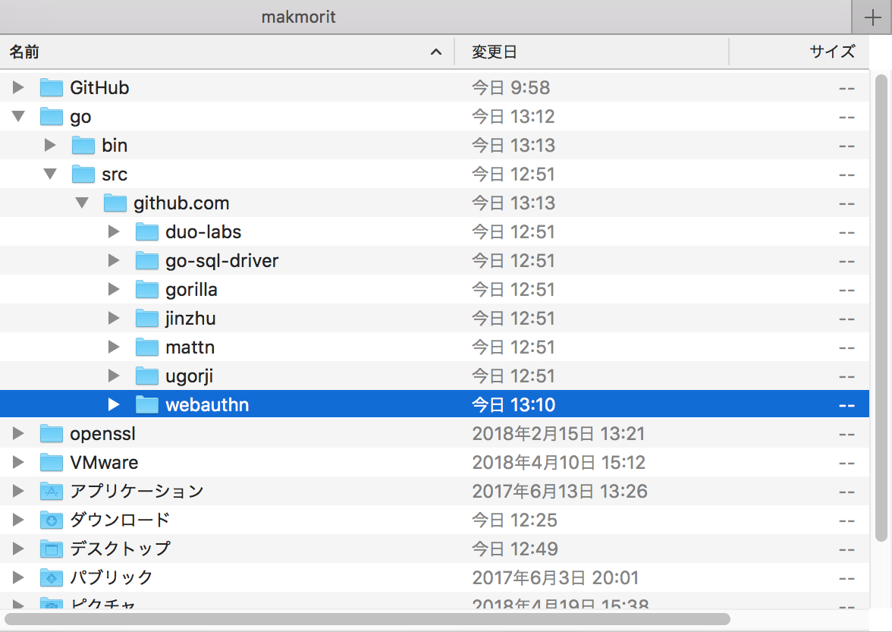
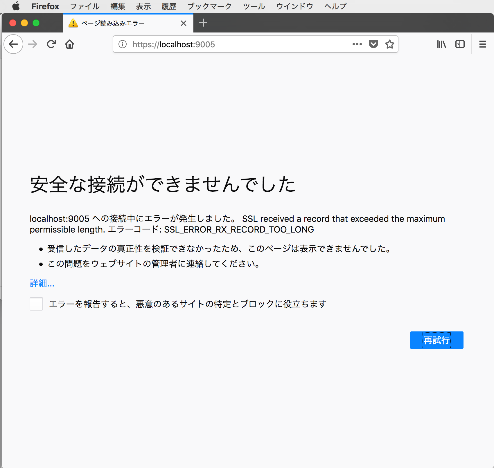

# [WIP] WebAuthnローカルテストサーバー

GitHubで公開されている、WebAuthnのローカルテストサーバーをPC上に構築する手順を掲載しています。

手順は以下のページを参考にしております。<br>
https://github.com/duo-labs/webauthn#webauthn-demo

2018/05/14：<br>
こちらで紹介されているGOのサーバーソフトだけでなく、Webサーバー（ApacheのHTTPSサーバー等）が追加で必要なようです。<br>
調査に時間を要しそうなので、一時的に調査をストップいたします。

## GO環境の導入

[こちらのダウンロードページ](https://golang.org/dl/)から、インストーラーをダウンロードします。<br>
（今回の検証では、macOS版を使用しております）



ダウンロードしたインストーラーを実行し、GO環境を導入します。



インストールが完了したら、任意のフォルダーに下記のようなコードを記述したファイルを配置します。

```
package main

import "fmt"

func main() {
    fmt.Printf("hello, world\n")
}
```

ソースコードが配置されているディレクトリーに移動し、`go build`を実行してビルドします。<br>
`test`という実行可能ファイルができます。

```
MacBookPro-makmorit-jp:test makmorit$ ls -al
total 16
drwxr-xr-x   3 makmorit  staff  102  5 14 12:40 .
drwx------+ 11 makmorit  staff  374  5 14 12:39 ..
-rw-r--r--@  1 makmorit  staff   77  5 14 12:39 hello.go
MacBookPro-makmorit-jp:test makmorit$ go build
MacBookPro-makmorit-jp:test makmorit$ ls -al
total 4120
drwxr-xr-x   4 makmorit  staff      136  5 14 12:40 .
drwx------+ 11 makmorit  staff      374  5 14 12:39 ..
-rw-r--r--@  1 makmorit  staff       77  5 14 12:39 hello.go
-rwxr-xr-x   1 makmorit  staff  2097456  5 14 12:40 test
MacBookPro-makmorit-jp:test makmorit$
```

作成された`test`を実行し、`hello, world`と表示されれば成功です。

```
MacBookPro-makmorit-jp:test makmorit$ ./test
hello, world
MacBookPro-makmorit-jp:test makmorit$
```

以上でGO環境の導入は完了です。

## リポジトリーのクローン作成

以下のURLのリポジトリーのクローンを作成します。<br>
https://github.com/duo-labs/webauthn.git

下図はGitHubデスクトップでチェックアウトしたところです。



チェックアウトしたコードは、GOディレクトリー配下のsrcディレクトリー内に配置するようにします。<br>
配置イメージは下記のようになります。



## 依存ライブラリーの取得

ソースコードディレクトリー配下で`go get .`コマンドを実行すると、自動的に依存ライブラリーのダウンロードが行われます。

```
MacBookPro-makmorit-jp:webauthn makmorit$ cd /Users/makmorit/go/src/github.com/webauthn
MacBookPro-makmorit-jp:webauthn makmorit$ pwd
/Users/makmorit/go/src/github.com/webauthn
MacBookPro-makmorit-jp:webauthn makmorit$ go get .
MacBookPro-makmorit-jp:webauthn makmorit$
```

コマンド実行中に、別段のメッセージが表示されなければ、依存ライブラリーの取得は完了になります。

GOディレクトリー配下のbinディレクトリー内を確認し、`webauthn`という実行可能ファイルが生成されていることを確認します。

```
MacBookPro-makmorit-jp:bin makmorit$ pwd
/Users/makmorit/go/bin
MacBookPro-makmorit-jp:bin makmorit$ ls -al
total 45472
drwxr-xr-x  3 makmorit  staff       102  5 14 14:46 .
drwxr-xr-x  5 makmorit  staff       170  5 14 14:46 ..
-rwxr-xr-x  1 makmorit  staff  23279472  5 14 14:46 webauthn
MacBookPro-makmorit-jp:bin makmorit$
```

## 実行

まずは`config.template.json`というファイルをコピーして`config.json`を作成します。

```
MacBookPro-makmorit-jp:webauthn makmorit$ cp config.template.json config.json
MacBookPro-makmorit-jp:webauthn makmorit$ ls -al *.json
-rw-r--r--  1 makmorit  staff  378  5 14 14:31 config.json
-rw-r--r--  1 makmorit  staff  378  5 14 09:58 config.template.json
MacBookPro-makmorit-jp:webauthn makmorit$
```

内容を適宜確認し、下記のように修正します。

```
{
	"db_name" : "sqlite3",
	"db_path" : "webauthn.db",
	"migrations_prefix" : "db/db_",
	"has_proxy": false,
	"host_address": "127.0.0.1",
	"host_port": ":9005"
}
```

このファイルを、binディレクトリー内に配置しておきます。

次に、同じくbinディレクトリー内の`webauthn`という実行可能ファイルを実行します。

```
MacBookPro-makmorit-jp:bin makmorit$ ./webauthn
Config: {DBName:sqlite3 DBPath:webauthn.db MigrationsPath:db/db_sqlite3 HostAddress:127.0.0.1 HostPort::9005 HasProxy:false}
```

実行がスタートします。

## 動作確認

Firefox 60を起動し、`https://localhost:9005/`を実行してみます。<br>
下記のようなエラーが発生してしまいます。



おそらくですが、webサーバー（バーチャルホスト）を追加で仕込まないと、サーバー証明書が発行されず、結果ブラウザー側でエラーになってしまうものと考えられます。

調査に時間を要しそうなので、一時的にこの調査はストップすることといたします。
