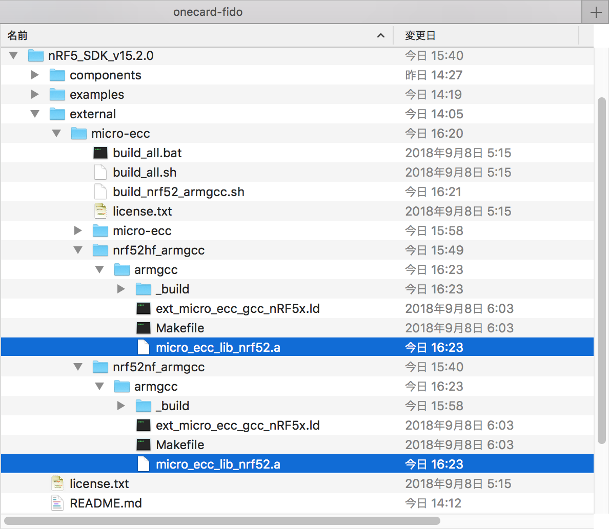

# micro-eccビルド手順

BLE U2Fサービスで使用する暗号化ライブラリー「micro-ecc」について、ビルド手順を以下に掲載いたします。

## ビルドの準備

### スクリプトのコピー

micro-eccのディレクトリー（`nRF5_SDK_v15.2.0/external/micro-ecc`）に格納されている「build_all.sh」をコピーして「build_nrf52_armgcc.sh」というファイルを作成します。


### スクリプトの編集

「build_nrf52_armgcc.sh」を開いて以下のように編集します。

```
#!/bin/bash

# This script will use git (must be in $PATH) and arm-none-eabi tools in combination with GNU Make
# to both fetch and compile all variants of micro-ecc for the nRF5 families

if ! [ -x "$(command -v git)" ]; then
    echo 'git is not installed. Please install and append to PATH.' >&2
    exit
fi

if [ ! -f micro-ecc/uECC.c ]; then
    echo "micro-ecc not found! Let's pull it from HEAD."
    git clone https://github.com/kmackay/micro-ecc.git
fi

make -C nrf52hf_armgcc/armgcc &&
echo $?
make -C nrf52nf_armgcc/armgcc &&
echo $?
```

ご参考：オリジナルとのdiff

```
MacBookPro-makmorit-jp:micro-ecc makmorit$ diff build_all.sh build_nrf52_armgcc.sh
16,18d15
< make -C nrf51_armgcc/armgcc &&
< make -C nrf51_iar/armgcc &&
< make -C nrf51_keil/armgcc &&
20,21c17
< make -C nrf52hf_iar/armgcc &&
< make -C nrf52hf_keil/armgcc &&
---
> echo $?
23,24c19
< make -C nrf52nf_iar/armgcc &&
< make -C nrf52nf_keil/armgcc
---
> echo $?
MacBookPro-makmorit-jp:micro-ecc makmorit$
```

## ビルドの実行

ターミナルを開き、先般編集した「build_nrf52_armgcc.sh」を実行させます。

```
MacBookPro-makmorit-jp:micro-ecc makmorit$ pwd
/Users/makmorit/GitHub/onecard-fido/nRF5_SDK_v15.2.0/external/micro-ecc
MacBookPro-makmorit-jp:micro-ecc makmorit$ ./build_nrf52_armgcc.sh
micro-ecc not found! Let's pull it from HEAD.
Cloning into 'micro-ecc'...
remote: Enumerating objects: 1086, done.
remote: Total 1086 (delta 0), reused 0 (delta 0), pack-reused 1086
Receiving objects: 100% (1086/1086), 647.95 KiB | 265.00 KiB/s, done.
Resolving deltas: 100% (637/637), done.
mkdir _build
cd _build && mkdir micro_ecc_lib
Compiling file: uECC.c
Creating library: ../../nrf52hf_armgcc/armgcc/micro_ecc_lib_nrf52.a
/Users/makmorit/opt/gcc-arm-none-eabi-7-2018-q2-update/bin/arm-none-eabi-ar: creating ../../nrf52hf_armgcc/armgcc/micro_ecc_lib_nrf52.a
Done
0
Creating library: ../../nrf52nf_armgcc/armgcc/micro_ecc_lib_nrf52.a
Done
0
MacBookPro-makmorit-jp:micro-ecc makmorit$
```

ディレクトリー「nrf52hf_armgcc/armgcc」「nrf52nf_armgcc/armgcc」配下に、ライブラリーファイル「micro_ecc_lib_nrf52.a」が生成されていることを確認します。



以上で、micro-eccビルドは完了です。
