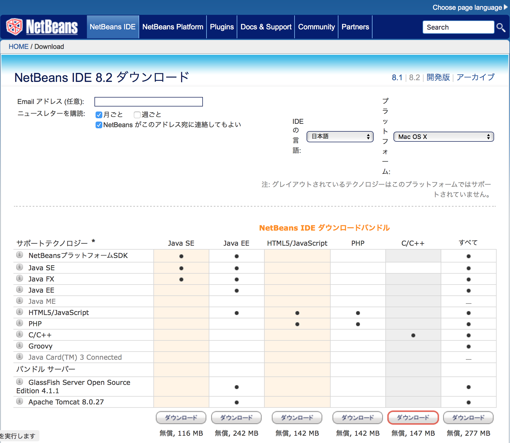

# NetBeans開発環境構築手順

NetBeansとARM GCC、nRF5-SDKを使用し、nRF52840の開発環境を構築する手順を記載します。

以下の手順では、nRF52840のハードウェアとして、nRF52840 DKという評価ボードを使用しています。

## セットアップ用媒体取得

### NetBeans

こちらのサイトにアクセスします。<br>
https://netbeans.org/downloads/<br>
下図のような画面に遷移します。



「NetBeans IDE ダウンロードバンドル」の「C/C++」をダウンロードします。<br>
「netbeans-8.2-cpp-macosx.dmg」というファイルがダウンロードされます。

### nRF tools and SDK

こちらのサイトにアクセスします。<br>
https://www.nordicsemi.com/eng/Products/nRF52840-DK<br>
下図のような画面に遷移します。


DOWNLOADSタブを開いて、下記のファイルをダウンロードします。

- nRF5-SDK-zip<br>
https://www.nordicsemi.com/eng/nordic/download_resource/59022/94/94590278/116085<br>
「nRF5_SDK_15.2.0_9412b96.zip」というファイルがダウンロードされます。

- nRF5x-Command-Line-Tools-OSX<br>
https://www.nordicsemi.com/eng/nordic/download_resource/58856/21/44330059/99977<br>
「nRF5x-Command-Line-Tools_9_7_3_OSX.tar」というファイルがダウンロードされます。


### ARM GCC toolchain

こちらのサイトにアクセスします。<br>
https://developer.arm.com/open-source/gnu-toolchain/gnu-rm/downloads<br>
下図のような画面に遷移します。


Downloadボタンのプルダウンを開いて「Mac OS X 64-bit」をクリックすると、ダウンロードが開始されます。<br>
「gcc-arm-none-eabi-7-2018-q2-update-mac.tar.bz2」というファイルがダウンロードされます。

## セットアップ実行

### NetBeansのインストール

ダウンロードした「netbeans-8.2-cpp-macosx.dmg」をダブルクリックすると、インストーラーが起動しますので、画面の指示に従い操作を進めます。


アプリケーションフォルダーに「NetBeans」というサブフォルダーが出来ていればインストールは完了です。


### ツールチェイン／SDKの配置

ARM GCC、nRF5-SDKを任意のフォルダーに配置します。<br>
以下は `$HOME/opt` というディレクトリー配下に配置する例になります。

ターミナルを開き、以下のコマンドを次々と実行していきます。

#### ARM GCCの配置
```
mkdir -p ~/opt
cd ~/opt
tar xjvf ~/Downloads/gcc-arm-none-eabi-7-2018-q2-update-mac.tar.bz2
```

#### nRF5-SDKの配置
```
cd ~/opt
tar xjvf ~/Downloads/nRF5_SDK_15.2.0_9412b96.zip
mv nRF5_SDK_15.2.0_9412b96 nRF5_SDK_15.2.0
```

#### nRF5xコマンドラインツールの配置
```
cd ~/opt
mkdir -p nRF5x-Command-Line-Tools_9_7_3_OSX
cd nRF5x-Command-Line-Tools_9_7_3_OSX
tar xjvf ~/Downloads/nRF5x-Command-Line-Tools_9_7_3_OSX.tar
```

実行後は以下のようなディレクトリー構成になるかと存じます。


