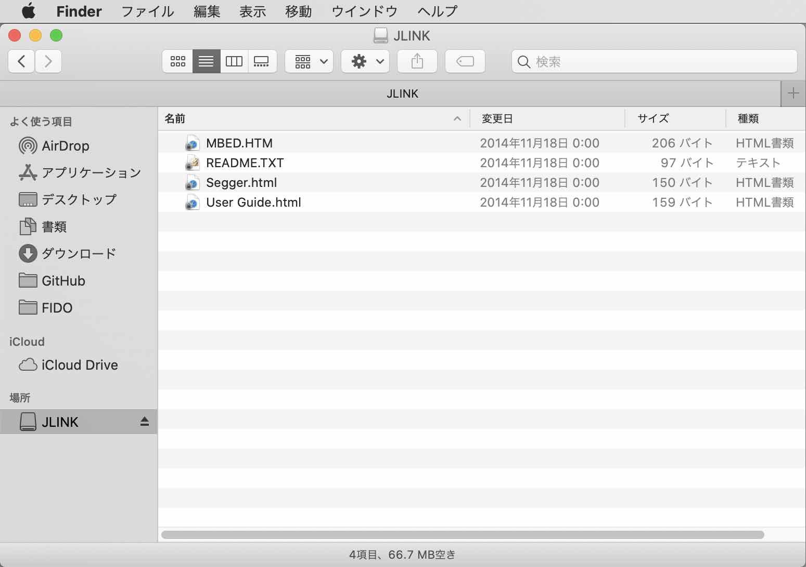

# FOTA upgrades動作確認手順

Nordic社が用意しているnRF Connect SDKサンプルアプリ「[Bluetooth: Peripheral UART](https://developer.nordicsemi.com/nRF_Connect_SDK/doc/latest/nrf/samples/bluetooth/peripheral_uart/README.html)」のファームウェアを、BLE経由で更新（FOTA upgrades）出来るようにするための手順について掲載します。

参考文献はこちら --><b>「[FOTA upgrades](https://developer.nordicsemi.com/nRF_Connect_SDK/doc/latest/nrf/ug_nrf5340.html#fota-upgrades)」</b>

## 事前準備

#### J-Linkのインストール

PCとNordic開発ボード（nRF5340 DK）をUSBケーブル経由で接続するためのソフトウェア「SEGGER J-Link」を、PCに導入願います。 
インストールの詳細につきましては、別途手順書「[NetBeansインストール手順](../../nRF52840_app/NETBEANSINST.md)」の該当章「<b>SEGGER J-Link</b>」をご参照願います。

#### ボードをPCに接続

動作確認に使用する開発ボード（nRF5340 DK）を、USBケーブルでPCに接続します。 
Finderで、JLINKという名前のボリュームができていることを確認してください。

#### サンプルアプリのビルド

サンプルアプリ「Bluetooth: Peripheral UART」をビルドし、ファームウェアイメージファイルを作成する作業まで実施しておきます。 
手順につきましては、別ドキュメント<b>「[nRF5340 DKを使用したサンプル動作確認手順書](../../Research/nRFCnctSDK_v1.4.99/SDKSAMPLE.md)」</b>をご参照願います。
