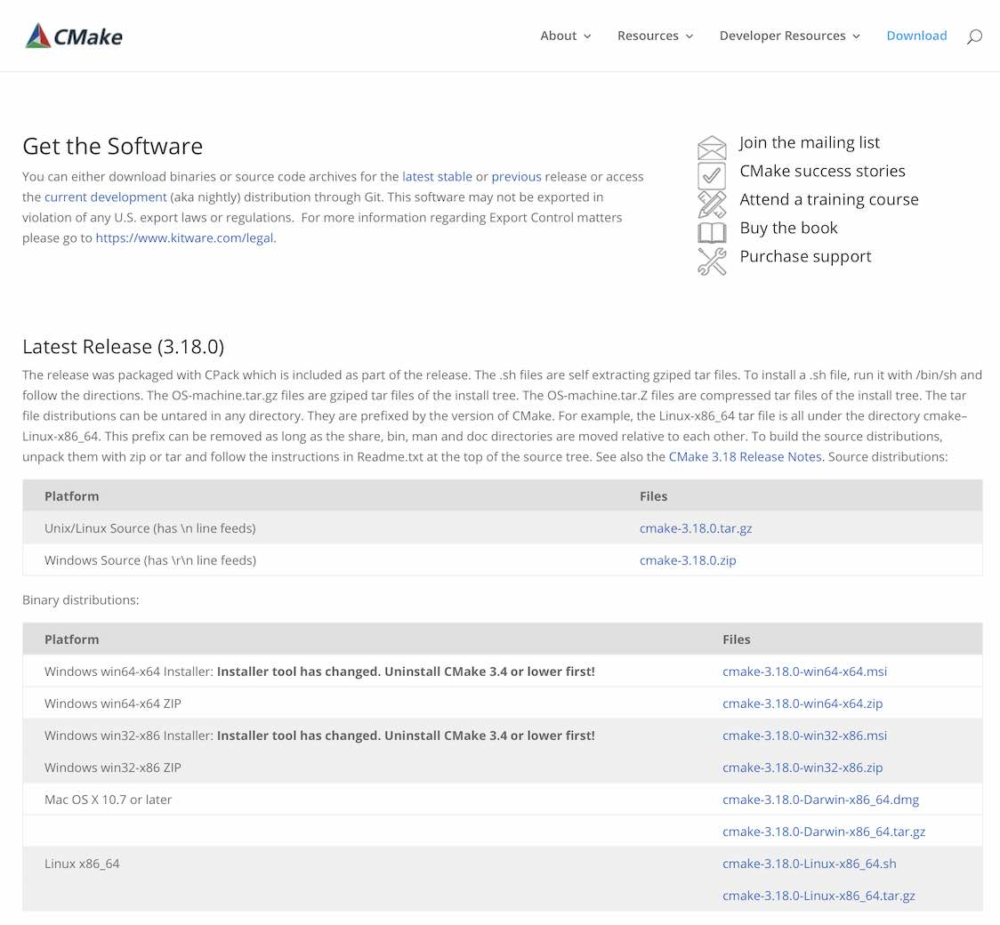
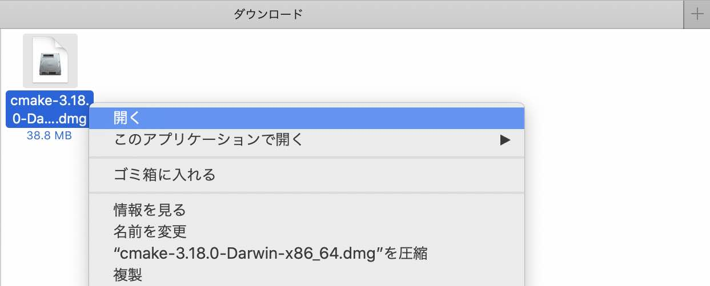
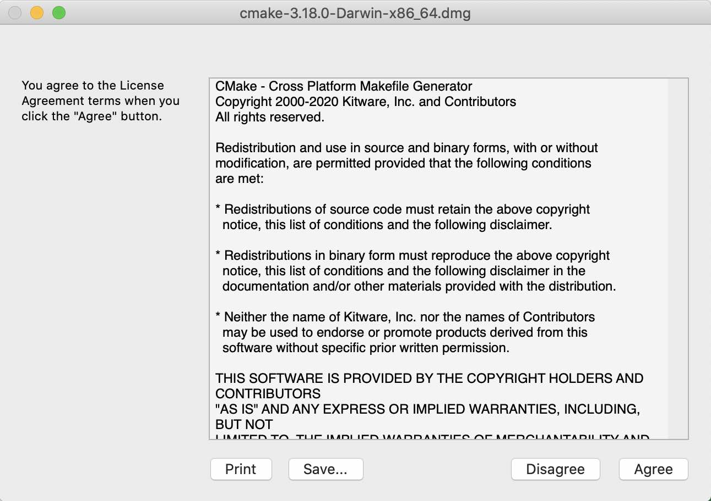
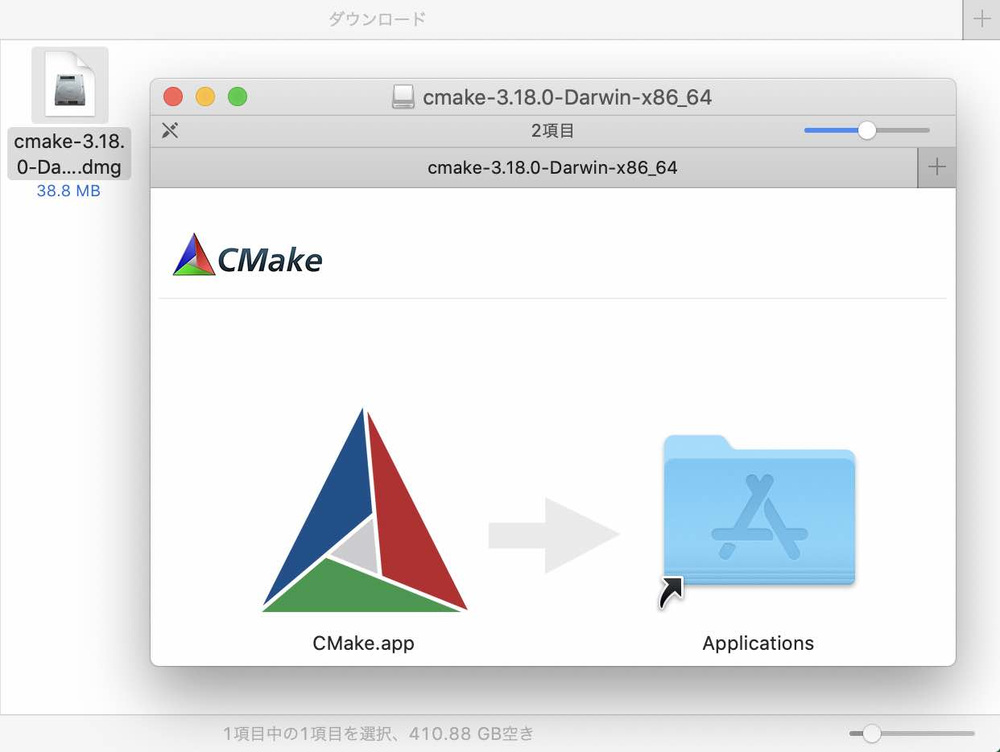
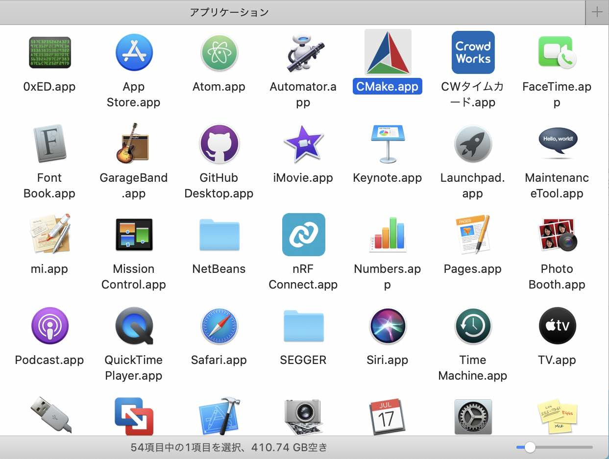

# CMakeインストール手順

メイクファイル生成コマンド「cmake」を含むツール「CMake」のインストール手順を掲載いたします。

## インストール媒体の取得

下図のような[ダウンロードページ](https://cmake.org/download/)からバイナリーをダウンロードします。 
macOS環境にインストールする場合は、ファイル「`cmake-3.18.0-Darwin-x86_64.dmg`」をダウンロードします。

### CMakeの導入

ダウンロードした`cmake-3.18.0-Darwin-x86_64.dmg`を右クリックして「開く」を実行します。

以下のようなダイアログが表示された場合は「Agree」をクリックします。

インストーラーが起動しますので、画面左側のアイコン「CMake.app」をドラッグし「Applications」にドロップしてください。

アプリケーションフォルダーにCMakeのアイコンができていれば、インストールは完了です。

