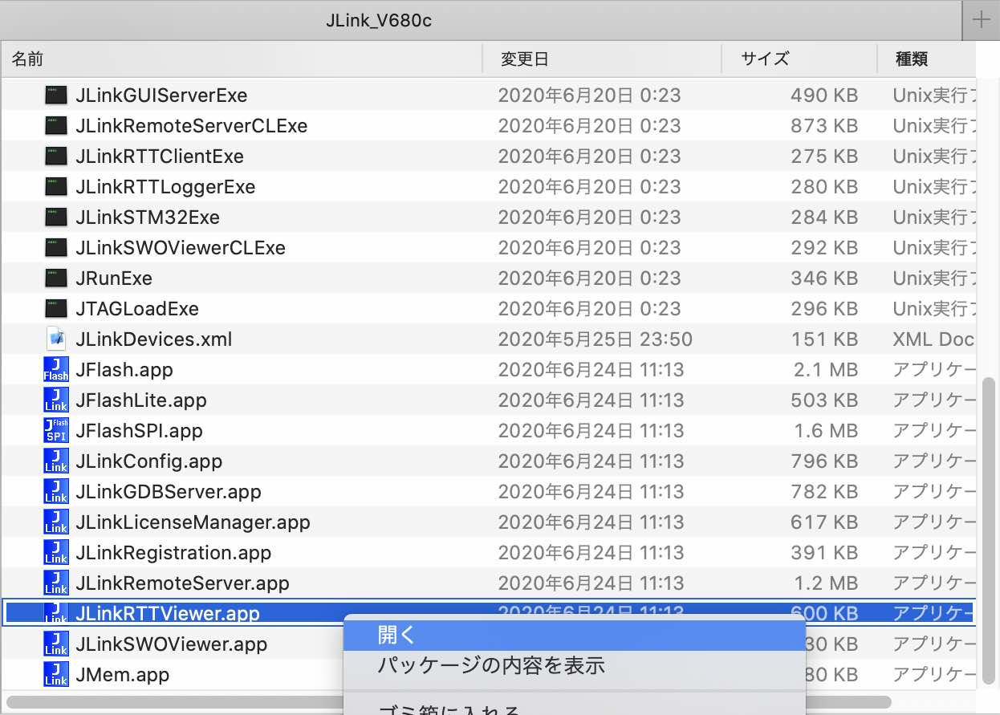
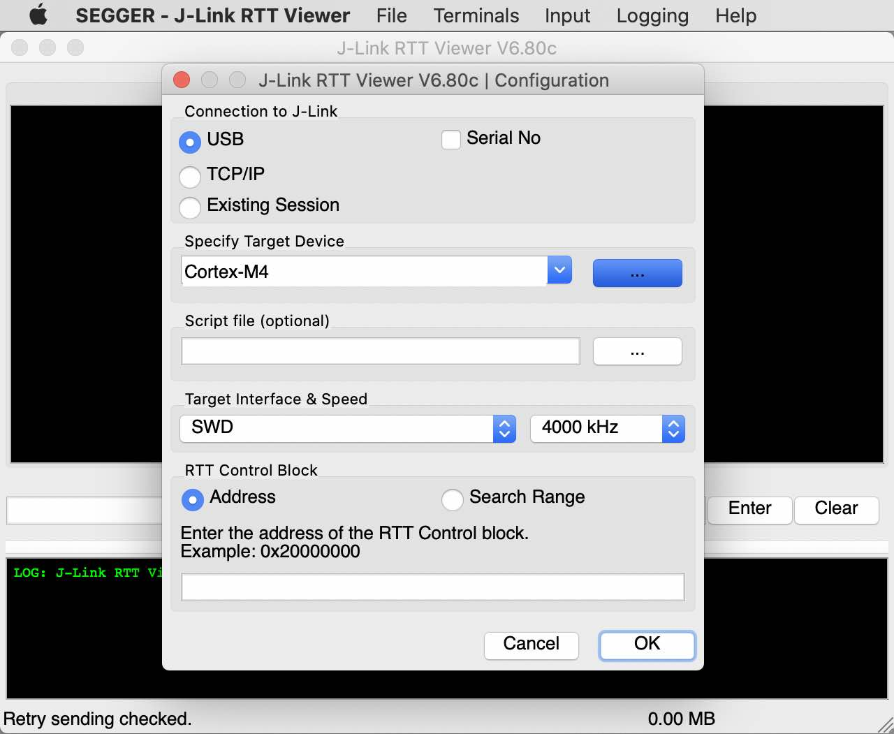
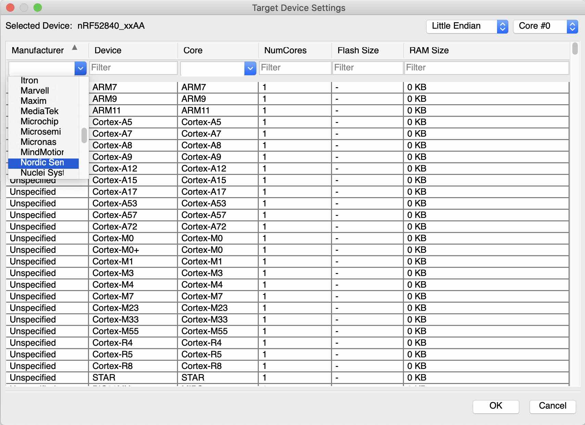
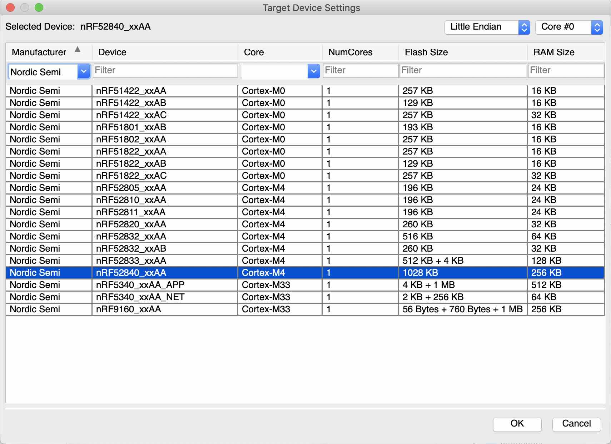
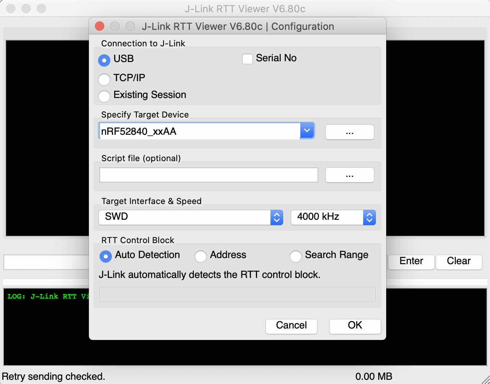
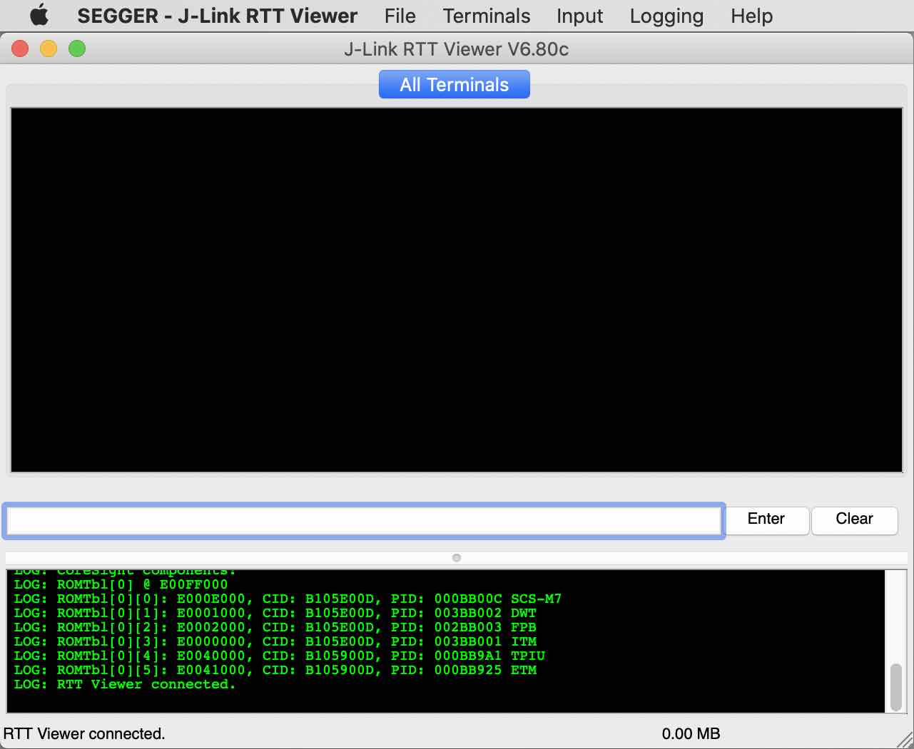

# RTTViewer設定手順書

J-Linkに同梱のデバッグ出力参照ツール「SEGGER J-Link RTT Viewer」（以下「RTTViewer」と略します。）の設定手順について掲載します。

## RTTViewerのインストール

RTTViewerは、デバッグツール「<b>SEGGER J-Link</b>」に含まれるGUIアプリケーションです。 
ですのでまずは「SEGGER J-Link」をPCに導入願います。

詳細につきましては、別途手順書「[NetBeansインストール手順](../../nRF5_SDK_v15.3.0/NETBEANSINST.md)」の該当章「<b>SEGGER J-Link</b>」をご参照願います。

## RTTViewerの設定

J-Linkが導入されているフォルダー「`/Applications/SEGGER/JLink_V680c`」に移動し、アプリケーション「`JLinkRTTViewer.app`」を開き実行します。

RTTViewerが起動し、Configuration画面（環境設定のポップアップ）が同時に開きます。 
「Specify Target Device」欄の右側にあるボタンをクリックします。

表示されたポップアップ画面上部の「Manufacturer」から「Nordic Semi」を選択します。

デバイス一覧が表示されるので、一覧から動作確認対象のボードを選択し、画面右下の「OK」ボタンをクリックします。 
下図は「nRF52840 DK」を選択する例です。

Configuration画面に戻るので、画面下部の「RTT Control Block」から「Auto Detection」を選択し、画面右下の「OK」ボタンをクリックします。 

Configuration画面が閉じられます。 
事前に開発ボードが接続されている場合、自動的に接続されます。

以上で、RTTViewerのインストールは完了です。
