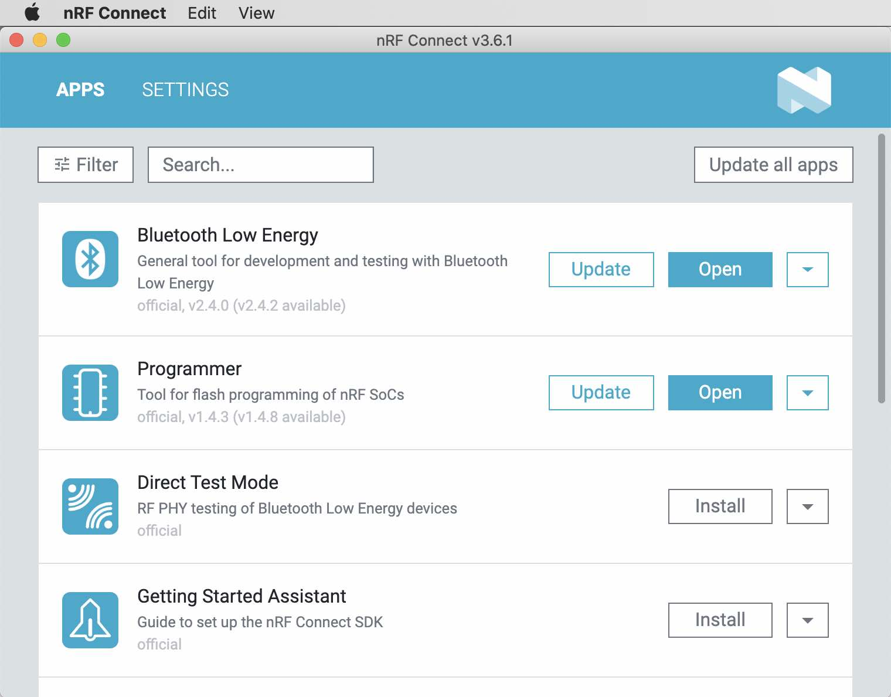
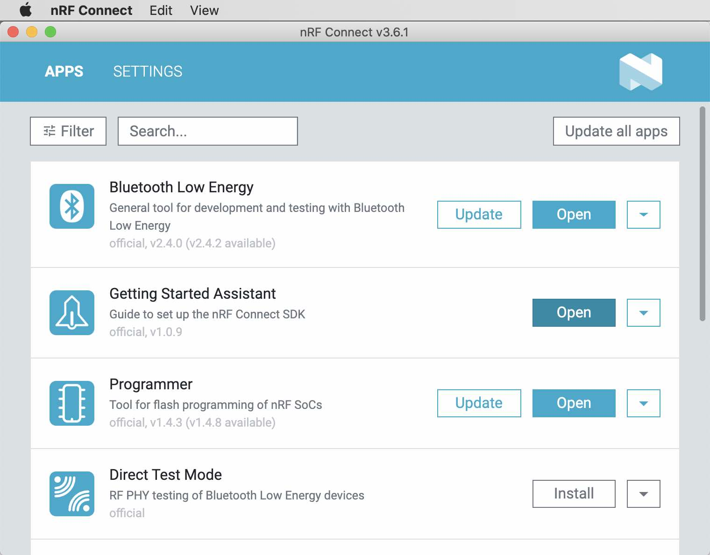
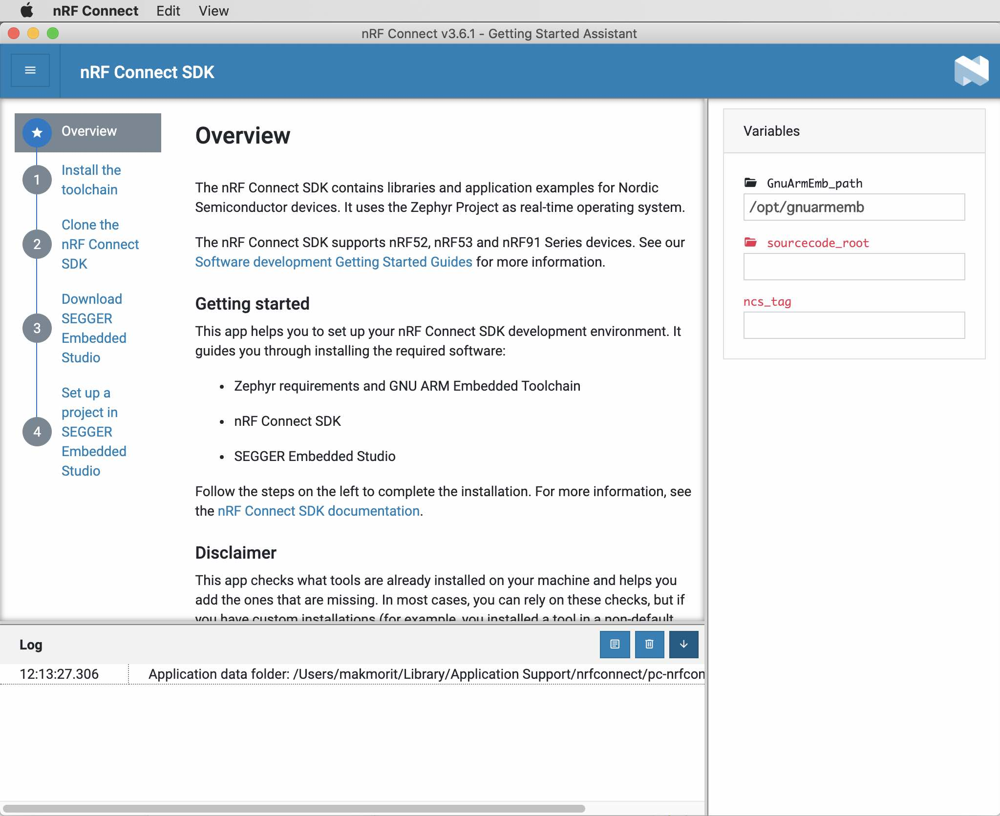

# nRF Connect SDKインストール手順書

「[nRF Connect SDK](https://developer.nordicsemi.com/nRF_Connect_SDK/doc/latest/nrf/index.html)」をmacOSにインストールする手順について掲載します。

## 前提条件

まずは以下の手順書を参照し、現在使用中のSDK（nRF5 SDK v15.3.0）による開発環境が整備されていることを前提とします。

#### [NetBeansインストール手順](../../nRF5_SDK_v15.3.0/NETBEANSINST.md)
[nRF52840アプリケーション](../../nRF5_SDK_v15.3.0/README.md)のビルドに必要なツールを準備します。<br>
具体的には、nRF Connect SDKを新規導入するために最低限必要な、以下のツール群をインストールします。
- nRFコマンドラインツール（nrfjprogコマンドが含まれる）
- ARM GCCツールチェイン
- SEGGER J-Link

#### [nRF Connect for Desktop導入手順](../../nRF5_SDK_v15.3.0/NRFCONNECTINST.md)
nRF Connect SDKインストール時に必要なGUIツールを準備します。

#### [CMakeインストール手順](../../Research/nRFCnctSDK_v1.4.99/INSTALLCMAKE.md)
メイクファイル生成コマンド「cmake」を含むツール「CMake」を準備します。

## 前提ソフトウェアのインストール

以下のソフトウェアを事前にインストールします。
- ninja
- west
- pyelftools
- Getting Started Assistant（必須ではないです）

#### ninjaのインストール

ファームウェアビルド時に使用するツール「ninja」をインストールします。<br>
ターミナルから以下のコマンドを実行します。

```
brew install ninja
```

以下はmacOS Catalinaでの実行例になります。

```
bash-3.2$ brew install ninja
Updating Homebrew...
：
==> Installing dependencies for ninja: gdbm, openssl@1.1, readline, sqlite, xz and python@3.9
==> Installing ninja dependency: gdbm
：
==> Summary
🍺  /usr/local/Cellar/python@3.9/3.9.1_3: 3,895 files, 63.9MB
==> Installing ninja
==> Pouring ninja-1.10.2.catalina.bottle.tar.gz
==> Caveats
zsh completions have been installed to:
  /usr/local/share/zsh/site-functions
==> Summary
🍺  /usr/local/Cellar/ninja/1.10.2: 7 files, 352.1KB
==> `brew cleanup` has not been run in 30 days, running now...
：
==> python@3.9
Python has been installed as
  /usr/local/bin/python3

Unversioned symlinks `python`, `python-config`, `pip` etc. pointing to
`python3`, `python3-config`, `pip3` etc., respectively, have been installed into
  /usr/local/opt/python@3.9/libexec/bin

You can install Python packages with
  pip3 install <package>
They will install into the site-package directory
  /usr/local/lib/python3.9/site-packages

See: https://docs.brew.sh/Homebrew-and-Python
==> ninja
zsh completions have been installed to:
  /usr/local/share/zsh/site-functions
bash-3.2$
```

途中、Python 3.9が強制的にインストールされるケースがあります。<br>
この場合は上記のように、その旨のログが出力されますので、ご注意願います。

#### westのインストール

ファームウェアビルド時に使用するツール「west」をインストールします。<br>
ターミナルから以下のコマンドを実行します。

```
/usr/local/bin/python3.9 -m pip install west
```

以下はmacOS Catalinaでの実行例になります。

```
bash-3.2$ /usr/local/bin/python3.9 -m pip install west
Collecting west
  Downloading west-0.8.0-py3-none-any.whl (74 kB)
     |████████████████████████████████| 74 kB 709 kB/s
Requirement already satisfied: setuptools in /usr/local/lib/python3.9/site-packages (from west) (51.0.0)
Collecting colorama
  Downloading colorama-0.4.4-py2.py3-none-any.whl (16 kB)
Collecting configobj
  Downloading configobj-5.0.6.tar.gz (33 kB)
Collecting packaging
  Downloading packaging-20.8-py2.py3-none-any.whl (39 kB)
Collecting pykwalify
  Downloading pykwalify-1.8.0-py2.py3-none-any.whl (24 kB)
Collecting docopt>=0.6.2
  Downloading docopt-0.6.2.tar.gz (25 kB)
Collecting pyparsing>=2.0.2
  Downloading pyparsing-2.4.7-py2.py3-none-any.whl (67 kB)
     |████████████████████████████████| 67 kB 2.6 MB/s
Collecting python-dateutil>=2.8.0
  Downloading python_dateutil-2.8.1-py2.py3-none-any.whl (227 kB)
     |████████████████████████████████| 227 kB 1.9 MB/s
Collecting PyYAML>=5.1
  Using cached PyYAML-5.3.1.tar.gz (269 kB)
Collecting ruamel.yaml>=0.16.0
  Downloading ruamel.yaml-0.16.12-py2.py3-none-any.whl (111 kB)
     |████████████████████████████████| 111 kB 573 kB/s
Collecting six
  Downloading six-1.15.0-py2.py3-none-any.whl (10 kB)
Building wheels for collected packages: configobj, docopt, PyYAML
  Building wheel for configobj (setup.py) ... done
  Created wheel for configobj: filename=configobj-5.0.6-py3-none-any.whl size=34545 sha256=cc8414d8680cb6dd4f35fa591da9f8eb478d6e5af5a20b5209fcd3f1596498f3
  Stored in directory: /Users/makmorit/Library/Caches/pip/wheels/4b/35/53/dfa4d3a4196794cb0a777a97c68dcf02b073d33de9c135d72a
  Building wheel for docopt (setup.py) ... done
  Created wheel for docopt: filename=docopt-0.6.2-py2.py3-none-any.whl size=13704 sha256=611a79d6cd82c5019ea89b6b778c47a4b9593c0c887a7ab1e7399957448b84ef
  Stored in directory: /Users/makmorit/Library/Caches/pip/wheels/70/4a/46/1309fc853b8d395e60bafaf1b6df7845bdd82c95fd59dd8d2b
  Building wheel for PyYAML (setup.py) ... done
  Created wheel for PyYAML: filename=PyYAML-5.3.1-cp39-cp39-macosx_10_15_x86_64.whl size=44624 sha256=dc5e67ed8c9e141f4785365009633146a6cd1444d570d6c91dd7aa5bd3b86232
  Stored in directory: /Users/makmorit/Library/Caches/pip/wheels/69/60/81/5cd74b8ee068fbe9e04ca0d53148f28f5c6e2c5b177d5dd622
Successfully built configobj docopt PyYAML
Installing collected packages: six, ruamel.yaml, python-dateutil, pyparsing, docopt, PyYAML, pykwalify, packaging, configobj, colorama, west
Successfully installed PyYAML-5.3.1 colorama-0.4.4 configobj-5.0.6 docopt-0.6.2 packaging-20.8 pykwalify-1.8.0 pyparsing-2.4.7 python-dateutil-2.8.1 ruamel.yaml-0.16.12 six-1.15.0 west-0.8.0
WARNING: You are using pip version 20.3.1; however, version 20.3.3 is available.
You should consider upgrading via the '/usr/local/opt/python@3.9/bin/python3.9 -m pip install --upgrade pip' command.
bash-3.2$
```

#### pyelftoolsのインストール

ファームウェアイメージ（`.elf`ファイル）生成時に使用するコマンド「pyelftools」をインストールします。<br>
ターミナルから以下のコマンドを実行します。

```
/usr/local/bin/python3.9 -m pip install pyelftools
```

以下はmacOS Catalinaでの実行例になります。

```
bash-3.2$ /usr/local/bin/python3.9 -m pip install pyelftools
Collecting pyelftools
  Downloading pyelftools-0.27-py2.py3-none-any.whl (151 kB)
     |████████████████████████████████| 151 kB 993 kB/s
Installing collected packages: pyelftools
Successfully installed pyelftools-0.27
WARNING: You are using pip version 20.3.1; however, version 20.3.3 is available.
You should consider upgrading via the '/usr/local/opt/python@3.9/bin/python3.9 -m pip install --upgrade pip' command.
bash-3.2$
```

#### Getting Started Assistantのインストール

本手順に必須ではありませんが、開発環境（IDE）として「[SEGGER Embedded Studio](https://www.nordicsemi.com/Software-and-tools/Development-Tools/Segger-Embedded-Studio)」の使用を検討している場合、このツールがあると非常に便利であるため、適宜インストールしておきます。

nRF Connect for Desktopを起動すると、下図のように「Getting Started Assistant」がリストアップされます。<br>
右側の「Install」ボタンをクリックします。



インストール処理が完了すると、画面のリストが下図のような状態に変わります。<br>
右側の「Open」ボタンをクリックします。



下図のような「Getting Started Assistant」画面が起動することを確認します。



以上で、Getting Started Assistantのインストールは完了です。

## nRF Connect SDKのインストール

前述のツール「west」を使用し、nRF Connect SDKのインストールを行います。

#### リポジトリーのチェックアウト

GitHubリポジトリーから、nRF Connect SDKの全ファイルイメージをチェックアウトします。<br>
ターミナルから以下のコマンドを実行します。

（注：`west zephyr-export`の実行前に、`cmake`コマンドへの実行パスを通しています）

```
cd ${HOME}/opt/
mkdir ncs
cd ncs
west init -m https://github.com/nrfconnect/sdk-nrf
west update
PATH=${PATH}:/Applications/CMake.app/Contents/bin
west zephyr-export
```

以下は実行例になります（途中ログを省略しています）。

```
bash-3.2$ cd ${HOME}/opt/
bash-3.2$ mkdir ncs
bash-3.2$ cd ncs
bash-3.2$ west init -m https://github.com/nrfconnect/sdk-nrf
=== Initializing in /Users/makmorit/opt/ncs
--- Cloning manifest repository from https://github.com/nrfconnect/sdk-nrf, rev. master
Initialized empty Git repository in /Users/makmorit/opt/ncs/.west/manifest-tmp/.git/
remote: Enumerating objects: 4, done.
remote: Counting objects: 100% (4/4), done.
remote: Compressing objects: 100% (4/4), done.
：
* [new tag]         v1.4.99-dev1    -> v1.4.99-dev1
00cceb9a17da9a8f33b5a48cb179bc2ab8f85325 refs/remotes/origin/master
Branch 'master' set up to track remote branch 'master' from 'origin'.
Already on 'master'
--- setting manifest.path to nrf
=== Initialized. Now run "west update" inside /Users/makmorit/opt/ncs.
bash-3.2$
bash-3.2$ west update
=== updating zephyr (zephyr):
--- zephyr: initializing
Initialized empty Git repository in /Users/makmorit/opt/ncs/zephyr/.git/
--- zephyr: fetching, need revision 3366927a54986ad0ddf060d0e08ecc578adf11f0
remote: Enumerating objects: 511091, done.
remote: Total 511091 (delta 0), reused 0 (delta 0), pack-reused 511091
Receiving objects: 100% (511091/511091), 335.47 MiB | 1.77 MiB/s, done.
Resolving deltas: 100% (392665/392665), done.
：
Resolving deltas: 100% (5922/5922), done.
From https://github.com/zephyrproject-rtos/trusted-firmware-m
 * [new branch]      master     -> refs/west/master
Updating files: 100% (8936/8936), done.
HEAD is now at 6edaaaa CMakeLists.txt: Build TF-M based on new Kconfig options
HEAD is now at 6edaaaa CMakeLists.txt: Build TF-M based on new Kconfig options
bash-3.2$
bash-3.2$ env | grep PATH
PATH=/usr/local/bin:/usr/bin:/bin:/usr/sbin:/sbin:/Applications/VMware Fusion.app/Contents/Public:/Library/Apple/usr/bin
bash-3.2$
bash-3.2$ PATH=${PATH}:/Applications/CMake.app/Contents/bin
bash-3.2$
bash-3.2$ env | grep PATH
PATH=/usr/local/bin:/usr/bin:/bin:/usr/sbin:/sbin:/Applications/VMware Fusion.app/Contents/Public:/Library/Apple/usr/bin:/Applications/CMake.app/Contents/bin
bash-3.2$
bash-3.2$ west zephyr-export
Zephyr (/Users/makmorit/opt/ncs/zephyr/share/zephyr-package/cmake)
has been added to the user package registry in:
~/.cmake/packages/Zephyr

ZephyrUnittest (/Users/makmorit/opt/ncs/zephyr/share/zephyrunittest-package/cmake)
has been added to the user package registry in:
~/.cmake/packages/ZephyrUnittest

bash-3.2$
```

#### 環境変数のセット

ユーザーディレクトリー直下に、`.zephyrrc`というファイルを作成し、下記のような内容を記述しておきます。

```
bash-3.2$ cd ${HOME}
bash-3.2$ cat .zephyrrc
# Environment variables for the GNU Arm Embedded toolchain
export ZEPHYR_TOOLCHAIN_VARIANT=gcc-arm-none-eabi-9-2020-q2-update
export GNUARMEMB_TOOLCHAIN_PATH="${HOME}/opt/gcc-arm-none-eabi-9-2020-q2-update"

# Paths for command
export PATH=${PATH}:/Applications/CMake.app/Contents/bin
export PATH=${PATH}:${HOME}/opt/nRF-Command-Line-Tools_10_9_0_OSX/nrfjprog

bash-3.2$
```

以上で、nRF Connect SDKのインストールは完了です。
