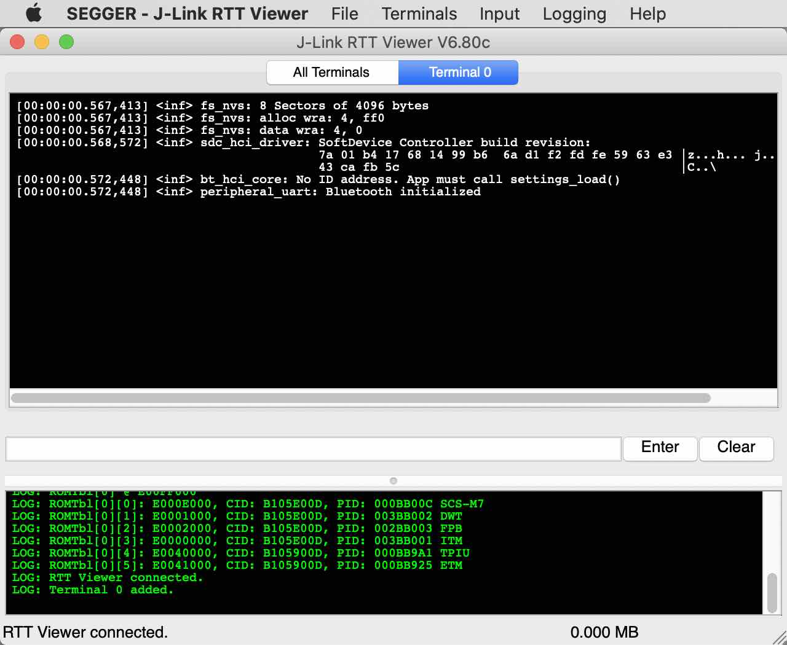

# nRF Connect SDKサンプル動作確認手順書

Nordic社が用意しているnRF Connect SDKサンプルアプリ「[Bluetooth: Peripheral UART](https://developer.nordicsemi.com/nRF_Connect_SDK/doc/latest/nrf/samples/bluetooth/peripheral_uart/README.html)」の動作確認手順について掲載します。

## 事前準備

#### J-Linkのインストール

PCとNordic開発ボード（nRF52840 DK等）をUSBケーブル経由で接続するためのソフトウェア「SEGGER J-Link」を、PCに導入願います。<br>
インストールの詳細につきましては、別途手順書「[NetBeansインストール手順](../../nRF5_SDK_v15.3.0/NETBEANSINST.md)」の該当章「<b>SEGGER J-Link</b>」をご参照願います。

#### RTTViewerの準備

サンプルアプリから出力されるデバッグ出力は、コンソール（UART出力）から参照することはできません。<br>
このため、前述J-Linkに同梱のデバッグ出力参照ツール「RTTViewer」を使用します。

設定の詳細につきましては、別途「[RTTViewer設定手順書](../../Research/nRFCnctSDK_v1.4.99/INSTALLRTTVW.md)」をご参照願います。

#### ボードをPCに接続

動作確認に使用する開発ボード（nRF52840 DKなど）を、USBケーブルでPCに接続します。<br>
Finderで、JLINKという名前のボリュームができていることを確認してください。


## サンプルアプリのビルド

サンプルアプリ「Bluetooth: Peripheral UART」をビルドし、ファームウェアイメージファイルを作成します。

#### ビルド準備

必要な環境変数をシェルに準備した後、サンプルアプリディレクトリーに移動します。<br>
以下のコマンドを実行します。

```
. ${HOME}/.zephyrrc
cd ${HOME}/opt/ncs/nrf/samples/bluetooth/peripheral_uart
```

以下は実行例になります。

```
bash-3.2$ . ${HOME}/.zephyrrc
bash-3.2$ cd ${HOME}/opt/ncs/nrf/samples/bluetooth/peripheral_uart
bash-3.2$ ls -al
total 72
drwxr-xr-x  10 makmorit  staff   320  1  5 10:39 .
drwxr-xr-x  27 makmorit  staff   864  1  4 15:13 ..
-rw-r--r--@  1 makmorit  staff  6148  1  5 10:39 .DS_Store
-rw-r--r--   1 makmorit  staff   340  1  4 13:45 CMakeLists.txt
-rw-r--r--   1 makmorit  staff   737  1  4 13:45 Kconfig
-rw-r--r--   1 makmorit  staff  4650  1  4 13:45 README.rst
-rw-r--r--   1 makmorit  staff   968  1  4 13:45 prj.conf
-rw-r--r--   1 makmorit  staff    46  1  4 13:45 prj.overlay
-rw-r--r--   1 makmorit  staff   392  1  4 13:45 sample.yaml
drwxr-xr-x   3 makmorit  staff    96  1  4 13:45 src
bash-3.2$
```

#### ビルドの実行

westツールを使用して、サンプルアプリをビルドします。<br>
以下のコマンドを実行します。

```
west build -b nrf52840dk_nrf52840
```

以下は実行例になります。<br>
ファームウェアイメージファイルは、サンプルアプリディレクトリー配下の`build/zephyr`というサブディレクトリーに作成されるようです。

```
bash-3.2$ west build -b nrf52840dk_nrf52840
-- west build: generating a build system
Including boilerplate (Zephyr base): /Users/makmorit/opt/ncs/zephyr/cmake/app/boilerplate.cmake
-- Application: /Users/makmorit/opt/ncs/nrf/samples/bluetooth/peripheral_uart
-- Zephyr version: 2.4.99 (/Users/makmorit/opt/ncs/zephyr)
-- Found Python3: /usr/local/bin/python3.9 (found suitable exact version "3.9.1") found components: Interpreter
-- Found west (found suitable version "0.8.0", minimum required is "0.7.1")
-- Board: nrf52840dk_nrf52840
-- Cache files will be written to: /Users/makmorit/Library/Caches/zephyr
-- Found toolchain: gnuarmemb (/Users/makmorit/opt/gcc-arm-none-eabi-9-2020-q2-update)
-- Found BOARD.dts: /Users/makmorit/opt/ncs/zephyr/boards/arm/nrf52840dk_nrf52840/nrf52840dk_nrf52840.dts
-- Generated zephyr.dts: /Users/makmorit/opt/ncs/nrf/samples/bluetooth/peripheral_uart/build/zephyr/zephyr.dts
-- Generated devicetree_unfixed.h: /Users/makmorit/opt/ncs/nrf/samples/bluetooth/peripheral_uart/build/zephyr/include/generated/devicetree_unfixed.h
Parsing /Users/makmorit/opt/ncs/nrf/samples/bluetooth/peripheral_uart/Kconfig
Loaded configuration '/Users/makmorit/opt/ncs/zephyr/boards/arm/nrf52840dk_nrf52840/nrf52840dk_nrf52840_defconfig'
Merged configuration '/Users/makmorit/opt/ncs/nrf/samples/bluetooth/peripheral_uart/prj.conf'
Configuration saved to '/Users/makmorit/opt/ncs/nrf/samples/bluetooth/peripheral_uart/build/zephyr/.config'
Kconfig header saved to '/Users/makmorit/opt/ncs/nrf/samples/bluetooth/peripheral_uart/build/zephyr/include/generated/autoconf.h'
-- The C compiler identification is GNU 9.3.1
-- The CXX compiler identification is GNU 9.3.1
-- The ASM compiler identification is GNU
-- Found assembler: /Users/makmorit/opt/gcc-arm-none-eabi-9-2020-q2-update/bin/arm-none-eabi-gcc
CMake Warning at /Users/makmorit/opt/ncs/zephyr/CMakeLists.txt:1349 (message):
  __ASSERT() statements are globally ENABLED


-- Configuring done
-- Generating done
-- Build files have been written to: /Users/makmorit/opt/ncs/nrf/samples/bluetooth/peripheral_uart/build
-- west build: building application
[1/204] Preparing syscall dependency handling

[199/204] Linking C executable zephyr/zephyr_prebuilt.elf
Memory region         Used Size  Region Size  %age Used
           FLASH:      203392 B         1 MB     19.40%
            SRAM:       36735 B       256 KB     14.01%
        IDT_LIST:         168 B         2 KB      8.20%
[204/204] Linking C executable zephyr/zephyr.elf
bash-3.2$
bash-3.2$ ls -al build/zephyr/zephyr.elf
-rwxr-xr-x  1 makmorit  staff  2520860  1  5 12:03 build/zephyr/zephyr.elf
bash-3.2$
bash-3.2$
```

## サンプルアプリの書込み

ビルドしたサンプルアプリのファームウェアイメージファイル`zephyr.hex`を、nRF52840 DKに書込みます。[注1]

以下のコマンドを実行します。
```
west flash
```

以下は実行例になります。

```
bash-3.2$ west flash

-- west flash: rebuilding
[0/1] cd /Users/makmorit/opt/ncs/nrf/samples/bluetooth/peripher...ake/flash && /Applications/CMake.app/Contents/bin/cmake -E echo

-- west flash: using runner nrfjprog
Using board 683272599
-- runners.nrfjprog: Flashing file: /Users/makmorit/opt/ncs/nrf/samples/bluetooth/peripheral_uart/build/zephyr/zephyr.hex
Parsing hex file.
Erasing page at address 0x0.
Erasing page at address 0x1000.
Erasing page at address 0x2000.
：
Erasing page at address 0x2F000.
Erasing page at address 0x30000.
Erasing page at address 0x31000.
Applying system reset.
Checking that the area to write is not protected.
Programming device.
Enabling pin reset.
Applying pin reset.
-- runners.nrfjprog: Board with serial number 683272599 flashed successfully.
bash-3.2$
bash-3.2$
```

先述のデバッグ出力参照画面（JLinkRTTViewer）には、以下のようなメッセージがプリントされます。

```
[00:00:00.567,413] <inf> fs_nvs: 8 Sectors of 4096 bytes
[00:00:00.567,413] <inf> fs_nvs: alloc wra: 4, ff0
[00:00:00.567,413] <inf> fs_nvs: data wra: 4, 0
[00:00:00.568,572] <inf> sdc_hci_driver: SoftDevice Controller build revision:
                                         7a 01 b4 17 68 14 99 b6  6a d1 f2 fd fe 59 63 e3 |z...h... j....Yc.
                                         43 ca fb 5c                                      |C..\             
[00:00:00.572,448] <inf> bt_hci_core: No ID address. App must call settings_load()
[00:00:00.572,448] <inf> peripheral_uart: Bluetooth initialized
```



以上で、サンプルアプリの書込みは完了になります。

[注1] nRF5 SDKで開発された[nRF52840アプリケーション](../../nRF5_SDK_v15.3.0)は、別途「[ソフトデバイス](../../nRF5_SDK_v15.3.0/firmwares/s140_nrf52_6.1.1_softdevice.hex)」というファームウェアの事前インストールが必要でしたが、本手順書のビルド手順でファームウェアを作成した場合、ソフトデバイスの事前インストールは不要となっているようです。

## サンプルアプリのテスト

サンプルアプリのテストには、Androidのスマートフォンを使用します。<br>
（今回はHUAWEI社のスマートフォン「nova lite 2」を使用しました）

#### ペアリングの実行

AndroidシステムのBluetooth設定画面を開き、BluetoothをONにします。<br>
開発ボードの検索を開始します。


リストアップされた開発ボード（`Nordic_UART_Service`）の名称部分をタップすると、ペアリングが開始されます。


Android側に、以下のメッセージが表示されます。<br>
下部ボタン「ペアリング」をタップして、ペアリングを実行します。


RTTViewerの画面にも、同様のデバッグ出力が表示されます。

```
00> [00:15:09.559,631] <inf> peripheral_uart: Passkey for AC:07:5F:EB:54:09 (public): 248801
00> [00:15:09.559,631] <inf> peripheral_uart: Press Button 1 to confirm, Button 2 to reject.
```


開発ボードのボタン「Button 1」を１回プッシュすると、ペアリングが完了します。


RTTViewerの画面にも、ペアリング完了メッセージが表示されるのを確認します。

```
00> [00:15:34.818,206] <inf> peripheral_uart: Numeric Match, conn 0x20002380
00> [00:15:34.881,530] <inf> peripheral_uart: Security changed: AC:07:5F:EB:54:09 (public) level 4
00> [00:15:34.934,112] <inf> peripheral_uart: Pairing completed: AC:07:5F:EB:54:09 (public), bonded: 1
```


AndroidのBluetooth設定画面上で、開発ボードと接続されていることが確認できます。


以上でペアリング実行は完了です。
