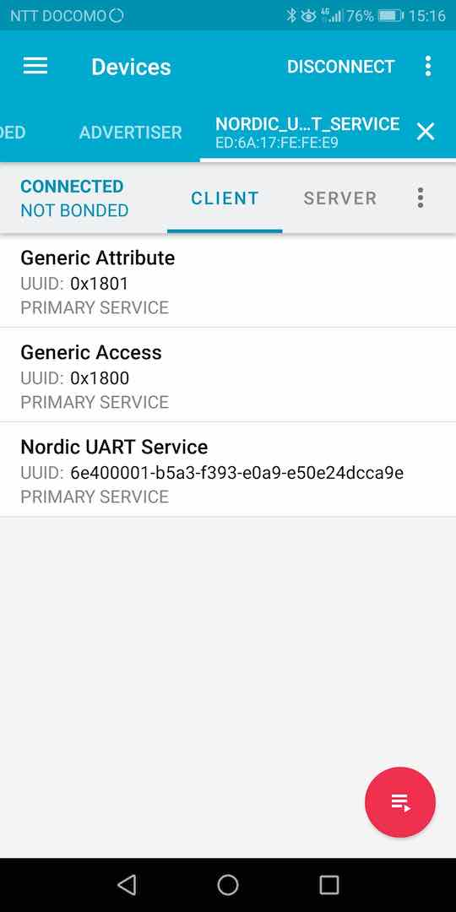
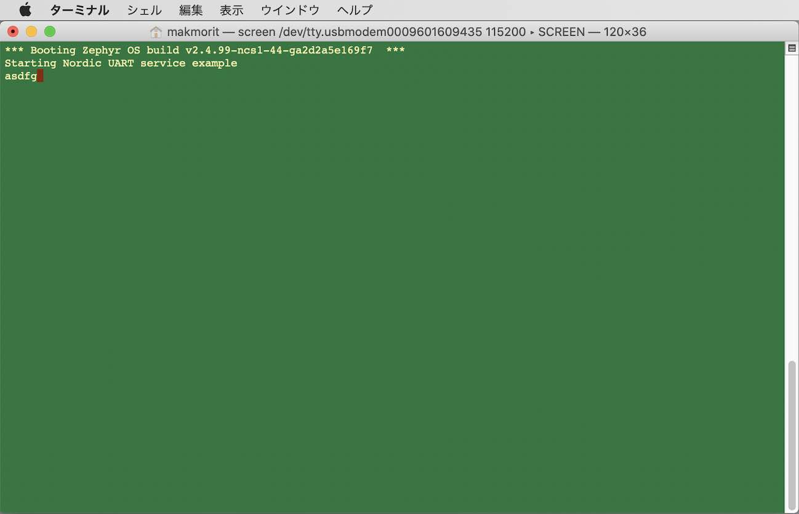

# nRF Connect SDKサンプル動作確認手順書

Nordic社が用意しているnRF Connect SDKサンプルアプリ「[Bluetooth: Peripheral UART](https://developer.nordicsemi.com/nRF_Connect_SDK/doc/latest/nrf/samples/bluetooth/peripheral_uart/README.html)」の動作確認手順について掲載します。

## 事前準備

#### J-Linkのインストール

PCとNordic開発ボード（nRF5340 DK）をUSBケーブル経由で接続するためのソフトウェア「SEGGER J-Link」を、PCに導入願います。<br>
インストールの詳細につきましては、別途手順書「[NetBeansインストール手順](../../nRF52840_app/NETBEANSINST.md)」の該当章「<b>SEGGER J-Link</b>」をご参照願います。

#### ボードをPCに接続

動作確認に使用する開発ボード（nRF5340 DK）を、USBケーブルでPCに接続します。<br>
Finderで、JLINKという名前のボリュームができていることを確認してください。


## サンプルアプリの準備

サンプルアプリ「Bluetooth: Peripheral UART」を、SDKサンプルフォルダーから任意のフォルダーに複製します。<br>
サンプルアプリのビルドと動作確認は、複製されたフォルダー上で実行するようにします。

#### サンプルアプリのコピー

サンプルアプリのプロジェクトフォルダー`${HOME}/opt/venv/ncs/nrf/samples/bluetooth/peripheral_uart`を、別フォルダー`${HOME}/opt/venv/ncs/research`配下に複製します。

下記は実行例になります。

```
(ncs) bash-3.2$ cd ${HOME}/opt/venv/ncs
(ncs) bash-3.2$ pwd
/Users/makmorit/opt/venv/ncs
(ncs) bash-3.2$ mkdir research
(ncs) bash-3.2$ cp -pr ${HOME}/opt/venv/ncs/nrf/samples/bluetooth/peripheral_uart research
(ncs) bash-3.2$ cd research
(ncs) bash-3.2$ ls -al
total 0
drwxr-xr-x   3 makmorit  staff   96  3 23 09:57 .
drwxr-xr-x  17 makmorit  staff  544  3 23 09:56 ..
drwxr-xr-x  10 makmorit  staff  320  3 23 09:35 peripheral_uart
(ncs) bash-3.2$
(ncs) bash-3.2$ cd peripheral_uart
(ncs) bash-3.2$ ls -al
total 64
drwxr-xr-x  10 makmorit  staff   320  3 23 09:35 .
drwxr-xr-x   3 makmorit  staff    96  3 23 09:57 ..
-rw-r--r--   1 makmorit  staff   336  3 23 09:35 CMakeLists.txt
-rw-r--r--   1 makmorit  staff   733  3 23 09:35 Kconfig
-rw-r--r--   1 makmorit  staff  4793  3 23 09:35 README.rst
-rw-r--r--   1 makmorit  staff   925  3 23 09:35 prj.conf
-rw-r--r--   1 makmorit  staff    46  3 23 09:35 prj.overlay
-rw-r--r--   1 makmorit  staff  3165  3 23 09:35 prj_minimal.conf
-rw-r--r--   1 makmorit  staff   338  3 23 09:35 sample.yaml
drwxr-xr-x   3 makmorit  staff    96  3 23 09:35 src
(ncs) bash-3.2$
```

#### ビルド／書込み専用シェルの作成

ビルド／書込みを実行するために使用する`westbuild.sh`を、下記内容で作成します。[注1][注2]<br>
作成場所はプロジェクトフォルダー（`${HOME}/opt/venv/ncs/research/peripheral_uart`）直下とします。

```
bash-3.2$ cd ${HOME}/opt/venv/ncs/research/peripheral_uart
bash-3.2$ cat westbuild.sh
#!/bin/bash

# Environment variables for the GNU Arm Embedded toolchain
export ZEPHYR_TOOLCHAIN_VARIANT=gcc-arm-none-eabi-9-2020-q2-update
export GNUARMEMB_TOOLCHAIN_PATH="${HOME}/opt/gcc-arm-none-eabi-9-2020-q2-update"

# Paths for command
export PATH=${PATH}:/Applications/CMake.app/Contents/bin
export PATH=${PATH}:${HOME}/opt/nRF-Command-Line-Tools_10_9_0_OSX/nrfjprog

# bash completion
source ${HOME}/opt/venv/ncs/west-completion.bash

# Enter Python3 venv
source ${HOME}/opt/venv/ncs/bin/activate

if [ "$1" == "-f" ]; then
    # Flash for nRF5340 DK
    ${HOME}/opt/venv/ncs/bin/west -v flash
else
    # Build for nRF5340 DK
    ${HOME}/opt/venv/ncs/bin/west build -c -b nrf5340dk_nrf5340_cpuapp
fi

deactivate
bash-3.2$
```

[注1] `gcc-arm-none-eabi-9-2020-q2-update`＝[ARM GCCツールチェイン](../../nRF52840_app/ARMGCCINST.md)の名称<br>
[注2] `nRF-Command-Line-Tools_10_9_0_OSX`＝[nRFコマンドラインツール](https://www.nordicsemi.com/Software-and-Tools/Development-Tools/nRF5-Command-Line-Tools/Download)のインストール先フォルダー名

## サンプルアプリのビルド

サンプルアプリ「Bluetooth: Peripheral UART」をビルドし、ファームウェアイメージファイルを作成します。
ビルド専用シェルを使用するため、Python3仮想環境に入る必要はありません。

#### ビルドの実行

先述のビルド専用シェル`westbuild.sh`を使用して、サンプルアプリをビルドします。<br>
以下のコマンドを実行します。<br>
（`build`サブディレクトリーがある場合は、事前に削除します）

```
cd ${HOME}/opt/venv/ncs/research/peripheral_uart
rm -rf build
./westbuild.sh
```

以下は実行例になります。<br>
ファームウェアイメージファイルは、サンプルアプリディレクトリー配下の`build/zephyr`というサブディレクトリーに作成されるようです。

```
bash-3.2$ cd ${HOME}/opt/venv/ncs/research/peripheral_uart
bash-3.2$ rm -rf build
bash-3.2$ ./westbuild.sh
-- west build: generating a build system
Including boilerplate (Zephyr base): /Users/makmorit/opt/venv/ncs/zephyr/cmake/app/boilerplate.cmake
-- Application: /Users/makmorit/opt/venv/ncs/research/peripheral_uart
-- Zephyr version: 2.4.99 (/Users/makmorit/opt/venv/ncs/zephyr)
-- Found Python3: /Users/makmorit/opt/venv/ncs/bin/python3 (found suitable exact version "3.7.3") found components: Interpreter
-- Found west (found suitable version "0.10.1", minimum required is "0.7.1")
-- Board: nrf5340dk_nrf5340_cpuapp
-- Cache files will be written to: /Users/makmorit/Library/Caches/zephyr
-- Found toolchain: gnuarmemb (/Users/makmorit/opt/gcc-arm-none-eabi-9-2020-q2-update)
-- Found BOARD.dts: /Users/makmorit/opt/venv/ncs/zephyr/boards/arm/nrf5340dk_nrf5340/nrf5340dk_nrf5340_cpuapp.dts
-- Generated zephyr.dts: /Users/makmorit/opt/venv/ncs/research/peripheral_uart/build/zephyr/zephyr.dts
-- Generated devicetree_unfixed.h: /Users/makmorit/opt/venv/ncs/research/peripheral_uart/build/zephyr/include/generated/devicetree_unfixed.h
-- Generated device_extern.h: /Users/makmorit/opt/venv/ncs/research/peripheral_uart/build/zephyr/include/generated/device_extern.h
Parsing /Users/makmorit/opt/venv/ncs/research/peripheral_uart/Kconfig
Loaded configuration '/Users/makmorit/opt/venv/ncs/zephyr/boards/arm/nrf5340dk_nrf5340/nrf5340dk_nrf5340_cpuapp_defconfig'
Merged configuration '/Users/makmorit/opt/venv/ncs/research/peripheral_uart/prj.conf'
Configuration saved to '/Users/makmorit/opt/venv/ncs/research/peripheral_uart/build/zephyr/.config'
Kconfig header saved to '/Users/makmorit/opt/venv/ncs/research/peripheral_uart/build/zephyr/include/generated/autoconf.h'
-- The C compiler identification is GNU 9.3.1
-- The CXX compiler identification is GNU 9.3.1
-- The ASM compiler identification is GNU
-- Found assembler: /Users/makmorit/opt/gcc-arm-none-eabi-9-2020-q2-update/bin/arm-none-eabi-gcc
Adding 'hci_rpmsg' firmware as child image since CONFIG_BT_RPMSG_NRF53 is set to 'y'

=== child image hci_rpmsg - CPUNET begin ===
Including boilerplate (Zephyr base): /Users/makmorit/opt/venv/ncs/zephyr/cmake/app/boilerplate.cmake
-- Application: /Users/makmorit/opt/venv/ncs/zephyr/samples/bluetooth/hci_rpmsg
-- Zephyr version: 2.4.99 (/Users/makmorit/opt/venv/ncs/zephyr)
-- Found Python3: /Users/makmorit/opt/venv/ncs/bin/python3 (found suitable exact version "3.7.3") found components: Interpreter
-- Found west (found suitable version "0.10.1", minimum required is "0.7.1")
-- Board: nrf5340dk_nrf5340_cpunet
-- Cache files will be written to: /Users/makmorit/Library/Caches/zephyr
-- Found toolchain: gnuarmemb (/Users/makmorit/opt/gcc-arm-none-eabi-9-2020-q2-update)
-- Found BOARD.dts: /Users/makmorit/opt/venv/ncs/zephyr/boards/arm/nrf5340dk_nrf5340/nrf5340dk_nrf5340_cpunet.dts
-- Generated zephyr.dts: /Users/makmorit/opt/venv/ncs/research/peripheral_uart/build/hci_rpmsg/zephyr/zephyr.dts
-- Generated devicetree_unfixed.h: /Users/makmorit/opt/venv/ncs/research/peripheral_uart/build/hci_rpmsg/zephyr/include/generated/devicetree_unfixed.h
-- Generated device_extern.h: /Users/makmorit/opt/venv/ncs/research/peripheral_uart/build/hci_rpmsg/zephyr/include/generated/device_extern.h
Parsing /Users/makmorit/opt/venv/ncs/zephyr/Kconfig
Loaded configuration '/Users/makmorit/opt/venv/ncs/zephyr/boards/arm/nrf5340dk_nrf5340/nrf5340dk_nrf5340_cpunet_defconfig'
Merged configuration '/Users/makmorit/opt/venv/ncs/zephyr/samples/bluetooth/hci_rpmsg/prj.conf'
Merged configuration '/Users/makmorit/opt/venv/ncs/nrf/subsys/partition_manager/partition_manager_enabled.conf'
Configuration saved to '/Users/makmorit/opt/venv/ncs/research/peripheral_uart/build/hci_rpmsg/zephyr/.config'
Kconfig header saved to '/Users/makmorit/opt/venv/ncs/research/peripheral_uart/build/hci_rpmsg/zephyr/include/generated/autoconf.h'
-- The C compiler identification is GNU 9.3.1
-- The CXX compiler identification is GNU 9.3.1
-- The ASM compiler identification is GNU
-- Found assembler: /Users/makmorit/opt/gcc-arm-none-eabi-9-2020-q2-update/bin/arm-none-eabi-gcc
-- Build type:  
-- Host:    Darwin/x86_64
-- Target:  Generic/arm
-- Machine: cortexm
-- Looking for include file stdatomic.h
-- Looking for include file stdatomic.h - found
-- Host:    Darwin/x86_64
-- Target:  Generic/arm
-- Machine: cortexm
-- C_FLAGS :  -Wall -Wextra
-- Looking for include file fcntl.h
-- Looking for include file fcntl.h - found
CMake Warning at ../../../CMakeLists.txt:1357 (message):
  __ASSERT() statements are globally ENABLED


-- Configuring done
-- Generating done
-- Build files have been written to: /Users/makmorit/opt/venv/ncs/research/peripheral_uart/build/hci_rpmsg
=== child image hci_rpmsg - CPUNET end ===

-- Build type:  
-- Host:    Darwin/x86_64
-- Target:  Generic/arm
-- Machine: cortexm
-- Looking for include file stdatomic.h
-- Looking for include file stdatomic.h - found
-- Host:    Darwin/x86_64
-- Target:  Generic/arm
-- Machine: cortexm
-- C_FLAGS :  -Wall -Wextra
-- Looking for include file fcntl.h
-- Looking for include file fcntl.h - found
CMake Warning at /Users/makmorit/opt/venv/ncs/zephyr/CMakeLists.txt:1357 (message):
  __ASSERT() statements are globally ENABLED


-- Configuring done
-- Generating done
-- Build files have been written to: /Users/makmorit/opt/venv/ncs/research/peripheral_uart/build
-- west build: building application
[1/244] Preparing syscall dependency handling

[7/244] Performing build step for 'hci_rpmsg_subimage'
[1/212] Preparing syscall dependency handling

[205/212] Linking C executable zephyr/zephyr_prebuilt.elf
Memory region         Used Size  Region Size  %age Used
           FLASH:      179596 B       256 KB     68.51%
            SRAM:       45708 B        64 KB     69.74%
        IDT_LIST:         168 B         2 KB      8.20%
[212/212] Generating zephyr/merged_CPUNET.hex
[234/244] Linking C executable zephyr/zephyr_prebuilt.elf
Memory region         Used Size  Region Size  %age Used
           FLASH:      129200 B      1016 KB     12.42%
            SRAM:       28344 B       448 KB      6.18%
        IDT_LIST:          88 B         2 KB      4.30%
[244/244] Generating zephyr/merged_domains.hex
bash-3.2$
```

## サンプルアプリの書込み

先述のビルド専用シェル`westbuild.sh`を使用して、サンプルアプリをnRF5340に書込みます。<br>
以下のコマンドを実行します。

```
cd ${HOME}/opt/venv/ncs/research/peripheral_uart
./westbuild.sh -f
```

以下は実行例になります。

```
bash-3.2$ cd ${HOME}/opt/venv/ncs/research/peripheral_uart
bash-3.2$ ./westbuild.sh -f
ZEPHYR_BASE=/Users/makmorit/opt/venv/ncs/zephyr (origin: configfile)
-- west flash: rebuilding
cmake version 3.18.0 is OK; minimum version is 3.13.1
Running CMake: /Applications/CMake.app/Contents/bin/cmake --build /Users/makmorit/opt/venv/ncs/research/peripheral_uart/build --target west_flash_depends
[0/4] Performing build step for 'hci_rpmsg_subimage'
ninja: no work to do.
[1/2] cd /Users/makmorit/opt/venv/ncs/research/peripheral_...lash && /Applications/CMake.app/Contents/bin/cmake -E echo

-- west flash: using runner nrfjprog
runners.nrfjprog: nrfjprog --ids
Using board 960160943
-- runners.nrfjprog: Flashing file: /Users/makmorit/opt/venv/ncs/research/peripheral_uart/build/zephyr/merged_domains.hex
-- runners.nrfjprog: Generating CP_NETWORK hex file /Users/makmorit/opt/venv/ncs/research/peripheral_uart/build/zephyr/GENERATED_CP_NETWORK_merged_domains.hex
-- runners.nrfjprog: Generating CP_APPLICATION hex file /Users/makmorit/opt/venv/ncs/research/peripheral_uart/build/zephyr/GENERATED_CP_APPLICATION_merged_domains.hex
runners.nrfjprog: nrfjprog --program /Users/makmorit/opt/venv/ncs/research/peripheral_uart/build/zephyr/GENERATED_CP_NETWORK_merged_domains.hex --sectorerase -f NRF53 --coprocessor CP_NETWORK --snr 960160943
Parsing hex file.
Erasing page at address 0x1000000.
Erasing page at address 0x1000800.
：
Erasing page at address 0x102B000.
Erasing page at address 0x102B800.
Applying system reset.
Checking that the area to write is not protected.
Programming device.
runners.nrfjprog: nrfjprog --program /Users/makmorit/opt/venv/ncs/research/peripheral_uart/build/zephyr/GENERATED_CP_APPLICATION_merged_domains.hex --sectorerase -f NRF53 --coprocessor CP_APPLICATION --snr 960160943
Parsing hex file.
Erasing page at address 0x0.
Erasing page at address 0x1000.
：
Erasing page at address 0x1E000.
Erasing page at address 0x1F000.
Applying system reset.
Checking that the area to write is not protected.
Programming device.
runners.nrfjprog: nrfjprog --pinreset -f NRF53 --snr 960160943
Applying pin reset.
-- runners.nrfjprog: Board with serial number 960160943 flashed successfully.
bash-3.2$
```

以上で、サンプルアプリの書込みは完了になります。

## サンプルアプリのデバッグ出力

nRF5340 DK（PCA10095）は、３点の仮想COMポート（USB CDC ACMポート）が用意されているようです。<br>
下記のように、仮想COMポート名は`<ボードのシリアル番号>N`形式（Nは1、3、5のいずれか）となっています。

```
bash-3.2$ ls -1 /dev/tty.usbmodem*
/dev/tty.usbmodem0009601609431
/dev/tty.usbmodem0009601609433
/dev/tty.usbmodem0009601609435
bash-3.2$
```

上記３点のうち、UARTデバッグプリントは下図のように、`/dev/tty.usbmodem0009601609435`に出力されたのを確認しています。


## サンプルアプリのテスト

サンプルアプリのテストには、Androidのスマートフォンを使用します。<br>
（今回はHUAWEI社のスマートフォン「nova lite 2」を使用）

#### テスト準備（Android側）

AndroidにインストールしたnRF Connectアプリを起動し、BLEデバイスをスキャンすると、下図のように一覧に「Nordic_UART_Service」というデバイスがリストされます。<br>
一覧右部の「Connect」をタップして、接続します。


下図のようにCLIENTタブに移りますので、右上の「DISCONNECT」というラベルの横にあるメニューをタップします。


「Discover services」を選択し、サービスディスカバリーを実行します。


一覧表示された「Nordic UART Service」をタップします。



キャラクタリスティックが一覧されますので「TX Characteristic」の横のアイコン（下に３本の矢印が向いているアイコン）をタップします。


「TX Characteristic」の横のアイコンの形が変わり、データ受信可能状態となります。


これでAndroid側の準備は完了です。

#### テスト準備（PC側）

先述したUARTプリント出力用のターミナルを開きます。<br>
（UART送信データの入力用ターミナルを兼ねます）

以下のようなコマンドを、ターミナルから実行します。<br>
（末尾が`5`になっている端末名を指定し、screenコマンドを実行）

```
screen `ls /dev/tty.usbmodem*5` 115200
```

以下のようなUARTプリント出力用のターミナルが表示されます。


これでPC側の準備は完了です。

#### テスト実行（PC-->Android）

PC側のターミナル上で「`qwerty`」とタイプし[ENTER]キーを押下します。<br>
（ターミナルには入力文字がエコーバックされないのでご注意）


BLEトランスポートを経由し、Android側で入力文字が受信され、画面上の「TX Characteristic」に「`Value: qwerty`」と表示される事を確認します。


#### テスト実行（Android-->PC）

Android画面上の「RX Characteristic」右横のアイコンをタップすると、下図のようなテキストボックスが表示されます。<br>
文字「`asdfg`」を入力し「SEND」をタップします。


BLEトランスポートを経由し、Android側から入力文字が送信され、PC側のターミナル上に「`asdfg`」と表示される事を確認します。



最後に、Android画面右上の「DISCONNECT」をタップし、nRF5340 DKとの接続を切断してください。<br>
下図のように「DISCONNECT」の表示が「CONNECT」と変化し、切断された事を示します。


以上で、サンプルアプリのテストは完了となります。
