# SMPサンプルアプリ動作確認手順書

Nordic社が用意しているSMPサンプルアプリ「[SMP Server Sample](https://developer.nordicsemi.com/nRF_Connect_SDK/doc/latest/zephyr/samples/subsys/mgmt/mcumgr/smp_svr/README.html)」の動作確認手順について掲載します。

## 概要

SMPサンプルアプリは、`MCUboot`というセキュアブートローダーを搭載するアプリケーションです。[注1][注2]<br>
したがって、このアプリの動作確認を行うことにより、nRF5340アプリケーション更新の仕組みを知ることができます。

本ドキュメントでは、サンプルアプリをnRF5340に導入したのち、サンプルアプリを１箇所改修後、BLE DFU機能で上書き導入します。<br>
実行結果を参照し、サンプルアプリのBLE DFU機能により、BLE経由でファームウェアが更新できるかどうか確認します。

[注1] [BLE DFU機能](https://developer.nordicsemi.com/nRF_Connect_SDK/doc/latest/zephyr/guides/device_mgmt/dfu.html#mcuboot)（Bluetooth経由でファームウェア更新イメージファイルを受信するとともに、受信した更新イメージをFlash ROMに書き込んで反映させる機能）を有しています。この機能を使用すると、ファームウェア更新時、nRF5340基板に対し直接配線を行う必要はありません。<br>
[注2] 2021/3/24現在、Nordic社はUSB DFU機能をサポートしていないようです（現状はスマートフォン版[nRF Connectアプリ](https://www.nordicsemi.com/Software-and-tools/Development-Tools/nRF-Connect-for-mobile)によるBLE DFUのみサポート）。

## 事前準備

#### J-Linkのインストール

PCとNordic開発ボード（nRF5340 DK）をUSBケーブル経由で接続するためのソフトウェア「SEGGER J-Link」を、PCに導入願います。<br>
インストールの詳細につきましては、別途手順書「[NetBeansインストール手順](../../nRF52840_app/NETBEANSINST.md)」の該当章「<b>SEGGER J-Link</b>」をご参照願います。

#### ボードをPCに接続

動作確認に使用する開発ボード（nRF5340 DK）を、USBケーブルでPCに接続します。<br>
Finderで、JLINKという名前のボリュームができていることを確認してください。


## サンプルアプリの準備

サンプルアプリ「[SMP Server Sample](https://developer.nordicsemi.com/nRF_Connect_SDK/doc/latest/zephyr/samples/subsys/mgmt/mcumgr/smp_svr/README.html)」を、SDKサンプルフォルダーから任意のフォルダーに複製します。<br>
サンプルアプリのビルドと動作確認は、複製されたフォルダー上で実行するようにします。

#### サンプルアプリのコピー

サンプルアプリのプロジェクトフォルダー`${HOME}/opt/venv/ncs/zephyr/samples/subsys/mgmt/mcumgr/smp_svr`を、別フォルダー`${HOME}/opt/venv/ncs/research`配下に複製します。<br>
下記コマンドを実行します。

```
cd ${HOME}/opt/venv/ncs/research
cp -pr ${HOME}/opt/venv/ncs/zephyr/samples/subsys/mgmt/mcumgr/smp_svr .
```

下記は実行例になります。

```
bash-3.2$ cd ${HOME}/opt/venv/ncs/research
bash-3.2$ cp -pr ${HOME}/opt/venv/ncs/zephyr/samples/subsys/mgmt/mcumgr/smp_svr .
bash-3.2$ ls -al
total 16
drwxr-xr-x   5 makmorit  staff   160  3 24 10:12 .
drwxr-xr-x  18 makmorit  staff   576  3 23 10:09 ..
-rw-r--r--@  1 makmorit  staff  6148  3 24 09:52 .DS_Store
drwxr-xr-x  13 makmorit  staff   416  3 23 12:16 peripheral_uart
drwxr-xr-x  17 makmorit  staff   544  3 23 14:46 smp_svr
bash-3.2$
```

#### ビルド／書込み専用シェルの作成

ビルド／書込みを実行するために使用する`westbuild.sh`を、下記内容で作成します。[注1][注2]<br>
作成場所はプロジェクトフォルダー（`${HOME}/opt/venv/ncs/research/smp_svr`）直下とします。

```
bash-3.2$ cd ${HOME}/opt/venv/ncs/research/smp_svr
bash-3.2$ cat westbuild.sh
#!/bin/bash

# Environment variables for the GNU Arm Embedded toolchain
export ZEPHYR_TOOLCHAIN_VARIANT=gnuarmemb
export GNUARMEMB_TOOLCHAIN_PATH="${HOME}/opt/gcc-arm-none-eabi-9-2020-q2-update"

# Paths for command
export PATH=${PATH}:/Applications/CMake.app/Contents/bin
export PATH=${PATH}:${HOME}/opt/nRF-Command-Line-Tools_10_9_0_OSX/nrfjprog

# bash completion
export NCS_HOME=${HOME}/opt/venv/ncs
source ${NCS_HOME}/west-completion.bash

# Enter Python3 venv
source ${NCS_HOME}/bin/activate

if [ "$1" == "-f" ]; then
    # Flash for nRF5340 DK
    ${NCS_HOME}/bin/west -v flash -d build_signed
else
    # Build for nRF5340 DK
    ${NCS_HOME}/bin/west build -c -b nrf5340dk_nrf5340_cpuapp -d build_signed -- -DCONFIG_MCUBOOT_SIGNATURE_KEY_FILE=\"bootloader/mcuboot/root-rsa-2048.pem\" -DOVERLAY_CONFIG=overlay-bt.conf
fi

deactivate
bash-3.2$
```

[注1] `gcc-arm-none-eabi-9-2020-q2-update`＝[ARM GCCツールチェイン](../../nRF52840_app/ARMGCCINST.md)の名称<br>
[注2] `nRF-Command-Line-Tools_10_9_0_OSX`＝[nRFコマンドラインツール](https://www.nordicsemi.com/Software-and-Tools/Development-Tools/nRF5-Command-Line-Tools/Download)のインストール先フォルダー名

## サンプルアプリのビルド

サンプルアプリ「SMP Server Sample」をビルドし、ファームウェアイメージファイルを作成します。<br>
ビルド専用シェルを使用するため、Python3仮想環境に入る必要はありません。

#### ビルドの実行

先述のビルド専用シェル`westbuild.sh`を使用して、サンプルアプリをビルドします。<br>
以下のコマンドを実行します。

```
cd ${HOME}/opt/venv/ncs/research/smp_svr
./westbuild.sh
```

以下は実行例になります。<br>
ファームウェアイメージファイルは、サンプルアプリディレクトリー配下の`build/zephyr`というサブディレクトリーに作成されるようです。

```
bash-3.2$ cd ${HOME}/opt/venv/ncs/research/smp_svr
bash-3.2$ ./westbuild.sh
-- west build: generating a build system
Including boilerplate (Zephyr base): /Users/makmorit/opt/venv/ncs/zephyr/cmake/app/boilerplate.cmake
-- Application: /Users/makmorit/opt/venv/ncs/research/smp_svr
-- Zephyr version: 2.4.99 (/Users/makmorit/opt/venv/ncs/zephyr)
-- Found Python3: /Users/makmorit/opt/venv/ncs/bin/python3 (found suitable exact version "3.7.3") found components: Interpreter
-- Found west (found suitable version "0.10.1", minimum required is "0.7.1")
-- Board: nrf5340dk_nrf5340_cpuapp
-- Cache files will be written to: /Users/makmorit/Library/Caches/zephyr
-- Found toolchain: gnuarmemb (/Users/makmorit/opt/gcc-arm-none-eabi-9-2020-q2-update)
-- Found BOARD.dts: /Users/makmorit/opt/venv/ncs/zephyr/boards/arm/nrf5340dk_nrf5340/nrf5340dk_nrf5340_cpuapp.dts
-- Generated zephyr.dts: /Users/makmorit/opt/venv/ncs/research/smp_svr/build_signed/zephyr/zephyr.dts
-- Generated devicetree_unfixed.h: /Users/makmorit/opt/venv/ncs/research/smp_svr/build_signed/zephyr/include/generated/devicetree_unfixed.h
-- Generated device_extern.h: /Users/makmorit/opt/venv/ncs/research/smp_svr/build_signed/zephyr/include/generated/device_extern.h
Parsing /Users/makmorit/opt/venv/ncs/zephyr/Kconfig
Loaded configuration '/Users/makmorit/opt/venv/ncs/zephyr/boards/arm/nrf5340dk_nrf5340/nrf5340dk_nrf5340_cpuapp_defconfig'
Merged configuration '/Users/makmorit/opt/venv/ncs/research/smp_svr/prj.conf'
Merged configuration 'overlay-bt.conf'
Merged configuration '/Users/makmorit/opt/venv/ncs/research/smp_svr/build_signed/zephyr/misc/generated/extra_kconfig_options.conf'
Configuration saved to '/Users/makmorit/opt/venv/ncs/research/smp_svr/build_signed/zephyr/.config'
Kconfig header saved to '/Users/makmorit/opt/venv/ncs/research/smp_svr/build_signed/zephyr/include/generated/autoconf.h'
-- The C compiler identification is GNU 9.3.1
-- The CXX compiler identification is GNU 9.3.1
-- The ASM compiler identification is GNU
-- Found assembler: /Users/makmorit/opt/gcc-arm-none-eabi-9-2020-q2-update/bin/arm-none-eabi-gcc
Adding 'hci_rpmsg' firmware as child image since CONFIG_BT_RPMSG_NRF53 is set to 'y'

=== child image hci_rpmsg - CPUNET begin ===
Including boilerplate (Zephyr base): /Users/makmorit/opt/venv/ncs/zephyr/cmake/app/boilerplate.cmake
-- Application: /Users/makmorit/opt/venv/ncs/zephyr/samples/bluetooth/hci_rpmsg
-- Zephyr version: 2.4.99 (/Users/makmorit/opt/venv/ncs/zephyr)
-- Found Python3: /Users/makmorit/opt/venv/ncs/bin/python3 (found suitable exact version "3.7.3") found components: Interpreter
-- Found west (found suitable version "0.10.1", minimum required is "0.7.1")
-- Board: nrf5340dk_nrf5340_cpunet
-- Cache files will be written to: /Users/makmorit/Library/Caches/zephyr
-- Found toolchain: gnuarmemb (/Users/makmorit/opt/gcc-arm-none-eabi-9-2020-q2-update)
-- Found BOARD.dts: /Users/makmorit/opt/venv/ncs/zephyr/boards/arm/nrf5340dk_nrf5340/nrf5340dk_nrf5340_cpunet.dts
-- Generated zephyr.dts: /Users/makmorit/opt/venv/ncs/research/smp_svr/build_signed/hci_rpmsg/zephyr/zephyr.dts
-- Generated devicetree_unfixed.h: /Users/makmorit/opt/venv/ncs/research/smp_svr/build_signed/hci_rpmsg/zephyr/include/generated/devicetree_unfixed.h
-- Generated device_extern.h: /Users/makmorit/opt/venv/ncs/research/smp_svr/build_signed/hci_rpmsg/zephyr/include/generated/device_extern.h
Parsing /Users/makmorit/opt/venv/ncs/zephyr/Kconfig
Loaded configuration '/Users/makmorit/opt/venv/ncs/zephyr/boards/arm/nrf5340dk_nrf5340/nrf5340dk_nrf5340_cpunet_defconfig'
Merged configuration '/Users/makmorit/opt/venv/ncs/zephyr/samples/bluetooth/hci_rpmsg/prj.conf'
Merged configuration '/Users/makmorit/opt/venv/ncs/nrf/subsys/bootloader/image/secure_boot.conf'
Merged configuration '/Users/makmorit/opt/venv/ncs/nrf/subsys/partition_manager/partition_manager_enabled.conf'
Configuration saved to '/Users/makmorit/opt/venv/ncs/research/smp_svr/build_signed/hci_rpmsg/zephyr/.config'
Kconfig header saved to '/Users/makmorit/opt/venv/ncs/research/smp_svr/build_signed/hci_rpmsg/zephyr/include/generated/autoconf.h'
-- The C compiler identification is GNU 9.3.1
-- The CXX compiler identification is GNU 9.3.1
-- The ASM compiler identification is GNU
-- Found assembler: /Users/makmorit/opt/gcc-arm-none-eabi-9-2020-q2-update/bin/arm-none-eabi-gcc

=== child image b0n - CPUNET (inherited) begin ===
Including boilerplate (Zephyr base): /Users/makmorit/opt/venv/ncs/zephyr/cmake/app/boilerplate.cmake
-- Application: /Users/makmorit/opt/venv/ncs/nrf/samples/nrf5340/netboot
-- Zephyr version: 2.4.99 (/Users/makmorit/opt/venv/ncs/zephyr)
-- Found Python3: /Users/makmorit/opt/venv/ncs/bin/python3 (found suitable exact version "3.7.3") found components: Interpreter
-- Found west (found suitable version "0.10.1", minimum required is "0.7.1")
-- Board: nrf5340dk_nrf5340_cpunet
-- Cache files will be written to: /Users/makmorit/Library/Caches/zephyr
-- Found toolchain: gnuarmemb (/Users/makmorit/opt/gcc-arm-none-eabi-9-2020-q2-update)
-- Found BOARD.dts: /Users/makmorit/opt/venv/ncs/zephyr/boards/arm/nrf5340dk_nrf5340/nrf5340dk_nrf5340_cpunet.dts
-- Generated zephyr.dts: /Users/makmorit/opt/venv/ncs/research/smp_svr/build_signed/hci_rpmsg/b0n/zephyr/zephyr.dts
-- Generated devicetree_unfixed.h: /Users/makmorit/opt/venv/ncs/research/smp_svr/build_signed/hci_rpmsg/b0n/zephyr/include/generated/devicetree_unfixed.h
-- Generated device_extern.h: /Users/makmorit/opt/venv/ncs/research/smp_svr/build_signed/hci_rpmsg/b0n/zephyr/include/generated/device_extern.h
Parsing /Users/makmorit/opt/venv/ncs/nrf/samples/nrf5340/netboot/Kconfig
Loaded configuration '/Users/makmorit/opt/venv/ncs/zephyr/boards/arm/nrf5340dk_nrf5340/nrf5340dk_nrf5340_cpunet_defconfig'
Merged configuration '/Users/makmorit/opt/venv/ncs/nrf/samples/nrf5340/netboot/prj.conf'
Merged configuration '/Users/makmorit/opt/venv/ncs/nrf/subsys/partition_manager/partition_manager_enabled.conf'
Configuration saved to '/Users/makmorit/opt/venv/ncs/research/smp_svr/build_signed/hci_rpmsg/b0n/zephyr/.config'
Kconfig header saved to '/Users/makmorit/opt/venv/ncs/research/smp_svr/build_signed/hci_rpmsg/b0n/zephyr/include/generated/autoconf.h'
-- The C compiler identification is GNU 9.3.1
-- The CXX compiler identification is GNU 9.3.1
-- The ASM compiler identification is GNU
-- Found assembler: /Users/makmorit/opt/gcc-arm-none-eabi-9-2020-q2-update/bin/arm-none-eabi-gcc
CMake Warning at /Users/makmorit/opt/venv/ncs/zephyr/kernel/CMakeLists.txt:59 (message):
  Single threaded mode (CONFIG_MULTITHREADING=n) is deprecated


CMake Warning at /Users/makmorit/opt/venv/ncs/zephyr/CMakeLists.txt:1357 (message):
  __ASSERT() statements are globally ENABLED


-- Configuring done
-- Generating done
-- Build files have been written to: /Users/makmorit/opt/venv/ncs/research/smp_svr/build_signed/hci_rpmsg/b0n
=== child image b0n - CPUNET (inherited) end ===

-- Build type:  
-- Host:    Darwin/x86_64
-- Target:  Generic/arm
-- Machine: cortexm
-- Looking for include file stdatomic.h
-- Looking for include file stdatomic.h - found
-- Host:    Darwin/x86_64
-- Target:  Generic/arm
-- Machine: cortexm
-- C_FLAGS :  -Wall -Wextra
-- Looking for include file fcntl.h
-- Looking for include file fcntl.h - found
CMake Warning at ../../../CMakeLists.txt:1357 (message):
  __ASSERT() statements are globally ENABLED


-- Configuring done
-- Generating done
-- Build files have been written to: /Users/makmorit/opt/venv/ncs/research/smp_svr/build_signed/hci_rpmsg
=== child image hci_rpmsg - CPUNET end ===


=== child image mcuboot -  begin ===
Including boilerplate (Zephyr base): /Users/makmorit/opt/venv/ncs/zephyr/cmake/app/boilerplate.cmake
-- Application: /Users/makmorit/opt/venv/ncs/bootloader/mcuboot/boot/zephyr
-- Zephyr version: 2.4.99 (/Users/makmorit/opt/venv/ncs/zephyr)
-- Found Python3: /Users/makmorit/opt/venv/ncs/bin/python3 (found suitable exact version "3.7.3") found components: Interpreter
-- Found west (found suitable version "0.10.1", minimum required is "0.7.1")
-- Board: nrf5340dk_nrf5340_cpuapp
-- Cache files will be written to: /Users/makmorit/Library/Caches/zephyr
-- Found toolchain: gnuarmemb (/Users/makmorit/opt/gcc-arm-none-eabi-9-2020-q2-update)
-- Found BOARD.dts: /Users/makmorit/opt/venv/ncs/zephyr/boards/arm/nrf5340dk_nrf5340/nrf5340dk_nrf5340_cpuapp.dts
-- Found devicetree overlay: /Users/makmorit/opt/venv/ncs/bootloader/mcuboot/boot/zephyr/dts.overlay
-- Generated zephyr.dts: /Users/makmorit/opt/venv/ncs/research/smp_svr/build_signed/mcuboot/zephyr/zephyr.dts
-- Generated devicetree_unfixed.h: /Users/makmorit/opt/venv/ncs/research/smp_svr/build_signed/mcuboot/zephyr/include/generated/devicetree_unfixed.h
-- Generated device_extern.h: /Users/makmorit/opt/venv/ncs/research/smp_svr/build_signed/mcuboot/zephyr/include/generated/device_extern.h
Parsing /Users/makmorit/opt/venv/ncs/bootloader/mcuboot/boot/zephyr/Kconfig
Loaded configuration '/Users/makmorit/opt/venv/ncs/zephyr/boards/arm/nrf5340dk_nrf5340/nrf5340dk_nrf5340_cpuapp_defconfig'
Merged configuration '/Users/makmorit/opt/venv/ncs/bootloader/mcuboot/boot/zephyr/prj.conf'
Merged configuration '/Users/makmorit/opt/venv/ncs/nrf/subsys/pcd/pcd.conf'
Merged configuration '/Users/makmorit/opt/venv/ncs/nrf/subsys/partition_manager/partition_manager_enabled.conf'
Configuration saved to '/Users/makmorit/opt/venv/ncs/research/smp_svr/build_signed/mcuboot/zephyr/.config'
Kconfig header saved to '/Users/makmorit/opt/venv/ncs/research/smp_svr/build_signed/mcuboot/zephyr/include/generated/autoconf.h'
-- The C compiler identification is GNU 9.3.1
-- The CXX compiler identification is GNU 9.3.1
-- The ASM compiler identification is GNU
-- Found assembler: /Users/makmorit/opt/gcc-arm-none-eabi-9-2020-q2-update/bin/arm-none-eabi-gcc
CMake Warning at /Users/makmorit/opt/venv/ncs/zephyr/kernel/CMakeLists.txt:59 (message):
  Single threaded mode (CONFIG_MULTITHREADING=n) is deprecated


MCUBoot bootloader key file: /Users/makmorit/opt/venv/ncs/bootloader/mcuboot/root-rsa-2048.pem
-- Configuring done
-- Generating done
-- Build files have been written to: /Users/makmorit/opt/venv/ncs/research/smp_svr/build_signed/mcuboot
=== child image mcuboot -  end ===

CMake Warning at /Users/makmorit/opt/venv/ncs/nrf/modules/mcuboot/CMakeLists.txt:151 (message):


        ---------------------------------------------------------
        --- WARNING: Using default MCUBoot key, it should not ---
        --- be used for production.                           ---
        ---------------------------------------------------------


CMake Warning at /Users/makmorit/opt/venv/ncs/nrf/modules/mcuboot/CMakeLists.txt:352 (message):
  CONFIG_MCUBOOT_SIGNATURE_KEY_FILE is set to
  "bootloader/mcuboot/root-rsa-2048.pem".

  You are using the NCS Mcuboot signing, which means this option will be
  ignored.

  Image signing in NCS is done via the MCUboot image's
  CONFIG_BOOT_SIGNATURE_KEY_FILE option.

  Consider setting CONFIG_MCUBOOT_SIGNATURE_KEY_FILE in your application
  image back to its default value, the empty string.


-- Build type:  
-- Host:    Darwin/x86_64
-- Target:  Generic/arm
-- Machine: cortexm
-- Looking for include file stdatomic.h
-- Looking for include file stdatomic.h - found
-- Host:    Darwin/x86_64
-- Target:  Generic/arm
-- Machine: cortexm
-- C_FLAGS :  -Wall -Wextra
-- Looking for include file fcntl.h
-- Looking for include file fcntl.h - found
-- Configuring done
-- Generating done
-- Build files have been written to: /Users/makmorit/opt/venv/ncs/research/smp_svr/build_signed
-- west build: building application
[1/304] Preparing syscall dependency handling

[11/304] Performing build step for 'mcuboot_subimage'
[1/259] Preparing syscall dependency handling

[254/259] Linking C executable zephyr/zephyr_prebuilt.elf
Memory region         Used Size  Region Size  %age Used
           FLASH:       39408 B        48 KB     80.18%
            SRAM:       24240 B       440 KB      5.38%
        IDT_LIST:          72 B         2 KB      3.52%
[259/259] Linking C executable zephyr/zephyr.elf
[280/304] Performing build step for 'hci_rpmsg_subimage'
[0/230] Generating extra provision key files
[1/230] Preparing syscall dependency handling

[9/230] Performing build step for 'b0n_subimage'
[1/152] Preparing syscall dependency handling

[147/152] Linking C executable zephyr/zephyr_prebuilt.elf
Memory region         Used Size  Region Size  %age Used
           FLASH:       24896 B      34304 B     72.57%
            SRAM:        3528 B        64 KB      5.38%
        IDT_LIST:          56 B         2 KB      2.73%
[152/152] Linking C executable zephyr/zephyr.elf
[214/230] Linking C executable zephyr/zephyr_prebuilt.elf
Memory region         Used Size  Region Size  %age Used
           FLASH:      180252 B       222 KB     79.29%
            SRAM:       45708 B        64 KB     69.74%
        IDT_LIST:         168 B         2 KB      8.20%
[215/230] Generating signing key
[219/230] Creating public key from private key used for signing
[220/230] Creating data to be provisioned to the Bootloader, storing to provision.hex
[227/230] Creating signature of application
[228/230] Creating validation for zephyr.hex, storing to
[230/230] Generating zephyr/merged_CPUNET.hex
[289/304] Linking C executable zephyr/zephyr_prebuilt.elf
Memory region         Used Size  Region Size  %age Used
           FLASH:      140248 B     474624 B     29.55%
            SRAM:       42255 B       440 KB      9.38%
        IDT_LIST:          88 B         2 KB      4.30%
[304/304] Generating zephyr/merged_domains.hex
bash-3.2$
```

## サンプルアプリの書込み

先述のビルド専用シェル`westbuild.sh`を使用して、サンプルアプリをnRF5340に書込みます。<br>
以下のコマンドを実行します。

```
cd ${HOME}/opt/venv/ncs/research/smp_svr
./westbuild.sh -f
```

以下は実行例になります。

```
bash-3.2$ cd ${HOME}/opt/venv/ncs/research/smp_svr
bash-3.2$ ./westbuild.sh -f
ZEPHYR_BASE=/Users/makmorit/opt/venv/ncs/zephyr (origin: configfile)
-- west flash: rebuilding
cmake version 3.18.0 is OK; minimum version is 3.13.1
Running CMake: /Applications/CMake.app/Contents/bin/cmake --build build_signed --target west_flash_depends
[0/9] Performing build step for 'mcuboot_subimage'
ninja: no work to do.
[1/6] Performing build step for 'hci_rpmsg_subimage'
[0/5] Performing build step for 'b0n_subimage'
ninja: no work to do.
[2/3] cd /Users/makmorit/opt/venv/ncs/research/smp_svr/bui...lash && /Applications/CMake.app/Contents/bin/cmake -E echo

-- west flash: using runner nrfjprog
runners.nrfjprog: nrfjprog --ids
Using board 960160943
-- runners.nrfjprog: Flashing file: /Users/makmorit/opt/venv/ncs/research/smp_svr/build_signed/zephyr/merged_domains.hex
-- runners.nrfjprog: Generating CP_NETWORK hex file /Users/makmorit/opt/venv/ncs/research/smp_svr/build_signed/zephyr/GENERATED_CP_NETWORK_merged_domains.hex
-- runners.nrfjprog: Generating CP_APPLICATION hex file /Users/makmorit/opt/venv/ncs/research/smp_svr/build_signed/zephyr/GENERATED_CP_APPLICATION_merged_domains.hex
runners.nrfjprog: nrfjprog --program /Users/makmorit/opt/venv/ncs/research/smp_svr/build_signed/zephyr/GENERATED_CP_NETWORK_merged_domains.hex --sectorerase -f NRF53 --coprocessor CP_NETWORK --snr 960160943
Parsing hex file.
Erasing page at address 0x1000000.
Erasing page at address 0x1000800.
：
Erasing page at address 0x1034000.
Erasing page at address 0x1034800.
Applying system reset.
Checking that the area to write is not protected.
Programming device.
runners.nrfjprog: nrfjprog --program /Users/makmorit/opt/venv/ncs/research/smp_svr/build_signed/zephyr/GENERATED_CP_APPLICATION_merged_domains.hex --sectorerase -f NRF53 --coprocessor CP_APPLICATION --snr 960160943
Parsing hex file.
Erasing page at address 0x0.
Erasing page at address 0x1000.
：
Erasing page at address 0x2D000.
Erasing page at address 0x2E000.
Applying system reset.
Checking that the area to write is not protected.
Programming device.
runners.nrfjprog: nrfjprog --pinreset -f NRF53 --snr 960160943
Applying pin reset.
-- runners.nrfjprog: Board with serial number 960160943 flashed successfully.
bash-3.2$
```

以上で、サンプルアプリの書込みは完了になります。

この時点では、サンプルアプリはオリジナルの状態となっています。

## サンプルアプリのデバッグ出力

nRF5340 DK（PCA10095）は、３点の仮想COMポート（USB CDC ACMポート）が用意されているようです。<br>
下記のように、仮想COMポート名は`<ボードのシリアル番号>N`形式（Nは1、3、5のいずれか）となっています。

```
bash-3.2$ ls -1 /dev/tty.usbmodem*
/dev/tty.usbmodem0009601609431
/dev/tty.usbmodem0009601609433
/dev/tty.usbmodem0009601609435
bash-3.2$
```

上記３点のうち、UARTデバッグプリントは下図のように、`/dev/tty.usbmodem0009601609435`に出力されたのを確認しています。

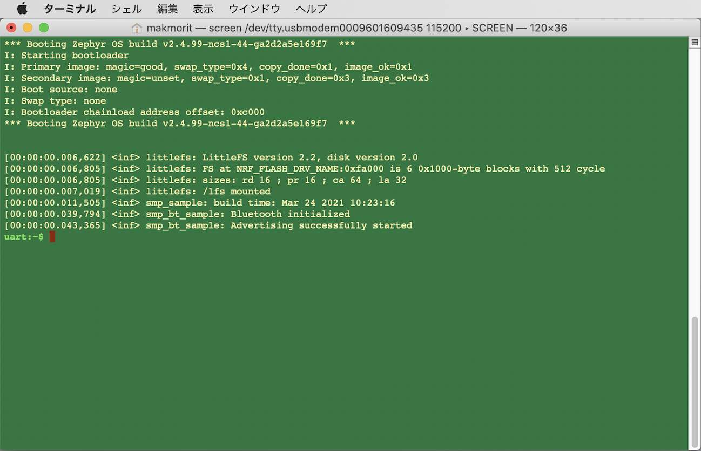

#### アプリケーション（オリジナル）のデバッグプリント

オリジナルのアプリケーションが出力するデバッグプリントは、以下の３行です。<br>
（Zephyr OSが出力する他のデバッグプリントは省略）

```
[00:00:00.011,505] <inf> smp_sample: build time: Mar 24 2021 10:23:16
[00:00:00.039,794] <inf> smp_bt_sample: Bluetooth initialized
[00:00:00.043,365] <inf> smp_bt_sample: Advertising successfully started
```

## サンプルアプリの修正

更新後のアプリケーションでは、<b>`This is version 2`</b>といったデバッグプリントが追加出力されるよう、修正を施します。

#### `main.c`の修正

`main.c`をエディターで開き、デバッグプリントを追加出力するよう修正します。

```
bash-3.2$ cd ${HOME}/opt/venv/ncs/research/smp_svr/src/
bash-3.2$ cp -p main.c main.c.original
bash-3.2$ diff main.c.original main.c
107a108
> 	LOG_INF("This is version 2");
bash-3.2$
```

#### サンプルアプリの再ビルド

修正した`main.c`を含むサンプルアプリを再度ビルドします。<br>
再び以下のコマンドを実行します。

```
cd ${HOME}/opt/venv/ncs/research/smp_svr
./westbuild.sh
```

下記は実行例になります。

```
bash-3.2$ cd ${HOME}/opt/venv/ncs/research/smp_svr
bash-3.2$ ./westbuild.sh
-- west build: generating a build system
Including boilerplate (Zephyr base (cached)): /Users/makmorit/opt/venv/ncs/zephyr/cmake/app/boilerplate.cmake
-- Application: /Users/makmorit/opt/venv/ncs/research/smp_svr
-- Zephyr version: 2.4.99 (/Users/makmorit/opt/venv/ncs/zephyr)
-- Found west (found suitable version "0.10.1", minimum required is "0.7.1")
-- Board: nrf5340dk_nrf5340_cpuapp
-- Cache files will be written to: /Users/makmorit/Library/Caches/zephyr
-- Found toolchain: gnuarmemb (/Users/makmorit/opt/gcc-arm-none-eabi-9-2020-q2-update)
-- Found BOARD.dts: /Users/makmorit/opt/venv/ncs/zephyr/boards/arm/nrf5340dk_nrf5340/nrf5340dk_nrf5340_cpuapp.dts
-- Generated zephyr.dts: /Users/makmorit/opt/venv/ncs/research/smp_svr/build_signed/zephyr/zephyr.dts
-- Generated devicetree_unfixed.h: /Users/makmorit/opt/venv/ncs/research/smp_svr/build_signed/zephyr/include/generated/devicetree_unfixed.h
-- Generated device_extern.h: /Users/makmorit/opt/venv/ncs/research/smp_svr/build_signed/zephyr/include/generated/device_extern.h
Parsing /Users/makmorit/opt/venv/ncs/zephyr/Kconfig
Loaded configuration '/Users/makmorit/opt/venv/ncs/research/smp_svr/build_signed/zephyr/.config'
No change to configuration in '/Users/makmorit/opt/venv/ncs/research/smp_svr/build_signed/zephyr/.config'
No change to Kconfig header in '/Users/makmorit/opt/venv/ncs/research/smp_svr/build_signed/zephyr/include/generated/autoconf.h'
Adding 'hci_rpmsg' firmware as child image since CONFIG_BT_RPMSG_NRF53 is set to 'y'

=== child image hci_rpmsg - CPUNET begin ===
Including boilerplate (Zephyr base (cached)): /Users/makmorit/opt/venv/ncs/zephyr/cmake/app/boilerplate.cmake
-- Application: /Users/makmorit/opt/venv/ncs/zephyr/samples/bluetooth/hci_rpmsg
-- Zephyr version: 2.4.99 (/Users/makmorit/opt/venv/ncs/zephyr)
-- Found west (found suitable version "0.10.1", minimum required is "0.7.1")
-- Board: nrf5340dk_nrf5340_cpunet
-- Cache files will be written to: /Users/makmorit/Library/Caches/zephyr
-- Found toolchain: gnuarmemb (/Users/makmorit/opt/gcc-arm-none-eabi-9-2020-q2-update)
-- Found BOARD.dts: /Users/makmorit/opt/venv/ncs/zephyr/boards/arm/nrf5340dk_nrf5340/nrf5340dk_nrf5340_cpunet.dts
-- Generated zephyr.dts: /Users/makmorit/opt/venv/ncs/research/smp_svr/build_signed/hci_rpmsg/zephyr/zephyr.dts
-- Generated devicetree_unfixed.h: /Users/makmorit/opt/venv/ncs/research/smp_svr/build_signed/hci_rpmsg/zephyr/include/generated/devicetree_unfixed.h
-- Generated device_extern.h: /Users/makmorit/opt/venv/ncs/research/smp_svr/build_signed/hci_rpmsg/zephyr/include/generated/device_extern.h
Parsing /Users/makmorit/opt/venv/ncs/zephyr/Kconfig
Loaded configuration '/Users/makmorit/opt/venv/ncs/research/smp_svr/build_signed/hci_rpmsg/zephyr/.config'
No change to configuration in '/Users/makmorit/opt/venv/ncs/research/smp_svr/build_signed/hci_rpmsg/zephyr/.config'
No change to Kconfig header in '/Users/makmorit/opt/venv/ncs/research/smp_svr/build_signed/hci_rpmsg/zephyr/include/generated/autoconf.h'

=== child image b0n - CPUNET (inherited) begin ===
Including boilerplate (Zephyr base (cached)): /Users/makmorit/opt/venv/ncs/zephyr/cmake/app/boilerplate.cmake
-- Application: /Users/makmorit/opt/venv/ncs/nrf/samples/nrf5340/netboot
-- Zephyr version: 2.4.99 (/Users/makmorit/opt/venv/ncs/zephyr)
-- Found west (found suitable version "0.10.1", minimum required is "0.7.1")
-- Board: nrf5340dk_nrf5340_cpunet
-- Cache files will be written to: /Users/makmorit/Library/Caches/zephyr
-- Found toolchain: gnuarmemb (/Users/makmorit/opt/gcc-arm-none-eabi-9-2020-q2-update)
-- Found BOARD.dts: /Users/makmorit/opt/venv/ncs/zephyr/boards/arm/nrf5340dk_nrf5340/nrf5340dk_nrf5340_cpunet.dts
-- Generated zephyr.dts: /Users/makmorit/opt/venv/ncs/research/smp_svr/build_signed/hci_rpmsg/b0n/zephyr/zephyr.dts
-- Generated devicetree_unfixed.h: /Users/makmorit/opt/venv/ncs/research/smp_svr/build_signed/hci_rpmsg/b0n/zephyr/include/generated/devicetree_unfixed.h
-- Generated device_extern.h: /Users/makmorit/opt/venv/ncs/research/smp_svr/build_signed/hci_rpmsg/b0n/zephyr/include/generated/device_extern.h
Parsing /Users/makmorit/opt/venv/ncs/nrf/samples/nrf5340/netboot/Kconfig
Loaded configuration '/Users/makmorit/opt/venv/ncs/research/smp_svr/build_signed/hci_rpmsg/b0n/zephyr/.config'
No change to configuration in '/Users/makmorit/opt/venv/ncs/research/smp_svr/build_signed/hci_rpmsg/b0n/zephyr/.config'
No change to Kconfig header in '/Users/makmorit/opt/venv/ncs/research/smp_svr/build_signed/hci_rpmsg/b0n/zephyr/include/generated/autoconf.h'
CMake Warning at /Users/makmorit/opt/venv/ncs/zephyr/kernel/CMakeLists.txt:59 (message):
  Single threaded mode (CONFIG_MULTITHREADING=n) is deprecated


CMake Warning at /Users/makmorit/opt/venv/ncs/zephyr/CMakeLists.txt:1357 (message):
  __ASSERT() statements are globally ENABLED


-- Configuring done
-- Generating done
-- Build files have been written to: /Users/makmorit/opt/venv/ncs/research/smp_svr/build_signed/hci_rpmsg/b0n
=== child image b0n - CPUNET (inherited) end ===

-- Build type:  
-- Host:    Darwin/x86_64
-- Target:  Generic/arm
-- Machine: cortexm
-- Host:    Darwin/x86_64
-- Target:  Generic/arm
-- Machine: cortexm
-- C_FLAGS :  -Wall -Wextra
CMake Warning at ../../../CMakeLists.txt:1357 (message):
  __ASSERT() statements are globally ENABLED


-- Configuring done
-- Generating done
-- Build files have been written to: /Users/makmorit/opt/venv/ncs/research/smp_svr/build_signed/hci_rpmsg
=== child image hci_rpmsg - CPUNET end ===


=== child image mcuboot -  begin ===
Including boilerplate (Zephyr base (cached)): /Users/makmorit/opt/venv/ncs/zephyr/cmake/app/boilerplate.cmake
-- Application: /Users/makmorit/opt/venv/ncs/bootloader/mcuboot/boot/zephyr
-- Zephyr version: 2.4.99 (/Users/makmorit/opt/venv/ncs/zephyr)
-- Found west (found suitable version "0.10.1", minimum required is "0.7.1")
-- Board: nrf5340dk_nrf5340_cpuapp
-- Cache files will be written to: /Users/makmorit/Library/Caches/zephyr
-- Found toolchain: gnuarmemb (/Users/makmorit/opt/gcc-arm-none-eabi-9-2020-q2-update)
-- Found BOARD.dts: /Users/makmorit/opt/venv/ncs/zephyr/boards/arm/nrf5340dk_nrf5340/nrf5340dk_nrf5340_cpuapp.dts
-- Found devicetree overlay: /Users/makmorit/opt/venv/ncs/bootloader/mcuboot/boot/zephyr/dts.overlay
-- Found devicetree overlay: /Users/makmorit/opt/venv/ncs/bootloader/mcuboot/boot/zephyr/dts.overlay
-- Generated zephyr.dts: /Users/makmorit/opt/venv/ncs/research/smp_svr/build_signed/mcuboot/zephyr/zephyr.dts
-- Generated devicetree_unfixed.h: /Users/makmorit/opt/venv/ncs/research/smp_svr/build_signed/mcuboot/zephyr/include/generated/devicetree_unfixed.h
-- Generated device_extern.h: /Users/makmorit/opt/venv/ncs/research/smp_svr/build_signed/mcuboot/zephyr/include/generated/device_extern.h
Parsing /Users/makmorit/opt/venv/ncs/bootloader/mcuboot/boot/zephyr/Kconfig
Loaded configuration '/Users/makmorit/opt/venv/ncs/research/smp_svr/build_signed/mcuboot/zephyr/.config'
No change to configuration in '/Users/makmorit/opt/venv/ncs/research/smp_svr/build_signed/mcuboot/zephyr/.config'
No change to Kconfig header in '/Users/makmorit/opt/venv/ncs/research/smp_svr/build_signed/mcuboot/zephyr/include/generated/autoconf.h'
CMake Warning at /Users/makmorit/opt/venv/ncs/zephyr/kernel/CMakeLists.txt:59 (message):
  Single threaded mode (CONFIG_MULTITHREADING=n) is deprecated


MCUBoot bootloader key file: /Users/makmorit/opt/venv/ncs/bootloader/mcuboot/root-rsa-2048.pem
-- Configuring done
-- Generating done
-- Build files have been written to: /Users/makmorit/opt/venv/ncs/research/smp_svr/build_signed/mcuboot
=== child image mcuboot -  end ===

CMake Warning at /Users/makmorit/opt/venv/ncs/nrf/modules/mcuboot/CMakeLists.txt:151 (message):


        ---------------------------------------------------------
        --- WARNING: Using default MCUBoot key, it should not ---
        --- be used for production.                           ---
        ---------------------------------------------------------


CMake Warning at /Users/makmorit/opt/venv/ncs/nrf/modules/mcuboot/CMakeLists.txt:352 (message):
  CONFIG_MCUBOOT_SIGNATURE_KEY_FILE is set to
  "bootloader/mcuboot/root-rsa-2048.pem".

  You are using the NCS Mcuboot signing, which means this option will be
  ignored.

  Image signing in NCS is done via the MCUboot image's
  CONFIG_BOOT_SIGNATURE_KEY_FILE option.

  Consider setting CONFIG_MCUBOOT_SIGNATURE_KEY_FILE in your application
  image back to its default value, the empty string.


-- Build type:  
-- Host:    Darwin/x86_64
-- Target:  Generic/arm
-- Machine: cortexm
-- Host:    Darwin/x86_64
-- Target:  Generic/arm
-- Machine: cortexm
-- C_FLAGS :  -Wall -Wextra
-- Configuring done
-- Generating done
-- Build files have been written to: /Users/makmorit/opt/venv/ncs/research/smp_svr/build_signed
-- west build: building application
[0/217] Performing build step for 'mcuboot_subimage'
[138/142] Linking C executable zephyr/zephyr_prebuilt.elf
Memory region         Used Size  Region Size  %age Used
           FLASH:       39408 B        48 KB     80.18%
            SRAM:       24240 B       440 KB      5.38%
        IDT_LIST:          72 B         2 KB      3.52%
[142/142] Linking C executable zephyr/zephyr.elf
[191/215] Performing build step for 'hci_rpmsg_subimage'
[0/176] Performing build step for 'b0n_subimage'
[112/116] Linking C executable zephyr/zephyr_prebuilt.elf
Memory region         Used Size  Region Size  %age Used
           FLASH:       24896 B      34304 B     72.57%
            SRAM:        3528 B        64 KB      5.38%
        IDT_LIST:          56 B         2 KB      2.73%
[116/116] Linking C executable zephyr/zephyr.elf
[166/174] Linking C executable zephyr/zephyr_prebuilt.elf
Memory region         Used Size  Region Size  %age Used
           FLASH:      180252 B       222 KB     79.29%
            SRAM:       45708 B        64 KB     69.74%
        IDT_LIST:         168 B         2 KB      8.20%
[171/174] Creating signature of application
[172/174] Creating validation for zephyr.hex, storing to
[174/174] Generating zephyr/merged_CPUNET.hex
[203/215] Linking C executable zephyr/zephyr_prebuilt.elf
Memory region         Used Size  Region Size  %age Used
           FLASH:      140280 B     474624 B     29.56%
            SRAM:       42255 B       440 KB      9.38%
        IDT_LIST:          88 B         2 KB      4.30%
[213/213] Generating zephyr/merged.hex
bash-3.2$
```

#### ファームウェア更新イメージファイルの確認

ビルドが完了したら、`${HOME}/opt/venv/ncs/research/smp_svr/build_signed/zephyr/`というフォルダーに、ファームウェア更新イメージファイル<b>`app_update.bin`</b>が作成された事を確認します。

```
bash-3.2$ cd ${HOME}/opt/venv/ncs/research/smp_svr/build_signed/zephyr/
bash-3.2$
bash-3.2$ ls -al app_update.bin
-rw-r--r--  1 makmorit  staff  141128  3 24 11:04 app_update.bin
bash-3.2$
```

以上で、サンプルアプリの修正は完了です。

## サンプルアプリの更新

修正後のサンプルアプリは、BLE経由で更新します。

サンプルアプリの更新は、[nRF Connectアプリ](https://www.nordicsemi.com/Software-and-tools/Development-Tools/nRF-Connect-for-mobile)が導入済みの、Androidのスマートフォンを使用して行います。<br>
（今回はHUAWEI社のスマートフォン「nova lite 2」を使用）

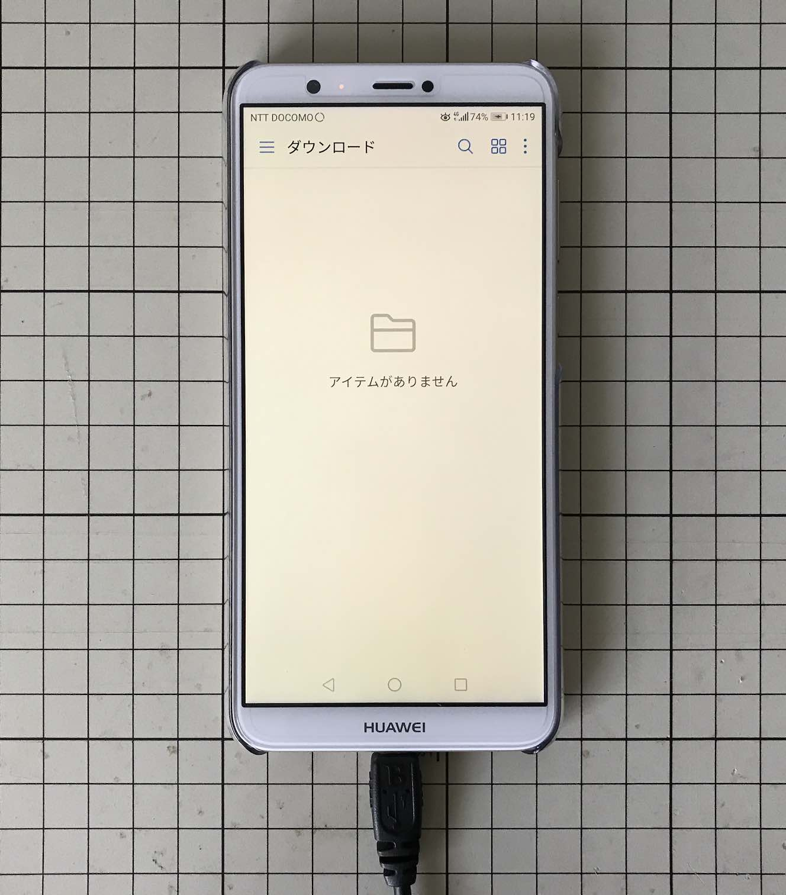

#### 修正済みサンプルアプリのダウンロード

先ほど生成したファームウェア更新イメージファイル<b>`app_update.bin`</b>を、Android側にダウンロードしておきます。<br>
今回のテストでは、[Android File Transfer](https://www.android.com/filetransfer/)というアプリを使用し、PCからUSB経由でダウンロードしました。

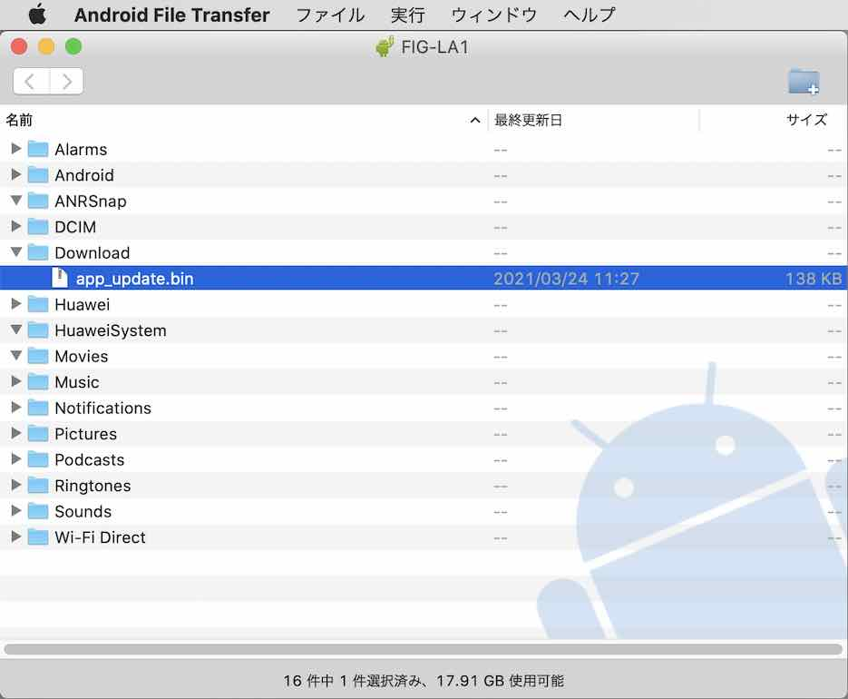

#### 更新（DFU）の実行

AndroidにインストールしたnRF Connectアプリを起動します。

ホーム画面に表示された「Zephyr」というデバイスが、nRF5340になります。<br>
画面横の「CONNECT」をタップします。

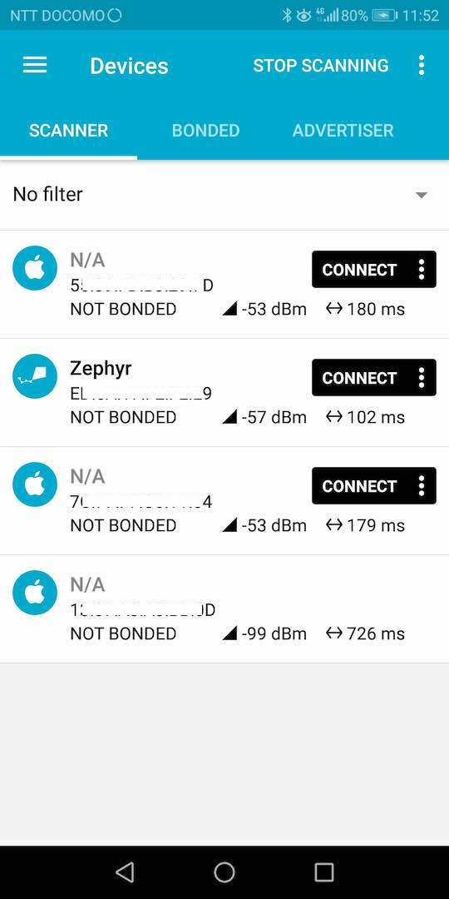

下図のように、Devices画面に遷移します。<br>
画面右上のメニューボタンをタップします。

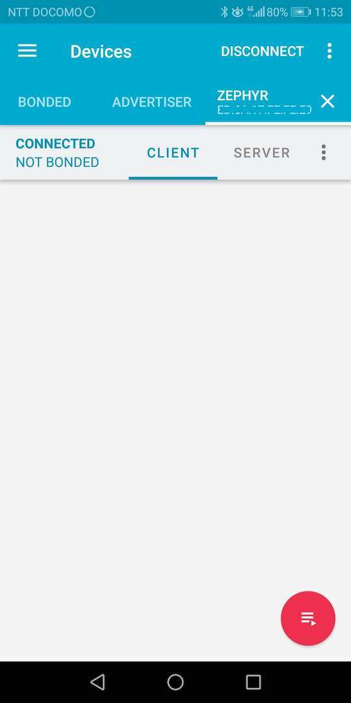

表示されたポップアップメニューの「Discover services」をタップします。

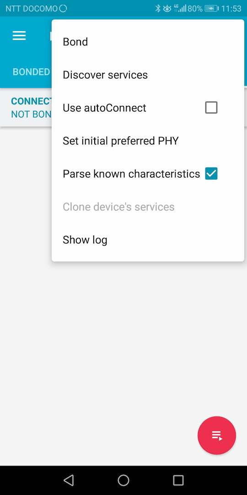

画面右上部に「DFU」アイコンが表示されたのを確認したのち、DFUアイコンをタップします。

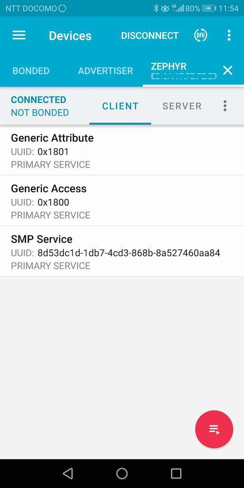

ファイル一覧画面に遷移するので、先ほどダウンロードした`app_update.bin`を選択します。

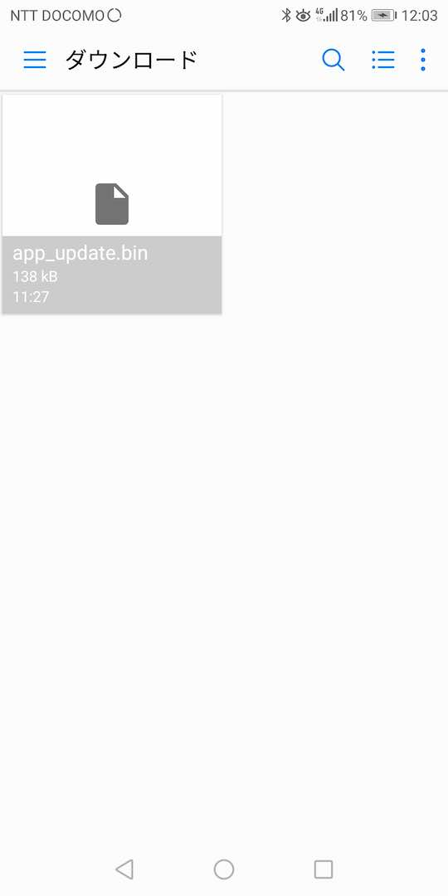

Select mode画面がポップアップ表示されるので、`Confirm only`を選択し、OKをタップします。

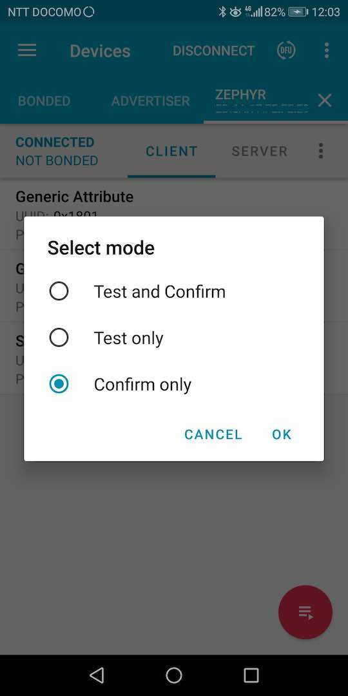

DFUがスタートし、画面にグラフが表示されます。<br>
転送には２〜３分程度を要しますが、そのまま待ちます。

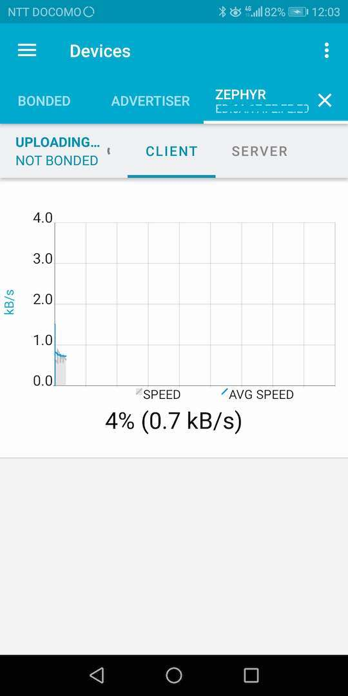

転送が完了すると、nRF5340側からの応答を待ちます。

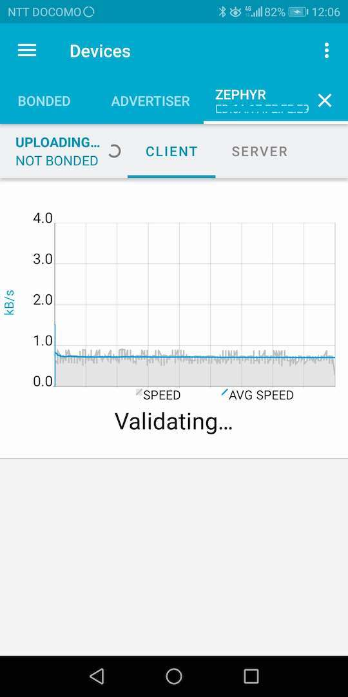

正常に応答を受け取ると、元のDevices画面に戻ります。

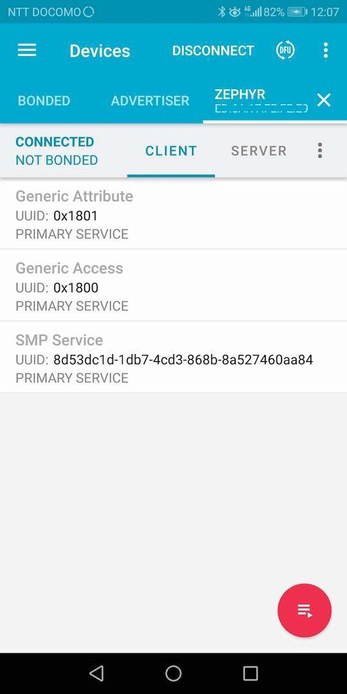

以上で、サンプルアプリの更新は完了です。

## 修正内容の反映確認

nRF5340側でも、ファームウェア更新イメージの反映が完了し、アプリケーションが自動的に再始動されます。<br>
下図のように、ターミナルからデバッグプリントが出力されます。

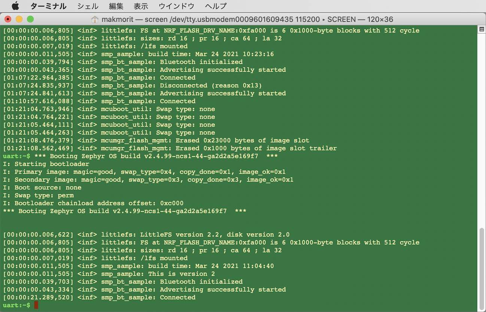

ここで、先ほど修正したコードが、動作に反映されているかどうか確認します。<br>
デバッグプリントの内容を参照し、下記のように、コードを修正した部分`This is version 2`が追加出力されていることを確認します。

```
[00:00:00.011,505] <inf> smp_sample: build time: Mar 24 2021 11:04:40
[00:00:00.011,505] <inf> smp_sample: This is version 2
[00:00:00.039,703] <inf> smp_bt_sample: Bluetooth initialized
[00:00:00.043,334] <inf> smp_bt_sample: Advertising successfully started
```

以上まで確認できましたら、最後に、Android画面右上の「DISCONNECT」をタップし、nRF5340との接続を切断してください。


下図のように「DISCONNECT」の表示が「CONNECT」と変化し、切断された事を示します。

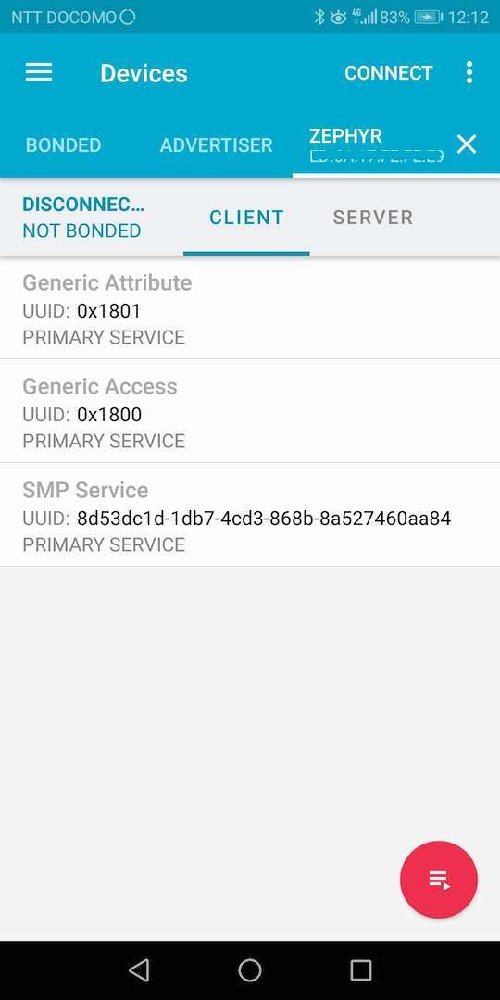

以上で、サンプルアプリのテストは完了となります。
