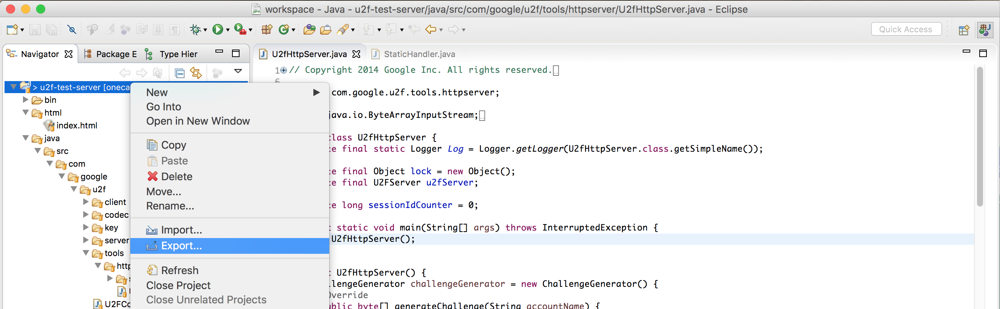
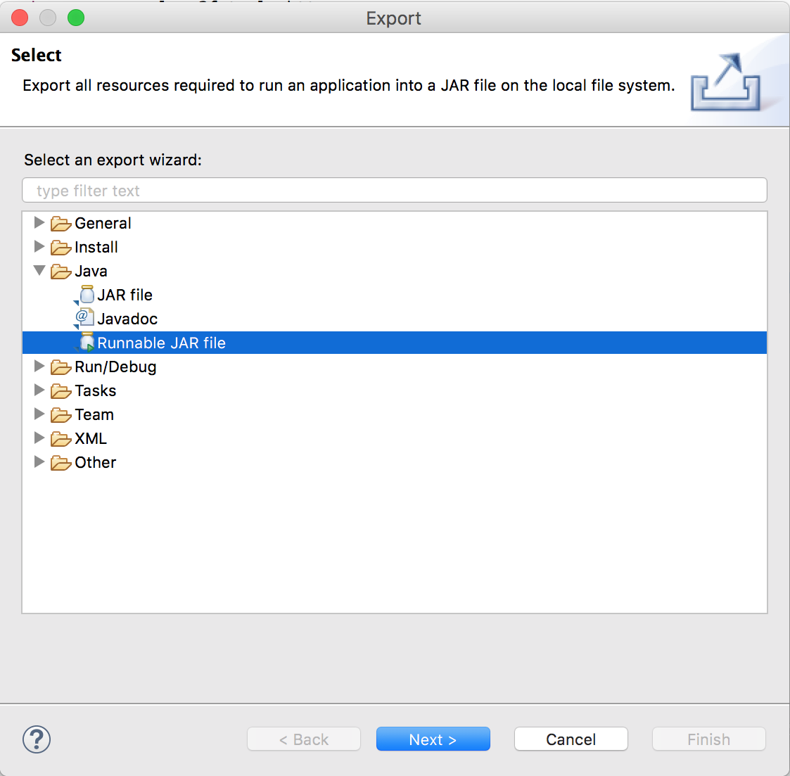
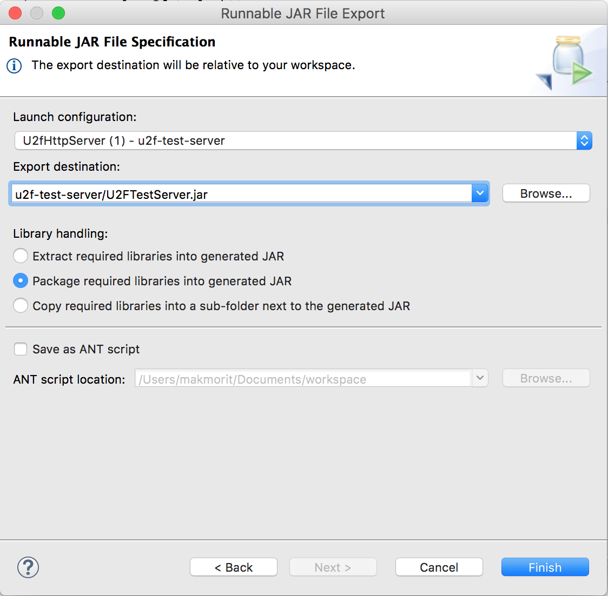
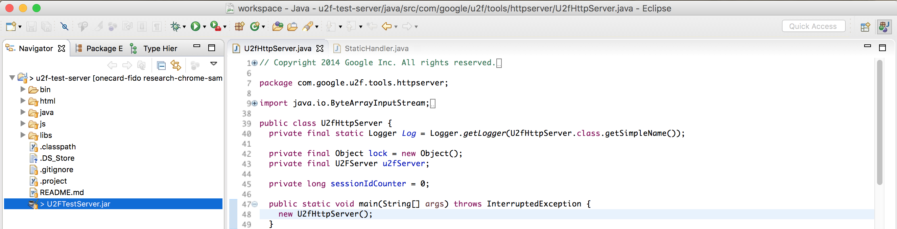

# U2Fローカルテストサーバー

## 概要

ChromeでBLE U2F対応調査／開発を行う際に使用する、テスト用のU2Fサーバーを構築しました。<br>
（以下、U2Fローカルテストサーバーと称します）

- 実装について<br>
GoogleのU2Fテストサーバー（[https://crxjs-dot-u2fdemo.appspot.com/](https://crxjs-dot-u2fdemo.appspot.com/)）の実装と基本的には同じものです。

- ベースにしたコード<br>
<b>Reference code for U2F specifications - Java U2F implementation</b><br>
https://github.com/fido-alliance/google-u2f-ref-code/tree/master/u2f-ref-code

- カスタマイズ<br>
処理の途中で不要なページ遷移が発生しないよう、Ajaxを使用して、クライアント<--->サーバー間のやり取りを行うよう修正しています。<br>
このため、JQuery関連のリモートJavaScriptを参照しています。

- HTTPホスティング<br>
Java Servletにより、ローカルPC上でホスト（HTTP port=8080）されます。<br>
ApacheなどのWebサーバー・ソフトは不要です。

- U2Fクライアントを同梱<br>
U2Fクライアント（JavaScript API）は、サーバー側に設置しなければならないため、本U2Fサーバーは、U2Fクライアントとセットになっています。

## 制約等

2018/1/1現在、BLE版U2Fクライアント（JavaScript）はセットアップされていません。

したがって、U2F Register/Authenticationの処理は、USB版U2Fクライアントを使用して動作確認を行なっています。<br>
Chrome U2Fエクステンションに同梱されている、UsbHelperクラスを使用します。

これは、後日調査・開発するBLE版U2Fクライアント（JavaScript）で置き換える予定です。<br>
BLE版U2Fクライアントを、Chromeエクステンションとして開発する場合は、BleHelperクラスを新設の上、Chrome U2Fエクステンション内に同梱するようにします。

動作確認時のセットアップは下図のようになります。<br>
U2F Register/Authenticationの処理を実行するため、YubiKey NEOをPCに挿しておきます。


## つかい方

### U2Fローカルテストサーバーの始動

このプロジェクト（u2f-test-server）の配下に移動し、実行可能JARファイル（U2FTestServer.jar）をjavaコマンドで実行します。<br>

```
cd <GitHubチェックアウト先ディレクトリー>/onecard-fido/Research/u2f-test-server/
java -jar U2FTestServer.jar
```

実行例は以下になります。<br>
（プロセス名表示部に「java -jar U2FTestServer.jar」と表示され、実行中の状態となります）


### U2Fデバイスの登録

YubiKey NEOをPCに挿したのち、Chromeブラウザーを起動します。<br>
その後、アドレスバーに「[http://localhost:8080/](http://localhost:8080/)」を入力して実行しますと、テスト用ページが表示されます。


「Register U2F Authenticator」ボタンをクリックすると、ページに「Waiting for user touch」というガイダンスが表示されますので、ここでYubiKeyに指を触れます。<br>
（注：この部分はYubiKeyの仕様であり、FIDOで強制されていない部分のため、BLE化する際に無くなる予定）


YubiKeyにタッチすると、U2F Register処理完了--->YubiKeyからのレスポンスをU2Fサーバーへ転送、の流れで処理が進みます。

結果はHTML上で確認できます。<br>
ここでは、<u><b>トークン・カウンターの値が０になっていること</b></u>に注目します。<br>
（下図では「counter: 0」の表記が確認できます）


これで、U2FデバイスがU2Fサーバーに登録されました。

### U2Fデバイスを使った認証

「Test Authentication」ボタンをクリックすると処理が進み、ページに「Waiting for user touch」というガイダンスが表示されますので、ここでYubiKeyに指を触れます。<br>
（注：認証時のユーザー所在確認は、FIDOで強制されている部分のため、BLE化しても変わりません）


YubiKeyにタッチすると、U2F Register処理完了--->YubiKeyからのレスポンスをU2Fサーバーへ転送、の流れで処理が進みます。

結果はHTML上で確認できます。<br>
ここでは、<u><b>トークン・カウンターの値が変わっていること</b></u>に注目します。<br>
（下図では「counter: 14」の表記が確認できます。なお本オペレーションの前に、このYubiKeyによる認証を13回試行しています）


これで、U2FデバイスによるU2F認証は完了です。

## U2Fローカルテストサーバーのメンテナンス

U2Fローカルテストサーバーをメンテナンスする場合は、Eclipse IDE (for Java) にプロジェクトを取り込み、実行可能JARファイルを再作成する必要があります。

### プロジェクト作成

このプロジェクト（u2f-test-server）を丸ごと、Eclipse IDEにインポートします。<br>
その後、U2fHttpServerクラスのmain関数を実行します。


ソースコードをメンテナンス後、U2Fローカルテストサーバーを起動し、動作確認を行います。<br>
（下図は、コンソールにU2fHttpServerが起動した旨が表示されたところです）


### 実行可能JARファイル作成

動作確認が完了したら、実行可能JARファイルを作成します。<br>
プロジェクトを右クリックして「Export」を実行します。



表示されたExportダイアログで、実行可能JARファイルのエクスポートウィザードを選択して「Next >」を実行します。



作成先パス（Export destination）をプロジェクトディレクトリー直下に指定します。<br>
（これにより、実行可能JARファイルからhtml、jsサブフォルダーを参照することが可能となります）



実行可能JARファイルが、プロジェクトディレクトリー直下に作成されたことを確認します。



これで、U2Fローカルテストサーバーのメンテナンスは完了です。
