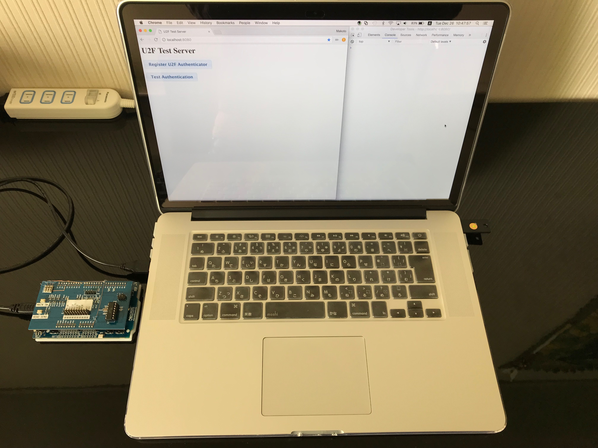
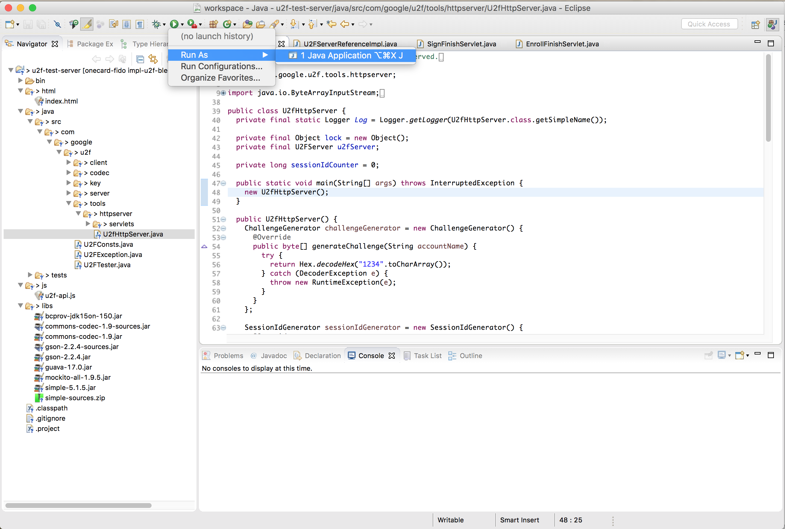
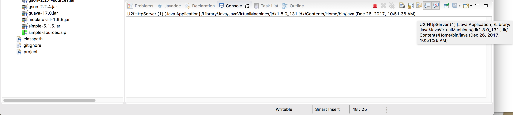
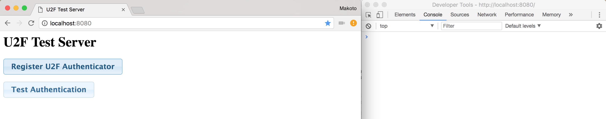
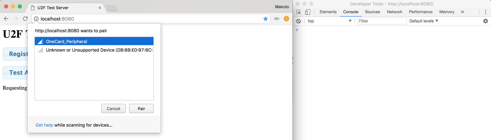
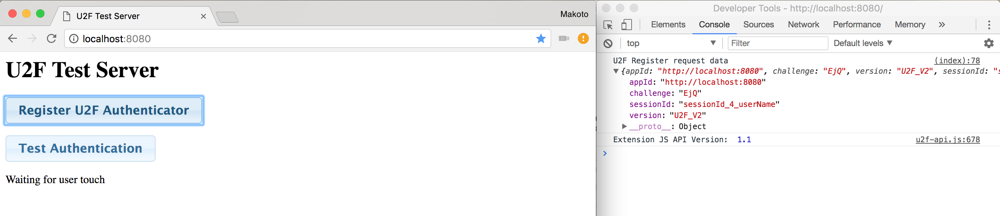
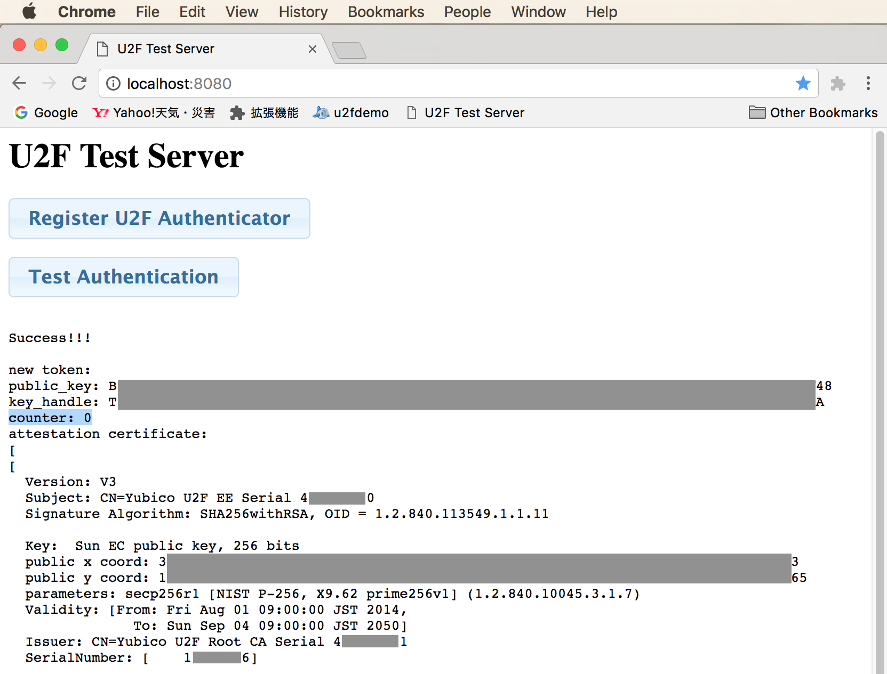
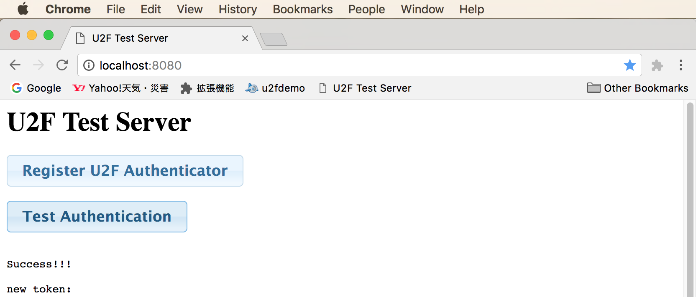
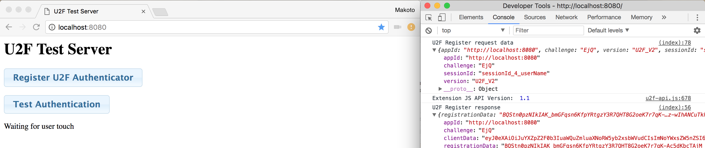
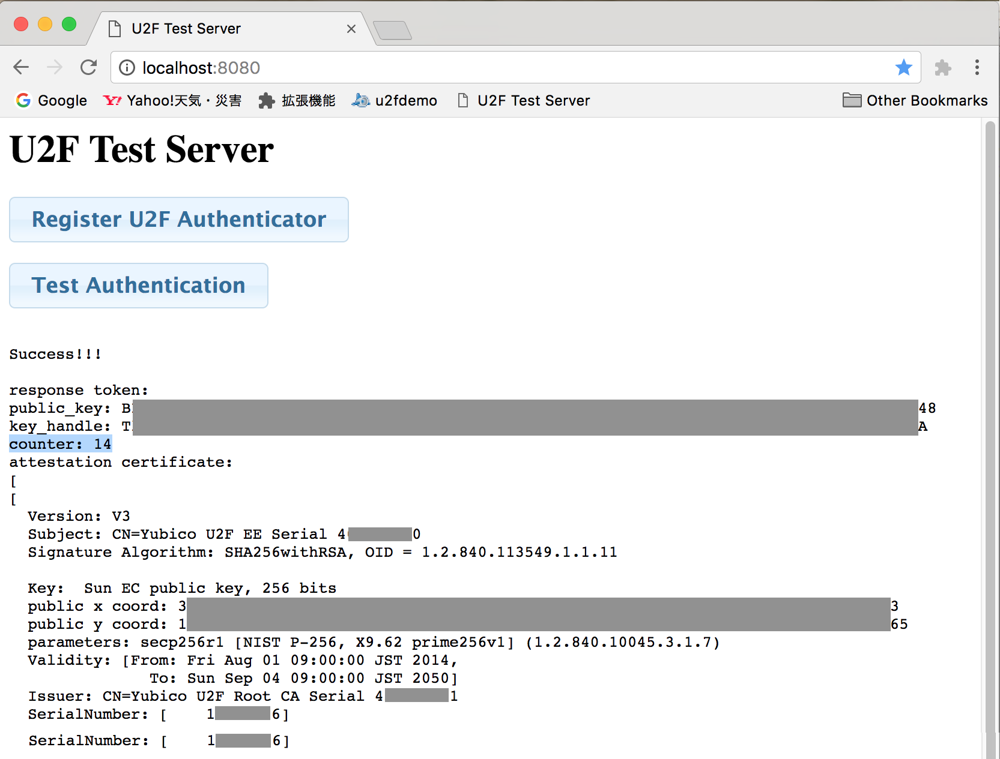

# U2Fローカルテスト用サーバー

## 概要

ChromeでBLE U2F対応調査／開発を行う際に使用する、テスト用のU2Fサーバーを構築しました。<br>
（以下単にU2Fサーバーと称します）

- 実装について<br>
GoogleのU2Fテストサーバー（[https://crxjs-dot-u2fdemo.appspot.com/](https://crxjs-dot-u2fdemo.appspot.com/)）の実装と基本的には同じものです。

- ベースにしたコード<br>
<b>Reference code for U2F specifications - Java U2F implementation</b><br>
https://github.com/fido-alliance/google-u2f-ref-code/tree/master/u2f-ref-code

- カスタマイズ<br>
処理の途中でページ遷移が発生すると、Web Bluetooth APIが使用できなくなるため、Ajaxを使用して、クライアント<--->サーバー間のやり取りを行うよう修正しています。<br>
このため、JQuery関連のリモートJavaScriptを参照しています。

- HTTPホスティング<br>
Java Servletにより、ローカルPC上でホスト（HTTP port=8080）されます。<br>
ApacheなどのWebサーバー・ソフトは不要です。

- U2Fクライアントを同梱<br>
U2Fクライアント（JavaScript API）は、サーバー側に設置しなければならないため、本U2Fサーバーは、U2Fクライアントとセットになっています。

## 制約等

2017/12/26現在、BLE版U2Fクライアント（JavaScript）はセットアップされていません。

したがって、U2F Register/Authenticationの処理は、USB版U2Fクライアントを使用して動作確認を行なっています。<br>
Chrome U2Fエクステンションに同梱されている、UsbHelperクラスを使用しています。

これは、後日調査・開発するBLE版U2Fクライアント（JavaScript）で置き換える予定です。<br>
BLE版U2Fクライアントは、Web Bluetooth APIの仕様上の制約により、Chromeエクステンション実装はできないため、HTMLからsrcタグで参照されるJavaScriptにより実装する予定です。

動作確認時のセットアップは下図のようになります。<br>
Web Bluetooth APIの確認のため、One Cardは電源を入れてアドバタイジングさせておきます。<br>
また、U2F Register/Authenticationの処理を実行するため、YubiKey NEOをPCに挿しておきます。


## つかい方

### U2Fサーバーの始動

このプロジェクト（u2f-test-server）を丸ごと、Eclipse IDE (for Java) にインポートします。<br>
その後、U2fHttpServerクラスのmain関数を実行します。



U2Fサーバーが起動します。<br>
（下図のように、コンソールにU2fHttpServerが起動した旨が表示されます）



### U2Fデバイスの登録

YubiKey NEOをPCに挿したのち、Chromeブラウザーを起動します。<br>
その後、アドレスバーに「[http://localhost:8080/](http://localhost:8080/)」を入力して実行しますと、テスト用ページが表示されます。<br>
（下図はデベロッパー・ツールを右側に表示させた例です）



「Register U2F Authenticator」ボタンをクリックすると、Web Bluetooth API「navigator.bluetooth.requestDevice」が実行されます。

ボタンスクリプトから「navigator.bluetooth.requestDevice」を実行するコードは以下になります。
```
    <input type="button" value="Register U2F Authenticator" onClick="doProcess('enroll');"/>
    ：
    <script type="text/javascript">
    function doProcess(processType) {
        ：
        // Web Bluetooth APIを実行
        navigator.bluetooth.requestDevice({acceptAllDevices:true})
        .then(device => {
            // BLE U2Fデバイスの参照を保持
            bleU2fDevice = device;

            // 以降の処理を振り分け
            if (processType == 'enroll') {
                doProcessEnroll();
                ：
        })
        .catch(error => {
            // BLE U2Fデバイス参照が取得できない場合
            document.getElementById('status').innerHTML =
                "Requesting BLE U2F device failed: " + error;
        });
    }
    </script>
```

requestDeviceすると、下図のようなダイアログが表示され、デバイスの選択を促します。<br>
デバイスを選択し「Pair」ボタンをクリックします。



デバイスを選択すると処理が進み、ページに「Waiting for user touch」というガイダンスが表示されますので、ここでYubiKeyに指を触れます。<br>
（注：この部分はYubiKeyの仕様であり、FIDOで矯正されていない部分のため、BLE化する際に無くなる予定）



YubiKeyにタッチすると、U2F Register処理完了--->YubiKeyからのレスポンスをU2Fサーバーへ転送、の流れで処理が進みます。

結果はHTMLおよびデベロッパー・ツール上で確認できます。<br>
ここでは、<u><b>トークン・カウンターの値が０になっていること</b></u>に注目します。<br>
（下図では「counter: 0」の表記が確認できます）



これで、U2FデバイスがU2Fサーバーに登録されました。

### U2Fデバイスを使った認証

「Test Authentication」ボタンをクリックすると、再びWeb Bluetooth API「navigator.bluetooth.requestDevice」が実行されます。

下図のようなダイアログが表示されたら、デバイスを選択し「Pair」ボタンをクリックします。



デバイスを選択すると処理が進み、ページに「Waiting for user touch」というガイダンスが表示されますので、ここでYubiKeyに指を触れます。<br>
（注：認証時のユーザー所在確認は、FIDOで強制されている部分のため、BLE化しても変わりません）



YubiKeyにタッチすると、U2F Register処理完了--->YubiKeyからのレスポンスをU2Fサーバーへ転送、の流れで処理が進みます。

結果はHTMLおよびデベロッパー・ツール上で確認できます。<br>
ここでは、<u><b>トークン・カウンターの値が変わっていること</b></u>に注目します。<br>
（下図では「counter: 11」の表記が確認できます。なお本オペレーションの前に、認証を10回試行しています）



これで、U2FデバイスによるU2F認証は完了です。
