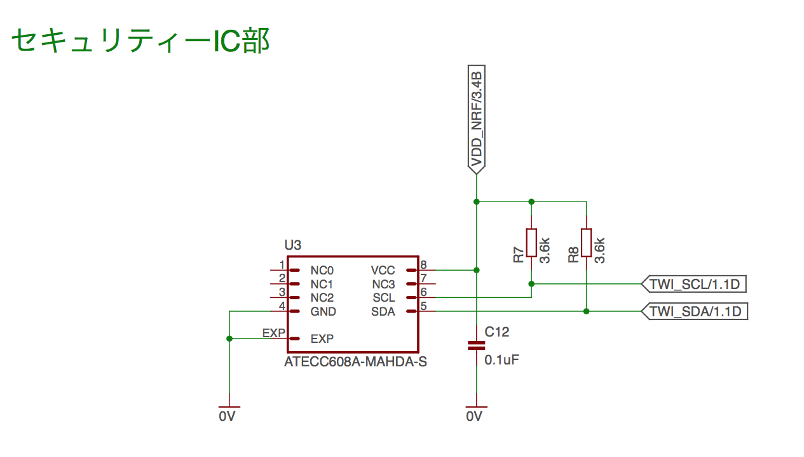

# セキュアIC組込み対応

## 概要
Microchip社のセキュアIC「[ATECC608A](https://www.mouser.jp/ProductDetail/Microchip-Technology/ATECC608A-MAHDA-T?qs=sGAEpiMZZMve4%2FbfQkoj%252BNx3hPbDs5d66otQ2I4K6nk%3D)」を、[MDBT50Q Dongle](../FIDO2Device/MDBT50Q_Dongle/README.md)に追加導入します。

この対応により、nRF52840内部のFlash ROMにより管理されていた秘密鍵等の機密データが、（ハードウェア仕様的に秘密鍵等を外部漏洩不可としている）ATECC608Aにより管理されることとなり、結果としてセキュリティー性が向上することになると思われます。 

## ATECC608Aの特徴

- ATECC608Aは、3mm x 2mm の超小型セキュアICです。

- nRF52840との通信は、I2Cインターフェース（TWI）によるシリアル通信で行われます。

- FIDO機能で使用するEC鍵ペアやECDSA署名、ECDH共通鍵、SHA256ハッシュ等の生成機能を有しています。 
ただし残念ながら、FIDO仕様に含まれる256ビット暗号化機能（AES-256-CBC）は有していません。 
（ですので256ビット暗号化機能は引き続き、MBED TLSを利用します）

- 内部秘密鍵（ATECC608A内部で生成される秘密鍵）の使用を想定しています。 
内部秘密鍵は、いかなる方法によっても、その内容を参照することはできません。

- 他方、外部秘密鍵や外部データ（一時使用キーなど）も格納できます。 
ただし、外部秘密鍵はひとたび格納されると、いかなる方法によっても、その内容を参照することはできなくなります。

## 組込みイメージ

MDBT50Q DongleやnRF52840 DK等への組込みは、最小限の部品追加により可能なようです。

下図の通り、追加部品は、ATECC608A１点、バイパスコンデンサー１点、プルアップ抵抗器２点の想定です。

## 設定のカスタマイズ

ATECC608Aのデフォルト設定を使用すると、FIDOで使用するための秘密鍵スロットは、３点しか利用できません。

このうち、１点はFIDO認証器固有の秘密鍵として必要となります。 
将来の仕様拡張により、カスタム秘密鍵を収容する必要が出た時に、残り２スロットしか利用の余地がありません。

そこで本件では、ATECC608Aの設定をカスタマイズすることとしました。 
カスタマイズの結果、カスタム秘密鍵を収容できるスロットが１２点に増加いたします。

カスタマイズ内容は下記ドキュメントをご参照願います。
- <b>[ATECC608Aの設定カスタマイズについて](../Research/CRYPTOAUTH/CRYPTOAUTHCONF.md)</b>

## ATECC608A操作関数群

ATECC608Aを、[FIDO認証器アプリケーション](../nRF5_SDK_v15.3.0)から操作するための専用関数群を用意しました。

関数一覧および、関数の使用方法については、下記ドキュメントをご参照願います。
- <b>[ATECC608A関数群について](../Research/CRYPTOAUTH/CRYPTOAUTHFUNC.md)</b>
- <b>[ATECC608A関数テストモジュールについて](../Research/CRYPTOAUTH/CRYPTOAUTHTEST.md)</b>

なお、ATECC608A操作関数群を使用することにより、前項の「ATECC608A設定カスタマイズ」の処理は、関数内部で自動的に実行されます。
