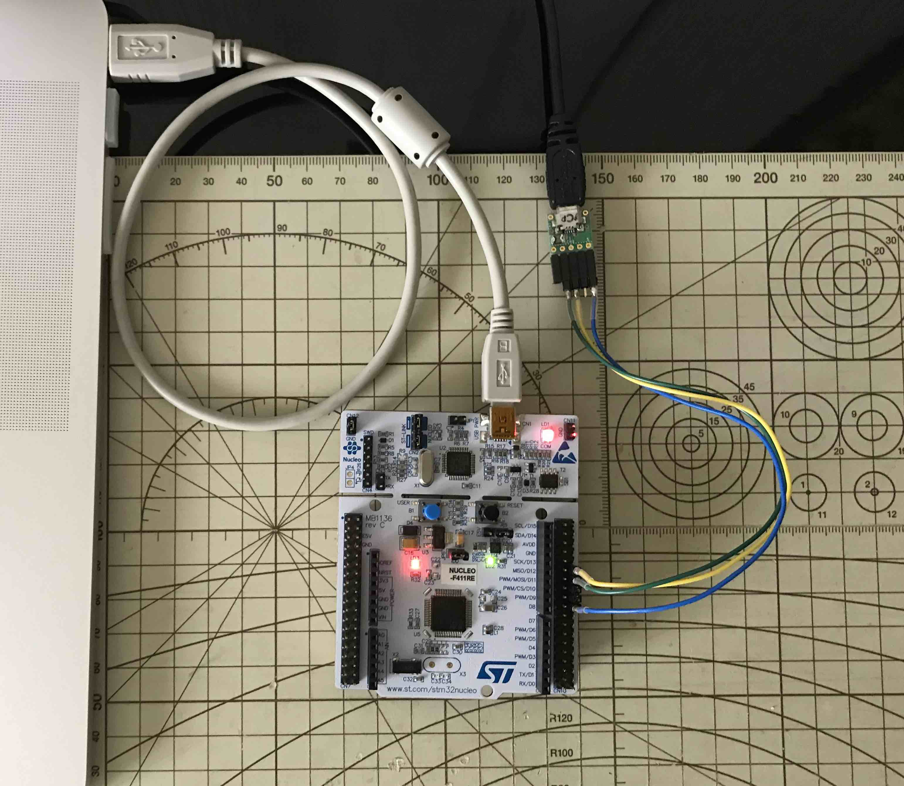
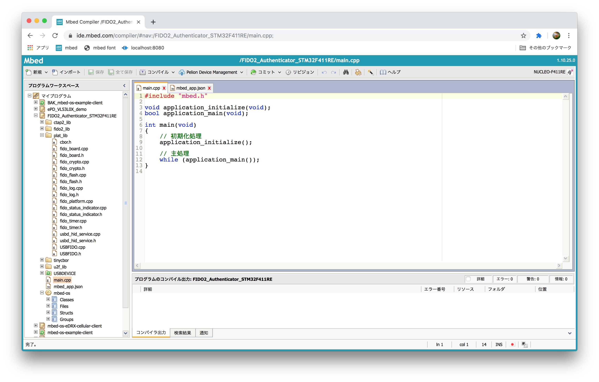
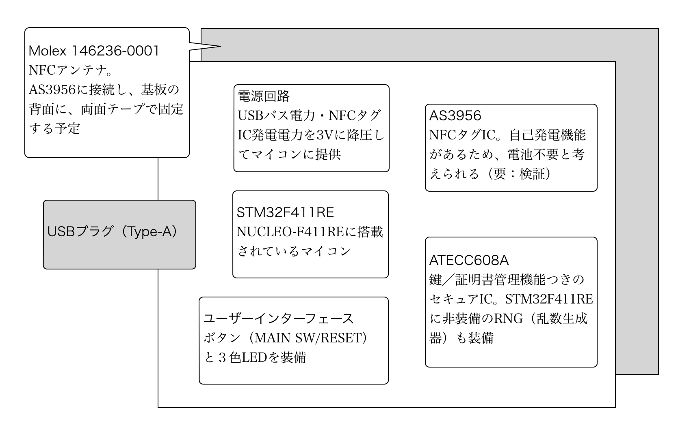

# [WIP] mbed OS版 FIDO2.0認証器

## 概要

nRF52840向けに制作された[FIDO2認証器アプリケーション](../nRF5_SDK_v15.3.0)を、mbed OSに移植するプロジェクトです。

## 使用機材

ファームウェア（mbed OSアプリケーション）開発時は、USB HIDをサポートする「NUCLEO-F411RE」（マイコンはSTM32F411RE）を使用します。

## 使用ファームウェア

mbedオンラインコンパイラーでビルドしたファームウェアを、USB（ST-Link V2-1）を経由して書き込んで使用します。

開発リソースは、以下から構成されます。

#### ファームウェア

- [`FIDO2_Authenticator_STM32F411RE.NUCLEO_F411RE.bin`](./FIDO2_Authenticator_STM32F411RE.NUCLEO_F411RE.bin) 
mbedオンラインコンパイラーでビルドし作成します。

#### ソースコード

- [`main.cpp`](./mbed5/main.cpp) 
メインプログラムです。初期化処理・主処理を呼出す最上位モジュールになります。

- [`mbed_app.json`](./mbed5/mbed_app.json) 
設定ファイルです。nRF52840の`sdk_config.h`同様、書き換えた場合は、反映のため再ビルドが必要です。

- [`plat_lib`](./mbed5/plat_lib) 
nRF52840から移植される対象の、プラットフォーム依存ソースコードです。 
以下のような内容です。 
・デバッグログ関連 
・ユーザーインターフェース関連 
・永続化関連 
・タイマー関連 
・暗号化関連

- [`tinycbor`](./mbed5/tinycbor) 
GitHubで公開されている、CBOR関連処理をまとめたライセンスフリーのライブラリーです。[公開ソースコード](https://github.com/intel/tinycbor/tree/master/src)をノンカスタマイズで使用しています。

- [`USBHAL_STM_144_64pins.h`](./mbed5/USBDEVICE/USBDevice/TARGET_STM/USBHAL_STM_144_64pins.h) 
[STの公開ソース](https://os.mbed.com/teams/ST/code/USBDEVICE/file/50ec00aa4515/USBDevice/TARGET_STM/USBHAL_STM_144_64pins.h/)を、FIDO2 USBトランスポートの仕様に合わせ、一部カスタマイズしたソースです。mbedコンパイラー上で同名・同位置のファイルを上書きして使用します。

- [`ctap2_lib`](../FIDO2Device/ctap2_lib)／[`fido2_lib`](../FIDO2Device/fido2_lib)／[`u2f_lib`](../FIDO2Device/u2f_lib) 
nRF52840と共用する、プラットフォーム非依存ソースコードです。 
nRF5 SDK、mbedオンラインコンパイラーの双方で、正常コンパイルを確認済みです。 
（暗号化関連以外の機能については実機動作確認済みです） 
mbedオンラインコンパイラーにノンカスタマイズでコピー（インポート）して使用できます。

## 移植先の基板

#### 基板イメージ

現在移植先として検討している基板は下図のようなイメージになります。

各ICの個別評価、およびファームウェア開発が概ね完了次第、基板製作に着手する予定です。

#### 特徴

- USB HIDデバイスとして使用できるドングル基板
- NFCサポート（FIDO2.0トランスポート仕様に準拠）[注1]
- NFCタグICからの発電電力により、電池電源が不要 [注2]
- セキュアICによる堅牢な鍵／証明書等の管理 [注3]

[注1] すでにnRF52840 DK同梱のNFCで、ファームウェアレベルでの対応はできているのですが、nRF52840 DKでの動作確認結果が不調であったため、nRF52840でのNFCサポートは見送っております。 
[注2] 使用予定のNFCタグIC「AS3956」の自己発電機能については、まだ未検証です。 
[注3] 鍵／証明書管理に、マイコンのFlash ROMを使用すると、マイコンファームウェアの改竄で比較的簡単に鍵／証明書にアクセスできてしまうのですが、セキュアIC導入により、これを回避できます。 

#### 書き込み運用

「[MDBT50Q Dongle](../FIDO2Device/MDBT50Q_Dongle)」と同様、SWD経由のプログラム書き込み運用といたします。 
（USBブートローダーは制作・導入いたしません）

書き込みにはJ-Linkではなく、開発機「NUCLEO-F411RE」に同梱の「ST-Link V2-1」を使用する想定です。
