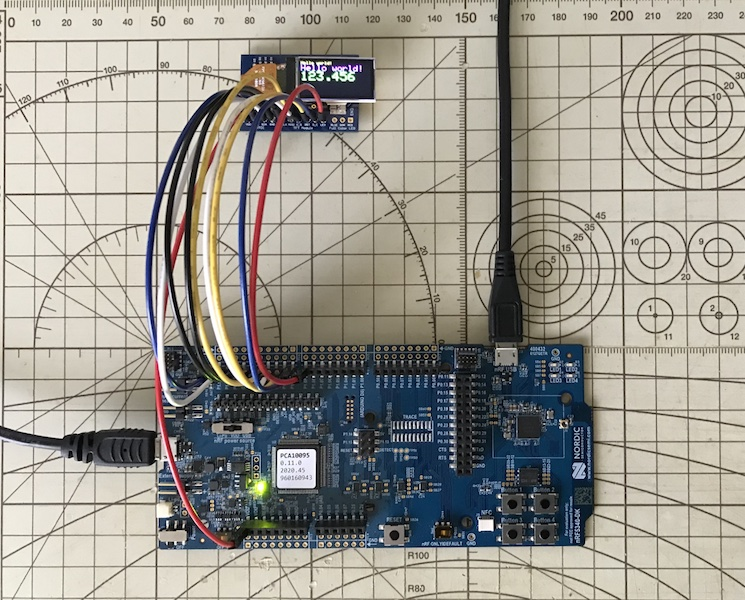
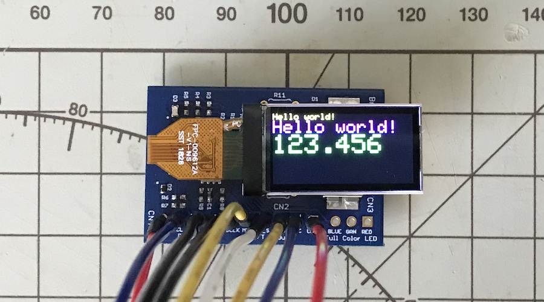

# 超小型TFTディスプレイ接続対応

最終更新日：2023/4/18

## 概要

超小型TFTディスプレイを、nRF5340／nRF52840アプリケーションに接続するための対応です。

使用するディスプレイは、FORMIKEというメーカーの「KWH009ST01-F01」になります。

#### 特色
- 外形寸法：`28`mm x `14`mm
- 表示領域：`21.7`mm x `10.8`mm（`0.96`inch）
- 白色バックライトLEDを装備
- 動作電圧：`2.75`V（`3.3V`までなら動作可能）
- 消費電力：`62mW`（`3.0`Vで動作時）
- SPI接続

## [Tiny TFT Library](../TFT/tiny_tft_lib/README.md)
ライブラリーの構成について記載しています。

## 参考文献

#### 初期調査内容
こちらのドキュメントを参考にし、まずはArduinoで動作確認しました。 
[USING THE ST7735 1.8″ COLOR TFT DISPLAY WITH ARDUINO](https://www.electronics-lab.com/project/using-st7735-1-8-color-tft-display-arduino/)

- <b>[TFTライブラリーの解析](../TFT/ADATFTLIB.md)</b> 
「KWH009ST01-F01」をArduino UNOに接続するためのライブラリー（`Adafruit-ST7735-Library`／`Adafruit-GFX-Library`）について、解析を行いました。

#### 調査用アプリ
Arduino UNOで動作する「KWH009ST01-F01」の動作確認用サンプルアプリを制作しました。 
ソースコードは、フォルダー[`tft_sample`](../../TFT/tft_sample)配下に格納しています。

- <b>[TFTサンプルアプリ](../TFT/tft_sample/README.md)</b> 
超小型TFTディスプレイ「KWH009ST01-F01」の動作確認用サンプルアプリについて解説しています。

- <b>[SPIダミースレーブアプリ](../TFT/dummy_slave)</b> 
TFTサンプルアプリがディスプレイに転送するコマンド／データバイトを、ダンプ出力させるためのアプリです。
