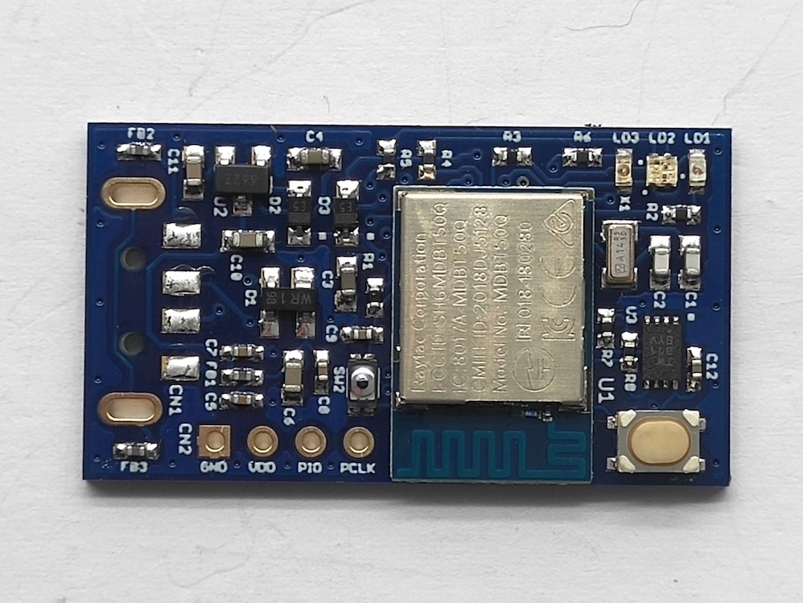

# 開発TODO

現在進行中、もしくは将来予定している開発案件についての概要を掲載します。

## 各種アプリケーション改善対応

#### 要件確定済み

- [[改善] BLE自動認証有効時のヘルスチェック動作を改善](https://github.com/diverta/onecard-fido/issues/302)

#### 要件未確定

- [改善] nRF52840アプリケーションのソースコードを圧縮する 
不要コードを削除／重複実装コードを整理／etc...

- [改善] 管理ツールから「エンドユーザー向けのツール」を分割 
BLEペアリング・ファームウェア更新・ヘルスチェック・PIN変更といった、エンドユーザーが利用する機能に限定。 
PIN初期設定、鍵・証明書インストール／削除といった機能は、ベンダーが行うものなので、エンドユーザーには公開しないようにする

## MDBT50Q DongleのセキュアIC組込み対応
基板上にATECC608Aを追加実装し、秘密鍵を読出し不可にするための対応を行います。 
（[#245](https://github.com/diverta/onecard-fido/issues/245) ご参照）

#### ソフトウェアの開発状況
nRF52840アプリケーションへの追加実装と、ATECC608A単体の実機動作確認は、ほぼ完了しています。 
作業中のアプリケーションは以下の場所に格納しています。 
コード格納場所（プラットフォーム非依存）--->[fido_cryptoauth_lib](FIDO2Device/fido_cryptoauth_lib) 
コード格納場所（プラットフォーム依存）--->[plat_lib_rev2_1](nRF5_SDK_v15.3.0/examples/diverta/plat_lib_rev2_1)

後日、後述「スロット構成変更」を実施しようと考えています。

#### 評価基板の製作状況
完成イメージは下図の通りですが、現状、製造外注に大幅な遅れが出ています。 

#### 今後必要な対応
- ATECC608Aスロット構成の変更（FIDO以外の業務アプリケーションでも使用できるようにするための拡張対応）

#### 各種調査結果
- [ATECC608A関数群について](Research/CRYPTOAUTH/CRYPTOAUTHFUNC.md)
- [ATECC608A関数テストモジュールについて](Research/CRYPTOAUTH/CRYPTOAUTHTEST.md)
- [ATECC608Aの設定カスタマイズについて](Research/CRYPTOAUTH/CRYPTOAUTHCONF.md)

## MDBT50Q Dongleの極小化対応
MDBT50Q Dongleについて、基板実装要件が全て出揃ったところで、基板をさらに極小化する試みになります。 
（[#280](https://github.com/diverta/onecard-fido/issues/280) ご参照）

## CCIDインターフェース追加対応
PIV Card、OpenPGP Cardなどといったスマートカードのエミュレーションに必要な基盤技術を確立します。 
（[#323](https://github.com/diverta/onecard-fido/issues/323) ご参照）

#### ソフトウェアの開発状況
nRF52840アプリケーションへの追加実装と、macOS環境上での実機動作確認は、概ね完了しています。 
作業中のアプリケーションは以下の場所に格納しています。 
コード格納場所（プラットフォーム非依存）--->[ccid_lib](CCID/ccid_lib) 
コード格納場所（プラットフォーム依存）--->[app_usbd_ccid](nRF5_SDK_v15.3.0/examples/diverta/plat_lib/app_usbd_ccid.c)

Windows環境上での実機動作確認はできていません。 
（Windows環境固有の対応が追加で必要となります）

#### 今後必要な対応
- CCID I/FのWindows環境固有対応
- macOS環境専用ドライバー（インストーラー含む）の開発
- 業務アプリケーション（PIV／OpenPGP）の開発
- CCID I/F専用管理ツールの開発（当面は「Yubico PIV Tool」で代用を想定）

#### 各種調査結果
- [USB CCIDインターフェース](CCID/ccid_lib/README.md)
- [Yubico PIV Toolによる初期データ導入手順](Research/CCID/SETUPYKPIV.md)
- [CCIDインターフェースに関する調査](Research/CCID/README.md)

#### 利用事例
- [PIVデバイスを使用したmacOSログイン手順](Research/CCID/MACPIVLOGIN.md)

## ワンタイムパスワード対応
TOTPの実装に必須となる「RTCC（リアルタイムクロック・カレンダー）」の追加実装可能性について調査します。 
（[#329](https://github.com/diverta/onecard-fido/issues/329) ご参照）

#### 今後必要な対応
- HID Keyboard I/Fの追加実装（前述・スマートカードエミュレート機能でも必要になる可能性あり）
- 業務アプリケーション（OATH-TOTP）の開発
- RTCC評価用の基板製作（I2Cコマンド検証用／バックアップ機能検証用／etc...）

## その他
優先度は低くなります

#### CTAP 2.1対応

[FIDO認証器の新しい仕様（CTAP 2.1）](https://fidoalliance.org/specs/fido2/fido-client-to-authenticator-protocol-v2.1-rd-20191217.html)がプレビュー公開されております。 
現行の仕様はこちら --> [CTAP 2.0](https://fidoalliance.org/specs/fido-v2.0-ps-20190130/fido-client-to-authenticator-protocol-v2.0-ps-20190130.html)

調査（[#321](https://github.com/diverta/onecard-fido/issues/321) ご参照）の結果、CTAP 2.1で追加されたコマンド`authenticatorSelection`については、追加対応が必要であることが判明しています。 
調査結果はこちら --> [CTAP 2.1 関連調査](https://github.com/diverta/onecard-fido/blob/research-CTAP2.1-new-spec/Research/CTAP_2_1/README.md)

ただし、2020/04/23現在、FIDOアライアンスからFIDO2.1に関する仕様適合テストツールが公開されていないため、実装作業は後日改めて再開したいと考えます。

#### NFC対応（中断中）

自己発電機能のあるNFCチップ「[ST25DV](https://www.st.com/ja/nfc/st25dv-i2c-series-dynamic-nfc-tags.html)」と、前出のセキュアIC「ATECC608A」を活用した、電池不要の高機能セキュリティーデバイスを製作する試みになります。

#### MBED OS移植対応（中断中）

「NUCLEO-F411RE」を使用し、MBED OS用に移植作業を進めていましたが、以下の問題点があり、現在開発を中断しています。
- 搭載されている「STM32F411RE」に、乱数製造器（RNG）の実装がないため、暗号化関連ライブラリー（MBED TLS）が使用できない
- 予定していたNFCタグ「AS3956」が製造中止-->調達不可

移植作業中のアプリケーションは以下の場所に格納しています。 
コード格納場所--->[[WIP] mbed OS版 FIDO2.0認証器](STM32F411RE)
