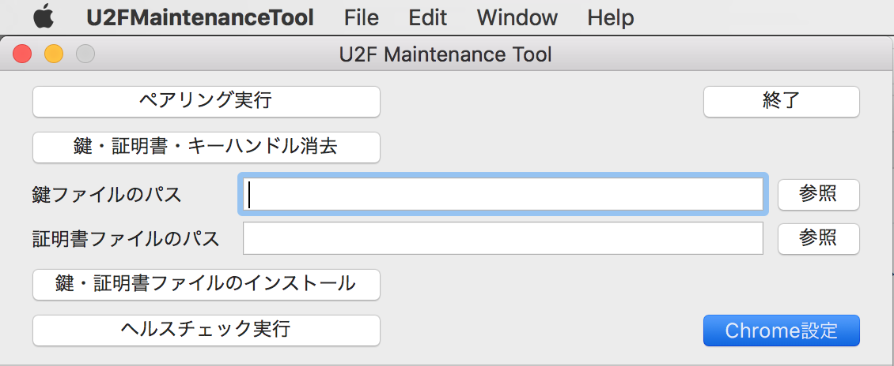
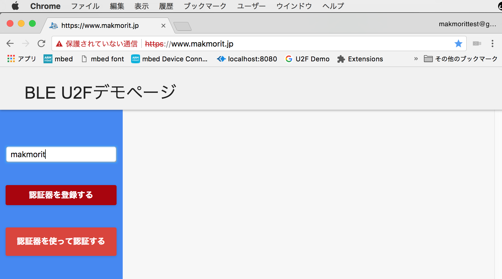
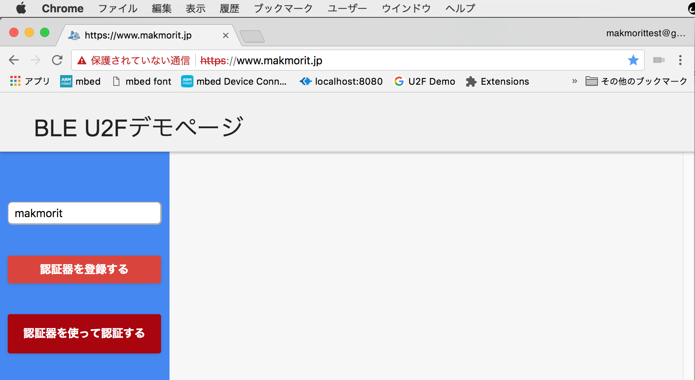
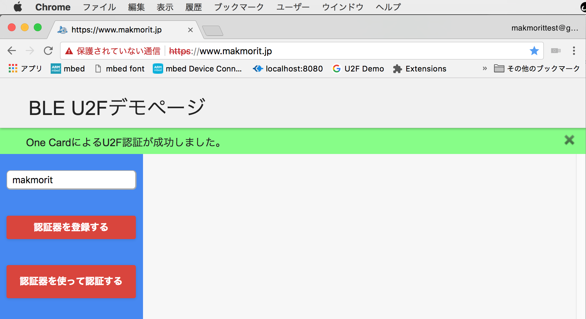

# Chromeブラウザーを使用したデモ手順

ChromeおよびU2Fエクステンションを使用し、U2F管理ツール、One Cardを使用して、U2F Register／Authenticateを実行するまでの手順を、以下に掲載いたします。

## U2Fローカルテストサーバーの準備

U2Fローカルテストサーバーを起動します。<br>
以下のコマンドを実行します。

```
MacBookPro-makmorit-jp:~ makmorit$ cd ~/GitHub/onecard-fido/U2FDemoServer/python-u2flib-server
MacBookPro-makmorit-jp:python-u2flib-server makmorit$ python ./u2f_server.py -i www.makmorit.jp
[29/May/2018 15:22:33] Starting server on http://www.makmorit.jp:8081
```

## デモ用プログラムのインストール

U2Fローカルテストサーバーでの動作確認時は、以下のプログラムをインストールする必要があります。

- パッケージ化されていないChrome U2Fエクステンション
- U2F管理ツール

### ファイルのダウンロード

本件デモで使用する、パッケージ化されていないChrome U2Fエクステンション、U2F管理ツール（エクステンションID修正版）を、下記場所からダウンロードします。

- パッケージ化されていないChrome U2Fエクステンション（圧縮ファイル）<br>
[u2f-chrome-extension.zip](../../U2FMaintenanceTool/u2f-chrome-extension.zip)

- U2F管理ツール<br>
[U2FMaintenanceTool.pkg](../../U2FMaintenanceTool/macOSApp/U2FMaintenanceTool.pkg)

ダウンロードしたファイルはそれぞれインストールします。

### エクステンションのインストール

Chromeブラウザーを起動し、デベロッパーモードに切り替えます。


ダウンロードした`u2f-chrome-extension.zip`を任意のフォルダーで解凍後、Chromeブラウザーの「拡張機能ページ」（`chrome://extensions/`）にドラッグ＆ドロップします。


エクステンションがChromeに追加表示されます。<br>
インストールしたエクステンションがID`pfboblefjcgdjicmnffhdgionmgcdmne`であることを確認します。


確認後は、デベロッパーモードをOffにしておきます。


これで、パッケージ化されたChrome U2Fエクステンションのインストールは完了です。

### U2F管理ツールのインストール

ダウンロードした`U2FMaintenanceTool.pkg`のアイコンを右クリックし「開く」を実行してください。<br>
（2018/05/30現在、アプリに署名がされていないので、アイコンをダブルクリックしても実行することができないための措置になります）

以降は表示された画面の指示に従い、インストールを進めます。

### U2F管理ツールの設定

パッケージ化されたChrome U2Fエクステンションが、 U2F管理ツール（エクステンションID修正版）で使用できるようにします。<br>
下図画面の「Chrome設定」をクリックします。



処理が成功すれば、パッケージ化されたChrome U2Fエクステンションが、U2F管理ツール（エクステンションID修正版）を呼び出せるようになります。

## Chrome上での操作

あらかじめOne Cardを起動した後、Chromeブラウザーを開き、U2FローカルテストサーバーでRegister／Authenticateを実行します。

### U2F Registerの実行

ローカルテストサーバーをChromeブラウザーで開き、ユーザー名欄に入力後「認証器を登録する」をクリックします。



U2F Registerが成功します。


### U2F Authenticateの実行

「認証器を使って認証する」をクリックします。その後、One Card上のMAIN SWを１回押します。



U2F Authenticateが成功します。


