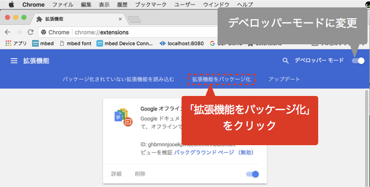
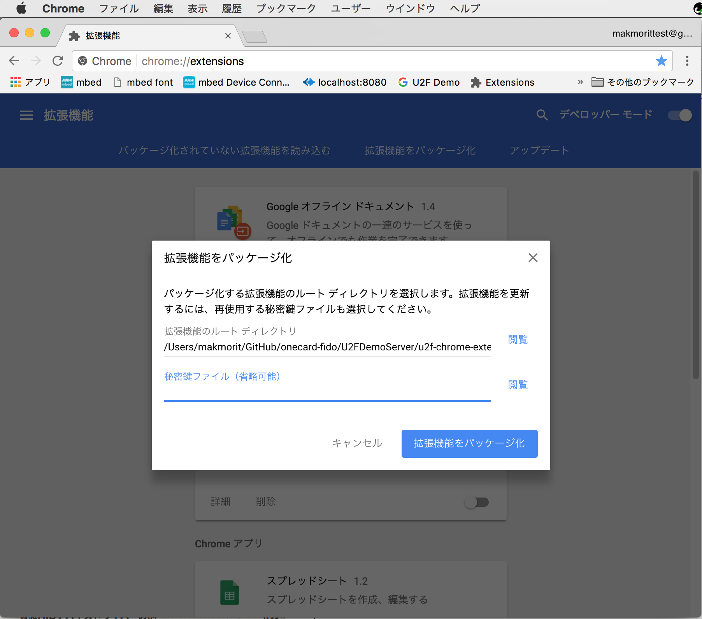
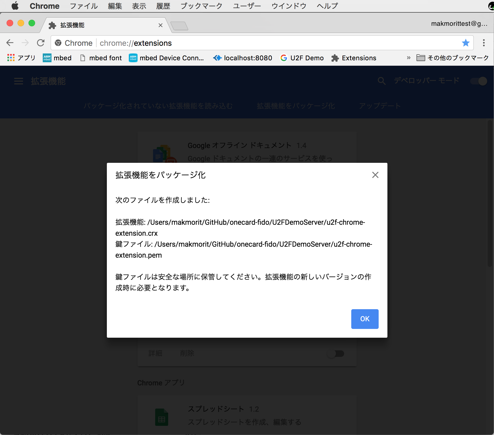
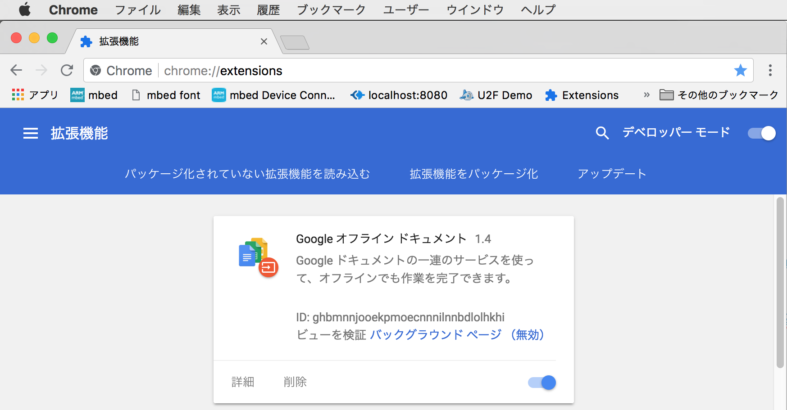
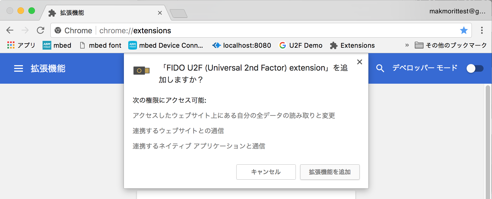
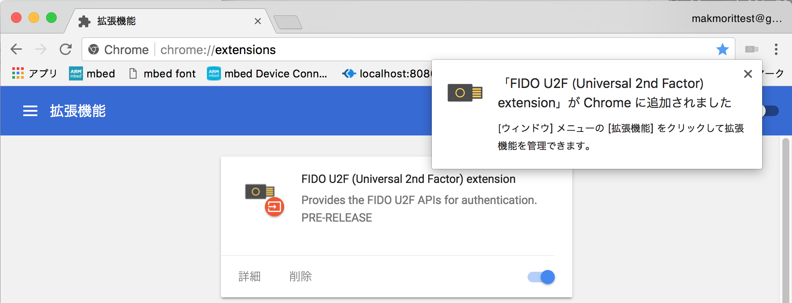
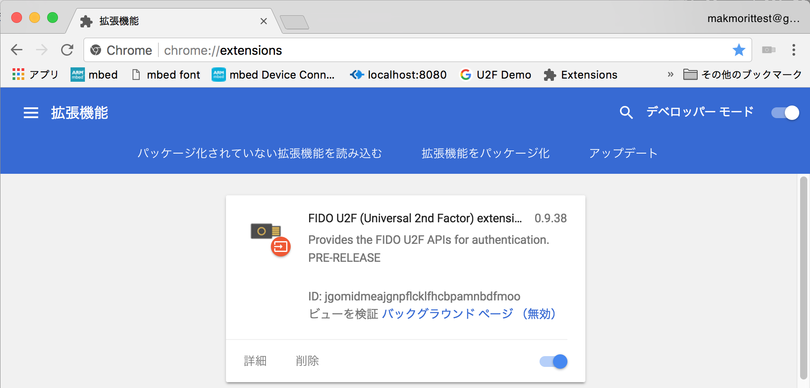
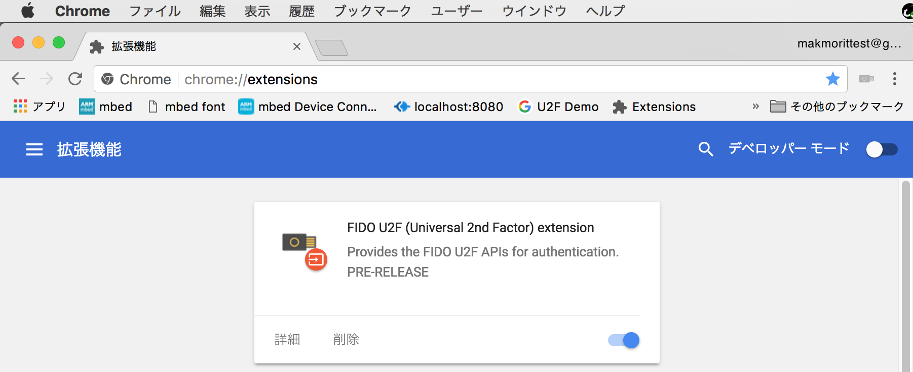

# Chrome U2Fエクステンションのパッケージ手順

`u2f-chrome-extension.crx`をパッケージする方法について掲載いたします。

## Chromeブラウザー上の操作

### エクステンションのパッケージ

Chromeブラウザーを起動し、デベロッパーモードに変更したのち「拡張機能をパッケージ化」をクリックします。

パッケージ化するエクステンションのディレクトリー（`<リポジトリールート>/U2FDemoServer/u2f-chrome-extension`）を入力します。

秘密鍵ファイルは、エクステンションのソースを修正した時（＝エクステンションを作成し直す時）に指定します。 
下図は新規にエクステンションを作成する例になりますので、鍵ファイルは指定していません。

メッセージが表示され、エクステンション`u2f-chrome-extension.crx`が作成されました。

これでエクステンションのパッケージは完了です。

### エクステンションのインストール

上記手順で作成された`u2f-chrome-extension.crx`を、Chromeブラウザーの「拡張機能ページ」（`chrome://extensions/`）にドラッグ＆ドロップします。

確認メッセージが表示されるので「拡張機能を追加」をクリックします。

エクステンションがChromeに追加された旨のメッセージが表示されます。

デベロッパーモードに変更すると、新しくインストールしたエクステンションのID`jgomidmeajgnpflcklfhcbpamnbdfmoo`が確認できます。

確認後は、デベロッパーモードを無効にしておくようにします。

これでエクステンションのインストールは完了です。
