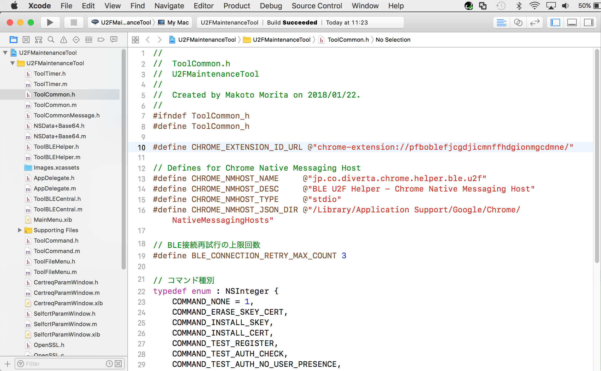
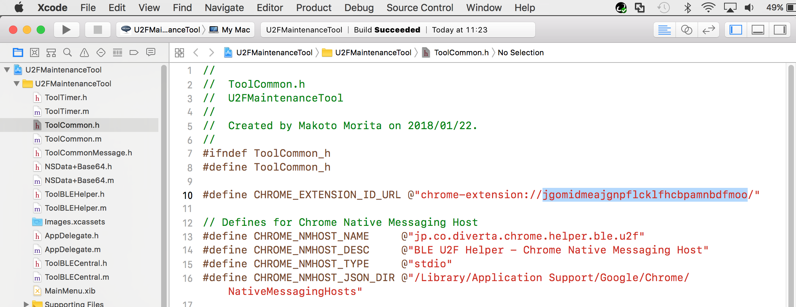
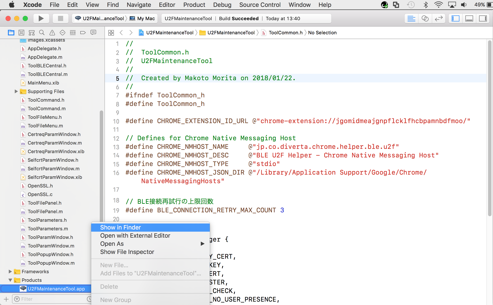
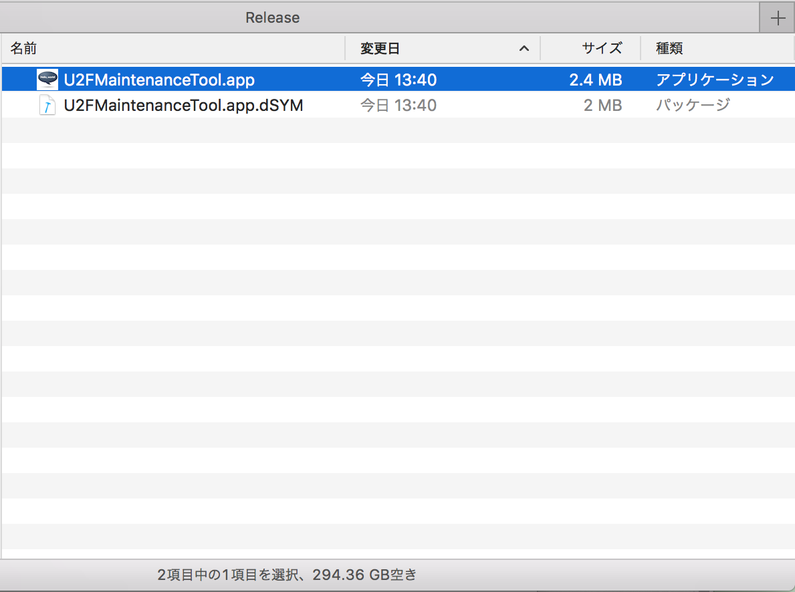
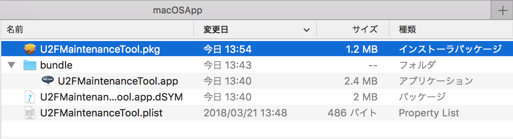

# U2F管理ツールの修正手順

`u2f-chrome-extension.crx`を使用するためには、エクステンションIDを修正する必要があります。

エクステンションID修正版 U2F管理ツールのインストール媒体修正手順を、以下に掲載いたします。

#### ご参考：エクステンションIDをマスターに反映しない理由
U2Fローカルテストサーバーは、Yubico社が参考実装として無償提供しているものです。<br>
ただし、One CardのFIDO対応開発で利用している[U2Fデモサーバー](https://crxjs-dot-u2fdemo.appspot.com/)と比して、Googleサイトとの連携ができないなど、かなり機能が限定されております。

（Googleサイトとの連携＝Chromeブラウザーでログイン中のGoogleアカウント [通常はGmailアドレス] を、U2FデモサーバーにユーザーIDとして引き渡す機能）

エクステンションID修正版のU2F管理ツールをマスターに反映してしまうと、[U2Fデモサーバー](https://crxjs-dot-u2fdemo.appspot.com/)での動作ができなくなってしまいます。<br>
これでは、One CardのFIDO対応開発を進める上で都合が悪いため、エクステンションID修正版をマスターとは別建てで管理するようにしております。

## macOS版

### ヘッダーファイルの修正

最新バージョンのU2F管理ツールのソースコードを取得後、Xcodeを起動します。<br>
起動したらヘッダーファイル `ToolCommon.h` を開きます。



エクステンションIDを `pfboblefjcgdjicmnffhdgionmgcdmne` から `jgomidmeajgnpflcklfhcbpamnbdfmoo` に修正します。



ビルドを実行し、成功したら `U2FMaintenanceTool.app` があるディレクトリーをファインダーで開きます。



下図の `U2FMaintenanceTool.app` と `U2FMaintenanceTool.app.dSYM` を、それぞれ下記パスに移動します。

- U2FMaintenanceTool.app <br>---> `<リポジトリールート>/U2FDemoServer/U2FMaintenanceTool/macOSApp/bundle/`
- U2FMaintenanceTool.app.dSYM <br>---> `<リポジトリールート>/U2FDemoServer/U2FMaintenanceTool/macOSApp/`



### インストーラーの修正

以下のコマンドを実行します。

```
cd <リポジトリールート>/U2FMaintenanceTool/macOSApp/
rm -rfv U2FMaintenanceTool.pkg
pkgbuild --root bundle --component-plist U2FMaintenanceTool.plist --identifier jp.co.diverta.U2FMaintenanceTool --version <バージョン文字列> --install-location /Applications U2FMaintenanceTool.pkg
```

下記は最新バージョンが `0.1.3` である場合の実行例になります。

```
MacBookPro-makmorit-jp:~ makmorit$ cd /Users/makmorit/GitHub/onecard-fido/U2FDemoServer/U2FMaintenanceTool/macOSApp/
MacBookPro-makmorit-jp:macOSApp makmorit$ rm -rfv U2FMaintenanceTool.pkg
MacBookPro-makmorit-jp:macOSApp makmorit$ pkgbuild --root bundle --component-plist U2FMaintenanceTool.plist --identifier jp.co.diverta.U2FMaintenanceTool --version 0.1.3 --install-location /Applications U2FMaintenanceTool.pkg
pkgbuild: Reading components from U2FMaintenanceTool.plist
pkgbuild: Adding component at U2FMaintenanceTool.app
pkgbuild: Wrote package to U2FMaintenanceTool.pkg
MacBookPro-makmorit-jp:macOSApp makmorit$
```

下図のように `U2FMaintenanceTool.pkg` が生成されたら、U2F管理ツールのインストーラー修正は完了です。


