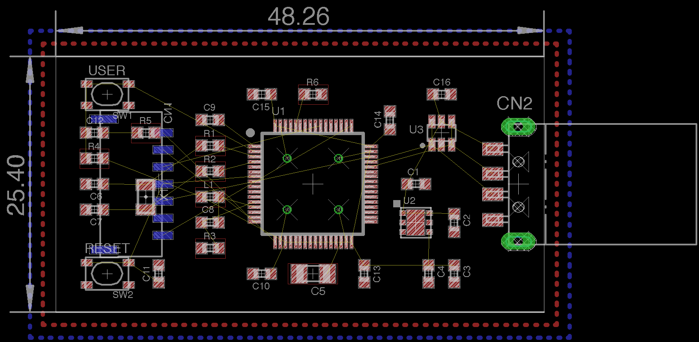

# U2F USB HIDデバイス

## 概要

U2Fでは、Register（ユーザー登録時の認証情報登録）時、USB HIDデバイスによる認証情報生成を要求されます。 
ですので、結果としてU2F Registerは、PCのChromeブラウザーからしか実行させることができません。

このU2F USB HIDデバイス（ヘルパーデバイス）を使用すれば、別途制作した[ヘルパーアプリ（U2F Helper）](../Usage/HELPER_INSTALL.md)と連携し、One Card上のU2F Register機能を実行させることができます。

## 使用方法

PCのUSBポートに挿して使用します。 
PCが、本デバイスをUSB HIDデバイスとして認識するために、約10秒前後の時間を要しますのでご注意ください。

具体的な使用方法は、別途手順書[「Googleアカウントを使ったテスト手順」](../Usage/GOOGLEACCTEST.md)をご参照願います。

## プログラム

U2F USB HIDデバイスは、mbedを使用して制作したファームウェアにより動作します。 

- [U2F USB HIDデバイス用ファームウェア](NucleoF411RE_u2fhiddevice/readme.md) - [mbedオンラインコンパイラー](https://os.mbed.com/compiler/)でビルドできます。
- [バイナリーファイル](NucleoF411RE_usbmouse.NUCLEO_F411RE.bin) - NUCLEOに付属のST-LINK V2-1により書き込みできます。

## 基板

EAGLE（Version 7.7.0）というソフトウェアによりデザインしたものです。

- [回路図（U2FHIDDevice_1.pdf）](pcb/U2FHIDDevice_1.pdf)
- [部品表（BOM.csv）](pcb/bom/BOM.csv)
- [ガーバーファイル（U2FHIDDevice_1.zip）](pcb/gerber/U2FHIDDevice_1.zip)
