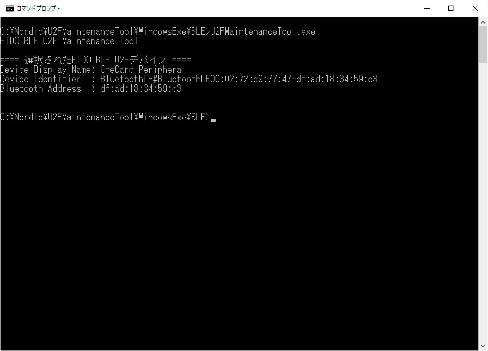

# U2F管理ツール

## 概要
PC環境から、BLE U2Fサービスの動作に必要な鍵・証明書の導入などを行うツールです。

macOS版と、Windows版を用意しました。

## macOS版

### 機能
* ペアリング情報削除
* 鍵・証明書削除
* 鍵・証明書インストール
* ヘルスチェック実行
* Chrome Native Messaging有効化設定

### 動作環境
macOS Sierra (Version 10.12.6)

## Windows版

### 機能
* ペアリング情報削除
* 鍵・証明書削除
* 鍵・証明書インストール
* Chrome Native Messaging有効化設定

ヘルスチェック実行機能は、後日追加実装予定です。

### 動作環境
Windows 10 (32bit版)
