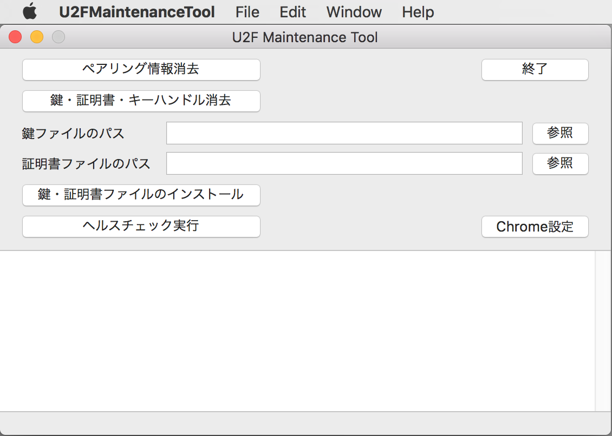

# macOS版 U2F管理ツール

## 概要
PC環境から、FIDO2サービスの動作に必要な鍵・証明書の導入などを行うツールです。

### 機能
* ペアリング実行
* 鍵・証明書削除
* 鍵・証明書インストール
* ヘルスチェック実行
* 鍵ファイル作成
* 証明書要求ファイル作成
* 自己署名証明書ファイル作成

### 画面イメージ

### 動作環境
macOS Sierra (Version 10.12.6) 〜

## 開発情報

2019/03/19現在、以下の機能をUSB HID経由で実行できるように改修中です。

* 鍵・証明書削除
* 鍵・証明書インストール

（[Issue #144](https://github.com/diverta/onecard-fido/issues/144) ご参照）
