# FIDO U2F認証テスト手順

FIDO U2F認証取得のための事前テストツール（BLECertificationTool.exe）が、FIDOアライアンスから提供されています。

- URL<br>
<b>Download and build code for Authenticator BLE Transport Layer Testing</b><br>
https://github.com/fido-alliance/jovasco-u2f-ref-code/tree/master/u2f-tests/BLE

- 動作環境<br>
Windows 10のみサポートされています。

- プログラム<br>
こちらからダウンロードできます。<br>
[BLECertificationTool.exe](../Research/BLECertificationTool.exe)

このテストツールを使用してテストを実行する手順を、下記に掲載いたします。

## テスト実行前の確認

### ペアリングされていること

事前に、Windows 10上で、One Cardとペアリングが行われているかどうか確認します。

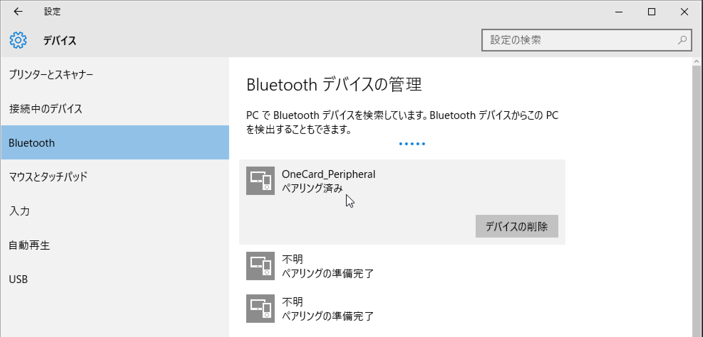

ペアリングが行われていない場合は、[One Cardペアリング手順](PAIRING.md) によりペアリングをおこなってください。

### 非ペアリングモードになっていること

テスト実行時は、必ず<u><b>One Cardが非ペアリングモードになっていること</u></b>を確認してください。

非ペアリングモードでは、下図の通り、One CardのLEDが点灯していない状態となっております。

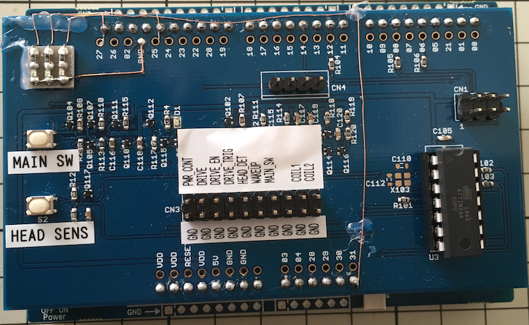

ペアリングモードでテストを実行すると、テスト項目「非ペアリングモードにおけるペアリングテスト」で判定NGとなり、テストが異常終了します。

## テストの実行

後述の不具合があるため、BLE Transport TestsとU2F Raw Message Testsは別々に実行するようにします。

### BLE Transport Testsの実行

コマンドプロンプトを開き、コマンド「BLECertificationTool.exe -v -V -T -S -D -u -i」を実行します。

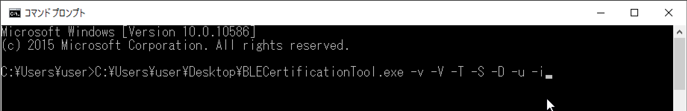

テストが実行され、しばらく経つと、下図のように「Turn on device in Pairing Mode and press ENTER.」というメッセージが表示され、一旦テストが停止します。

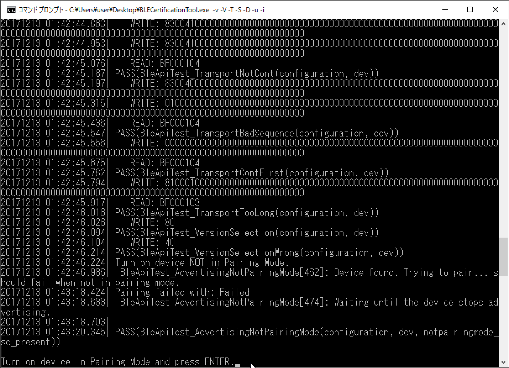

メッセージに従い、One Cardをペアリングモードに変更します。<br>
<u>[ペアリングモード変更方法はこちらをご参照](PAIRING.md)</u>

ペアリングモードに変更すると、One Card上の２番目のLEDが<font color=ff0000><b>点灯</b></font>します。

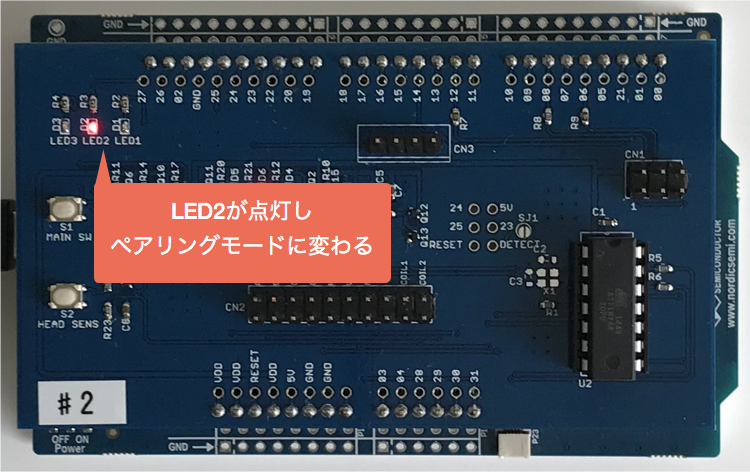

ここで、コマンドプロンプト上に戻り、PCのENTERキーを押下しますと、テスト実行が再開されます。

テストが成功すると、下図のように「==== Test completed. ====」というメッセージが表示されます。

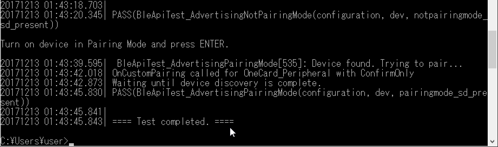

これでBLE Transport Testsは完了です。

### U2F Raw Message Testsの実行

コマンドプロンプトを開き、コマンド「BLECertificationTool.exe -v -V -T -S -D -t」を実行します。

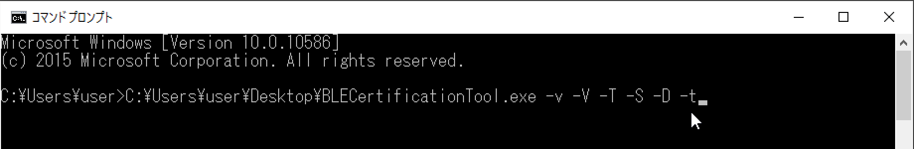

テストが実行され、しばらく経つと、下図のように「READ: 82000102」というメッセージが次々と表示され、一旦テストが停止します。

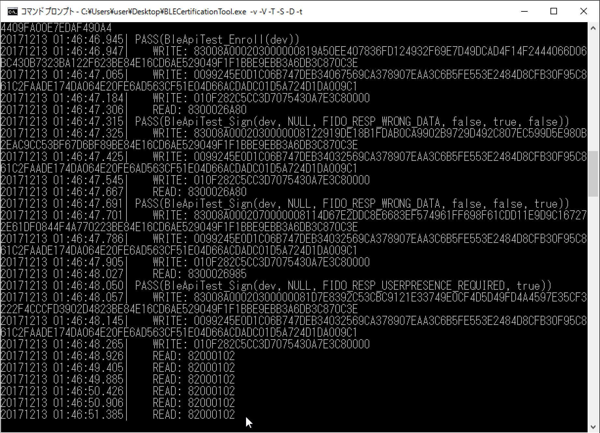

One Cardを見ると、３番目のLEDが<font color=ff0000><b>点滅</b></font>しているのが確認できます。<br>
（ユーザー所在確認を求めるため、One Card側の処理が一時的に中断されます）


ここでMAIN SWを１回押しますと、テストが再開されます。

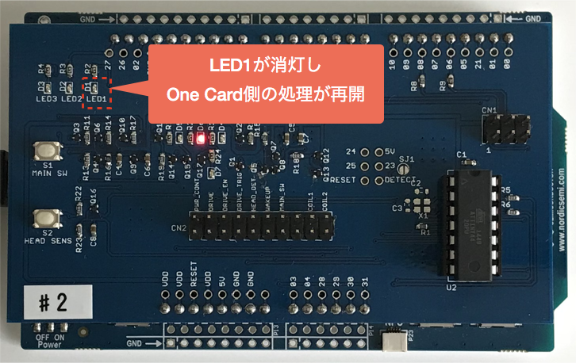

<b><u>ユーザー所在確認は、テスト内で５回行われます。</b></u><br>
その都度、MAIN SWを押すようにしてください。

テストが成功すると、下図のように「==== Test completed. ====」というメッセージが表示されます。

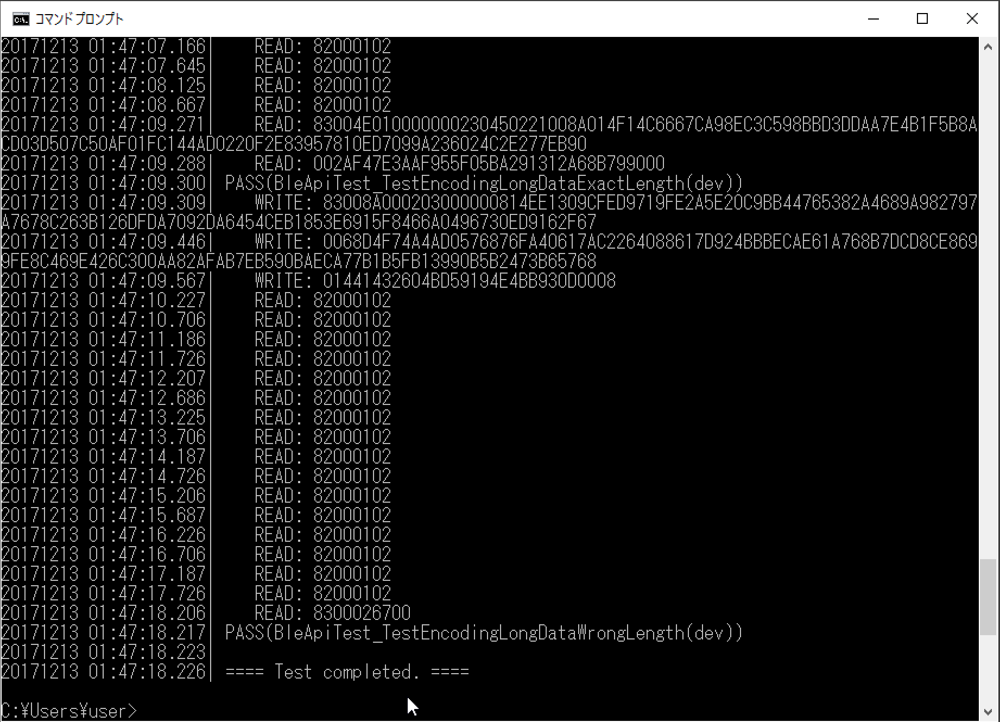

これでU2F Raw Message Testsは完了です。

## テスト時の不具合

前述 [Download and build code for Authenticator BLE Transport Layer Testing](https://github.com/fido-alliance/jovasco-u2f-ref-code/tree/master/u2f-tests/BLE) に記されている

```
Recommended usage:

  BLECertificationTool.exe -v -V -T -S -d "<device identifier>"
```

の通り、テストツールを実行すると、以下の障害が発生し、テストが停止してしまいます。

#### テストツールがテスト途中でハング
こちらは常に再現する障害です。<br>
下図のように「Waiting until device disconnects...」というメッセージが表示され、テストが一旦中断するのですが、この後３分以上たってもタイムアウトせずに、テストツールがハングしてしまいます。<br><br>
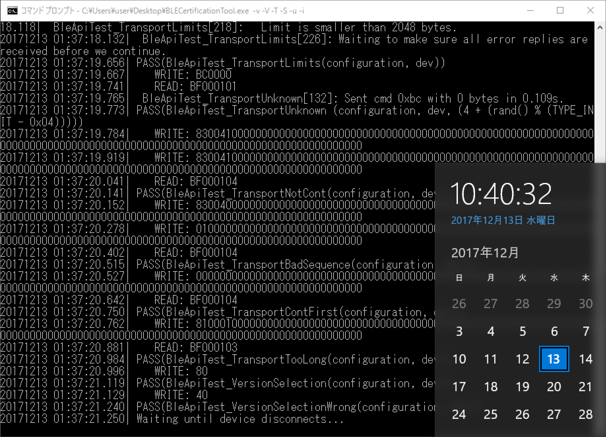


#### テストツールがセマフォタイムアウトで異常停止
こちらは、コマンドライン・オプションに「-D」を追加して、前項のハング障害を回避する際に、発生してしまう障害です。<br>
ただし、常に再現するわけではありません。<br>
発生時のイメージは下図のとおりです。<br><br>
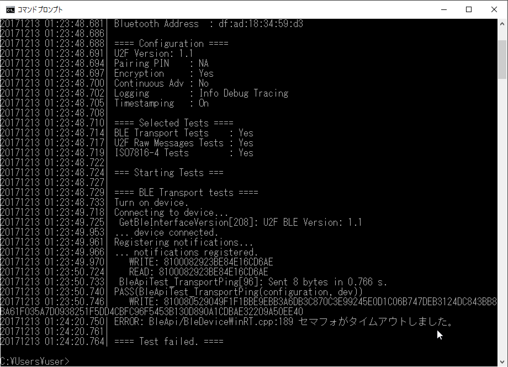

2017/12/12現在、調査中のステータスです。
