# U2Fデモサイトを使ったテスト手順

[U2Fデモサイト](https://crxjs-dot-u2fdemo.appspot.com/)を使用して、One CardのU2F機能（Register/Authenticate）をテストする手順を、以下に掲載いたします。

## テスト実行前の確認

### Chromeブラウザーについて

テスト事前に、Chromeブラウザーがインストールされているかどうか確認します。

また、本テストは、Chromeブラウザーの拡張機能（U2Fエクステンション）を使用しますが、パッケージ化されていないため、デベロッパーモードになっている必要があります。 
デベロッパーモードにするためには、Chromeブラウザーの拡張機能ページ（chrome://extensions/）を開いて、デベロッパーモードのチェックボックスをチェック状態にします。
（下図ご参照）

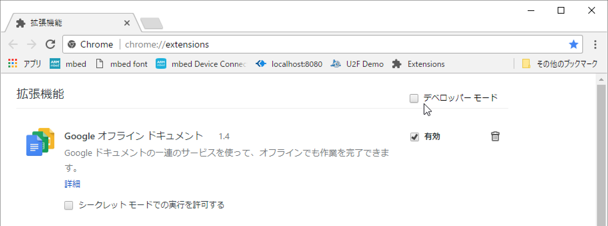

デベロッパーモードに移行すると、下図のように「パッケージ化されていない拡張機能を読み込む...」ボタンが表示され、パッケージ化されていないエクステンションを、Chromeにインストールすることができるようになります。

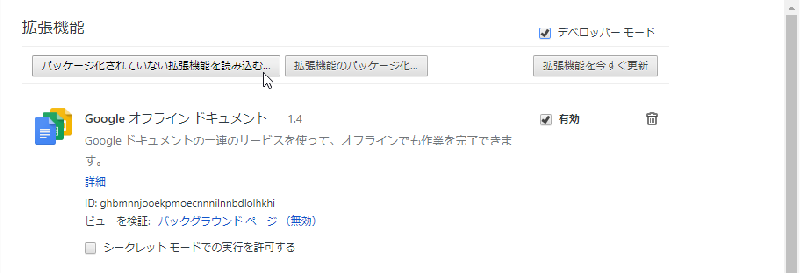

- （ご参考）パッケージ化しない理由 
[Googleから提供されたオリジナルのU2Fエクステンション](https://github.com/google/u2f-ref-code/tree/master/u2f-chrome-extension)をカスタマイズしたコードをパッケージ化して、Chromeブラウザーにインストールすると、エクステンションのIDが変わってしまうため、[U2Fデモサイト](https://crxjs-dot-u2fdemo.appspot.com/)が指定したIDと一致しなくなり、結果認証テストが失敗します。 
このため、本手順で使用するU2Fエクステンションは、本手順のとおり、パッケージ化されていない状態で、Chromeブラウザーにインストールするものとしております。

### One Cardについて

テスト事前に、One Cardがシステム（macOS／Windows）とペアリングされていることを確認してください。 
ペアリングの手順は、[こちらのページ（One Cardペアリング手順）](PAIRING.md)に掲載しております。

また、One Cardがスリープ状態になっている場合、U2F機能の実行が失敗します。 
MAIN SWを１回プッシュし、スリープ状態を解除してください。

### U2F管理ツールと鍵・証明書について

テスト事前に、U2F管理ツールがシステム（macOS／Windows）にインストールされ、かつ、U2F管理ツールで作成した鍵・証明書がOne Cardにインストールされていることを確認してください。

インストール手順は下記のページに掲載しております。

- [鍵・証明書インストール手順（macOS版）](INSTALL.md)
- [鍵・証明書インストール手順（Windows版）](INSTALL_WINDOWS.md)

## テスト事前準備

以下の順番で実行します。

- Chrome Native Messaging有効化設定
- U2Fエクステンションのインストール
- Chromeブラウザーの再起動

### Chrome Native Messaging有効化設定

U2F管理ツールを起動し、画面上の「Chrome設定」をクリックします。 
（下図はWindows版のものですが、macOS版でも同様になります）

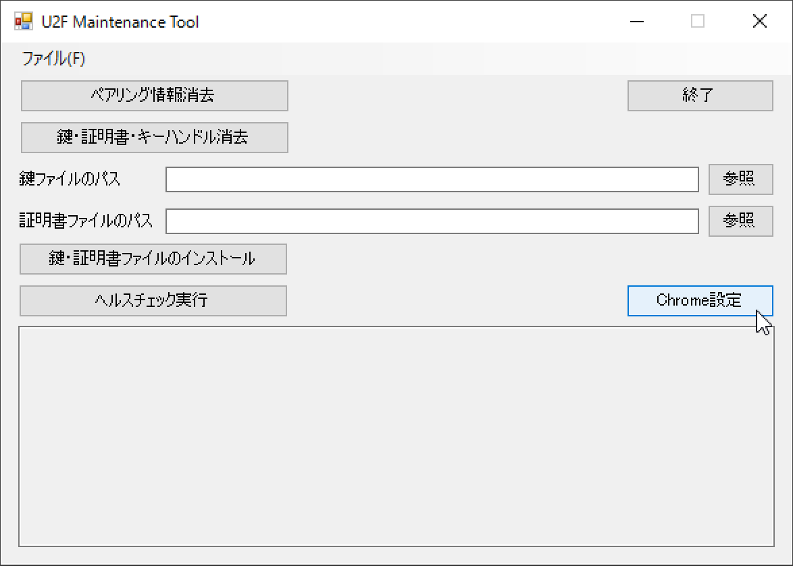

表示されたダイアログで「はい」をクリックします。

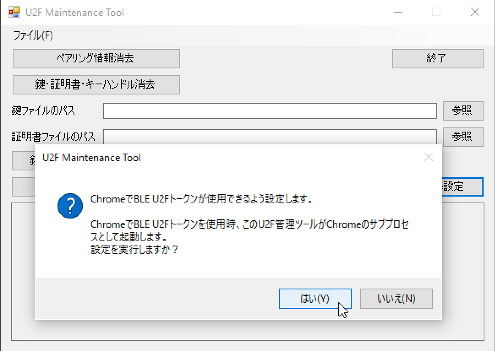

「Chrome Native Messaging有効化設定が成功しました。」というポップアップが表示されたら、設定完了です。

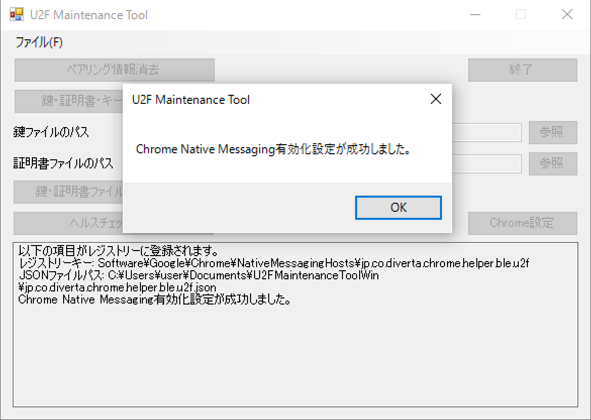

### U2Fエクステンションのインストール

[u2f-chrome-extension.zip](../U2FMaintenanceTool/u2f-chrome-extension.zip)をGitHubからダウンロードします。

ダウンロードしたファイルを任意の場所で解凍します。 
（下図はドキュメントフォルダーに解凍した例）

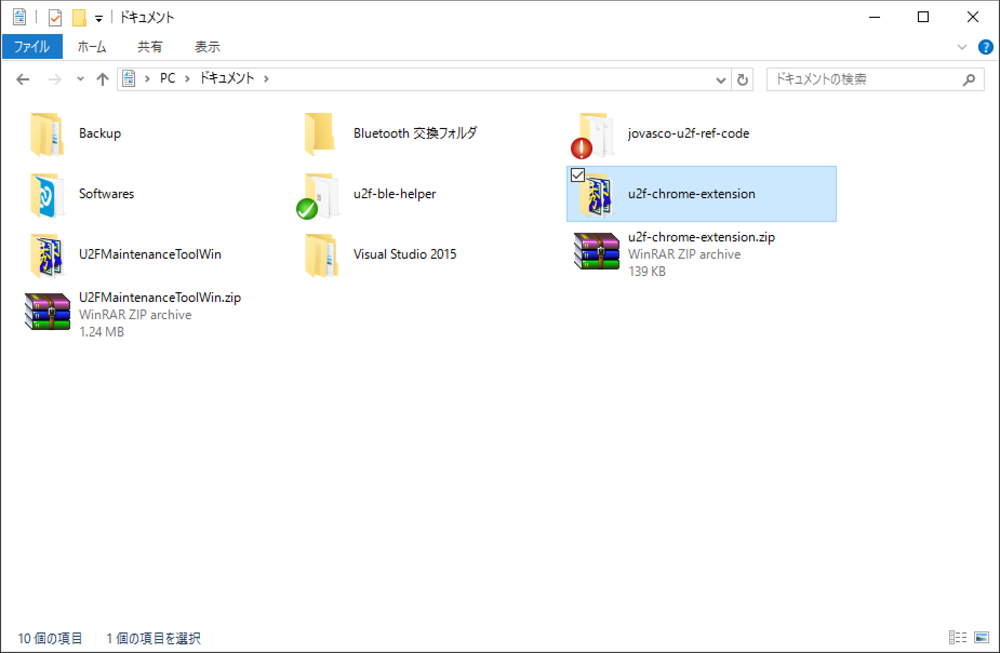

Chromeブラウザーを起動し、拡張機能ページ（chrome://extensions/）を開きます。 
拡張機能ページの「パッケージ化されていない拡張機能を読み込む...」ボタンをクリックします。

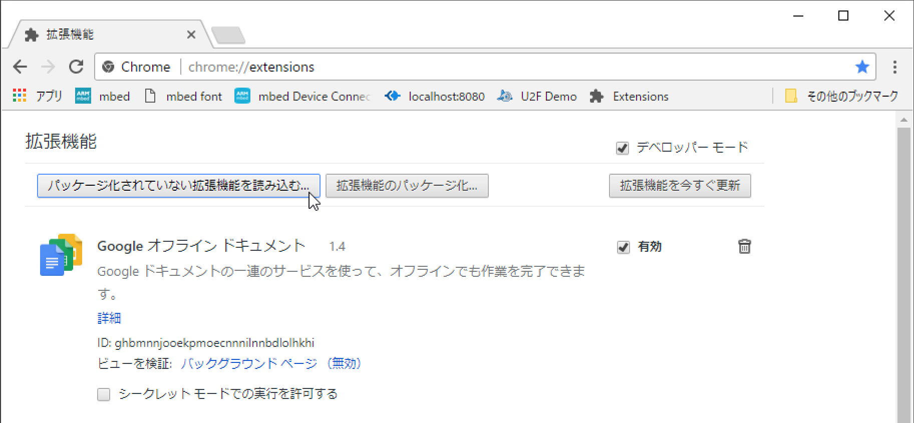

フォルダー参照ダイアログで、先述「u2f-chrome-extension.zip」の解凍先の場所を選択します。

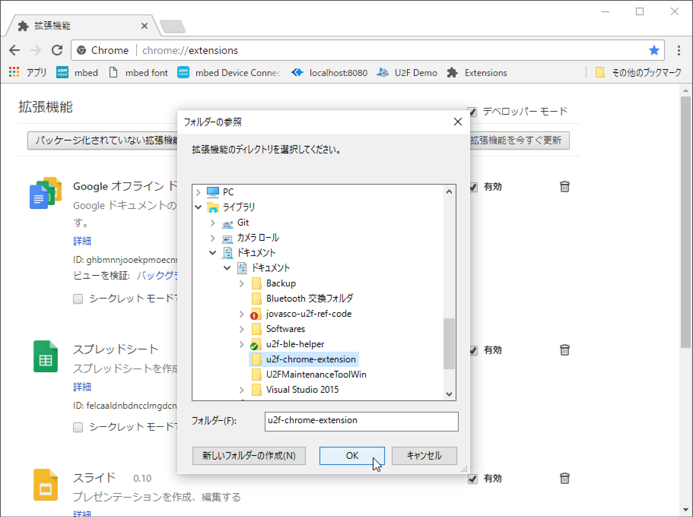

U2Fエクステンションがインストールされ、拡張機能ページに表示されれば、U2Fエクステンションのインストールは完了です。

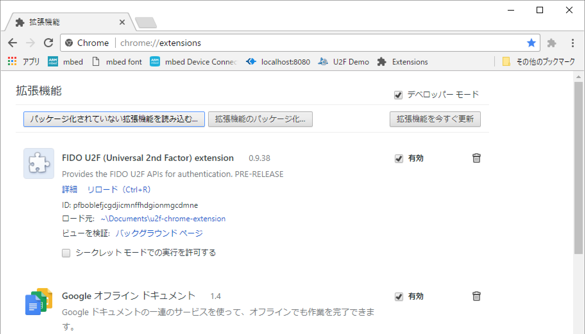

### Chromeブラウザーの再起動

Chromeブラウザーを再起動します。

起動してほどなく、下図のように「デベロッパーモードの拡張機能を無効にする」というメッセージが表示されます。 
ここで、<b>必ずキャンセルをクリック</b>してください。

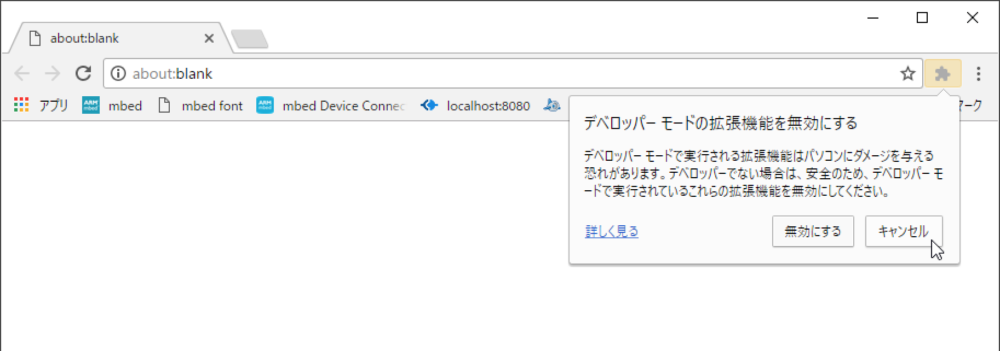

## テストの実行

以下の順番で実行します。

- U2F Registerの実行
- U2F Authenticateの実行

### U2F Registerの実行

Chromeブラウザーで[U2Fデモサイト](https://crxjs-dot-u2fdemo.appspot.com/)を表示させます。 
下図のような画面に遷移します。

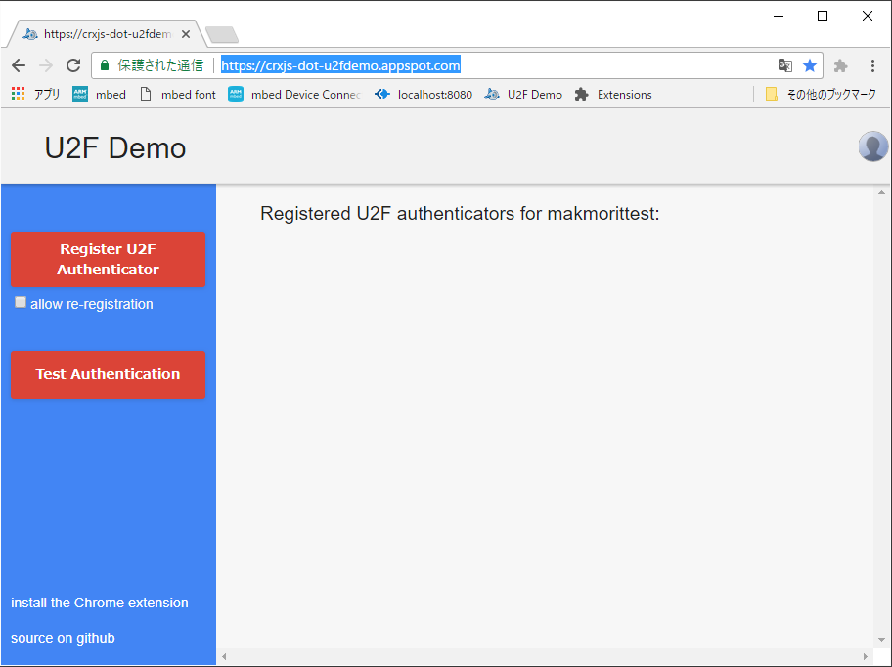

画面左側の「Register U2F Authenticator」をクリックします。

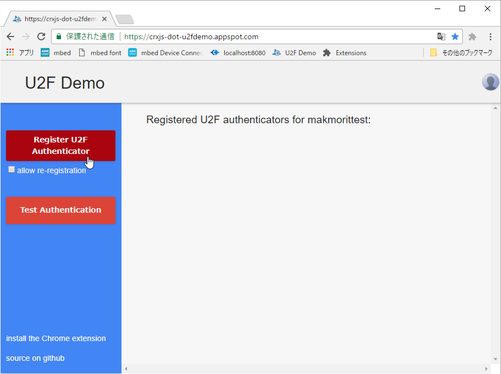

One CardでのU2F Register機能が実行されます。 
画面上では「please touch the token」と表示されますが、何もせずに待ちます。

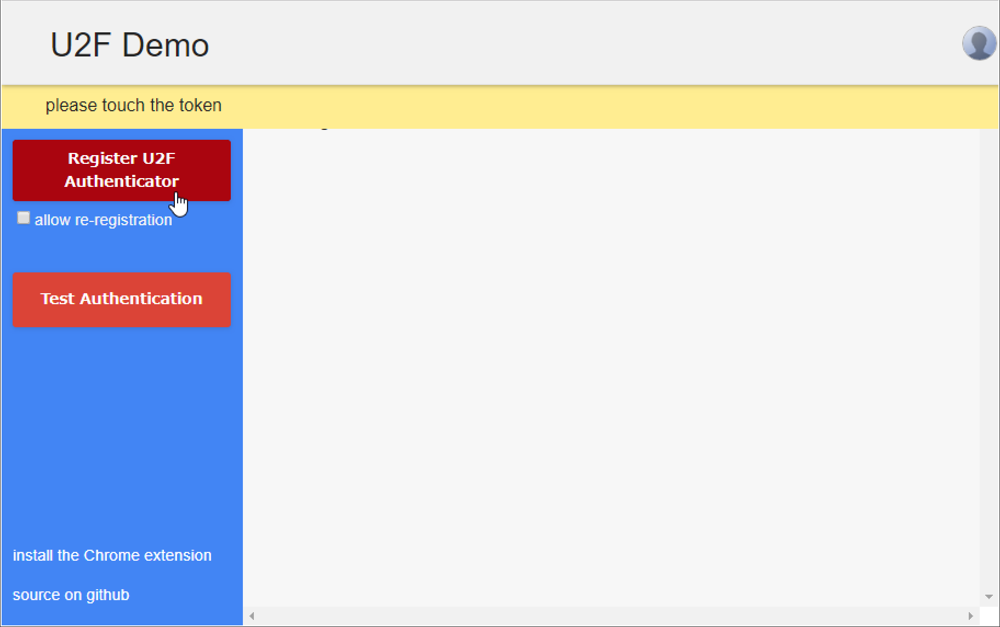

One Cardでの実行が完了すると、下図のようにU2FデモサーバーにRegisterされる証明書の情報が画面表示されます。

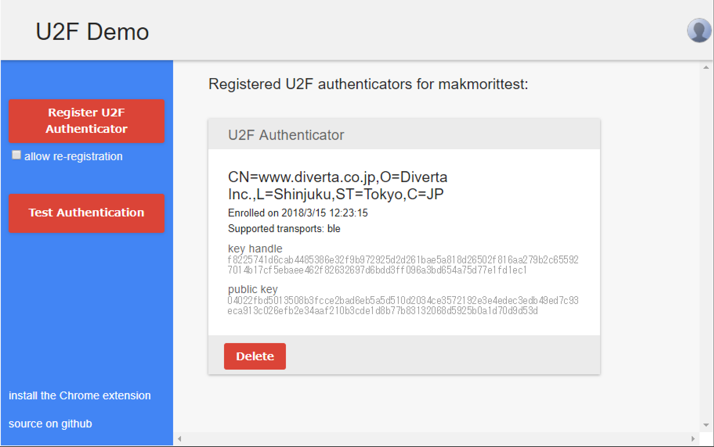

これでU2F Registerは完了です。

### U2F Authenticateの実行

画面左側の「Test Authentication」をクリックします。

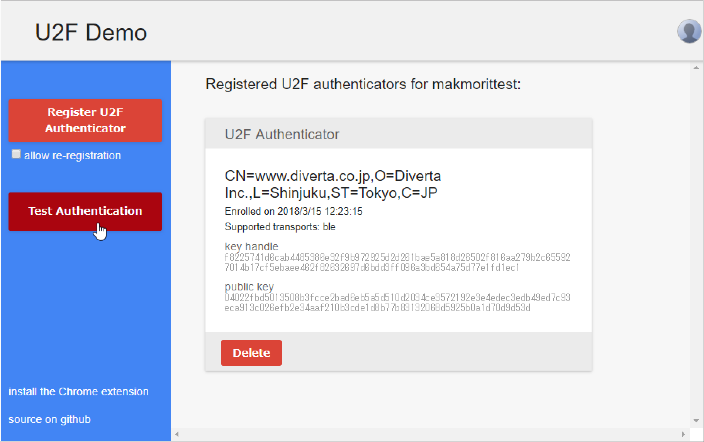

One CardでのU2F Authenticate機能が実行されます。 
画面上では「please touch the token」と表示されます。

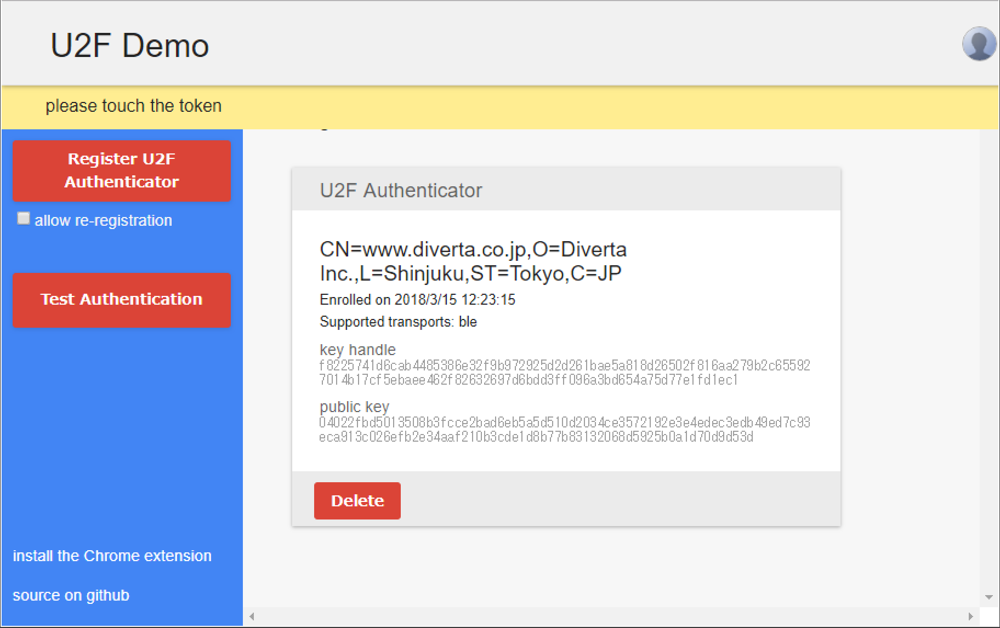

One Cardを見ると、一番右側のLEDが<b>点灯</b>しているのが確認できます。 
（ユーザー所在確認を求めるため、One Card側の処理が一時的に中断されます）

ここでMAIN SWを１回押しますと、One Card側の処理が再開されます。

One Cardでの実行が完了すると、下図のようにU2Fデモサーバーでの認証が成功した旨が表示されます。 
（証明書欄が約１秒間、緑色に変化します）

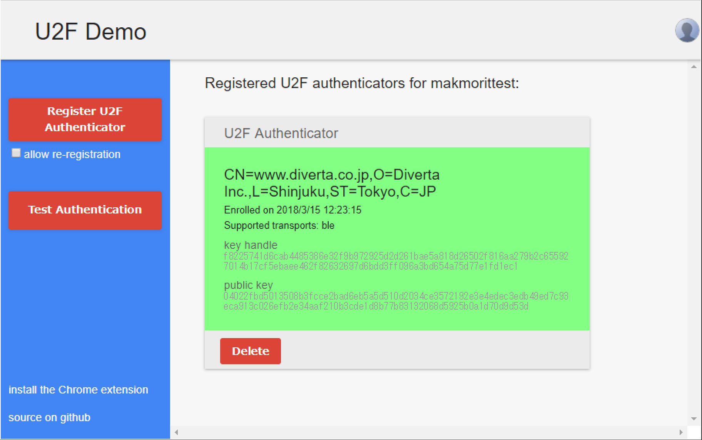

これでU2F Authenticateは完了です。
