# U2F Helperインストール手順

U2F HIDデバイスを使用し、ChromeブラウザーのU2Fクライアントと、One CardのFIDO機能を連携させるために必要となる、U2F Helperのインストール手順を掲載いたします。

## U2F Helperのインストール（macOS版）

[U2F Helper](../U2FMaintenanceTool/macOSApp/U2FHelper.pkg)を、GitHubからダウンロード／解凍します。 

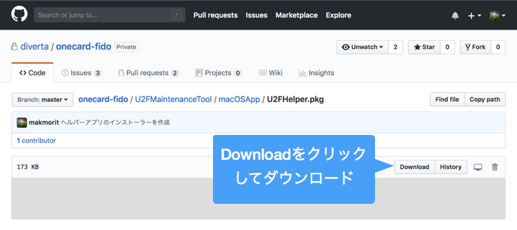

ダウンロードされたファイルを右クリックし「開く」を実行してください。 
（2018/07/23現在、アプリに署名がされていないので、アイコンをダブルクリックしても実行することができないための措置になります）

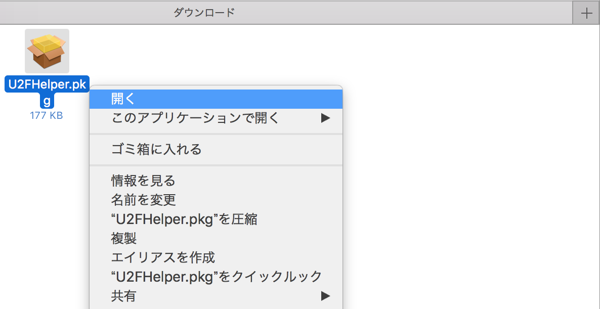

警告画面が表示されますが、続いて「開く」を実行します。

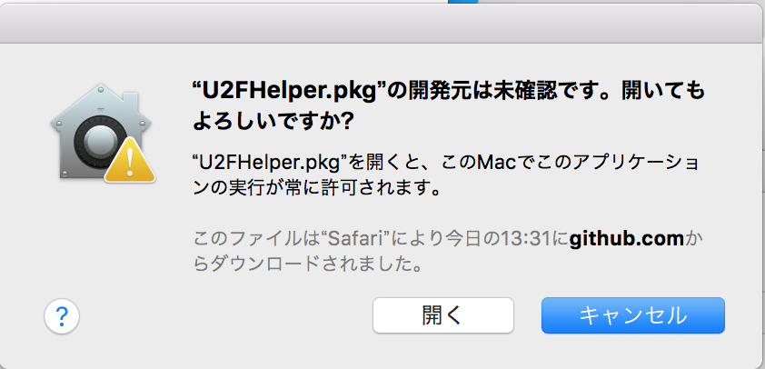

インストーラーが起動しますので、指示に従いインストールを進めます。

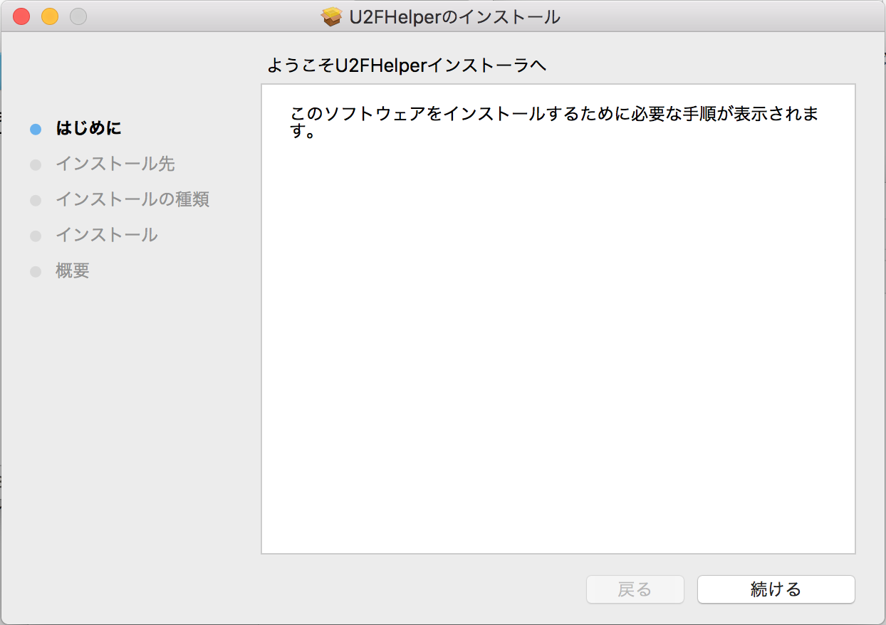

インストールが完了すると、アプリケーションフォルダーに、U2F Helperのアイコンができます。

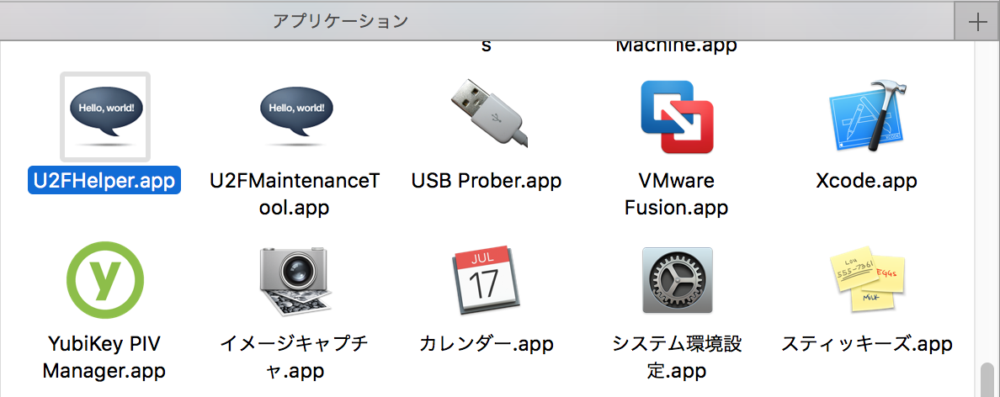

この後、システム環境設定画面を開き「ユーザとグループ」をクリックします。

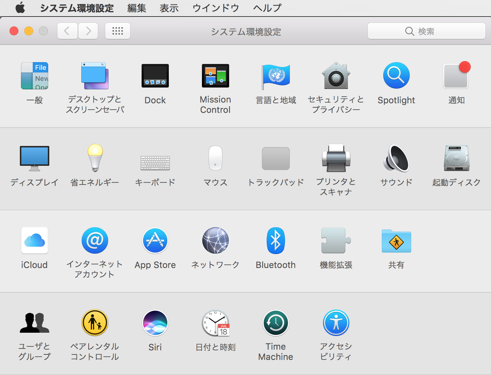

「ユーザとグループ」画面の「ログイン項目」タブをクリックしたら、一覧左下の「＋」ボタンをクリックします。

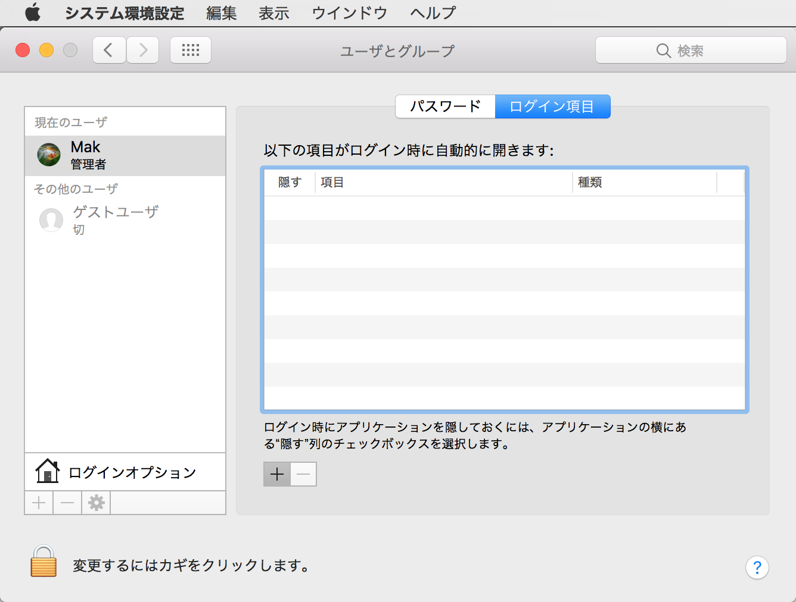

表示されたファイル選択ダイアログで、アプリケーションフォルダーのU2F Helperのアイコンを選択し「追加」をクリックします。

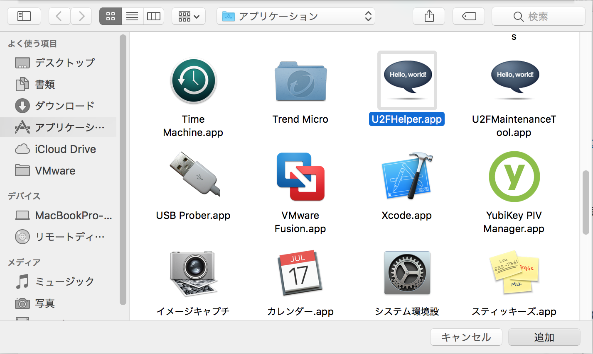

ログイン項目にU2F Helperが追加されたことを確認します。

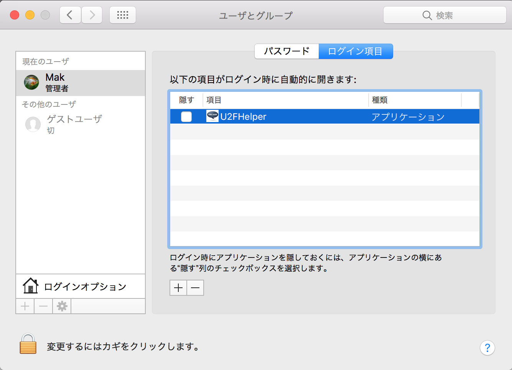

いったんログオフします。

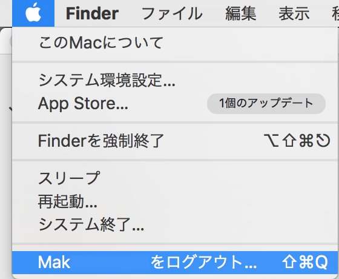

再度ログインすると、ステータスバーにU2F Helperのアイコンが表示されます。

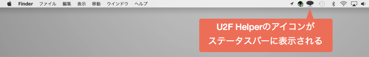

これでU2F Helperのインストールは完了です。

## U2F Helperのインストール（Windows版）

Windows版は、後日作成予定です。
