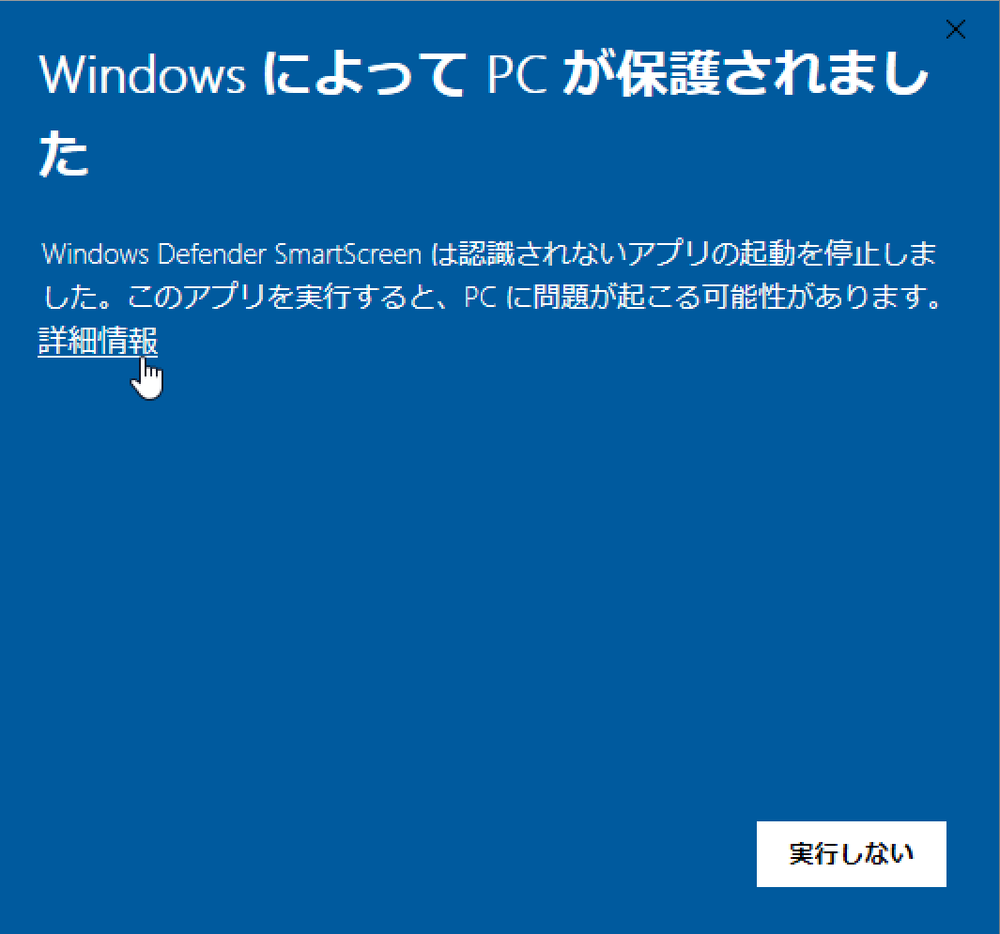
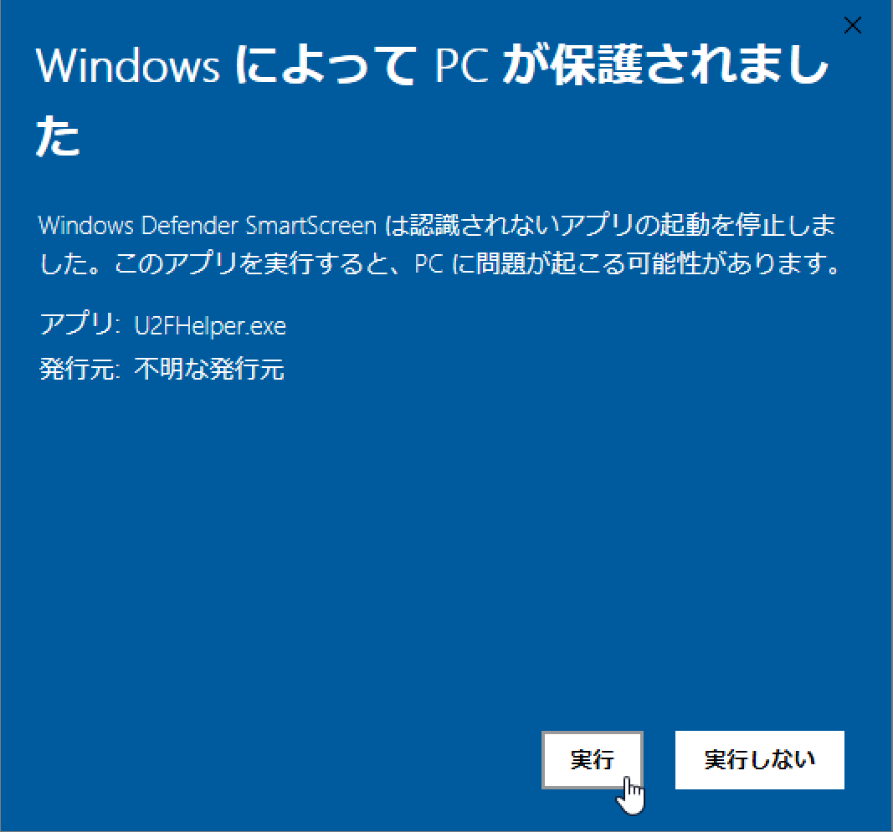
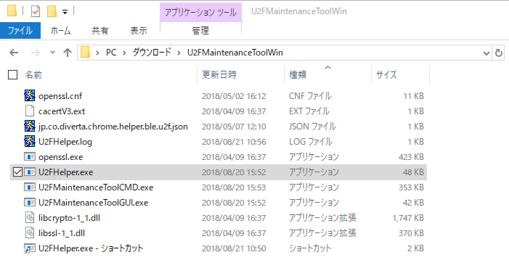
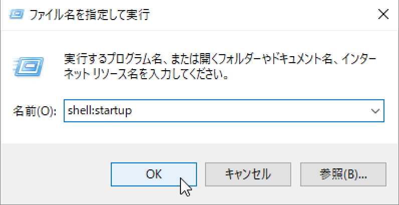
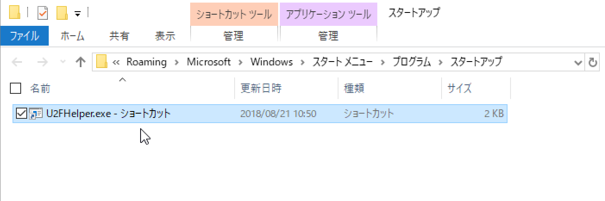
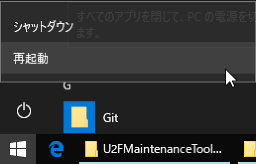
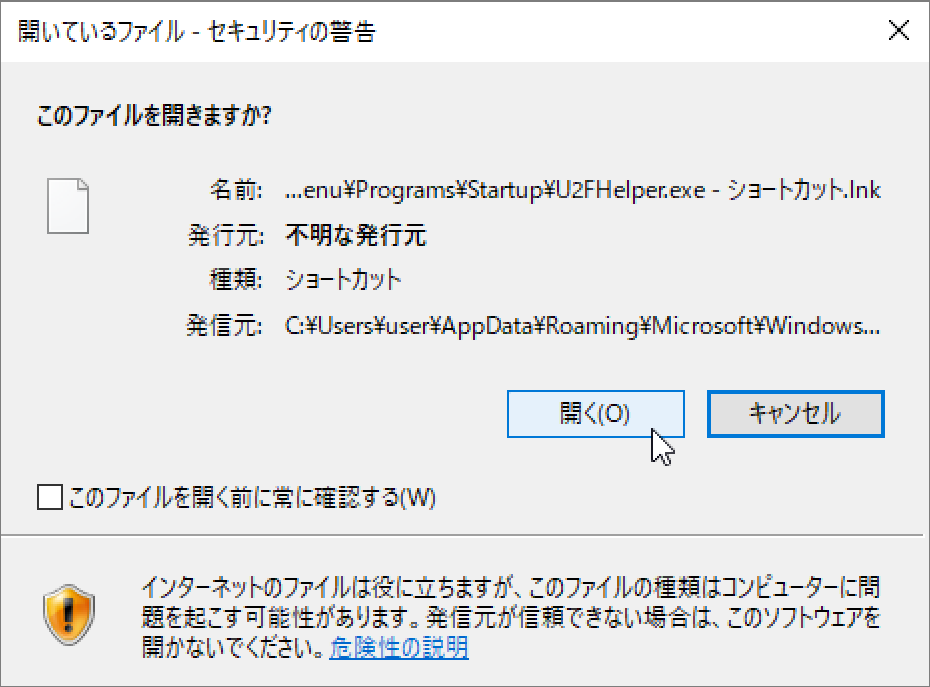

# U2F Helperインストール手順

U2F HIDデバイスを使用し、ChromeブラウザーのU2Fクライアントと、One CardのFIDO機能を連携させるために必要となる、U2F Helperのインストール手順を掲載いたします。

## U2F Helperのインストール（macOS版）

[U2F Helper](../U2FMaintenanceTool/macOSApp/U2FHelper.pkg)を、GitHubからダウンロード／解凍します。 

ダウンロードされたファイルを右クリックし「開く」を実行してください。 
（2018/07/23現在、アプリに署名がされていないので、アイコンをダブルクリックしても実行することができないための措置になります）

警告画面が表示されますが、続いて「開く」を実行します。

インストーラーが起動しますので、指示に従いインストールを進めます。

インストールが完了すると、アプリケーションフォルダーに、U2F Helperのアイコンができます。

この後、システム環境設定画面を開き「ユーザとグループ」をクリックします。

「ユーザとグループ」画面の「ログイン項目」タブをクリックしたら、一覧左下の「＋」ボタンをクリックします。

表示されたファイル選択ダイアログで、アプリケーションフォルダーのU2F Helperのアイコンを選択し「追加」をクリックします。

ログイン項目にU2F Helperが追加されたことを確認します。

いったんログオフします。

再度ログインすると、ステータスバーにU2F Helperのアイコンが表示されます。

これでU2F Helperのインストールは完了です。

## U2F Helperのインストール（Windows版）

### ダウンロードと実行確認

[U2FMaintenanceToolWin.zip](../U2FMaintenanceTool/WindowsExe/U2FMaintenanceToolWin.zip) を、GitHubからダウンロードして取得します。

U2FMaintenanceToolWin.zipを展開すると、下図のように「U2FMaintenanceToolWin」というフォルダーができるので、任意の場所に配置します。 
その後、フォルダー内の実行ファイル「U2FHelper.exe」をダブルクリックします。

2018/08/21現在、アプリに署名がされていないため、ダウンロードしたプログラムを実行できない旨のダイアログが表示されます。 
「詳細情報」をクリックして、実行ボタンを表示させます。

表示された実行ボタンをクリックして、U2F Helperを実行させます。

U2F Helperが起動し、タスクトレイに入っていることを確認します。

### タスクトレイ常駐設定

前述手順で配置したインストール媒体「U2FMaintenanceToolWin」内の「U2FHelper.exe」に対して、ショートカットを作成します。

その後「ファイル名を指定して実行」で `shell:startup`を実行します。

スタートアップフォルダーが開くので、先ほど作成したショートカットを、スタートアップフォルダーに移動します。

その後、PCを再起動します。

PCが再起動すると、約30秒ほどでU2F Helperがスタートアップ起動します。

下図のようなポップアップが表示されることがありますが、その場合は「このファイルを開く前に常に確認する(W)」のチェックを外した上で、「開く(O)」ボタンをクリックして、起動処理を続行させてください。

これでU2F Helperのインストールは完了です。
