# 鍵・証明書インストール手順

BLE U2Fサービスを動作させるためには、秘密鍵と署名済み証明書が必要になります。

秘密鍵と署名済み証明書を、U2F管理ツールを使用してインストールし、動作確認（ヘルスチェック）を実行するまでの手順を、以下に掲載いたします。

## 鍵・証明書の作成

以下の手順で、秘密鍵ファイル(.pem)、証明書ファイル(.crt)を作成します。

注意：macOS版U2F管理ツールのファイル作成メニューを使用しての手順となります。

（2018/03/05現在、Windows版U2F管理ツールにはファイル作成メニューがありません。後日、実装予定となっております）

### 秘密鍵ファイル(.pem)の作成

U2F管理ツールのファイル作成メニューから「鍵ファイル作成」を実行します。

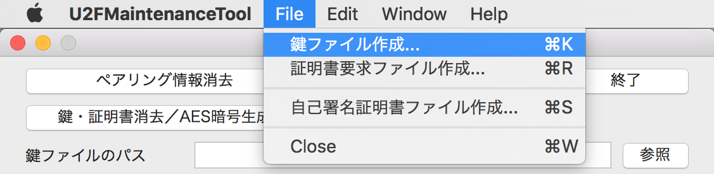

ファイル作成ダイアログが表示されますので、出力先のディレクトリー、ファイル名を指定して「作成」をクリックします。

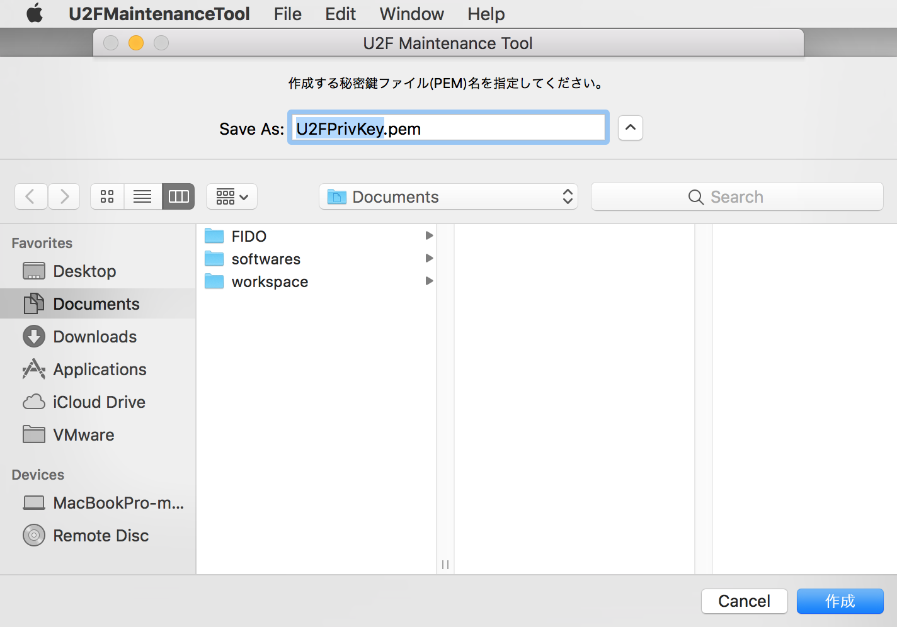

秘密鍵ファイル作成処理がスタートします。

「鍵ファイル作成が成功しました。」というメッセージが表示されれば、秘密鍵ファイル(.pem)作成は完了です。

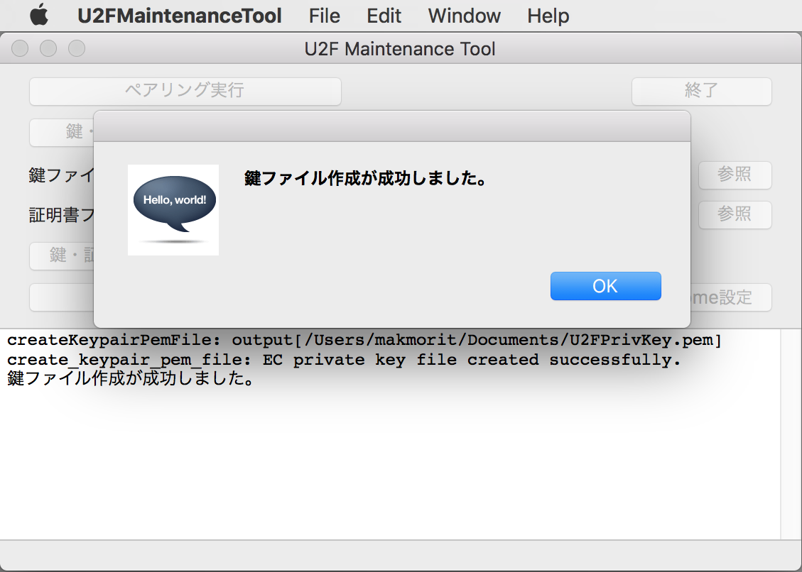

### 証明書ファイル(.crt)の作成

署名済み証明書は、本来、ベリサインやグローバルサインのようなパブリック認証局に署名／作成を依頼するのですが、その手順につきましては、ここでは触れません。

ここでは、開発用に使用できる「自己署名証明書」の作成手順について、掲載いたします。

#### 証明書要求ファイル(.csr)の作成

先ほど作成した秘密鍵ファイル(.pem)を入力とし、証明書要求ファイル(.csr)を生成します。

U2F管理ツールのファイル作成メニューから「証明書要求ファイル作成」を実行します。

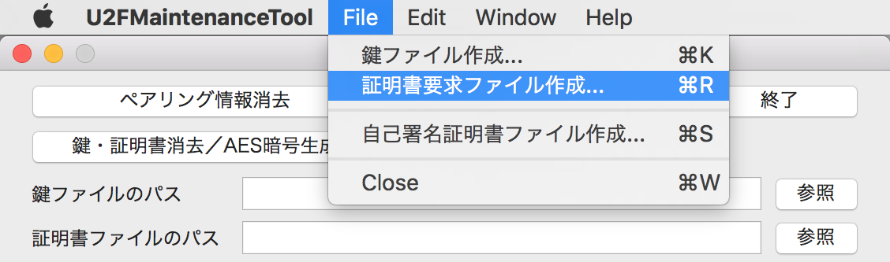

証明書要求ファイル(CSR)作成ダイアログが表示されます。 
画面上の項目に、使用する鍵ファイル、Webサイトや事業者に関する情報を入力して「作成」をクリックします。

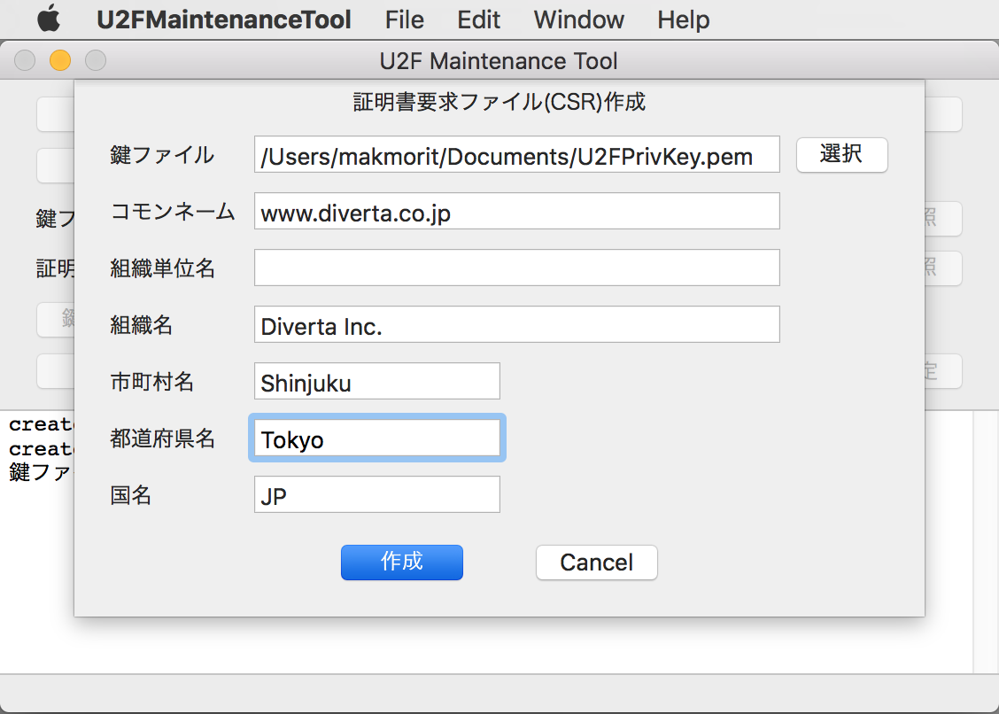

ファイル作成ダイアログが表示されますので、出力先のディレクトリー、ファイル名を指定して「作成」をクリックします。

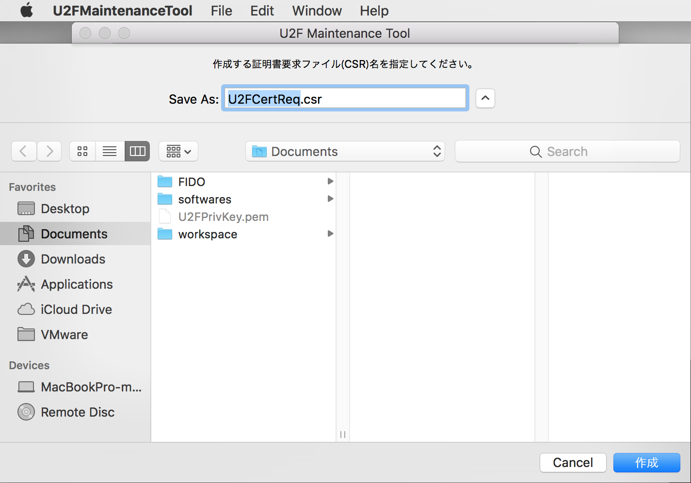

証明書要求ファイル作成処理がスタートします。

「証明書要求ファイル作成が成功しました。」というメッセージが表示されれば、証明書要求ファイル(.csr)作成は完了です。

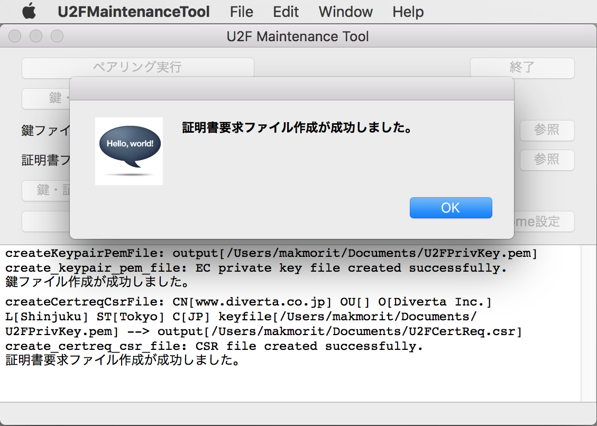

#### 証明書要求ファイルから、自己署名証明書を作成

証明書要求ファイル(.csr)を入力とし、X.509を使用して署名した自己署名証明書ファイル(.crt)を生成します。 
出力形式は、秘密鍵(PEM形式)との混同を回避するため、DER形式で出力されます。

U2F管理ツールのファイル作成メニューから「自己署名証明書ファイル作成」を実行します。

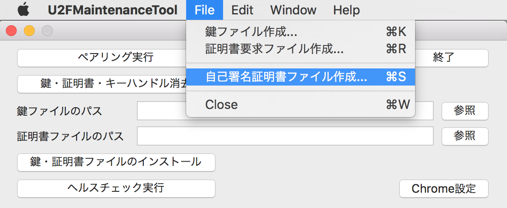

自己署名証明書ファイル(CRT)作成ダイアログが表示されます。 
画面上の項目に、使用する証明書要求ファイル、鍵ファイル、証明書有効期間（日数）を入力して「作成」をクリックします。

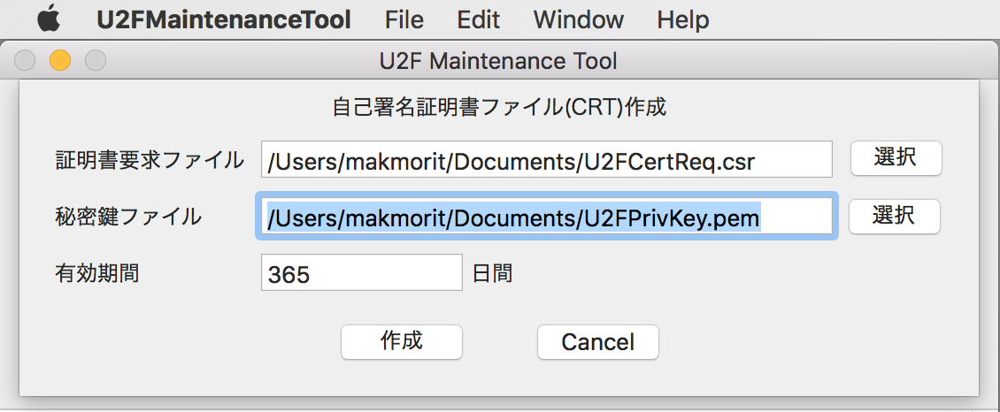

ファイル作成ダイアログが表示されますので、出力先のディレクトリー、ファイル名を指定して「作成」をクリックします。

自己署名証明書ファイル作成処理がスタートします。

「自己署名証明書ファイル作成が成功しました。」というメッセージが表示されれば、自己署名証明書ファイル(.csr)作成は完了です。

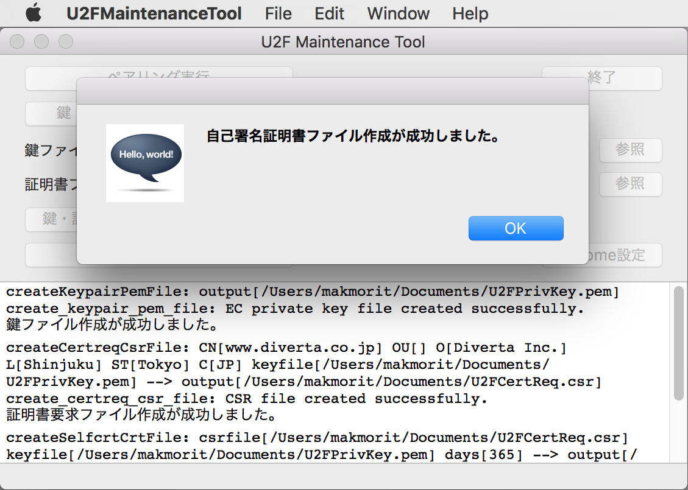

以下の図のように作成された鍵ファイル、証明書ファイルを、One Cardにインストールして使用することになります。

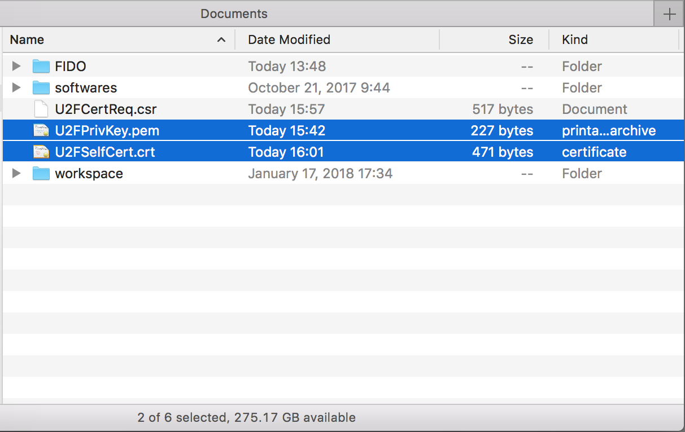

以上で、鍵・証明書の作成は完了です。

## U2F管理ツールの準備

[U2F管理ツール](../U2FMaintenanceTool/) をGitHubから取得します。

macOS環境の場合は [U2FMaintenanceTool.pkg](../U2FMaintenanceTool/macOSApp/U2FMaintenanceTool.pkg) をダウンロード後、インストールを実行します。

Windows環境の場合は [U2FMaintenanceToolGUI.exe](../U2FMaintenanceTool/WindowsExe/BLE/U2FMaintenanceToolGUI.exe) をダウンロードします。

## 鍵・証明書のインストール

U2F管理ツールを使用して、秘密鍵ファイル(.pem)、証明書ファイル(.crt)を、One Cardにインストールします。

### macOS環境の場合

U2F管理ツール（U2FMaintenanceTool.app）を起動します。 
表示された画面の「鍵・証明書消去／AES暗号生成」ボタンをクリックします。

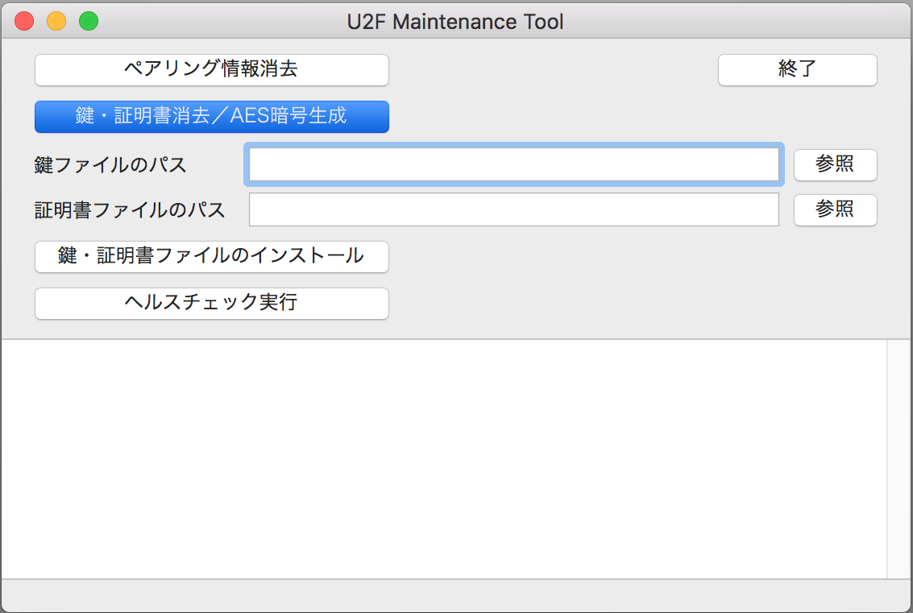

One Card側の処理が成功すると「鍵・証明書削除処理が成功しました。」と表示されます。

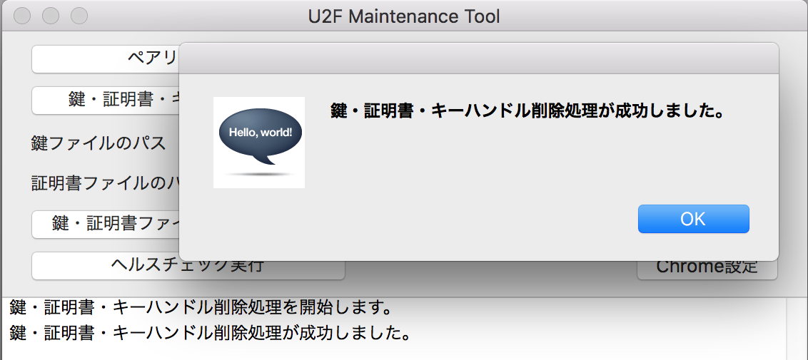

続いて、秘密鍵ファイル(.pem)、証明書ファイル(.crt)をそれぞれ「参照」ボタンをクリックして選択します。

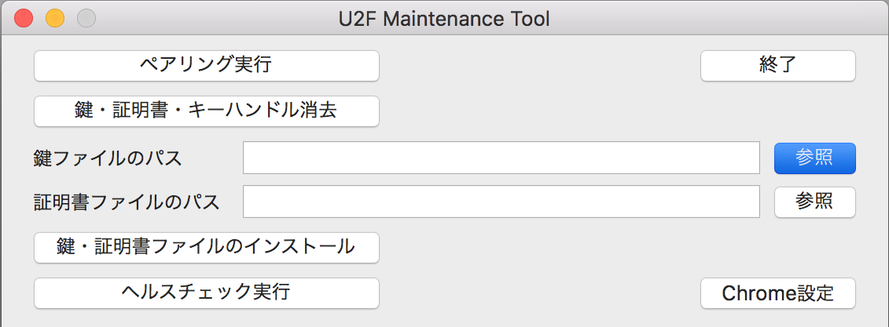

U2F管理ツール画面の「鍵・証明書ファイルのインストール」ボタンをクリックします。

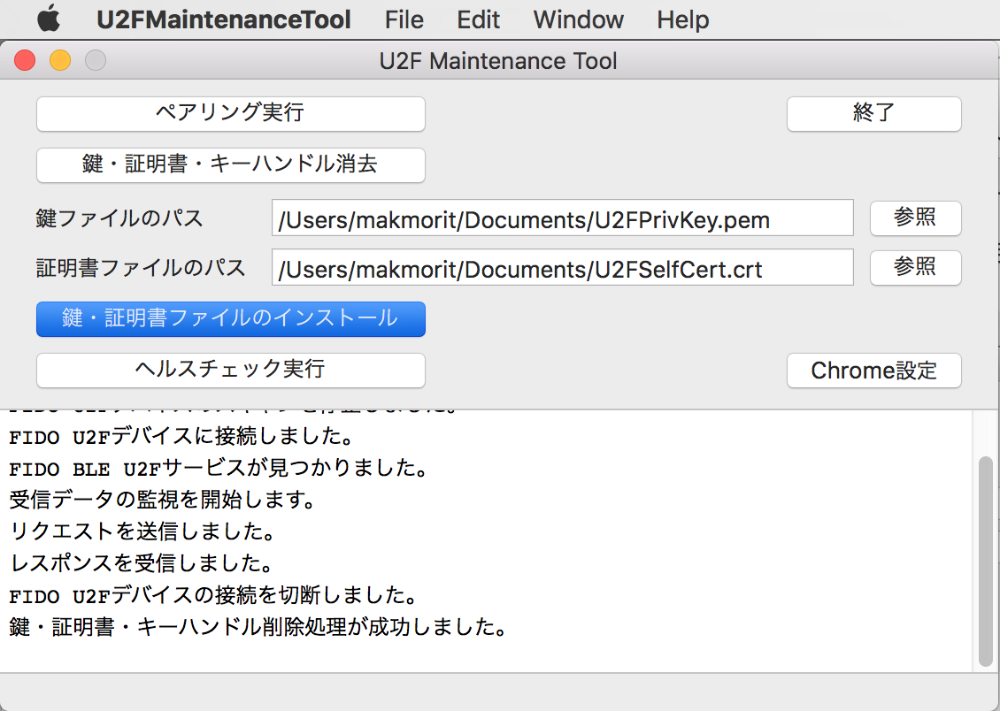

One Card側の処理が成功すると「鍵・証明書インストール処理が成功しました。」と表示されます。

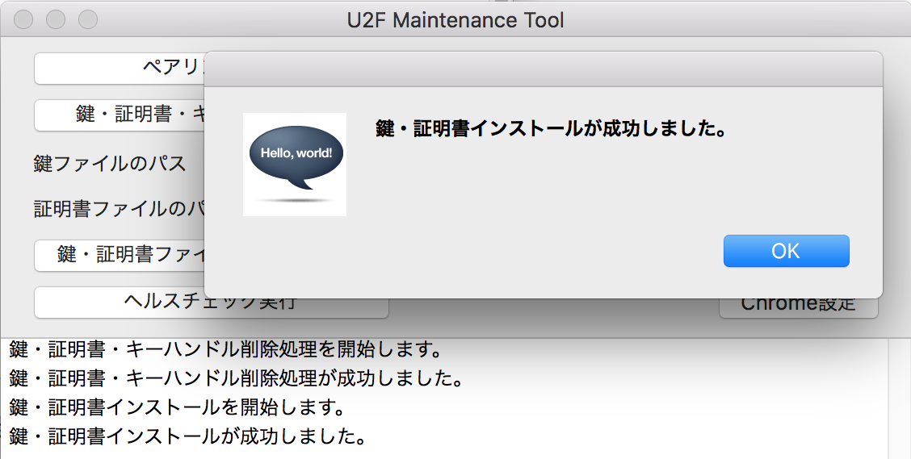

これで、鍵・証明書のインストールは完了です。

### Windows環境の場合

U2F管理ツール（U2FMaintenanceToolGUI.exe）を起動します。 
表示された画面の「鍵・証明書消去／AES暗号生成」ボタンをクリックします。

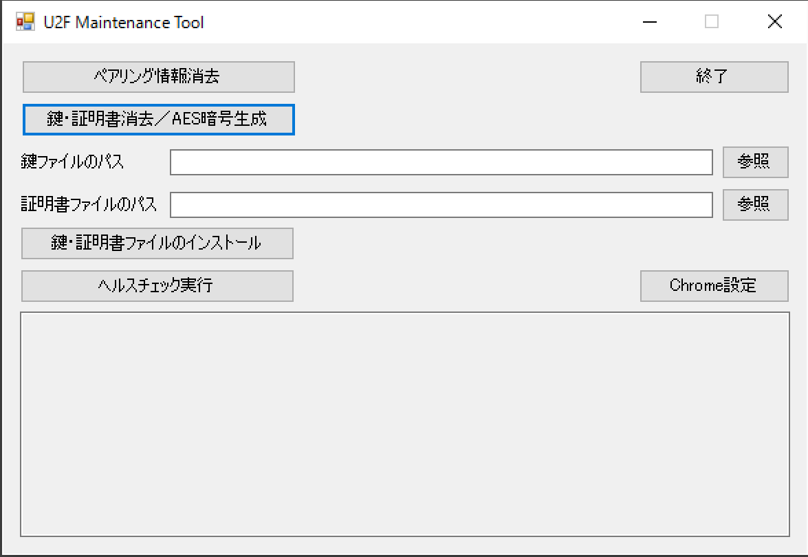

One Card側の処理が成功すると「鍵・証明書削除処理が成功しました。」と表示されます。

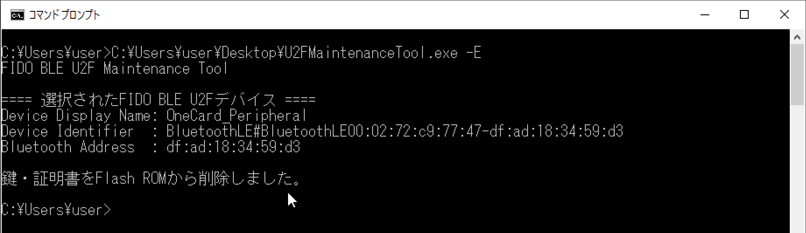

続いて、秘密鍵ファイル(.pem)、証明書ファイル(.crt)をそれぞれ「参照」ボタンをクリックして選択します。

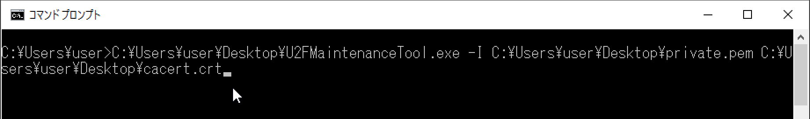

U2F管理ツール画面の「鍵・証明書ファイルのインストール」ボタンをクリックします。

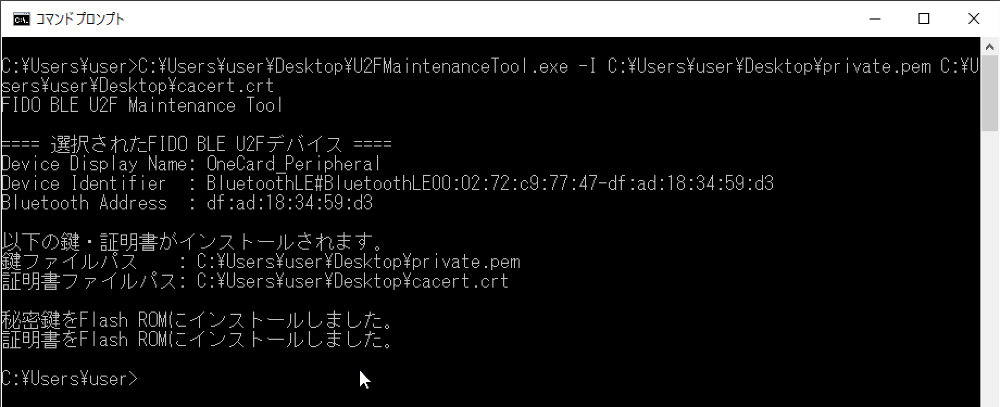

One Card側の処理が成功すると「鍵・証明書インストール処理が成功しました。」と表示されます。

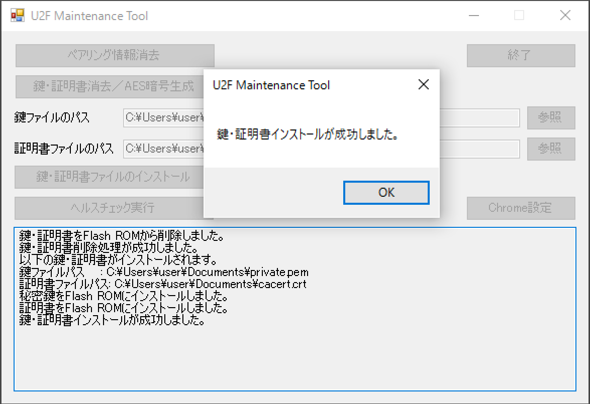

これで、鍵・証明書のインストールは完了です。

## U2F管理ツールによる動作確認（ヘルスチェック）

One Cardにインストールされた秘密鍵と署名済み証明書を使用し、U2F管理ツールを使用して動作確認（ヘルスチェック）を実行することができます。

### macOS環境の場合

U2F管理ツール（U2FMaintenanceTool.app）を起動します。 
表示された画面の「ヘルスチェック実行」ボタンをクリックします。

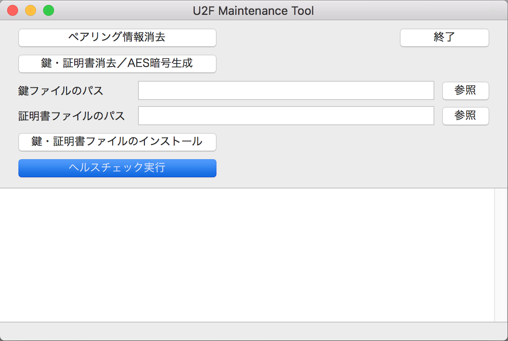

One Card側で処理が進み、ほどなくOne Card上の３番目のLEDが<b>点灯</b>します。 
（ユーザー所在確認を求めるため、One Card側の処理が一時的に中断されます）

ここでMAIN SWを１回押しますと、再びOne Card側の処理が再開されます。

One Card側の処理が成功すると「ヘルスチェックが成功しました。」と表示されます。

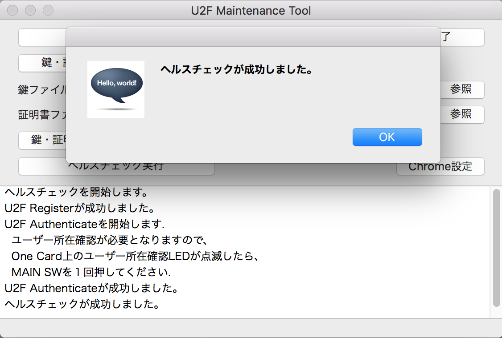

これでヘルスチェックは完了です。

### windows環境の場合

U2F管理ツール（U2FMaintenanceToolGUI.exe）を起動します。 
表示された画面の「ヘルスチェック実行」ボタンをクリックします。

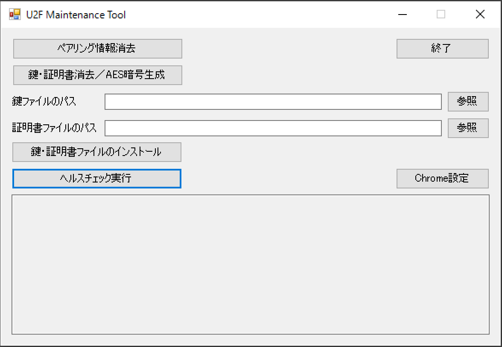

One Card側で処理が進み、ほどなくOne Card上の３番目のLEDが<b>点灯</b>します。 
（ユーザー所在確認を求めるため、One Card側の処理が一時的に中断されます）

ここでMAIN SWを１回押しますと、再びOne Card側の処理が再開されます。

One Card側の処理が成功すると「ヘルスチェックが成功しました。」と表示されます。

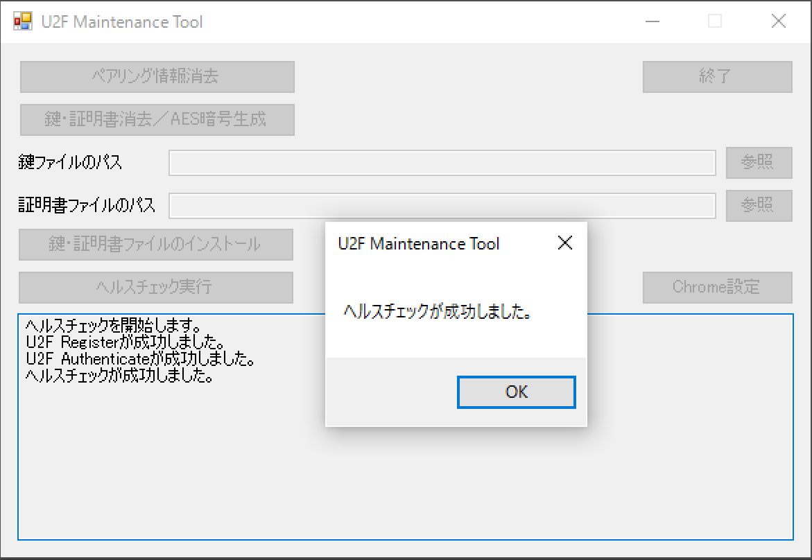

これでヘルスチェックは完了です。
