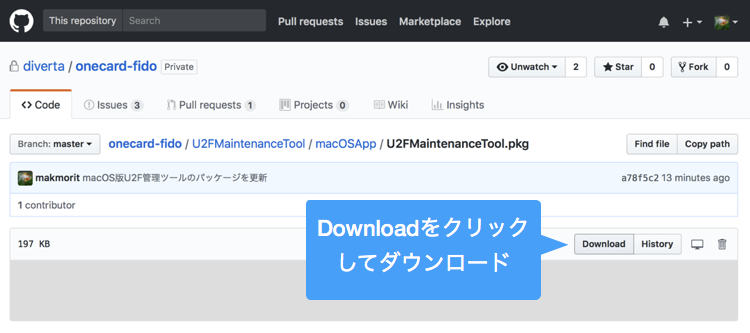
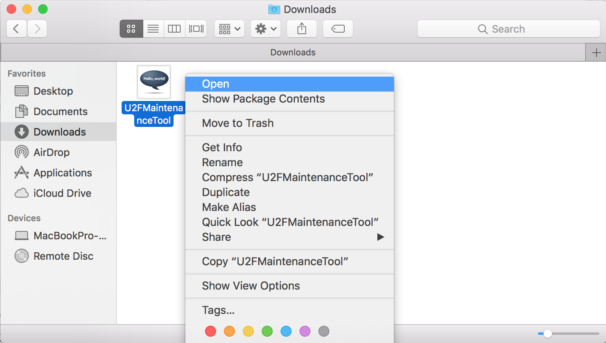
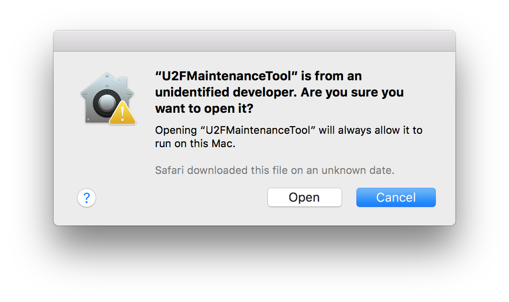
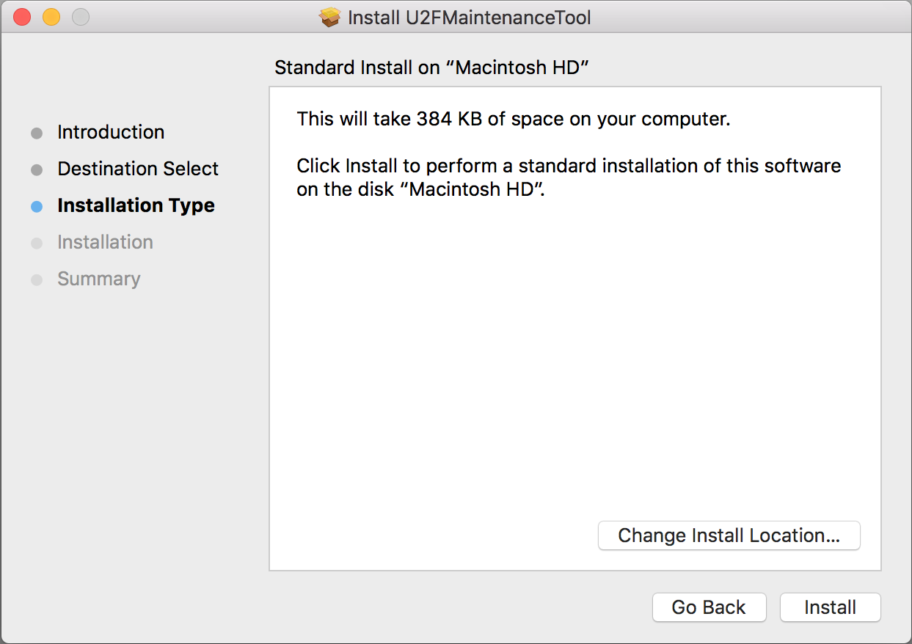
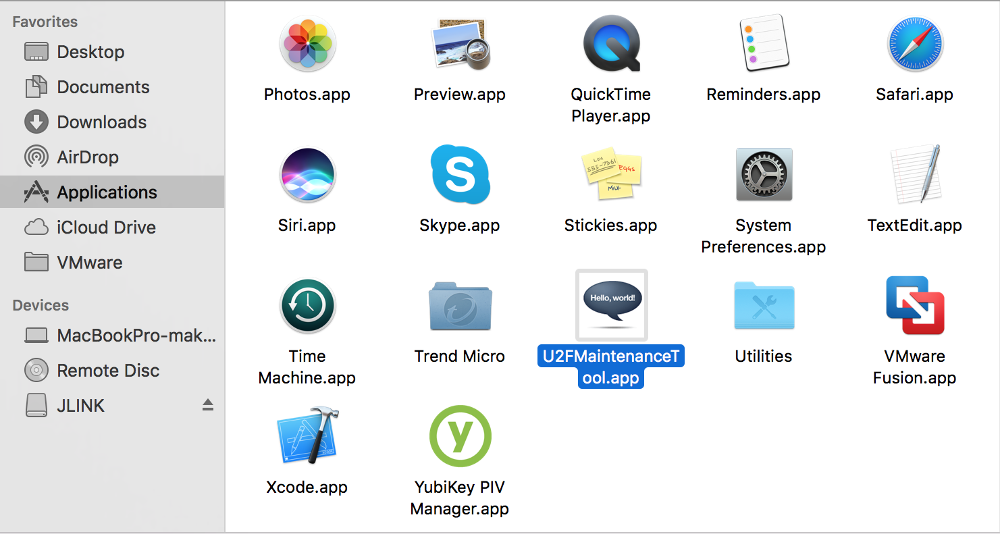
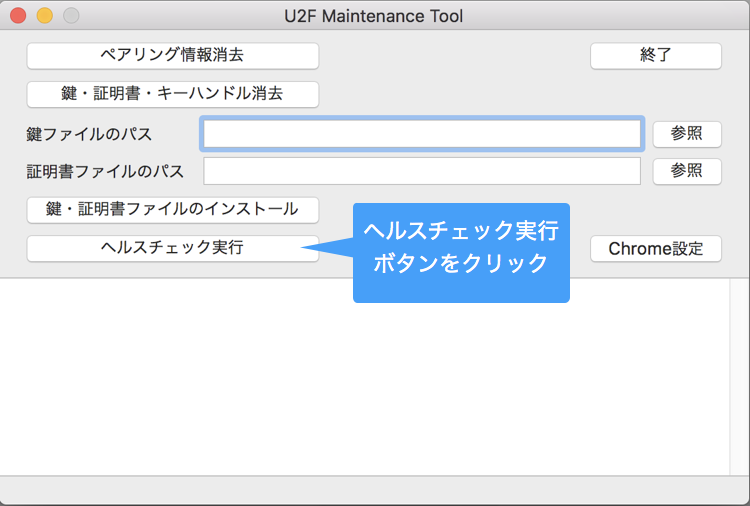
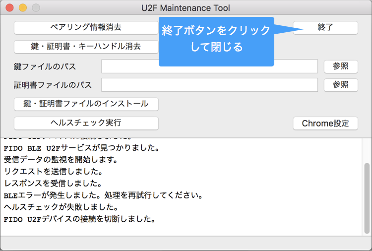

# One Cardペアリング手順

One CardおよびBLE U2Fサービスを使用するためには、ペアリングが必要となります。

ペアリングを行うためには、One Cardをペアリングモードに変更します。

## 非ペアリングモード--->ペアリングモードへの変更

One Cardに電源を投入すると、非ペアリングモードで起動しますが、これではペアリングを行うことができません。

ペアリングモードに変更させるためには、One CardのMAIN SWを５秒間押し続けます。

One Card上の２番目のLEDが<b>点灯</b>したら、指をMAIN SWから離します。

これでペアリングモードに変更されました。

## ペアリングの実施

### Windowsの場合

スタートメニューから設定を実行し、デバイスをクリックします。

Bluetoothをクリックします。 OneCard_Peripheralが表示されますので、「ペアリング」をクリックします。

しばらくすると「ペアリングの準備完了」の表示が「接続済み」に変わります。

これで、Windowsとのペアリングは完了です。

### macOSの場合

[U2F管理ツール](../U2FMaintenanceTool/macOSApp/U2FMaintenanceTool.pkg)をGitHubからダウンロード／解凍します。 

ダウンロードされたファイルを右クリックし「開く」を実行してください。 
（アイコンをダブルクリックしても、実行することができないための措置になります）

警告画面が表示されますが、続いて「開く」を実行します。

インストーラーが起動しますので、指示に従いインストールを進めます。

インストールが完了すると、アプリケーションフォルダーに、U2F管理ツールのアイコンができます。 
アイコンをダブルクリックして実行します。

U2F管理ツールが起動しますので、画面上の「ヘルスチェック実行」ボタンをクリックします。

後述<b>「鍵・証明書のインストール」</b>が行われていないため、下図のようなダイアログが表示されます。 
ただし異常ではないので、OKボタンを押してダイアログを閉じます。

その後「終了」ボタンをクリックして、U2F管理画面を終了させます。

macOSの設定画面からBluetooth設定を参照すると、下図のように、ペアリングが自動的に行われていることが確認できます。

これで、macOSとのペアリングは完了です。

## ペアリングモード--->非ペアリングモードへの変更

ペアリングモードから、非ペアリングモードに変更させるためには、One CardのMAIN SWを５秒間押し続けます。

One Card上の２番目のLEDが<b>消灯</b>したら、指をMAIN SWから離します。

これで非ペアリングモードに変更されました。

【ご参考】 
One Cardは、電源Off状態から電源投入時は、常に非ペアリングモードで起動します。
