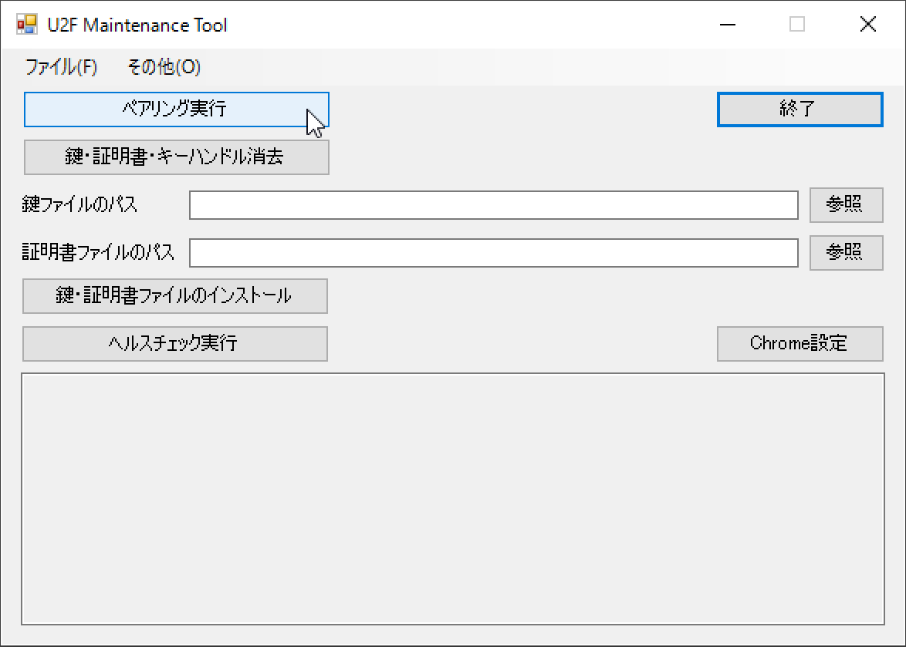
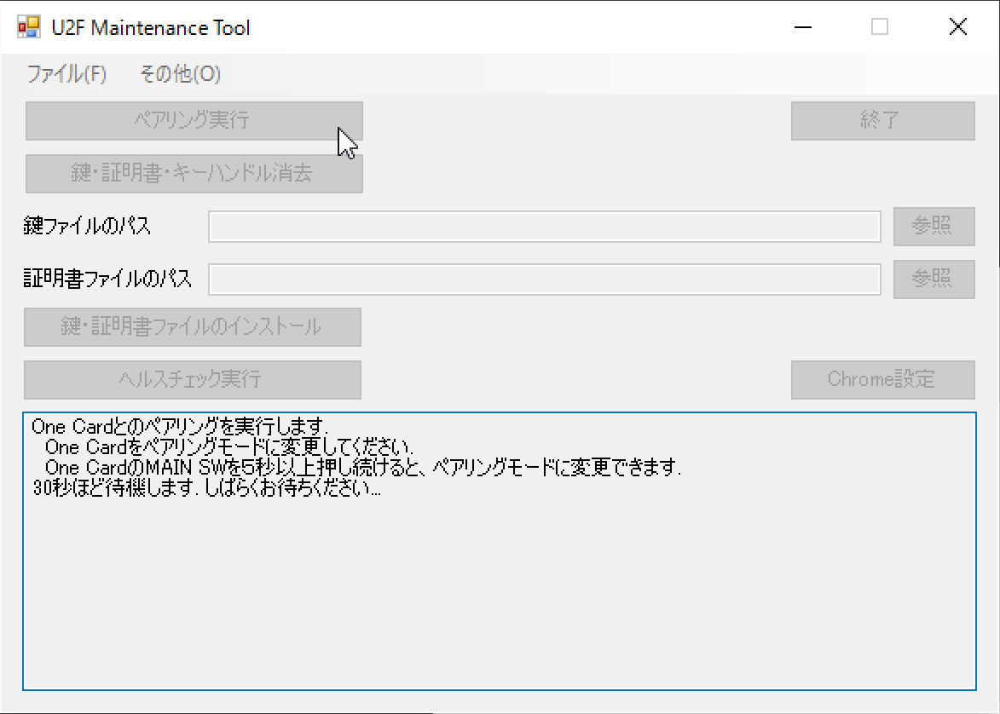
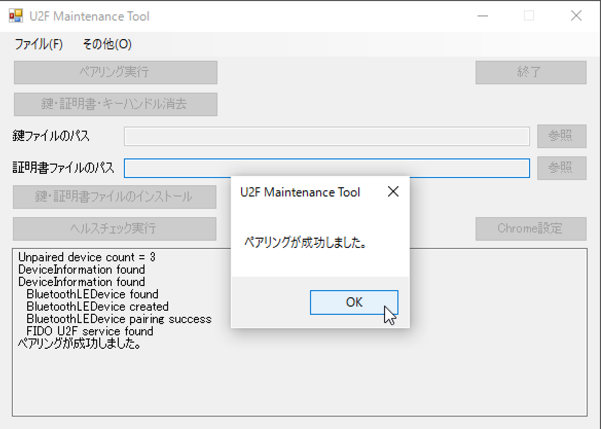
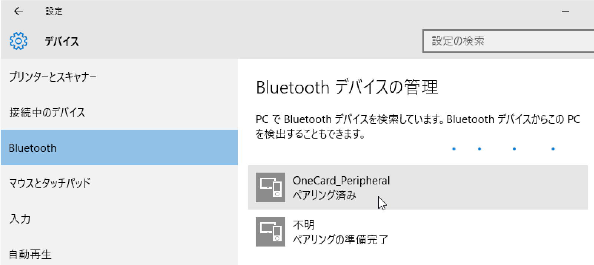
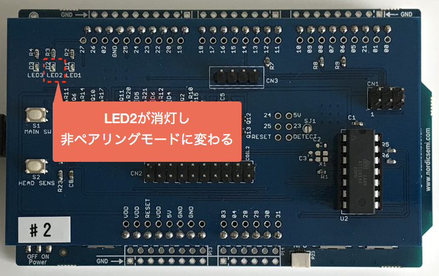
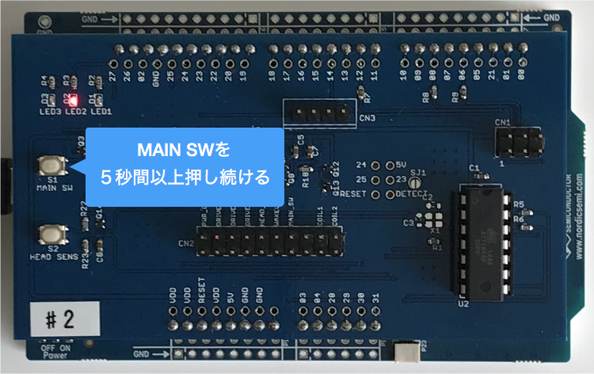

# One Cardペアリング手順

One CardおよびBLE U2Fサービスを使用するためには、ペアリングが必要となります。

ペアリングを行うためには、One Cardをペアリングモードに変更します。

## 非ペアリングモード--->ペアリングモードへの変更

One Cardに電源を投入すると、非ペアリングモードで起動しますが、これではペアリングを行うことができません。

ペアリングモードに変更させるためには、One CardのMAIN SWを５秒間押し続けます。

One Card上の２番目のLEDが<b>点灯</b>したら、指をMAIN SWから離します。

これでペアリングモードに変更されました。

## ペアリングの実施

### Windowsの場合

U2F管理ツールの「ペアリング実行」ボタンをクリックします。

約30秒ほど、ペアリング先の探索処理のため画面がクリックできない状態となります。

ペアリングが成功すると、ポップアップ画面が表示されます。

Windowsの設定画面からBluetooth設定を参照すると、下図のように「OneCard_Peripheral」がペアリング済みであることが確認できます。

これで、Windowsとのペアリングは完了です。

### macOSの場合

U2F管理ツールの「ペアリング実行」ボタンをクリックします。

約30秒ほど、ペアリング先の探索処理のため画面がクリックできない状態となります。

ペアリングが成功すると、ポップアップ画面が表示されます。

macOSの設定画面からBluetooth設定を参照すると、下図のように「OneCard_Peripheral」がペアリング済みであることが確認できます。

これで、macOSとのペアリングは完了です。

### ご参考
ペアリングが正常完了すると、One Cardは自動的に非ペアリングモードに移行します。 
非ペアリングモードに移行すると、One Card上の２番目のLEDが消灯します。

## ペアリングモード--->非ペアリングモードへの変更

ペアリングモードから、非ペアリングモードに変更させるためには、One CardのMAIN SWを５秒間押し続けます。

One Card上の２番目のLEDが<b>消灯</b>したら、指をMAIN SWから離します。

これで非ペアリングモードに変更されました。

### ご参考
One Cardは、電源Off状態から電源投入時は、常に非ペアリングモードで起動します。
