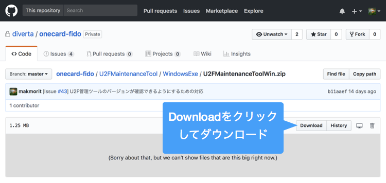

# U2F管理ツールインストール手順

One CardのFIDO機能を利用するために必要となる、[U2F管理ツール](../U2FMaintenanceTool/)のインストール手順を掲載いたします。

## macOS版U2F管理ツールのインストール

[U2F管理ツール](../U2FMaintenanceTool/macOSApp/U2FMaintenanceTool.pkg)を、GitHubからダウンロード／解凍します。 

ダウンロードされたファイルを右クリックし「開く」を実行してください。 
（2018/05/02現在、アプリに署名がされていないので、アイコンをダブルクリックしても実行することができないための措置になります）

警告画面が表示されますが、続いて「開く」を実行します。

インストーラーが起動しますので、指示に従いインストールを進めます。

インストールが完了すると、アプリケーションフォルダーに、U2F管理ツールのアイコンができます。 
アイコンをダブルクリックして実行します。

U2F管理ツールの画面が起動すれば、インストールは完了です。

## Windows版U2F管理ツールのインストール

[U2FMaintenanceToolWin.zip](../U2FMaintenanceTool/WindowsExe/U2FMaintenanceToolWin.zip) を、GitHubからダウンロードして取得します。

U2FMaintenanceToolWin.zipを展開すると、下図のように「U2FMaintenanceToolWin」というフォルダーができるので、任意の場所に配置します。 
その後、フォルダー内の実行ファイル「U2FMaintenanceToolGUI.exe」をダブルクリックします。

2018/05/02現在、アプリに署名がされていないため、ダウンロードしたプログラムを実行できない旨のダイアログが表示されます。 
「詳細情報」をクリックして、実行ボタンを表示させます。

表示された実行ボタンをクリックして、U2F管理ツールを実行させます。

U2F管理ツールの画面が起動すれば、インストールは完了です。
