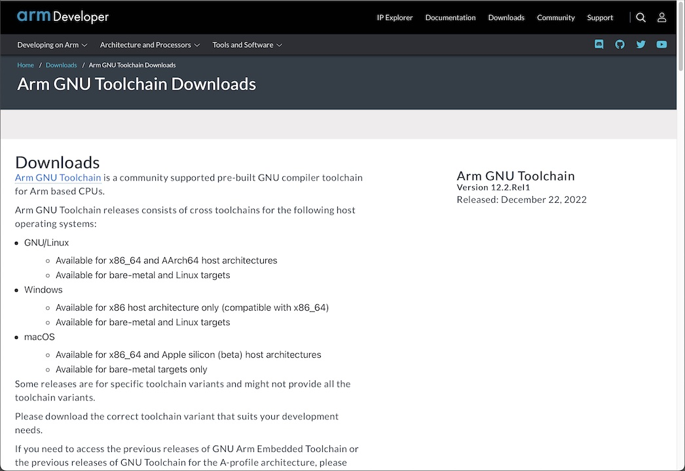
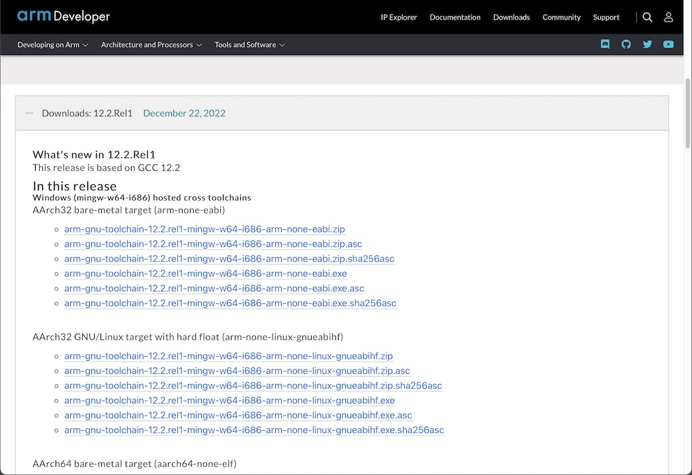
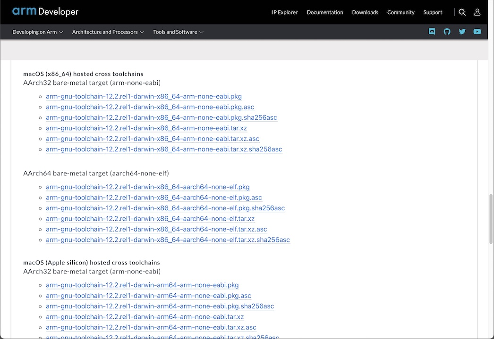

# ARM GCCインストール手順

ARM GCCツールチェインをmacOS環境にインストールする手順を記載します。

最終更新日：2020/06/24

## インストール用媒体の取得

こちらのサイトにアクセスします。<br>
https://developer.arm.com/tools-and-software/open-source-software/developer-tools/gnu-toolchain/gnu-rm/downloads<br>
下図のような画面に遷移します。



少し下にスクロールし「GNU Arm Embedded Toolchain: 9-2020-q2-update」のリンクを開きます。<br>
インストール用媒体（ファイル）のリストが表示されます。



下にスクロールすると、macOS用のインストール媒体がリストされています。<br>
クリックすると、ダウンロードが開始されます。



ダウンロードされたファイル「`gcc-arm-none-eabi-9-2020-q2-update-mac.tar.bz2`」を使用し、次章以降で配置作業を進めます。


## ARM GCCツールチェインの配置

ARM GCCツールチェインを、任意のフォルダーに配置します。<br>
以下は `${HOME}/opt` というディレクトリー配下に配置する例になります。

ターミナルを開き、以下のコマンドを実行します。

```
cd ${HOME}/opt
tar xjvf ${HOME}/Downloads/gcc-arm-none-eabi-9-2020-q2-update-mac.tar.bz2
```

以下は実行例になります。

```
bash-3.2$ cd ${HOME}/opt
bash-3.2$ tar xjvf /Users/makmorit/Documents/FIDO/Softwares/gcc-arm-none-eabi-9-2020-q2-update-mac.tar.bz2
x gcc-arm-none-eabi-9-2020-q2-update/arm-none-eabi/
x gcc-arm-none-eabi-9-2020-q2-update/arm-none-eabi/bin/
x gcc-arm-none-eabi-9-2020-q2-update/arm-none-eabi/bin/objdump
：
x gcc-arm-none-eabi-9-2020-q2-update/share/gcc-arm-none-eabi/samples/src/fpin/Makefile
x gcc-arm-none-eabi-9-2020-q2-update/share/gcc-arm-none-eabi/samples/src/fpin/fpin.c
x gcc-arm-none-eabi-9-2020-q2-update/share/gcc-arm-none-eabi/samples/src/makefile.conf
bash-3.2$
```

以上で、ARM GCCツールチェインのインストールは完了となります。
