# NetBeansインストール手順

NetBeansとARM GCC、nRF5 SDKを使用し、nRF52840の開発環境を構築する手順を記載します。

## 前提ソフトウェアのインストール

まず最初に、ARM GCCツールチェイン、nRF5 SDKをインストールします。 
以下の手順書をご参照願います。

- <b>[ARM GCCインストール手順](ARMGCCINST.md)</b>
- <b>[nRF5 SDKインストール手順](NR5SDKINST.md)</b>

## インストール用媒体の取得

### NetBeans

こちらのサイトにアクセスします。 
https://netbeans.org/downloads/8.2/ 
下図のような画面に遷移します。

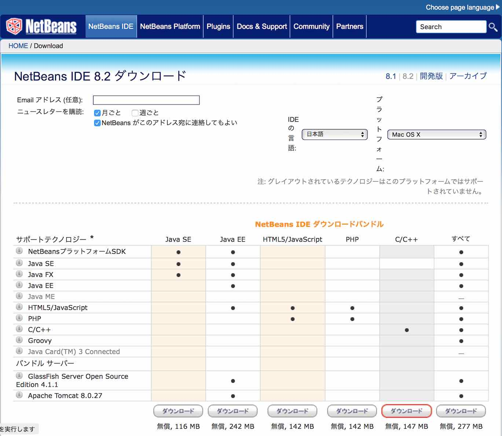

「NetBeans IDE ダウンロードバンドル」の「C/C++」をダウンロードします。 
「netbeans-8.2-cpp-macosx.dmg」というファイルがダウンロードされます。

### nRFコマンドラインツール

こちらのサイトにアクセスします。 
https://www.nordicsemi.com/Software-and-Tools/Development-Tools/nRF5-Command-Line-Tools/Download 
下図のような画面に遷移します。

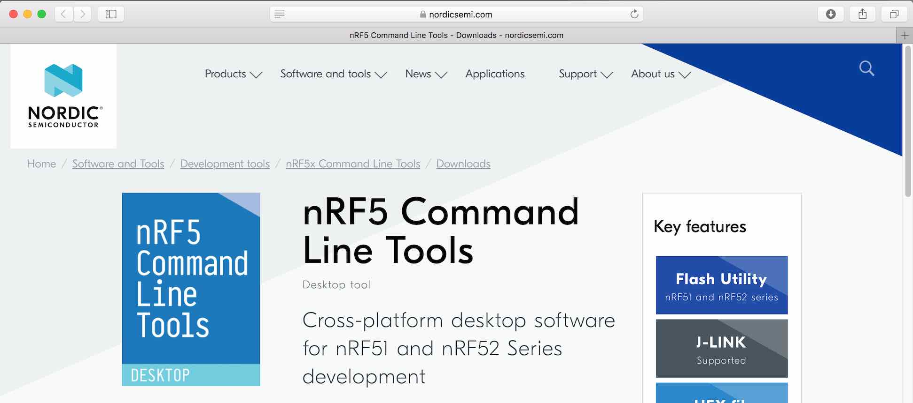

サイト中段のラジオボタン「9.8.1 macOS」をチェックします。 
その後、右上にある「Download file」をクリックし、ダウンロードを開始させます。

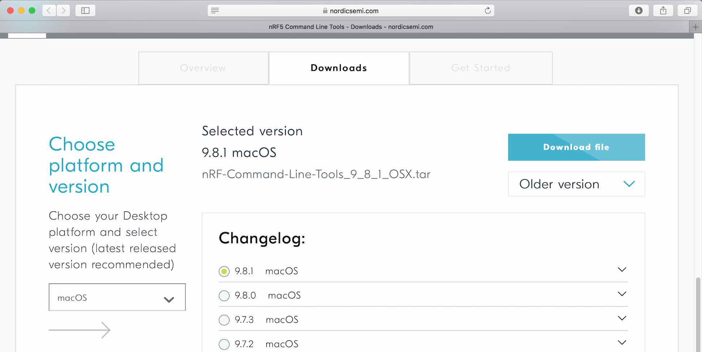

「nRF-Command-Line-Tools_9_8_1_OSX.tar」という名前のファイルがダウンロードされます。

### SEGGER J-Link

こちらのサイトにアクセスします。 
https://www.segger.com/downloads/jlink 
下図のような画面に遷移します。

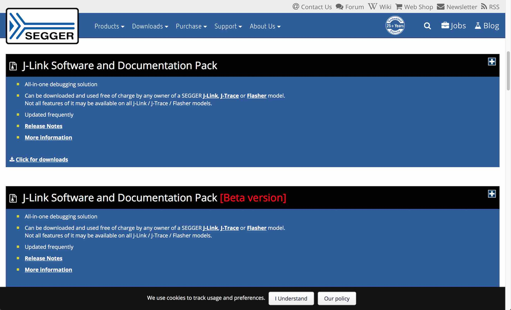

「J-Link Software and Documentation Pack」をクリックすると下図の画面のようになります。

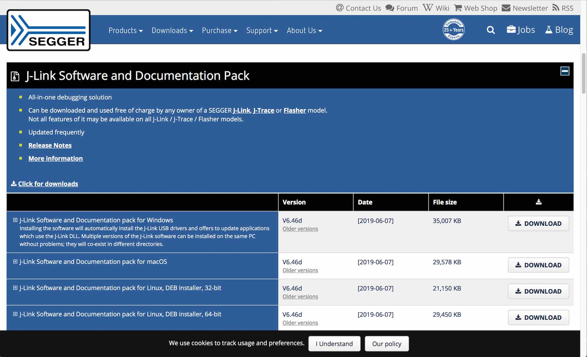

一覧の上から２番目「J-Link Software and Documentation pack for macOS」の、DOWNLOADボタンをクリックし、ツールをダウンロードします。 
「JLink_MacOSX_V646d.pkg」というファイルがダウンロードされます。

## ソフトウェアのインストール

### NetBeansのインストール

ダウンロードした「netbeans-8.2-cpp-macosx.dmg」をダブルクリックすると、インストーラーが起動しますので、画面の指示に従い操作を進めます。

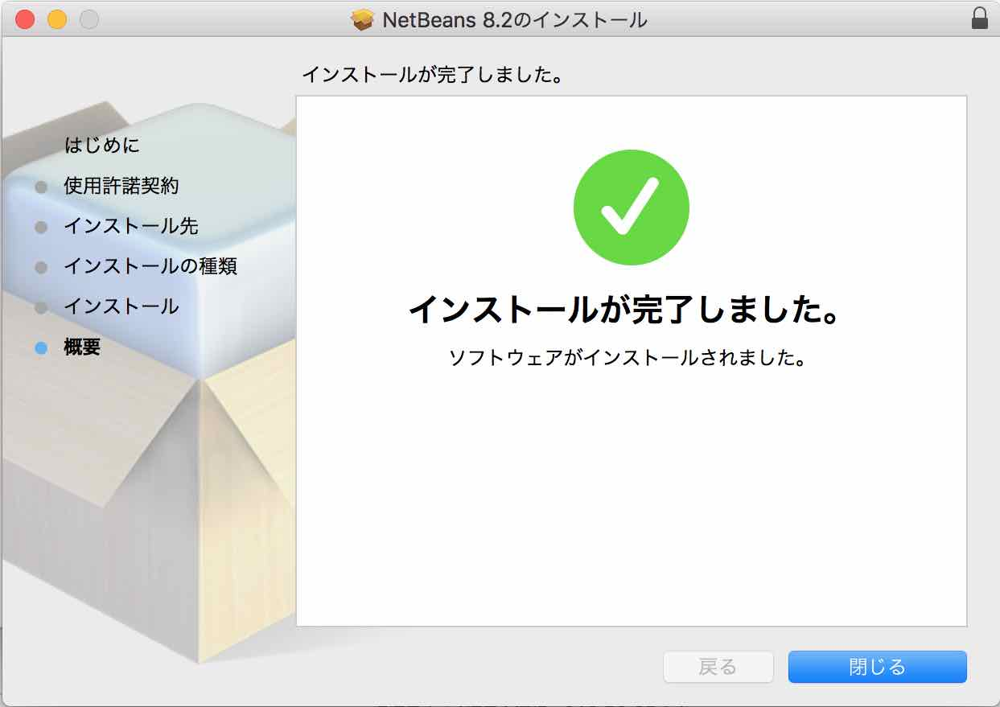

アプリケーションフォルダーに「NetBeans」というサブフォルダーが出来ていればインストールは完了です。

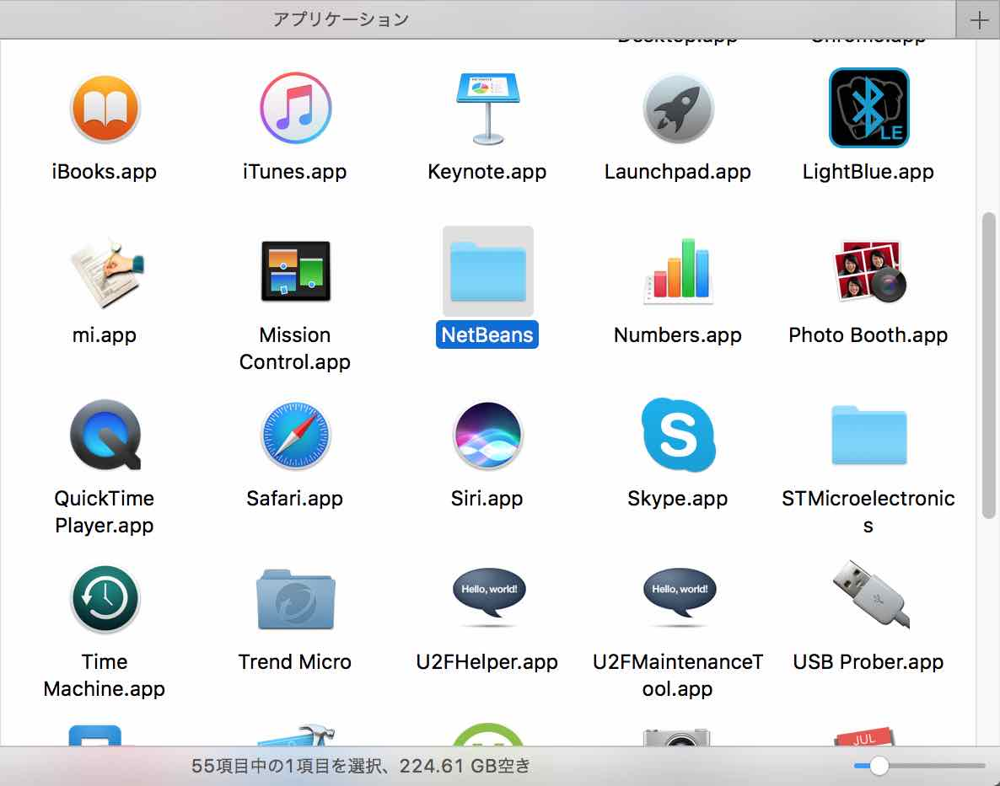

### SEGGER J-Linkのインストール

ダウンロードした「JLink_MacOSX_V646d.pkg」をダブルクリックすると、インストーラーが起動しますので、画面の指示に従い操作を進めます。

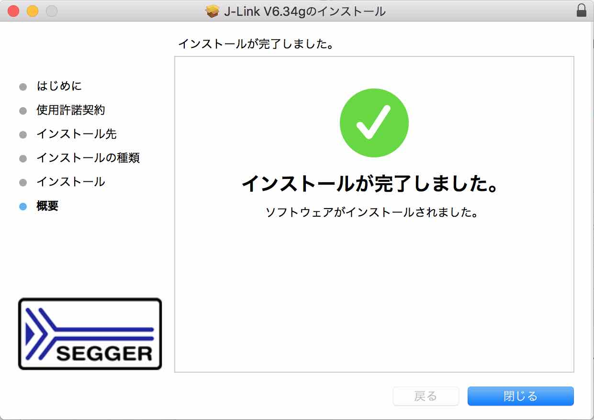

アプリケーションフォルダーに「SEGGER」というサブフォルダーが出来ていればインストールは完了です。

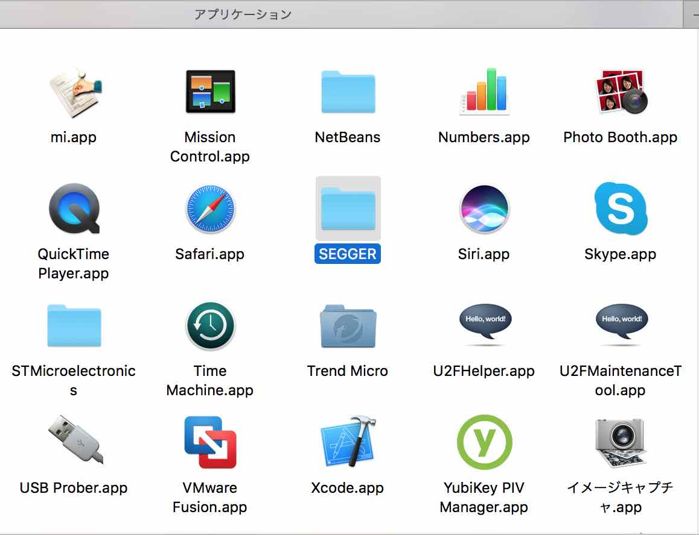

### NetBeansの設定変更

NetBeansを起動し、Preferencesを実行します。

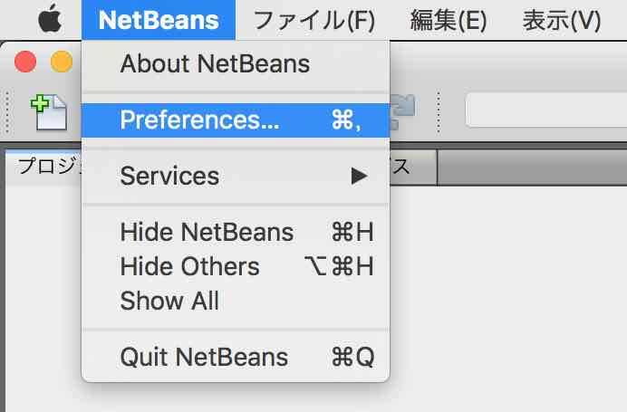

オプション画面が開きますので「C/C++」の「ビルド・ツール」タブを開きます。 
画面左側の「ツール・コレクション(C)」下部の「追加」ボタンをクリックします。

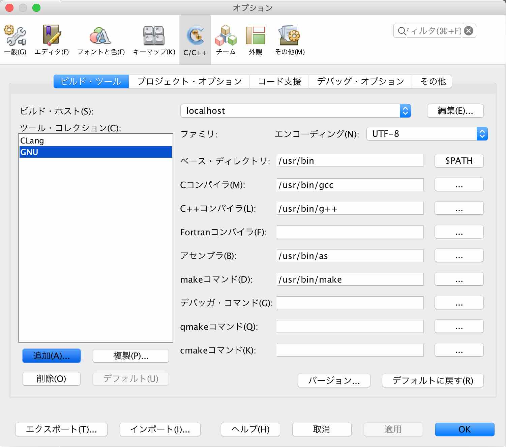

下図のようなポップアップが表示されるので、以下のように設定します。

- ベース・ディレクトリ - ARM GCCツールチェインのルートディレクトリーを選択
- ツール・コレクション・ファミリ - GNU Mac を選択
- ツール・コレクション名 - GNU_ARM と入力

選択／入力が完了したら「OK」をクリックします。

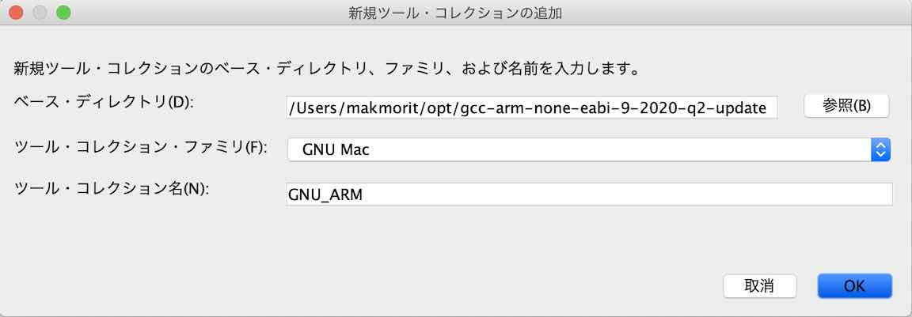

オプション画面に戻ったら、画面右上部の「$PATH」というボタンをクリックします。

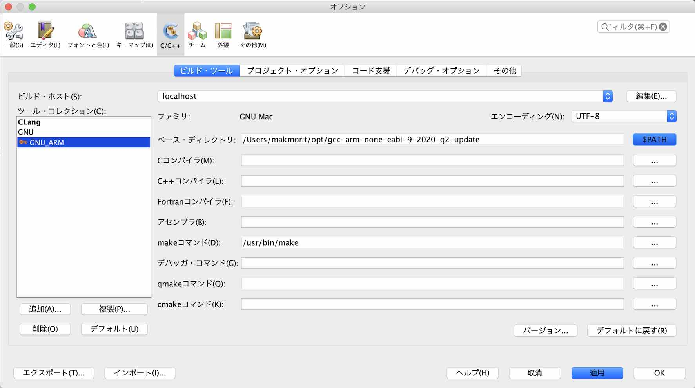

「実行コマンド・パスの変更」欄に`nrfjprog`（nRF5xコマンドライン・ツールのひとつ）のパスを追加します。 
下記例では「`;${HOME}/opt/nRF-Command-Line-Tools_10_9_0_OSX/nrfjprog`」という文字列を追加しています。

入力が完了したら「OK」をクリックします。

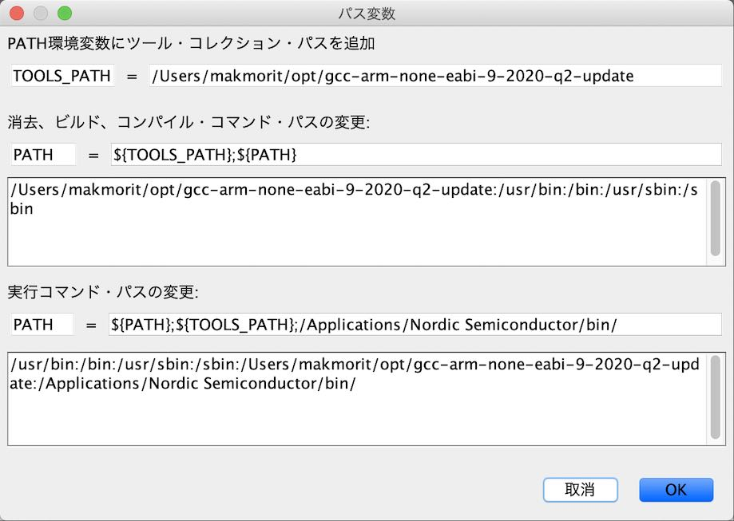

オプション画面に戻ったら、下図のように残りの項目を次々と設定します。

- Cコンパイラ - arm-none-eabi-gcc
- C++コンパイラ - arm-none-eabi-g++
- アセンブラ - arm-none-eabi-as

設定が完了したら「適用」をクリックします。

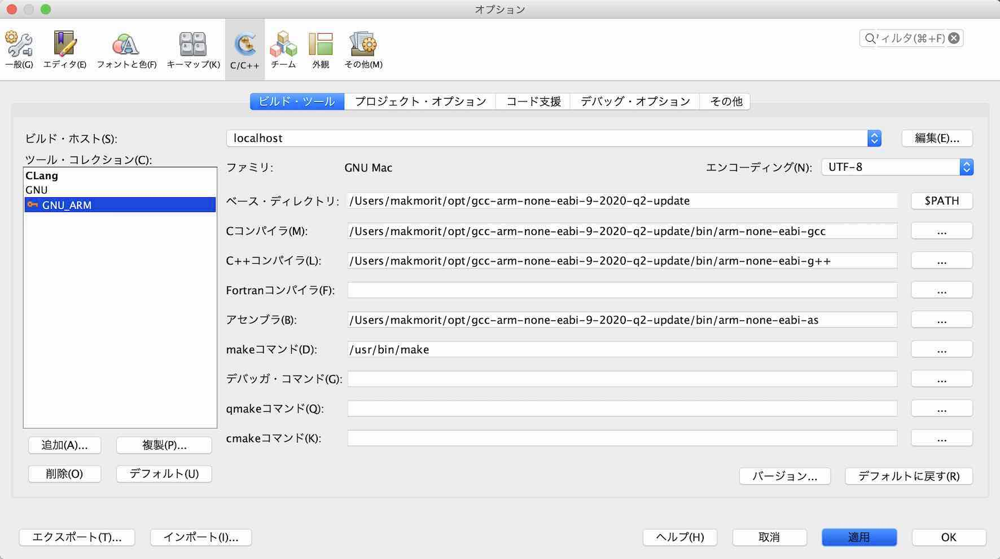

続いて、再び「GNU_ARM」を選択の上、設定内容が適用されていることを確認後「OK」ボタンをクリックします。

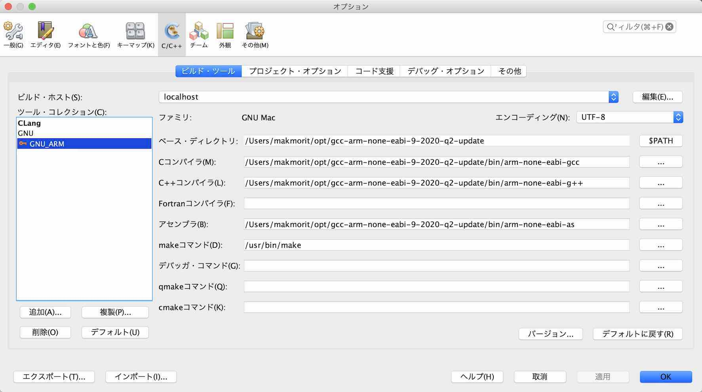

以上で、NetBeansとその稼働に必要なソフトウェアのインストールは完了となります。
