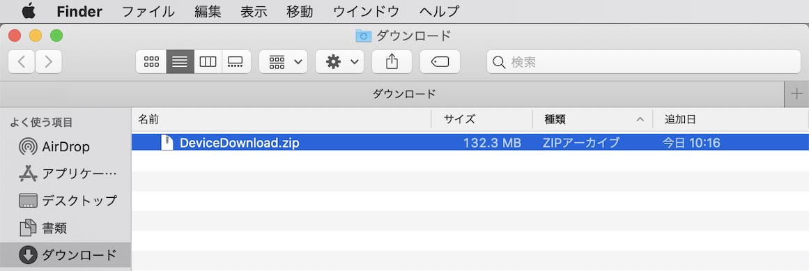
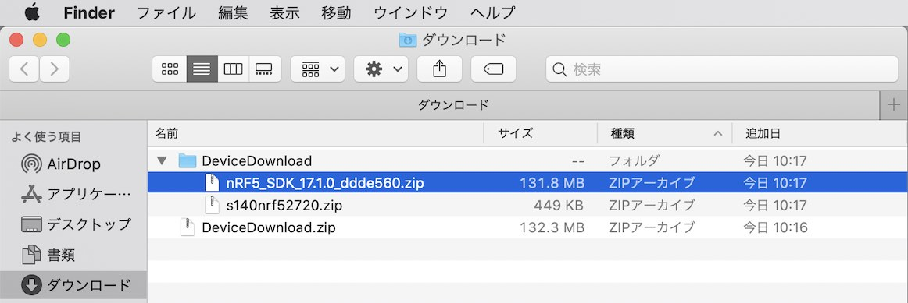

# nRF5 SDKインストール手順

最新のnRF5 SDKをmacOS環境にインストールする手順を記載します。

最終更新日：2021/01/11

## インストール用媒体の取得

こちらのサイトにアクセスします。<br>
https://www.nordicsemi.com/Software-and-Tools/Software/nRF5-SDK/Download

下図のような画面に遷移しますので、右側の「Downloads」ボタンをクリックします。


サイト中段のラジオボタン「17.0.2 nRF5 SDK」をチェックします。


ソフトデバイスの欄までスクロールダウンし「SoftDevice S140」以外のチェックをすべて外します。


サイト下段のボタン「Download files (.zip)」をクリックし、ダウンロードを開始させます。


「`DeviceDownload.zip`」という名前のファイルがダウンロードされます。<br>
このファイルをダブルクリックして解凍します。



「`nRF5SDK1702d674dde.zip`」というファイルが、nRF5 SDKの本体になります。<br>
（正式なフルパス名称は`${HOME}/Downloads/DeviceDownload/nRF5SDK1702d674dde.zip`となるかと存じます）

こちらを使用し、次章以降で配置作業を進めます。



## nRF5 SDKの配置

nRF5 SDKを任意のフォルダーに配置します。<br>
以下は `${HOME}/opt` というディレクトリー配下に配置する例になります。

ターミナルを開き、以下のコマンドを実行します。

```
cd ${HOME}/opt
tar xjvf ${HOME}/Downloads/DeviceDownload/nRF5SDK1702d674dde.zip
mv nRF5_SDK_17.0.2_d674dde nRF5_SDK_17.0.2
```

以下は実行例になります。

```
bash-3.2$ cd ${HOME}/opt
bash-3.2$ tar xjvf ${HOME}/Downloads/DeviceDownload/nRF5SDK1702d674dde.zip
x nRF5_SDK_17.0.2_d674dde/
x nRF5_SDK_17.0.2_d674dde/components/
x nRF5_SDK_17.0.2_d674dde/components/802_15_4/
：
x nRF5_SDK_17.0.2_d674dde/modules/nrfx/templates/nRF9160/nrfx_config.h
x nRF5_SDK_17.0.2_d674dde/modules/nrfx/templates/nrfx_glue.h
x nRF5_SDK_17.0.2_d674dde/modules/nrfx/templates/nrfx_log.h
bash-3.2$ mv nRF5_SDK_17.0.2_d674dde nRF5_SDK_17.0.2
bash-3.2$
```

## nRF5 SDKの設定変更

以下の作業では、ARM GCCツールチェインが、あらかじめ`${HOME}/opt/gcc-arm-none-eabi-9-2020-q2-update`というフォルダーに導入されている前提とします。<br>
（ARM GCCツールチェインのインストールにつきましては、[別途手順書](ARMGCCINST.md)ご参照）

#### ツールチェインのバージョン確認

ターミナルを開き、以下のコマンドを実行してツールチェインのバージョンを確認します。

```
cd ${HOME}/opt/gcc-arm-none-eabi-9-2020-q2-update/bin/
./arm-none-eabi-gcc --version
```

下記は実行例になります。<br>
バージョンは「`9.3.1`」であることが確認できます。

```
bash-3.2$ cd ${HOME}/opt/gcc-arm-none-eabi-9-2020-q2-update/bin/
bash-3.2$ ./arm-none-eabi-gcc --version
arm-none-eabi-gcc (GNU Arm Embedded Toolchain 9-2020-q2-update) 9.3.1 20200408 (release)
Copyright (C) 2019 Free Software Foundation, Inc.
This is free software; see the source for copying conditions.  There is NO
warranty; not even for MERCHANTABILITY or FITNESS FOR A PARTICULAR PURPOSE.

bash-3.2$
```

#### nRF5 SDKのMakefileを変更

まず最初に、`${HOME}/opt/nRF5_SDK_17.0.2/components/toolchain/gcc` というディレクトリーにある「Makefile.posix」をバックアップします。<br>
以下のコマンドを実行します。

```
cd ${HOME}/opt/nRF5_SDK_17.0.2/components/toolchain/gcc
cp -pv Makefile.posix Makefile.posix.original
```

下記は実行例になります。
```
bash-3.2$ ls -al ${HOME}/opt/nRF5_SDK_17.0.2/components/toolchain/gcc
total 56
drwxrwxr-x@ 7 makmorit  staff    224  1 11 12:34 .
drwxrwxr-x@ 6 makmorit  staff    192  9 11 11:01 ..
-rw-r--r--@ 1 makmorit  staff  10084  9 11 09:42 Makefile.common
-rw-r--r--@ 1 makmorit  staff    123  9 11 09:42 Makefile.posix
：
bash-3.2$
bash-3.2$ cd ${HOME}/opt/nRF5_SDK_17.0.2/components/toolchain/gcc
bash-3.2$ cp -pv Makefile.posix Makefile.posix.original
Makefile.posix -> Makefile.posix.original
bash-3.2$
bash-3.2$ ls -al
total 64
drwxrwxr-x@ 8 makmorit  staff    256  1 11 12:39 .
drwxrwxr-x@ 6 makmorit  staff    192  9 11 11:01 ..
-rw-r--r--@ 1 makmorit  staff  10084  9 11 09:42 Makefile.common
-rw-r--r--@ 1 makmorit  staff    123  9 11 09:42 Makefile.posix
-rw-r--r--@ 1 makmorit  staff    123  9 11 09:42 Makefile.posix.original
：
bash-3.2$
```

その後「Makefile.posix」開いて、以下のように設定します。<br>
（下記は`${HOME}`が`/Users/makmorit`である例になります）

```
GNU_INSTALL_ROOT ?= /Users/makmorit/opt/gcc-arm-none-eabi-9-2020-q2-update/bin/
GNU_VERSION ?= 9.3.1
GNU_PREFIX ?= arm-none-eabi
```

ご参考：オリジナルとのdiff
```
bash-3.2$ cd ${HOME}/opt/nRF5_SDK_17.0.2/components/toolchain/gcc
bash-3.2$ diff Makefile.posix.original Makefile.posix
1,2c1,2
< GNU_INSTALL_ROOT ?= /usr/local/gcc-arm-none-eabi-7-2018-q2-update/bin/
< GNU_VERSION ?= 7.3.1
---
> GNU_INSTALL_ROOT ?= /Users/makmorit/opt/gcc-arm-none-eabi-9-2020-q2-update/bin/
> GNU_VERSION ?= 9.3.1
bash-3.2$
```

以上で、nRF5 SDKのインストールは完了となります。
