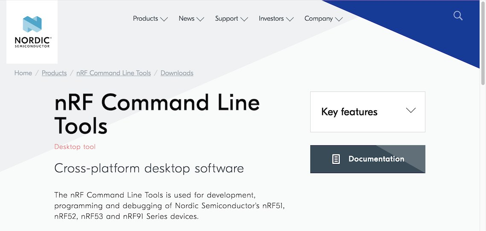
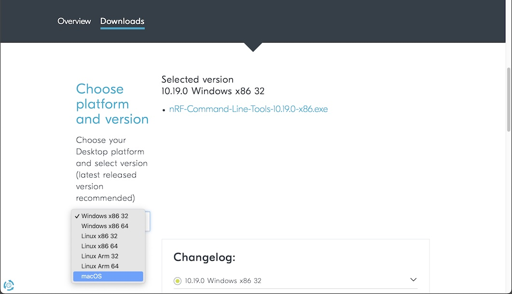
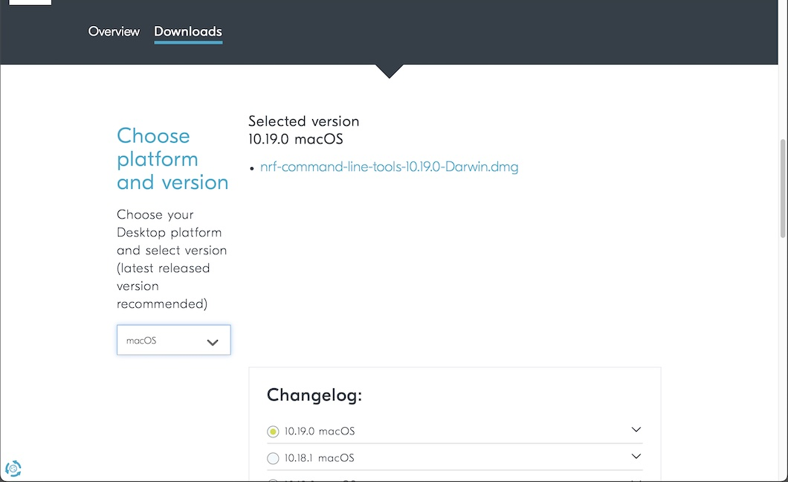
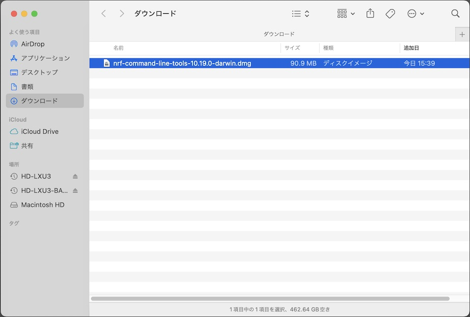
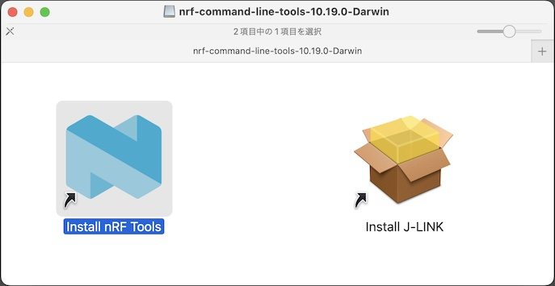
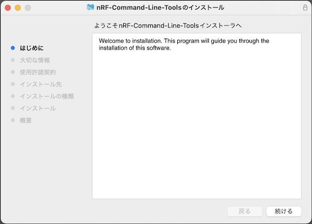
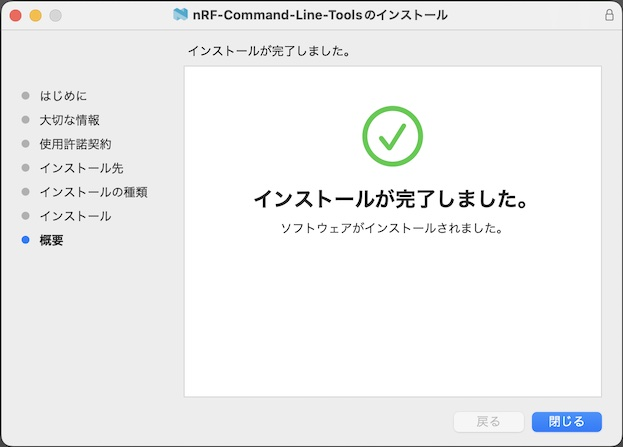
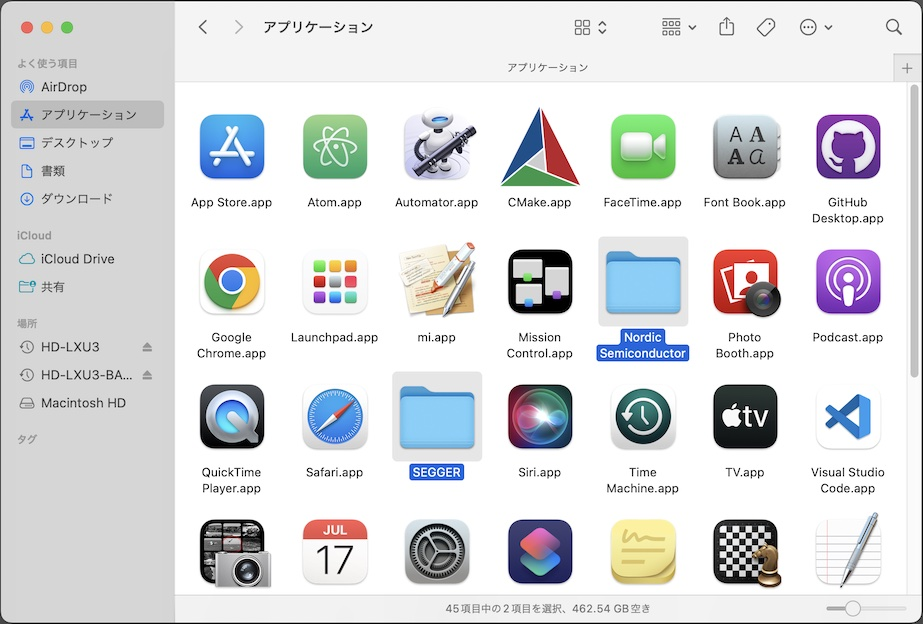

# nRF Command Line Toolsインストール手順

デスクトップツール「nRF Command Line Tools」を、macOS環境にインストールする手順について記載します。

最終更新日：2021/12/13

## インストール用媒体の取得

こちらのサイトにアクセスします。 
https://www.nordicsemi.com/Products/Development-tools/nrf-command-line-tools/download

下図のような画面に遷移します。

サイト中段のプルダウンリストから「macOS」を選択します。

右側に表示された「`nrf-command-line-tools-10.15.1-darwin.dmg`」のリンクをクリックし、ダウンロードを開始させます。

「`nrf-command-line-tools-10.15.1-darwin.dmg`」という名前のファイルがダウンロードされます。

## インストールの実行

ダウンロードフォルダーにある「`nrf-command-line-tools-10.15.1-darwin.dmg`」を右クリックして、パッケージフォルダーを開きます。

パッケージフォルダーが表示されます。 
青いアイコン「Install nRF Tools」をダブルクリックして、インストーラを開きます。

インストーラの指示に従い、インストール作業を進めます。

インストール作業が完了します。

アプリケーションフォルダーに「Nordic Semiconductor」というフォルダーが作成されていることを確認します。

以上で「nRF Command Line Tools」のインストールは完了となります。
