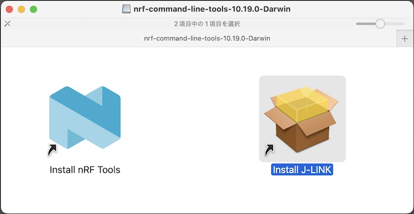
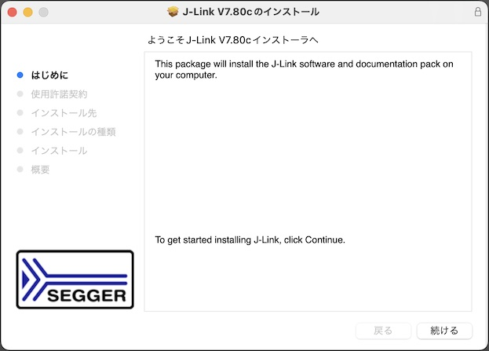
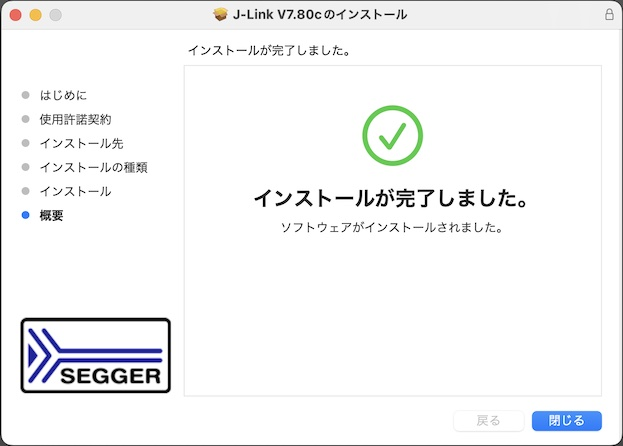

# nRF Command Line Toolsインストール手順

最終更新日：2023/02/14

デスクトップツール「nRF Command Line Tools」を、macOS環境にインストールする手順について記載します。

## 使用したシステム

PC: iMac (Retina 5K, 27-inch, 2019) 
OS: macOS 12.6.3

## インストール用媒体の取得

こちらのサイトにアクセスします。 
https://www.nordicsemi.com/Products/Development-tools/nrf-command-line-tools/download

下図のような画面に遷移します。

サイト中段のプルダウンリストから「macOS」を選択します。

右側に表示された「`nrf-command-line-tools-10.19.0-Darwin.dmg`」のリンクをクリックし、ダウンロードを開始させます。

「`nrf-command-line-tools-10.19.0-darwin.dmg`」という名前のファイルがダウンロードされます。

## インストールの実行

以下２点のソフトウェアを、必ずセットでインストールします。

- <b>nRF Tools</b> 
書込みツール`nrfjprog`を含むソフトウェアです。

- <b>J-Link</b> 
PCとUSB経由で接続中のnRF5340開発ボード（`PCA10095`）を接続するためのミドルウェアです。

### nRF Toolsのインストール

ダウンロードフォルダーにある「`nrf-command-line-tools-10.19.0-darwin.dmg`」を右クリックして、パッケージフォルダーを開きます。

パッケージフォルダーが表示されます。 
青いアイコン「Install nRF Tools」をダブルクリックして、インストーラを開きます。

インストーラの指示に従い、インストール作業を進めます。

インストール作業が完了します。

### J-Linkのインストール

次に、パッケージフォルダーの黄色いアイコン「Install J-LINK」をダブルクリックして、インストーラを開きます。

インストーラの指示に従い、インストール作業を進めます。

インストール作業が完了します。

最後に、アプリケーションフォルダーに「Nordic Semiconductor」「SEGGER」というフォルダーが作成されていることを確認します。

以上で「nRF Command Line Tools」のインストールは完了となります。
