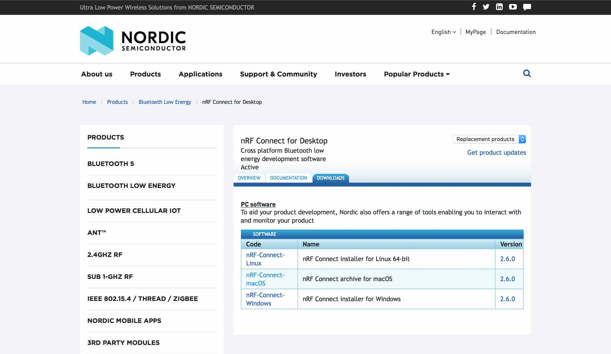
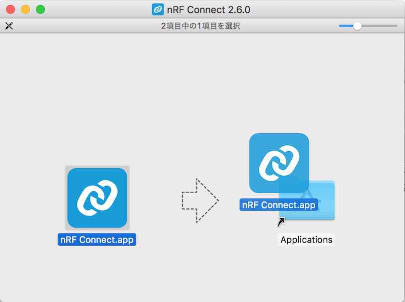
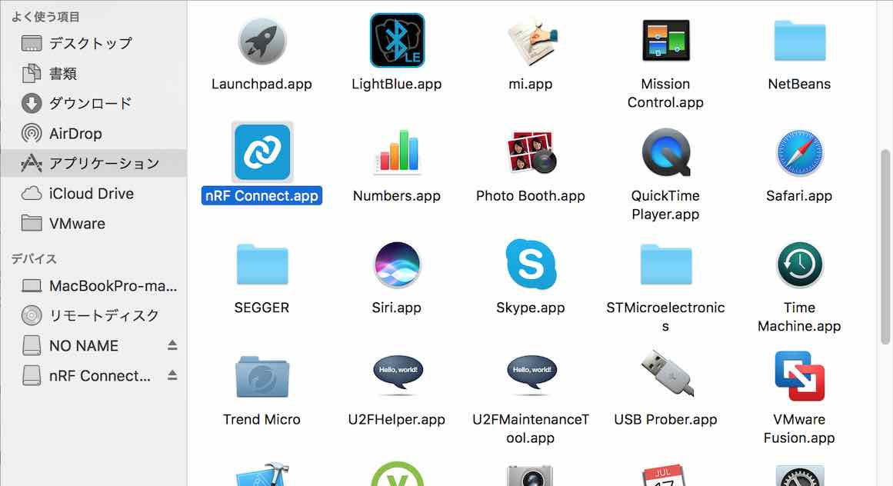
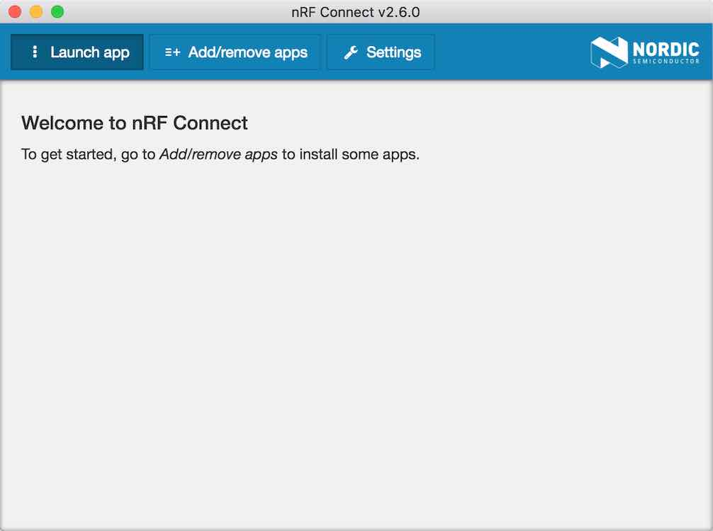
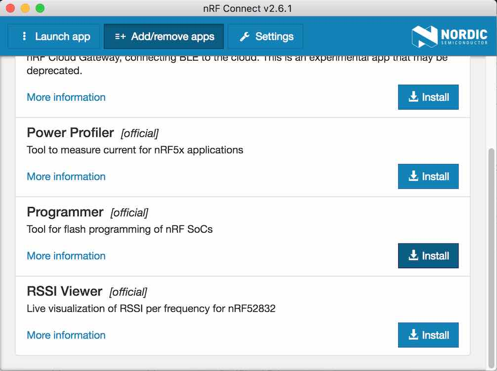
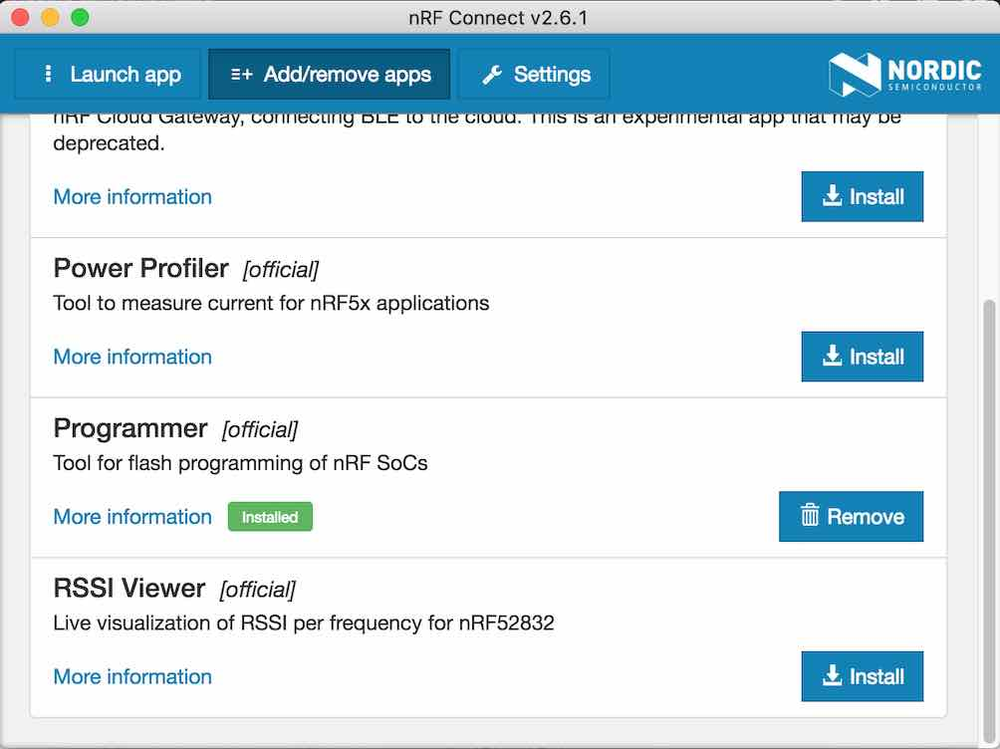

# nRF Connect for Desktop導入手順

Nordic社から無償公開されているツール「[nRF Connect for Desktop](https://www.nordicsemi.com/eng/Products/Bluetooth-low-energy/nRF-Connect-for-desktop/)」を導入する手順を記載します。

## ダウンロード

こちらのサイトにアクセスします。 
https://www.nordicsemi.com/eng/Products/Bluetooth-low-energy/nRF-Connect-for-desktop/ 
下図のような画面に遷移します。

使用システムに対応するインストール媒体をダウンロードします。

今回は検証のためmacOSを使用いたします。 
一覧の中から「nRF-Connect-macOS」をクリックしてダウンロードを実行すると「nrfconnect-2.6.0.dmg」というファイルがダウンロードされます。

## インストール

ダウンロードされた「nrfconnect-2.6.0.dmg」をダブルクリックしてインストールを実行します。 
下図のような画面が表示されたら、アプリケーションアイコンを「Applications」フォルダーにドラッグ＆ドロップします。

アプリケーションフォルダーに「nRF Connect」のアイコンができていれば、nRF Connect for Desktopのインストールは完了です。

## プログラミングツールのインストール

nRF Connectを起動したら、上の「Add/remove apps」ボタンをクリックします。

一覧の中の「Programmer [official]」をインストールします。

「Installed」という緑色のアイコンが表示されれば、プログラミングツールのインストールは完了です。

以上で、nRF Connect for Desktopの導入は完了です。
