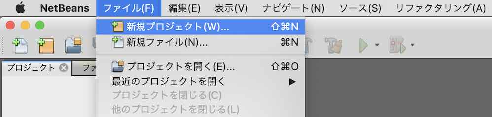
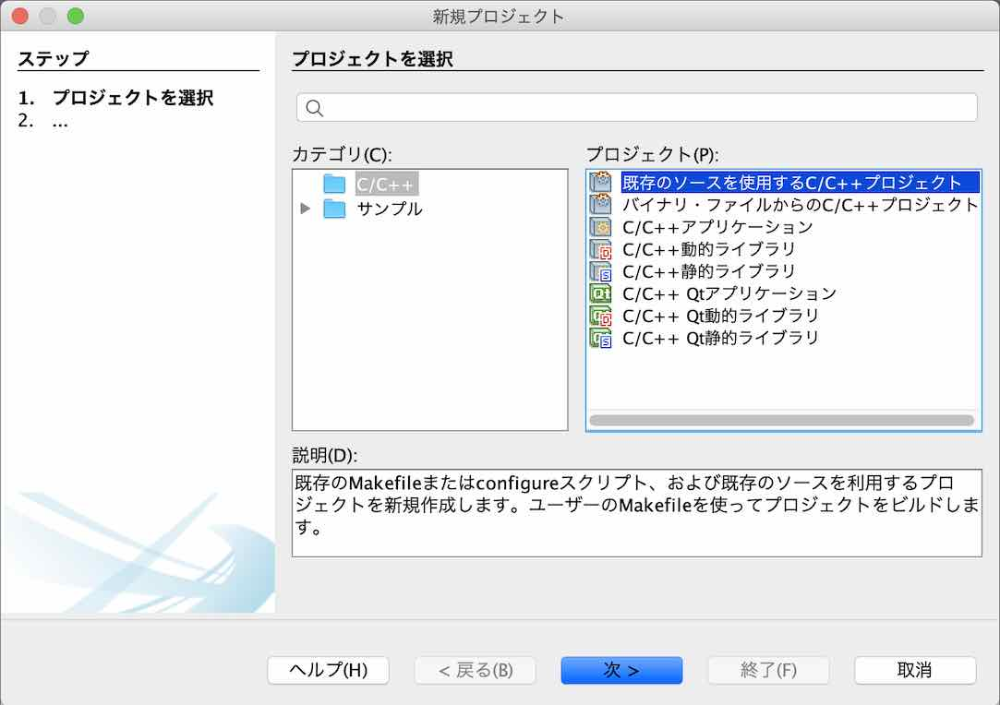
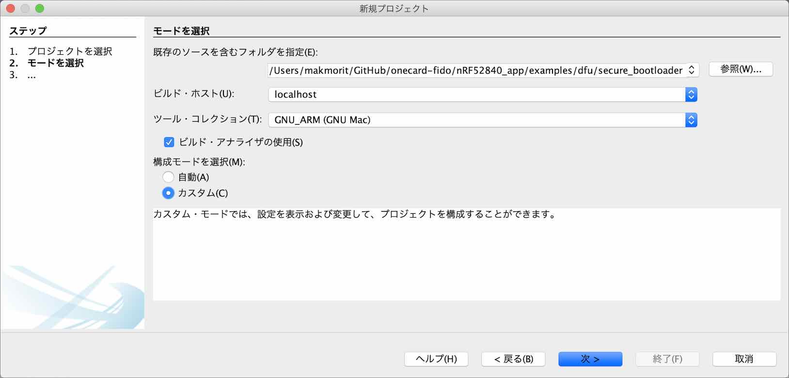
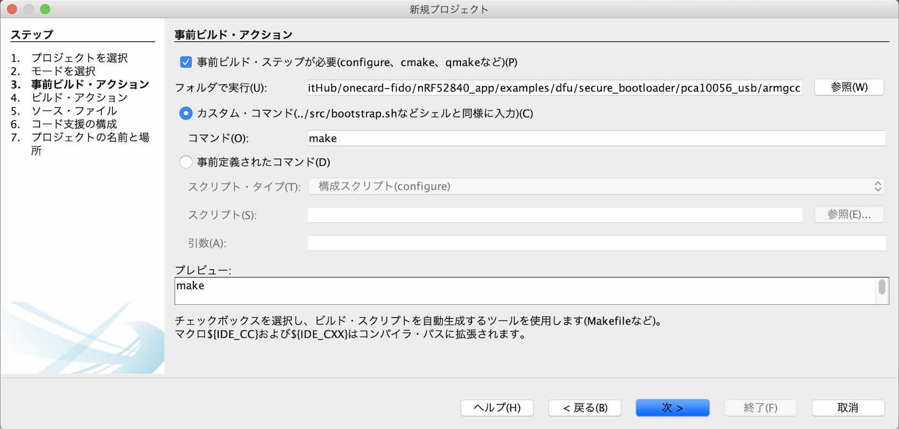
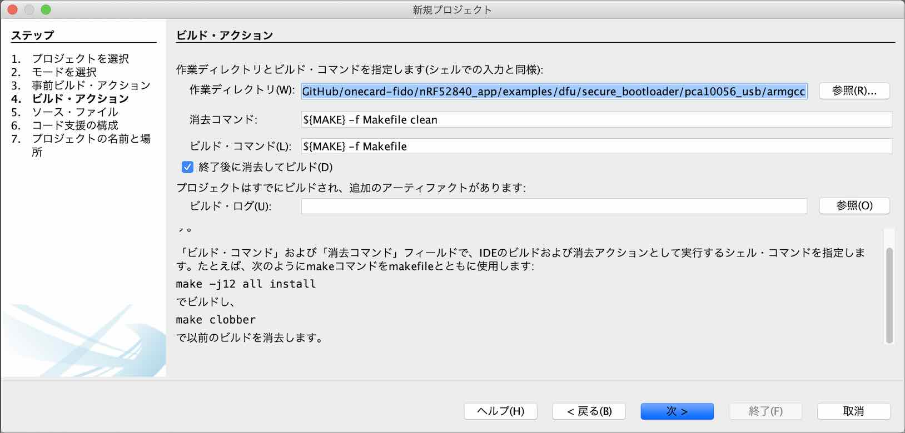
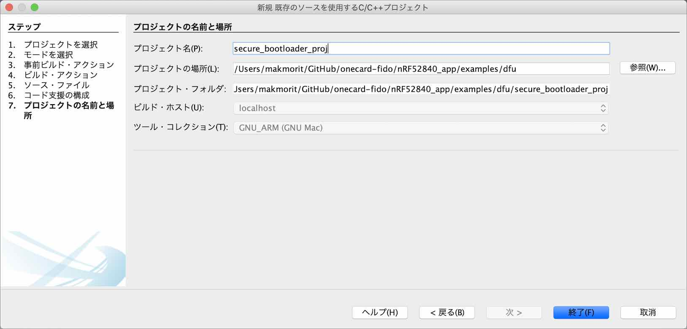
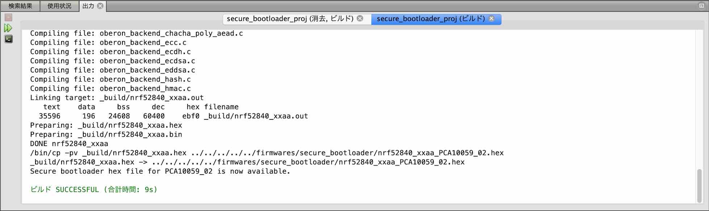

# USBブートローダー（署名機能付き）作成手順

NetBeansとARM GCC、nRF5 SDKを使用し、USBブートローダー（署名機能付き）を作成する手順を記載しています。

## USBブートローダー（署名機能付き）の概要

PCから[MDBT50Q Dongle](../../../FIDO2Device/MDBT50Q_Dongle/README.md)に対し、[nRF52840アプリケーション](../../../nRF5_SDK_v15.3.0/firmwares/README.md)を書き込むためのファームウェアです。<br>
[Nordic社提供のサンプルアプリケーション](https://infocenter.nordicsemi.com/topic/sdk_nrf5_v17.0.2/sdk_app_serial_dfu_bootloader.html)に小修正を施し、制作しています。

## 事前準備

### NetBeans環境の作成

あらかじめ、NetBeans環境をPCに作成しておきます。<br>
具体的な手順は、[NetBeansインストール手順](../../../../nRF5_SDK_v15.3.0/NETBEANSINST.md)をご参照ください。

## ソースファイルの準備

#### オリジナルソースの取得

nRF5 SDKのサンプルアプリケーション・フォルダー（/nRF5_SDK_17.0.2/examples/dfu）から、必要なソースコードを取得します。

- `secure_bootloader`サブフォルダー
- `dfu_public_key.c`

今回の作成にあたっては、[`<リポジトリールート>/nRF5_SDK_v15.3.0/examples/dfu`](../../../../nRF5_SDK_v15.3.0/examples/dfu)配下に配置いたしました。

`secure_bootloader`サブフォルダーには、不要なファイルが含まれていますので、適宜削除します。<br>
具体的には下記イメージになるかと存じます。


#### 公開鍵ファイルの作成

まずは、`dfu_public_key.c`は、Nordic社提供サンプルから修正します。<br>
具体的には、`uint8_t pk[64]`を、下記のようなコマンドを実行して作成されたものと差し替えます。[注1]

```
bash-3.2$ nrfutil keys generate secure_bootloader_prvkey.pem
Generated private key and stored it in: secure_bootloader_prvkey.pem
bash-3.2$ nrfutil keys display --key pk --format code secure_bootloader_prvkey.pem

/* This file was automatically generated by nrfutil on 2019-09-24 (YY-MM-DD) at 15:09:06 */

#include "stdint.h"
#include "compiler_abstraction.h"

/** @brief Public key used to verify DFU images */
__ALIGN(4) const uint8_t pk[64] =
{
    0x1b, 0x4a, 0x42, 0x57, 0x1c, 0xe7, 0xa2, 0x67, 0x36, 0x7b, 0x6a, 0x87, 0x84, 0xe4, 0x10, 0x40, 0x1b, 0xa8, 0xcc, 0xca, 0x37, 0xe2, 0x97, 0x37, 0x3e, 0x2d, 0x75, 0xb3, 0xc9, 0x87, 0x05, 0xee,
    0xeb, 0x91, 0x9b, 0x0f, 0xb3, 0xe1, 0x07, 0xa9, 0x64, 0x95, 0xd6, 0x82, 0x59, 0xc2, 0x02, 0x80, 0xad, 0x41, 0x35, 0x5e, 0xbc, 0x85, 0x80, 0xcc, 0x27, 0xde, 0x8f, 0x7c, 0x2b, 0xb3, 0xd1, 0x45
};

bash-3.2$
```

[注1] ご参考：[GitHub - pc-nrfutil](https://github.com/NordicSemiconductor/pc-nrfutil/blob/master/README.md)

#### メイクファイルの修正

メイクファイル「[Makefile](../../../../nRF5_SDK_v15.3.0/examples/dfu/secure_bootloader/pca10056_usb/armgcc/Makefile)」の下記部分を修正します。

#### パス修正

<b>修正前</b>
```
SDK_ROOT := ../../../../..
```

<b>修正後</b>
```
SDK_ROOT := $(HOME)/opt/nRF5_SDK_17.0.2
```

#### define追加

<b>追加した行</b>
```
TARGET_BOARD     := PCA10059

# Pin for DFU mode
CFLAGS += -DNRF_BL_DFU_ENTER_METHOD_BUTTON=0
CFLAGS += -DNRF_BL_DFU_ENTER_METHOD_GPREGRET=1
CFLAGS += -DNRF_BL_DFU_ENTER_METHOD_PINRESET=0
```

[注] `-DNRF_BL_DFU_ENTER_METHOD_xxxx`の定義は、ブートローダーの開始設定を修正している部分です。すなわち、ブートローダーモードに遷移させるためには、nRF52840アプリケーション側で、レジスター`GPREGRET`に所定の値を設定することが必要となります（リセットボタンやユーザーボタンによるブートローダーモード遷移は不可能です）。

#### ターゲット変更（２箇所あります）

<b>修正前</b>
```
CFLAGS += -DBOARD_PCA10056
```

<b>修正後</b>
```
CFLAGS += -DBOARD_$(TARGET_BOARD)
```

## ソースファイルからビルド

上記で取得したソースファイルから、NetBeansプロジェクトを新規作成し、USBブートローダー（`nrf52840_xxaa.hex`ファイル）を生成します。

#### プロジェクトの新規作成〜ビルド実行

NetBeansを起動し、ファイル--->新規プロジェクトを実行します。



新規プロジェクト画面が表示されますので、一覧から「既存のソースを使用するC/C++プロジェクト」を選択し「次 >」をクリックします。



下図のような画面に遷移しますので、以下のように設定します。

- 既存のソースを含むフォルダを指定 - サンプルアプリが格納されているフォルダー「`examples/dfu/secure_bootloader`」を指定します。<br>
下図の例では「`/Users/makmorit/GitHub/onecard-fido/nRF52840_app/examples/dfu/secure_bootloader`」という文字列が設定されています。

- ツール・コレクションを選択 - 「GNU_ARM (GNU Mac)」をチェックします。
- 構成モードを選択 - 「カスタム(C)」をチェックします。

設定が完了したら「次 >」をクリックします。



下図のような画面に遷移しますので、以下のように設定します。

- 「事前ビルド・ステップが必要」にチェック

- フォルダで実行(U) - サンプルアプリのサブフォルダー「`pca10056_usb/armgcc`」を指定します。<br>
下図の例では「`/Users/makmorit/GitHub/onecard-fido/nRF52840_app/examples/dfu/secure_bootloader/pca10056_usb/armgcc`」という文字列が設定されています。

- 「カスタム・コマンド」にチェック

- コマンド(O) - 「make」と入力します。

設定が完了したら「次 >」をクリックします。



「4. ビルド・アクション」に遷移しますが、以降は「7. プロジェクトの名前と場所」に遷移するまではデフォルト設定のまま「次 >」をクリックします。



「7. プロジェクトの名前と場所」に遷移したら、プロジェクト名(P)を「`secure_bootloader`」から「`secure_bootloader_proj`」に変更しておきます。<br>
（オリジナルのプロジェクト「`secure_bootloader`」を上書きしたくないための措置です）

設定が完了したら「終了(F)」をクリックします。



自動的にビルドがスタートしますので、しばらくそのまま待ちます。<br>
しばらくするとビルドが完了し「ビルド SUCCESSFUL」と表示されれば、ビルドは成功です。



#### ビルド結果の確認

ビルドが完了したら、USBブートローダー`nrf52840_xxaa.hex`が正しく生成されているかどうか確認します。<br>
下記は、ターミナルで`nrf52840_xxaa.hex`(102KB)が生成されたことを確認したところです。

```
bash-3.2$ cd ${HOME}/GitHub/onecard-fido/nRF52840_app/examples/dfu/secure_bootloader/pca10056_usb/armgcc/_build
bash-3.2$ ls -al *.hex
-rw-r--r--  1 makmorit  staff  101130  1 12 11:26 nrf52840_xxaa.hex
bash-3.2$
```

以上で、ソースファイルからのビルドは完了です。
