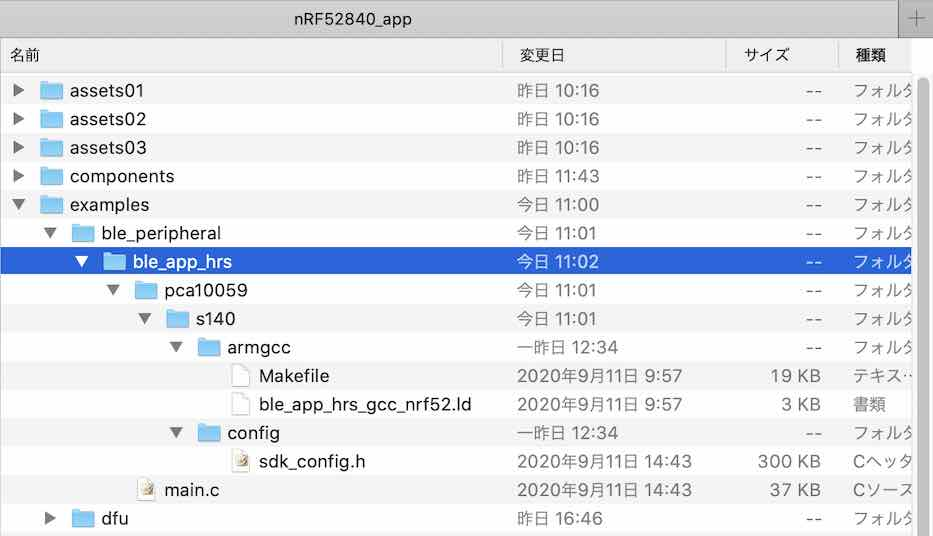
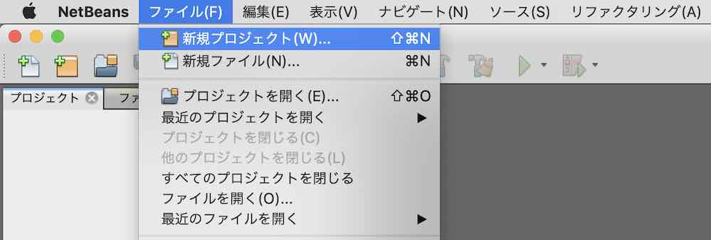
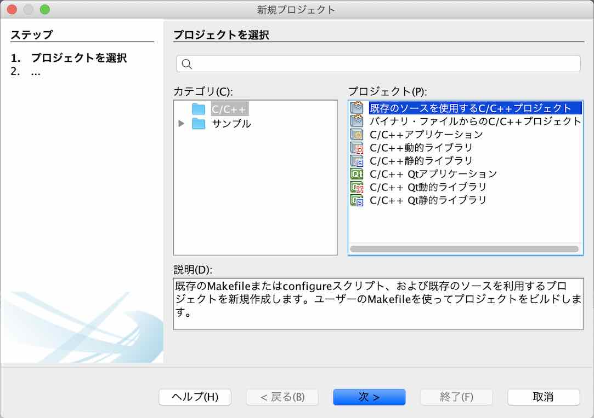
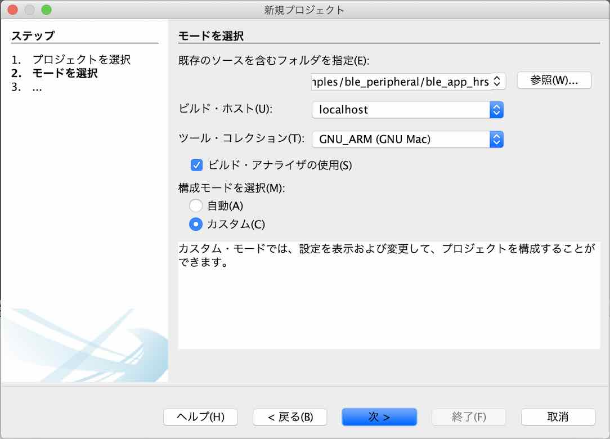
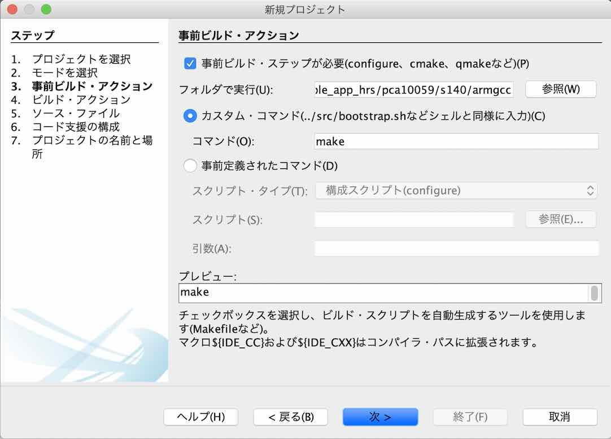
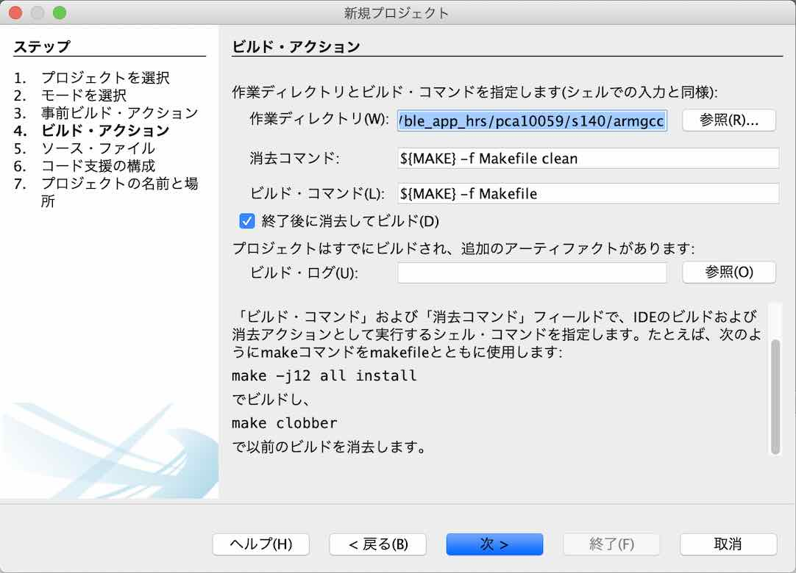
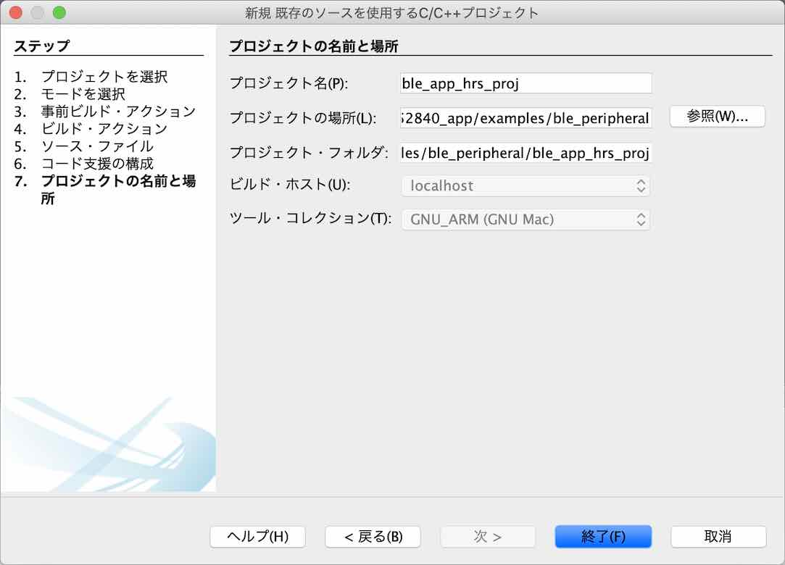
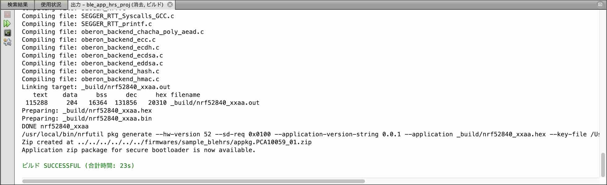

# サンプルアプリケーション作成手順書

NetBeansとARM GCC、nRF5 SDKを使用し、動作確認用のサンプルアプリケーション「Heart Rate Application」を作成する手順を記載しています。

## サンプルプログラムについて

[Nordic社提供のサンプルアプリケーション](https://infocenter.nordicsemi.com/topic/sdk_nrf5_v17.0.2/ble_sdk_app_hrs.html)に小修正を施し、制作しています。

## 事前準備

#### NetBeans環境の作成

あらかじめ、NetBeans環境をPCに作成しておきます。<br>
具体的な手順は、[NetBeansインストール手順](../../../nRF52840_app/NETBEANSINST.md)をご参照ください。

#### nRF Utilのインストール

ビルドを実行する際に必要となる、nRF UtilをPCにインストールしておきます。<br>
具体的な手順は、[nRF Utilインストール手順](../../../nRF52840_app/NRFUTILINST.md)をご参照ください。

本手順書を作成した時点でのnRF Utilは、`version 6.1`となっておりました。

```
bash-3.2$ nrfutil version
nrfutil version 6.1.0
bash-3.2$
```

## ソースファイルの準備

#### オリジナルソースの取得

nRF5 SDKのサンプルアプリケーション・フォルダー（`${HOME}/opt/nRF5_SDK_17.0.2/examples/ble_peripheral/ble_app_hrs`）から、必要なソースコードを取得します。<br>
今回の作成にあたっては、[`<リポジトリールート>/nRF52840_app/examples/ble_peripheral/ble_app_hrs`](../../../nRF52840_app/examples/ble_peripheral/ble_app_hrs)配下に配置いたしました。

`ble_app_hrs`サブフォルダーには、不要なファイルが含まれていますので、適宜削除します。<br>
具体的には下記イメージになるかと存じます。



#### 秘密鍵ファイルの存在確認

[USBブートローダーファームウェア](../../../nRF52840_app/firmwares/secure_bootloader/BUILDSBL.md)生成時に使用した公開鍵に対応する秘密鍵ファイル（`secure_bootloader_prvkey.pem`）を、ユーザールートディレクトリーに配置しておきます。<br>
このファイルがないと、サンプルアプリケーションをUSBポート経由で書込みできません。

```
bash-3.2$ cd ${HOME}
bash-3.2$ ls -al *.pem
-rw-r--r--  1 makmorit  staff  227  7  8  2020 secure_bootloader_prvkey.pem
bash-3.2$
```

#### SDKソースコードの修正

[MDBT50Q Dongle](../../../FIDO2Device/MDBT50Q_Dongle/README.md)は、Nordic社のドングル「nRF52840 Dongle」から回路を修正しているため、`PCA_10059`のソースがそのまま利用できません。<br>
そのため、nRF5 SDKのフォルダー（`/nRF5_SDK_17.0.2/components/boards`）から、必要なソースコードを取得し、一部修正を加えております。

MDBT50Q Dongle用の独自定義は下記ファイルになります。

| # |ファイル名 |説明 |
|:-:|:-|:-|
|1|`pca10059_01.h`|[MDBT50Q Dongle（rev2）](../../../FIDO2Device/MDBT50Q_Dongle/pcb_rev2/README.md)専用ヘッダーファイル|
|2|`pca10059_02.h`|[MDBT50Q Dongle（rev2.1.2）](../../../FIDO2Device/MDBT50Q_Dongle/pcb_rev2_1_2/README.md)専用ヘッダーファイル|

今回の作成にあたっては、[`<リポジトリールート>/nRF52840_app/components/boards`](../../../nRF52840_app/components/boards)配下に配置いたしました。

#### メイクファイルの修正

メイクファイル「[Makefile](../../../nRF52840_app/examples/ble_peripheral/ble_app_hrs/pca10059/s140/armgcc/Makefile)」の下記部分を修正します。

#### パス修正

【修正前】
```
SDK_ROOT := ../../../../../..
PROJ_DIR := ../../..
```

【修正後】<br>
修正コード／`.hex`ファイルコピー先ルートディレクトリーの定義を加えています。
```
SDK_ROOT := $(HOME)/opt/nRF5_SDK_17.0.2
PROJ_DIR := ../../..
SDK_CUSTOM_ROOT := $(PROJ_DIR)/../../..
DEPLOY_ROOT := $(SDK_CUSTOM_ROOT)/firmwares
```

#### define追加

【追加した行】
```
# target board
#  PCA10059_01  MDBT50Q Dongle(rev2, without ATECC608A)
#  PCA10059_02  MDBT50Q Dongle(rev2.1.2, with ATECC608A)
TARGET_BOARD     := PCA10059_01
# application version info
FW_REV := 0.0.1
```

[注1] `TARGET_BOARD`の定義は、アプリケーション導入先の基板名を指定します。`PCA10059_01`を指定すると、MDBT50Q Dongle(rev2)向けのアプリケーションが生成されます。

#### ターゲット変更（４箇所あります）

【修正前】
```
$(SDK_ROOT)/components/boards/boards.c \
：
$(SDK_ROOT)/components/boards \
：
CFLAGS += -DBOARD_PCA10056
：
ASMFLAGS += -DBOARD_PCA10056
：
default: nrf52840_xxaa
```

【修正後】
```
$(SDK_CUSTOM_ROOT)/components/boards/boards.c \
：
$(SDK_CUSTOM_ROOT)/components/boards \
：
CFLAGS += -DBOARD_$(TARGET_BOARD)
：
ASMFLAGS += -DBOARD_$(TARGET_BOARD)
：
default: nrf52840_xxaa secure_pkg
```

#### DFUイメージファイル生成処理追加

アプリケーション書込みイメージファイル（DFUイメージファイル）を作成し、所定の位置にコピーします。

【追加した行】
```
secure_pkg:
	/usr/local/bin/nrfutil pkg generate --hw-version 52 --sd-req 0x0100 --application-version-string $(FW_REV) --application $(OUTPUT_DIRECTORY)/nrf52840_xxaa.hex --key-file $(HOME)/secure_bootloader_prvkey.pem $(DEPLOY_ROOT)/sample_blehrs/appkg.$(TARGET_BOARD).zip
	@echo Application zip package for secure bootloader is now available.
```

[注] `--sd-req`で指定しているのは、ソフトデバイスのFirmware IDです。本件ではソフトデバイス`s140_nrf52_7.2.0_softdevice.hex`を使用していますが、そのFirmware IDは`0x0100`となっております。

## ソースファイルからビルド

上記で取得したソースファイルから、NetBeansプロジェクトを新規作成し、DFUイメージファイル（`appkg.<基板名>.zip`ファイル）を生成します。

#### プロジェクトの新規作成〜ビルド実行

NetBeansを起動し、ファイル--->新規プロジェクトを実行します。



新規プロジェクト画面が表示されますので、一覧から「既存のソースを使用するC/C++プロジェクト」を選択し「次 >」をクリックします。



下図のような画面に遷移しますので、以下のように設定します。

- 既存のソースを含むフォルダを指定 - サンプルアプリが格納されているフォルダー「`examples/ble_peripheral/ble_app_hrs`」を指定します。<br>
下図の例では「`/Users/makmorit/GitHub/onecard-fido/nRF52840_app/examples/ble_peripheral/ble_app_hrs`」という文字列が設定されています。

- ツール・コレクションを選択 - 「GNU_ARM (GNU Mac)」をチェックします。
- 構成モードを選択 - 「カスタム(C)」をチェックします。

設定が完了したら「次 >」をクリックします。



下図のような画面に遷移しますので、以下のように設定します。

- 「事前ビルド・ステップが必要」にチェック

- フォルダで実行(U) - サンプルアプリのサブフォルダー「`pca10059/s140/armgcc`」を指定します。<br>
下図の例では「`/Users/makmorit/GitHub/onecard-fido/nRF52840_app/examples/ble_peripheral/ble_app_hrs/pca10059/s140/armgcc`」という文字列が設定されています。

- 「カスタム・コマンド」にチェック

- コマンド(O) - 「make」と入力します。

設定が完了したら「次 >」をクリックします。



「4. ビルド・アクション」に遷移しますが、以降は「7. プロジェクトの名前と場所」に遷移するまではデフォルト設定のまま「次 >」をクリックします。



「7. プロジェクトの名前と場所」に遷移したら、プロジェクト名(P)を「`ble_app_hrs`」から「`ble_app_hrs_proj`」に変更しておきます。<br>
（オリジナルのプロジェクト「`ble_app_hrs`」を上書きしたくないための措置です）

設定が完了したら「終了(F)」をクリックします。



自動的にビルドがスタートしますので、しばらくそのまま待ちます。<br>
しばらくするとビルドが完了し「ビルド SUCCESSFUL」と表示されれば、ビルドは成功です。



#### ビルド結果の確認

ビルドが完了したら、USBブートローダー`appkg.<基板名>.zip`が正しく生成されているかどうか確認します。<br>
下記は、ターミナルで`appkg.PCA10059_01.zip`(116KB)が生成されたことを確認したところです。

```
bash-3.2$ cd ${HOME}/GitHub/onecard-fido/nRF52840_app/firmwares/sample_blehrs/
bash-3.2$ ls -al *.zip
-rw-r--r--  1 makmorit  staff  116128  1 13 15:49 appkg.PCA10059_01.zip
bash-3.2$
```

以上で、ソースファイルからのビルドは完了です。
