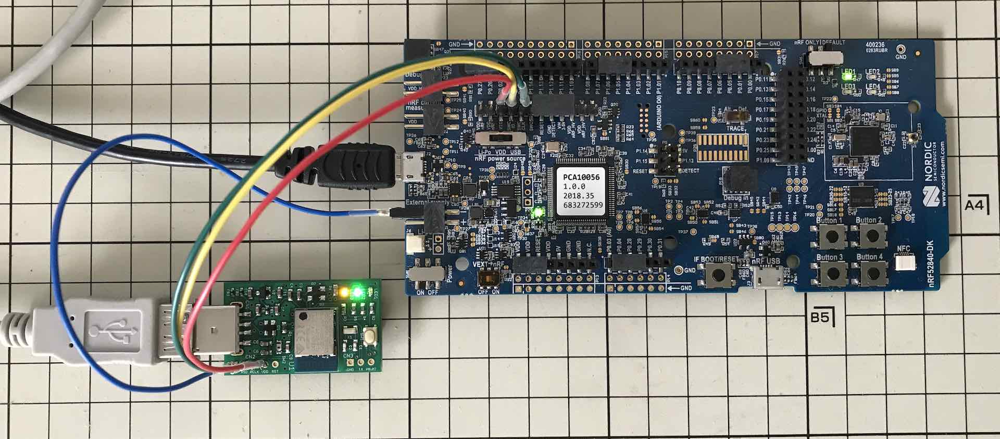

# サンプルアプリケーション動作確認手順書

## 概要

[MDBT50Q Dongle](../../../FIDO2Device/MDBT50Q_Dongle/README.md)に、[Heart Rate Application](../../../nRF52840_app/firmwares/sample_blehrs)を新規導入し、Androidアプリを使用して動作確認する手順を、以下に掲載いたします。

## 注意事項

この移行作業を実施すると、MDBT50Q DongleのFlash ROM全領域が消去されるため、MDBT50Q Dongleに導入した秘密鍵・証明書や、PIN番号、WebAuthn認証情報などは、すべて消去されます。

## 事前準備

まずはソフトウェア（nRF Util／nRF Toolbox app）を準備し、次にハードウェア（MDBT50Q Dongle）を準備します。

#### nRF Utilのインストール

ビルドを実行する際に必要となる、nRF UtilをPCにインストールしておきます。<br>
具体的な手順は、[nRF Utilインストール手順](../../../nRF52840_app/NRFUTILINST.md)をご参照ください。

本手順書を作成した時点でのnRF Utilは、`version 6.1`となっておりました。

```
bash-3.2$ nrfutil version
nrfutil version 6.1.0
bash-3.2$
```

#### Androidツールの準備

「nRF Toolbox app」というアプリを、Androidスマートフォンにインストールしておきます。<br>
Playストア経由で入手できるかと存じます。


#### ハードウェアの準備

まず最初に、MDBT50Q Dongleを初期化し、USBブートローダーのみが動作する状態とします。<br>
具体的な手順は、[USBブートローダー書込み手順書](../../../nRF52840_app/firmwares/secure_bootloader/WRITESBL.md)をご参照ください。

前述の手順が完了しますと、USBブートローダーのみが動作中のため、下図のように、基板上の緑色・橙色LEDが点灯している状態となります。



その後、MDBT50Q DongleをPCのUSBポートから外し、nRF52840 DKとの配線を外してください。<br>
さらに、PCとnRF52840 DKを切断させます。

続いて、再度MDBT50Q DongleをPCのUSBポートに装着します。<br>
再び、基板上の緑色・橙色LEDが点灯している状態となっていることを確認します。


## サンプルアプリケーションの書込み

nRF Utilを使用し、MDBT50Q Dongleへサンプルアプリケーションを書込みます。

#### 書込み実行

`nrfutil dfu usb-serial`コマンドを実行し、仮想COMポート経由で、ファームウェア更新イメージファイルを転送します。<br>
具体的には、以下のコマンドを投入します。

```
FIRMWARES_DIR="${HOME}/GitHub/onecard-fido/nRF52840_app/firmwares/sample_blehrs"
cd ${FIRMWARES_DIR}
PACKAGE=`ls appkg.PCA10059_01.zip`
PORTNAME=`ls /dev/tty.usbmodem*`
echo command [nrfutil dfu usb-serial -pkg ${PACKAGE} -p ${PORTNAME}]
nrfutil dfu usb-serial -pkg ${PACKAGE} -p ${PORTNAME}
```

下記は実行例になります。

```
bash-3.2$ FIRMWARES_DIR="${HOME}/GitHub/onecard-fido/nRF52840_app/firmwares/sample_blehrs"
bash-3.2$ cd ${FIRMWARES_DIR}
bash-3.2$ PACKAGE=`ls appkg.PCA10059_01.zip`
bash-3.2$ PORTNAME=`ls /dev/tty.usbmodem*`
bash-3.2$ echo command [nrfutil dfu usb-serial -pkg ${PACKAGE} -p ${PORTNAME}]
command [nrfutil dfu usb-serial -pkg appkg.PCA10059_01.zip -p /dev/tty.usbmodemD496DB4407941]
bash-3.2$ nrfutil dfu usb-serial -pkg ${PACKAGE} -p ${PORTNAME}
  [####################################]  100%          
Device programmed.
bash-3.2$
```

#### 書込み完了

書込処理が終了すると、MDBT50Q Dongleが自動的にリセットされ、サンプルアプリケーションがスタートします。<br>
アイドル時であることを表示する橙色のLEDが点滅していることを確認します。


以上で、MDBT50Q Dongleへのサンプルアプリケーション書込みは完了になります。

## サンプルアプリケーションの動作確認

「nRF Toolbox app」というアプリを使用して動作確認します。

#### ペアリングと接続

「nRF Toolbox app」を起動し、HRMのアイコンをタップします。


HEART RATE MONITOR画面に遷移します。<br>
画面下部の「CONNECT」をタップします。


下図のようなポップアップが表示されたら、<b>必ず「許可」をタップしてください。</b>


「`Nordic_HRM`」というデバイスがリストされます。<br>
先ほどMDBT50Q Dongleに書き込んだサンプルアプリケーションが「`Nordic_HRM`」として認識されます。

ここで「`Nordic_HRM`」をタップしてください。


ペアリングが自動的に行われ、接続が完了すると同時に、画面上のグラフが動き始めます。


#### 切断

画面下部のボタン「DISCONNECT」をタップします。


程なくMDBT50Q Dongleが、Androidスマートフォンから切断され、画面上のグラフが停止します。


以上で、サンプルアプリケーションの動作確認は完了となります。
