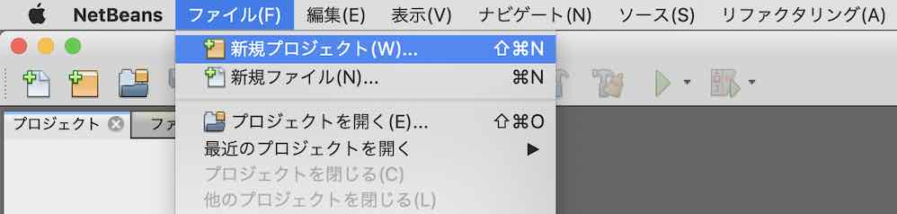
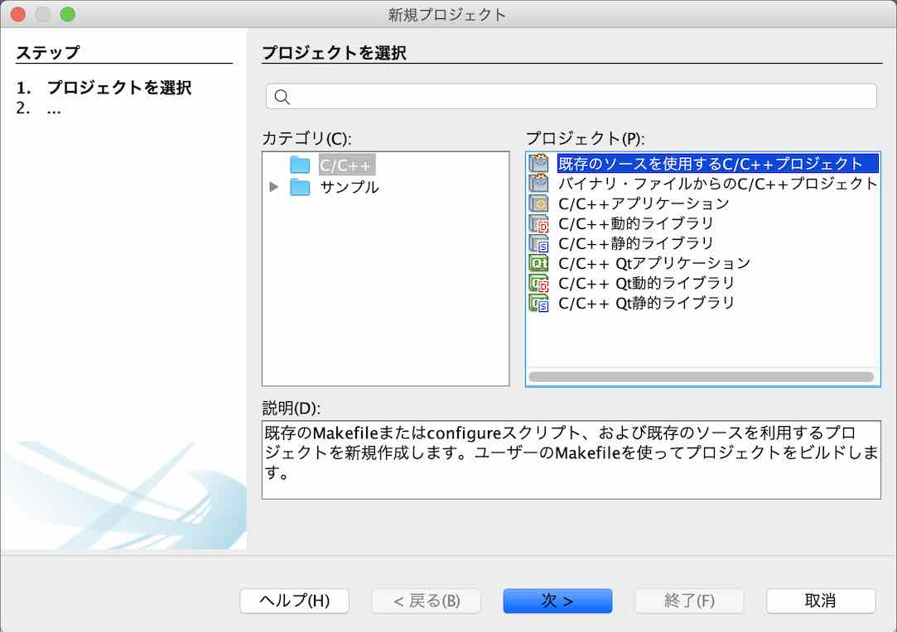
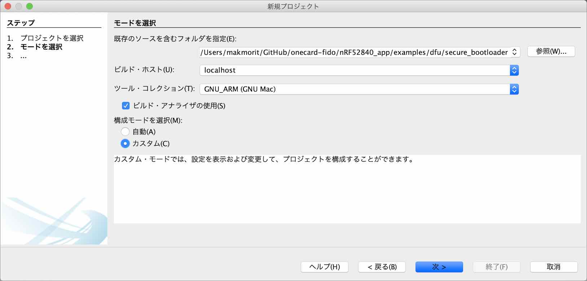
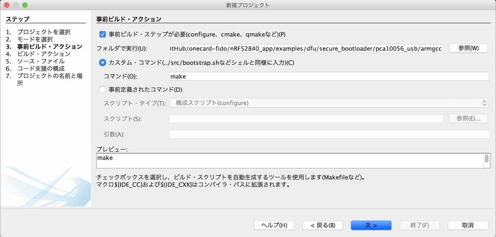
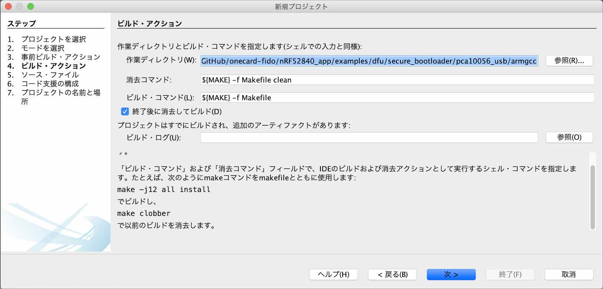
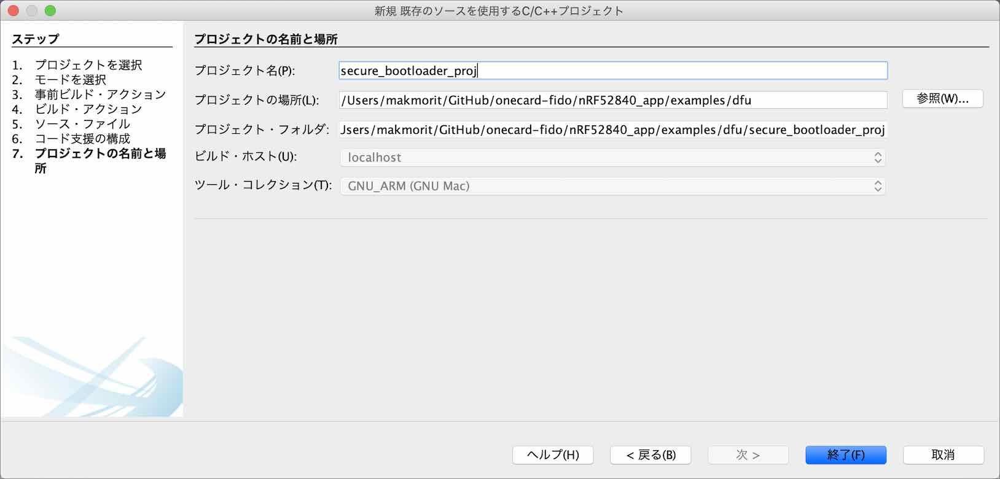
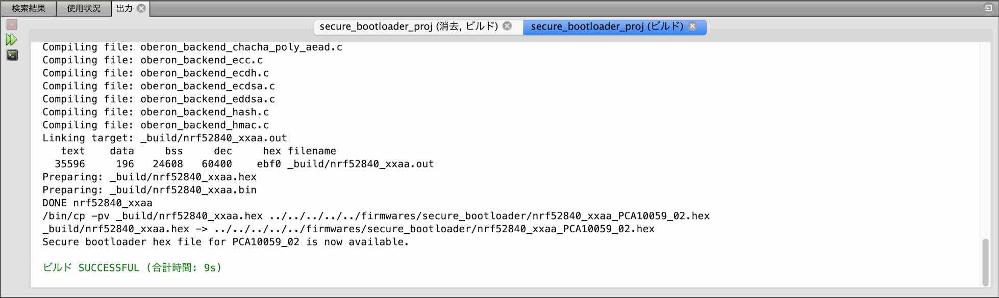

# USBブートローダー（署名機能付き）作成手順書

NetBeansとARM GCC、nRF5 SDKを使用し、USBブートローダー（署名機能付き）を作成する手順を記載しています。

## ブートローダーについて

PCから[MDBT50Q Dongle](../../../FIDO2Device/MDBT50Q_Dongle/README.md)に対し、[nRF52840アプリケーション](../../../nRF52840_app/firmwares/README.md)を書き込むためのファームウェアです。<br>
[Nordic社提供のサンプルアプリケーション](https://infocenter.nordicsemi.com/topic/sdk_nrf5_v17.0.2/sdk_app_serial_dfu_bootloader.html)に小修正を施し、制作しています。

## 事前準備

### NetBeans環境の作成

あらかじめ、NetBeans環境をPCに作成しておきます。<br>
具体的な手順は、[NetBeansインストール手順](../../../nRF52840_app/NETBEANSINST.md)をご参照ください。

## ソースファイルの準備

#### オリジナルソースの取得

nRF5 SDKのサンプルアプリケーション・フォルダー（`/nRF5_SDK_17.0.2/examples/dfu`）から、必要なソースコードを取得します。

- `secure_bootloader`サブフォルダー
- `dfu_public_key.c`

今回の作成にあたっては、[`<リポジトリールート>/nRF52840_app/examples/dfu`](../../../nRF52840_app/examples/dfu)配下に配置いたしました。

`secure_bootloader`サブフォルダーには、不要なファイルが含まれていますので、適宜削除します。<br>
具体的には下記イメージになるかと存じます。


#### 公開鍵ファイルの作成

まずは、`dfu_public_key.c`は、Nordic社提供サンプルから修正します。<br>
具体的には、`uint8_t pk[64]`を、下記のようなコマンドを実行して作成されたものと差し替えます。[注1]

```
bash-3.2$ nrfutil keys generate secure_bootloader_prvkey.pem
Generated private key and stored it in: secure_bootloader_prvkey.pem
bash-3.2$ nrfutil keys display --key pk --format code secure_bootloader_prvkey.pem

/* This file was automatically generated by nrfutil on 2019-09-24 (YY-MM-DD) at 15:09:06 */

#include "stdint.h"
#include "compiler_abstraction.h"

/** @brief Public key used to verify DFU images */
__ALIGN(4) const uint8_t pk[64] =
{
    0x1b, 0x4a, 0x42, 0x57, 0x1c, 0xe7, 0xa2, 0x67, 0x36, 0x7b, 0x6a, 0x87, 0x84, 0xe4, 0x10, 0x40, 0x1b, 0xa8, 0xcc, 0xca, 0x37, 0xe2, 0x97, 0x37, 0x3e, 0x2d, 0x75, 0xb3, 0xc9, 0x87, 0x05, 0xee,
    0xeb, 0x91, 0x9b, 0x0f, 0xb3, 0xe1, 0x07, 0xa9, 0x64, 0x95, 0xd6, 0x82, 0x59, 0xc2, 0x02, 0x80, 0xad, 0x41, 0x35, 0x5e, 0xbc, 0x85, 0x80, 0xcc, 0x27, 0xde, 0x8f, 0x7c, 0x2b, 0xb3, 0xd1, 0x45
};

bash-3.2$
```

[注1] ご参考：[GitHub - pc-nrfutil](https://github.com/NordicSemiconductor/pc-nrfutil/blob/master/README.md)

#### SDKソースコードの修正

[MDBT50Q Dongle](../../../FIDO2Device/MDBT50Q_Dongle/README.md)は、Nordic社のドングル「nRF52840 Dongle」から回路を修正しているため、`PCA_10059`のソースがそのまま利用できません。<br>
そのため、nRF5 SDKのフォルダー（`/nRF5_SDK_17.0.2/components/boards`）から、必要なソースコードを取得し、一部修正を加えております。

MDBT50Q Dongle用の独自定義は下記ファイルになります。

| # |ファイル名 |説明 |
|:-:|:-|:-|
|1|`pca10059_01.h`|[MDBT50Q Dongle（rev2）](../../../FIDO2Device/MDBT50Q_Dongle/pcb_rev2/README.md)専用ヘッダーファイル|
|2|`pca10059_02.h`|[MDBT50Q Dongle（rev2.1.2）](../../../FIDO2Device/MDBT50Q_Dongle/pcb_rev2_1_2/README.md)専用ヘッダーファイル|

今回の作成にあたっては、[`<リポジトリールート>/nRF52840_app/components/boards`](../../../nRF52840_app/components/boards)配下に配置いたしました。

#### メイクファイルの修正

メイクファイル「[Makefile](../../../nRF52840_app/examples/dfu/secure_bootloader/pca10056_usb/armgcc/Makefile)」の下記部分を修正します。

#### パス修正

【修正前】
```
SDK_ROOT := ../../../../..
PROJ_DIR := ../..
```

【修正後】<br>
修正コード／`.hex`ファイルコピー先ルートディレクトリーの定義を加えています。
```
SDK_ROOT := $(HOME)/opt/nRF5_SDK_17.0.2
PROJ_DIR := ../..
SDK_CUSTOM_ROOT := $(PROJ_DIR)/../../..
DEPLOY_ROOT := $(SDK_CUSTOM_ROOT)/firmwares
```

#### define追加

【追加した行】
```
# target board
#  PCA10059_01  MDBT50Q Dongle(rev2, without ATECC608A)
#  PCA10059_02  MDBT50Q Dongle(rev2.1.2, with ATECC608A)
TARGET_BOARD     := PCA10059_02

# Pin for DFU mode
CFLAGS += -DNRF_BL_DFU_ENTER_METHOD_BUTTON=0
CFLAGS += -DNRF_BL_DFU_ENTER_METHOD_GPREGRET=1
CFLAGS += -DNRF_BL_DFU_ENTER_METHOD_PINRESET=0
```

[注1] `-DNRF_BL_DFU_ENTER_METHOD_xxxx`の定義は、ブートローダーの開始設定を修正している部分です。すなわち、ブートローダーモードに遷移させるためには、nRF52840アプリケーション側で、レジスター`GPREGRET`に所定の値を設定することが必要となります（リセットボタンやユーザーボタンによるブートローダーモード遷移は不可能です）。<br>
[注2] `TARGET_BOARD`の定義は、ブートローダー導入先の基板名を指定します。`PCA10059_02`を指定すると、MDBT50Q Dongle(rev2.1.2)向けのブートローダーが生成されます。

#### ターゲット変更（４箇所あります）

【修正前】
```
$(SDK_ROOT)/components/boards/boards.c \
：
$(SDK_ROOT)/components/boards \
：
CFLAGS += -DBOARD_PCA10056
：
ASMFLAGS += -DBOARD_PCA10056
：
default: nrf52840_xxaa
```

【修正後】
```
$(SDK_CUSTOM_ROOT)/components/boards/boards.c \
：
$(SDK_CUSTOM_ROOT)/components/boards \
：
CFLAGS += -DBOARD_$(TARGET_BOARD)
：
ASMFLAGS += -DBOARD_$(TARGET_BOARD)
：
default: nrf52840_xxaa deploy_dk
```

#### `.hex`ファイルコピー処理追加

【追加した行】
```
deploy_dk:
	/bin/cp -pv $(OUTPUT_DIRECTORY)/nrf52840_xxaa.hex $(DEPLOY_ROOT)/secure_bootloader/nrf52840_xxaa_$(TARGET_BOARD).hex
	@echo Secure bootloader hex file for $(TARGET_BOARD) is now available.
```

## ソースファイルからビルド

上記で取得したソースファイルから、NetBeansプロジェクトを新規作成し、USBブートローダー（`nrf52840_xxaa_<基板名>.hex`ファイル）を生成します。

#### プロジェクトの新規作成〜ビルド実行

NetBeansを起動し、ファイル--->新規プロジェクトを実行します。



新規プロジェクト画面が表示されますので、一覧から「既存のソースを使用するC/C++プロジェクト」を選択し「次 >」をクリックします。



下図のような画面に遷移しますので、以下のように設定します。

- 既存のソースを含むフォルダを指定 - サンプルアプリが格納されているフォルダー「`examples/dfu/secure_bootloader`」を指定します。<br>
下図の例では「`/Users/makmorit/GitHub/onecard-fido/nRF52840_app/examples/dfu/secure_bootloader`」という文字列が設定されています。

- ツール・コレクションを選択 - 「GNU_ARM (GNU Mac)」をチェックします。
- 構成モードを選択 - 「カスタム(C)」をチェックします。

設定が完了したら「次 >」をクリックします。



下図のような画面に遷移しますので、以下のように設定します。

- 「事前ビルド・ステップが必要」にチェック

- フォルダで実行(U) - サンプルアプリのサブフォルダー「`pca10056_usb/armgcc`」を指定します。<br>
下図の例では「`/Users/makmorit/GitHub/onecard-fido/nRF52840_app/examples/dfu/secure_bootloader/pca10056_usb/armgcc`」という文字列が設定されています。

- 「カスタム・コマンド」にチェック

- コマンド(O) - 「make」と入力します。

設定が完了したら「次 >」をクリックします。



「4. ビルド・アクション」に遷移しますが、以降は「7. プロジェクトの名前と場所」に遷移するまではデフォルト設定のまま「次 >」をクリックします。



「7. プロジェクトの名前と場所」に遷移したら、プロジェクト名(P)を「`secure_bootloader`」から「`secure_bootloader_proj`」に変更しておきます。<br>
（オリジナルのプロジェクト「`secure_bootloader`」を上書きしたくないための措置です）

設定が完了したら「終了(F)」をクリックします。



自動的にビルドがスタートしますので、しばらくそのまま待ちます。<br>
しばらくするとビルドが完了し「ビルド SUCCESSFUL」と表示されれば、ビルドは成功です。



#### ビルド結果の確認

ビルドが完了したら、USBブートローダー`nrf52840_xxaa_<基板名>.hex`が正しく生成されているかどうか確認します。<br>
下記は、ターミナルで`nrf52840_xxaa_PCA10059_02.hex`(102KB)が生成されたことを確認したところです。

```
bash-3.2$ cd ${HOME}/GitHub/onecard-fido/nRF52840_app/firmwares/secure_bootloader/
bash-3.2$ ls -al *.hex
-rw-r--r--  1 makmorit  staff  100815  1 12 14:45 nrf52840_xxaa_PCA10059_02.hex
bash-3.2$
```

以上で、ソースファイルからのビルドは完了です。
