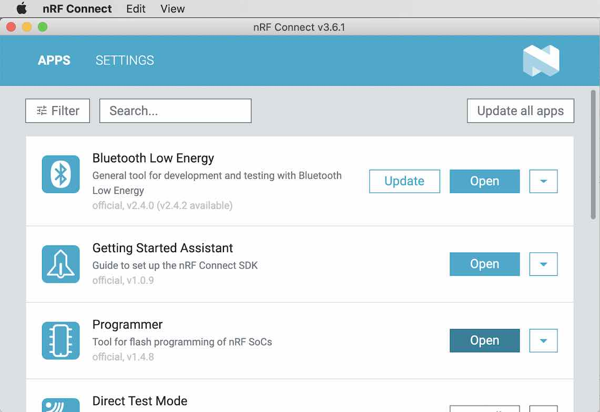

# USBブートローダー書込み手順書

## 概要

[MDBT50Q Dongle](../../../FIDO2Device/MDBT50Q_Dongle/README.md)に、[USBブートローダー（署名機能付き）](../../../nRF52840_app/firmwares/secure_bootloader)を新規導入する手順を、以下に掲載いたします。

## 注意事項

この移行作業を実施すると、MDBT50Q DongleのFlash ROM全領域が消去されるため、MDBT50Q Dongleに導入した秘密鍵・証明書や、PIN番号、WebAuthn認証情報などは、すべて消去されます。

## 導入の準備

署名機能付きUSBブートローダー（以下、単にブートローダー）の導入に必要な環境と媒体を準備します。

### 動作確認時の環境

- macOS Catalina（10.15.5）
- nRF52840 DK（PCA10056）: プログラムの書込みに使用
- MDBT50Q Dongle（rev2）: プログラムの書込み先となるターゲット基板

### ハードウェアの準備

まず最初に、MDBT50Q Dongleの背面にあるボタン電池ケースに、<b>電池が入っていないこと</b>を必ず確認します。


次に、MDBT50Q DongleをPCのUSBポートに装着後、nRF52840 DKと接続します。<br>
接続するピンの対応関係は以下の通りです。

|ピンの名前 |MDBT50Q Dongle（rev2）| | nRF52840 DK|
|:--|:-:|:-:|:-:|
|0V |GND  | <-->  |GND|
|SWD IO |PIO  | <-->  |SWDIO|
|SWD Clock |PCLK  | <--  |SWDCLK|
|SWD IO Level |VDD  | -->  |VTG|
|SWD Reset |RST  | <--  |RESET|

|ピンの名前 |MDBT50Q Dongle（rev2.1.2）| | nRF52840 DK|
|:--|:-:|:-:|:-:|
|0V |GND  | <-->  |GND|
|SWD IO Level |VDD  | -->  |VTG|
|SWD IO |PIO  | <-->  |SWDIO|
|SWD Clock |PCLK  | <--  |SWDCLK|

[注1] nRF52840 DK上の「P20」というコネクター（オスピン）に接続します。<br>
[注2] MDBT50Q Dongle（rev2, PCA10059_01）の回路図はこちら（[FIDO2AUTH_002.pdf](../../../FIDO2Device/MDBT50Q_Dongle/pcb_rev2/FIDO2AUTH_002.pdf)）になります。<br>
[注3] MDBT50Q Dongle（rev2.1.2, PCA10059_02）の回路図はこちら（[FIDO2AUTH_00212.pdf](../../../FIDO2Device/MDBT50Q_Dongle/pcb_rev2_1_2/FIDO2AUTH_00212.pdf)）になります。

下図は実際に両者を接続した時のイメージになります。


### ブートローダーファームウェアの準備

ブートローダーのファームウェアは、すでにビルド済みの`.hex`ファイルが、GitHubリポジトリーに格納されています。

| # |ファイル名 |説明 |
|:-:|:-|:-|
|1|[`nrf52840_xxaa_PCA10059_01.hex`](../../../nRF52840_app/firmwares/secure_bootloader/nrf52840_xxaa_PCA10059_01.hex)|[MDBT50Q Dongle（rev2）](../../../FIDO2Device/MDBT50Q_Dongle/pcb_rev2/README.md)専用ブートローダー|
|2|[`nrf52840_xxaa_PCA10059_02.hex`](../../../nRF52840_app/firmwares/secure_bootloader/nrf52840_xxaa_PCA10059_02.hex)|[MDBT50Q Dongle（rev2.1.2）](../../../FIDO2Device/MDBT50Q_Dongle/pcb_rev2_1_2/README.md)専用ブートローダー|

### 書込み用ツールの準備

以下のツールを、あらかじめPCに導入しておきます。

- <b>nRF Command Line Tools</b><br>
詳細につきましては、手順書「[NetBeansインストール手順](../../../nRF52840_app/NETBEANSINST.md)」内のトピック<b>「nRFコマンドラインツール」</b>をご参照ください。

- <b>nRF Connect for Desktop</b><br>
詳細につきましては、手順書[「nRF Connect for Desktop導入手順」](../../../nRF52840_app/NRFCONNECTINST.md)をご参照ください。

## ブートローダーの導入

MDBT50Q Dongleに、ブートローダーとソフトデバイスを導入します。

### Flash ROM全消去

以下のコマンドを実行します。<br>
（nRFコマンドラインツールの導入先が`${HOME}/opt/nRF-Command-Line-Tools_10_9_0_OSX`と想定します）

```
TOOLDIR=${HOME}/opt/nRF-Command-Line-Tools_10_9_0_OSX/nrfjprog
${TOOLDIR}/nrfjprog -f nrf52 --eraseall
```

以下は実行例になります。
```
bash-3.2$ TOOLDIR=${HOME}/opt/nRF-Command-Line-Tools_10_9_0_OSX/nrfjprog
bash-3.2$ ${TOOLDIR}/nrfjprog -f nrf52 --eraseall
Erasing user available code and UICR flash areas.
Applying system reset.
bash-3.2$
```

以上で、Flash ROM全消去は完了になりますが、MDBT50Q DongleはPCのUSBポートに装着し、かつ、nRF52840 DKと接続したままにしておきます。

### 書込み準備

nRF Connectを起動します。<br>
画面上部の「APPS」をクリックすると、Programmerという項目が表示されます。<br>
右横の「Open」ボタンをクリックします。



プログラミングツールが起動します。<br>
右側の「File Memory Layout」欄がブランクになっていることを確認します。

ブランクになっていない場合は、右側の「Clear Files」というリンクをクリックして「File Memory Layout」欄をブランクにしてください。


「File Memory Layout」欄に、ソフトデバイス、ブートローダーファームウェアをドラッグ＆ドロップします。<br>
かならず、ソフトデバイス（`s140_nrf52_7.2.0_softdevice.hex`） --> ブートローダーファームウェア（`nrf52840_xxaa_PCA10059_01.hex`または`nrf52840_xxaa_PCA10059_02.hex`）の順でドラッグ＆ドロップしてください。

[注1] ソフトデバイス`s140_nrf52_7.2.0_softdevice.hex`は、nRF5 SDKに同梱（`${HOME}/opt/nRF5_SDK_17.0.2/components/softdevice/s140/hex`というディレクトリーに格納）されています。

２点のファイルが、「File Memory Layout」欄に、下図のように配置されることを確認します。


画面左上部の「Select device」プルダウンをクリックして、PCA10056（前述のnRF52840 DK）を選択します。


しばらくすると、左側の「nRF52840」欄に、nRF52840 DKに接続されているMDBT50Q Dongle側のメモリーイメージが表示されます。<br>
下図例ではメモリーイメージが表示されていませんが、これは事前実行したFlash ROM全消去により、全領域が初期状態となったためです。


これで書き込み準備は完了です。

### 書込み実行

画面右下部にある「Write」のリンクをクリックし、書込みをスタートさせます。


下図のように「nRF52840」欄に淡い縞模様が表示され、書込処理が進みます。


しばらくすると、下図のように画面下部のメッセージ欄が赤く変化します。<br>


画面左上部にあるプルダウンから「Close device」を選択し、nRF52840 DKとの接続をすみやかに切断してください。


切断が完了したら、画面の「Quit」を実行して、nRF Connectを終了させます。


MDBT50Q Dongleにブートローダーが書き込まれ、自動的にブートローダーが起動します。<br>
下図のように、基板上の緑色・橙色LEDが点灯している状態が、ブートローダー起動中の状態になります。


その後、MDBT50Q DongleをPCのUSBポートから外し、nRF52840 DKとの配線を外してください。

これで、USBブートローダーの書込みは完了となります。
