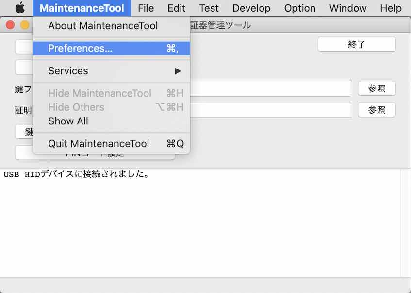
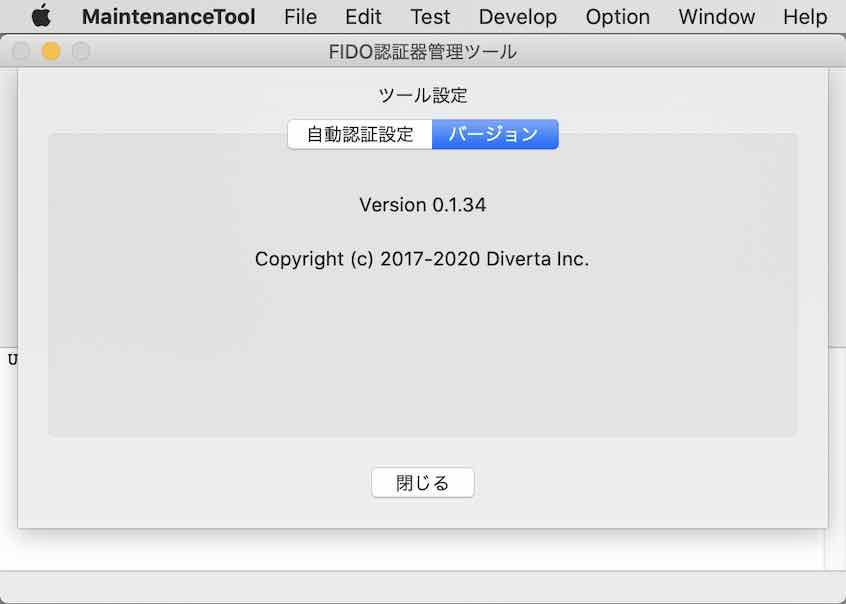
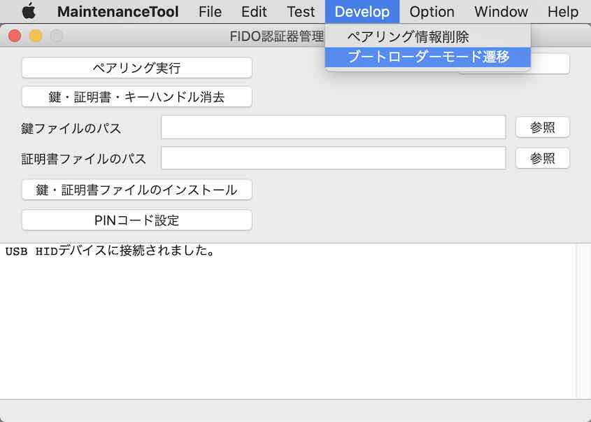
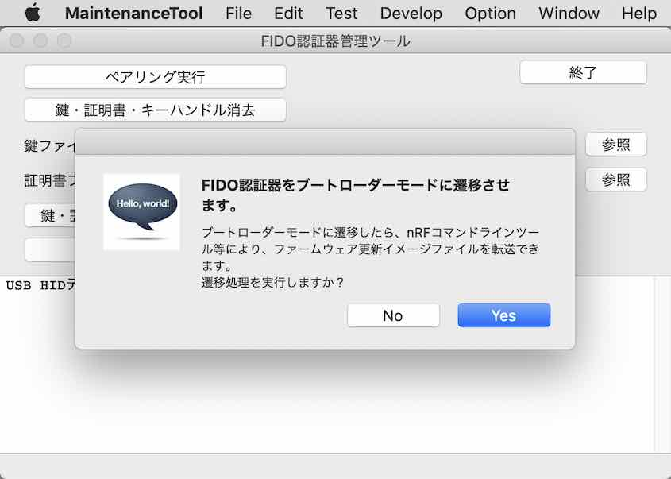
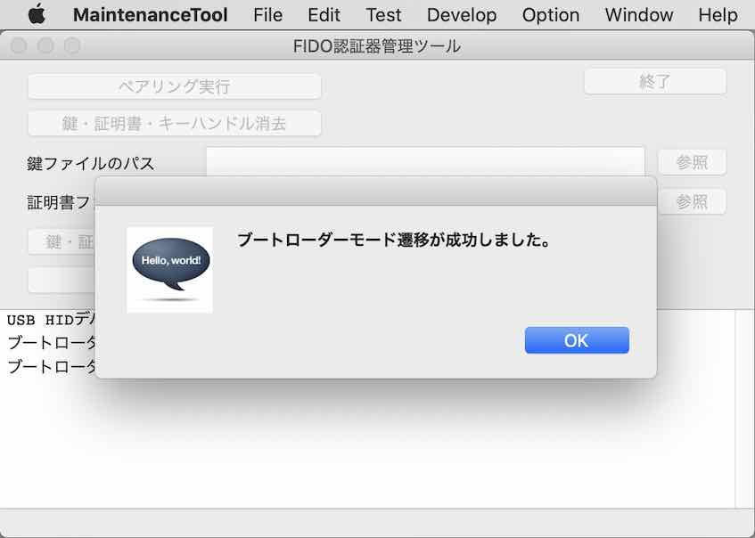

# ブートローダーモード遷移手順書

[管理ツール](../../../MaintenanceTool/README.md)を使用し、[MDBT50Q Dongle](../../../FIDO2Device/MDBT50Q_Dongle/README.md)をブートローダーモードに遷移させる手順を記載しています。

## 事前準備

#### MDBT50Q Dongleの初期化

[USBブートローダー書込み手順書](../../../nRF52840_app/firmwares/secure_bootloader/WRITESBL.md)の手順により、初期化されたMDBT50Q Dongleを準備します。

#### 管理ツールのインストール

あらかじめ、最新バージョンの管理ツールをPCにインストールしておきます。 
具体的な手順は、別ドキュメント「[管理ツールインストール手順](../../../MaintenanceTool/macOSApp/INSTALLPRG.md)」をご参照ください。

インストールされたら、為念で管理ツールを起動し、バージョンを確認します。 
メニューの「Preferences...」を選択します。

「バージョン」タブを表示させ、<b>バージョンが「0.1.34」以上</b>である事を確認してください。

## ブートローダーモード遷移手順

管理ツールの開発時運用機能（`Develop`メニュー）を使用し、MDBT50Q Dongleをブートローダーモードに遷移させます。

#### ブートローダーモード遷移の実行

管理ツールを起動し、メニュー「Develop --> ブートローダーモード遷移」を選択します。

下図のような確認ダイアログが表示されます。 
「Yes」ボタンをクリックし、ブートローダーモード遷移処理を実行させます。

ほどなく遷移処理が完了し、ポップアップが表示されます。

「OK」をクリックし、ポップアップを閉じます。

#### 遷移結果の確認

ブートローダーモード遷移処理の実行が完了すると、MDBT50Q Dongleの基板上で、緑色・橙色のLEDが同時点灯します。 
これはMDBT50Q Dongleが、ブートローダーモードである（＝アプリケーションのファームウェア更新イメージが書き込み可能である）状態を示しております。

以上で、MDBT50Q Dongleのブートローダーモード遷移は完了となります。
