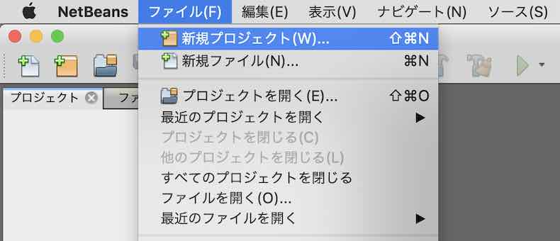

# nRF52840アプリケーション作成手順書

最終更新日：2023/1/11

Nordic社サンプルアプリケーションを土台に、nRF52840アプリケーションを作成する手順を記載しています。

## nRF52840アプリケーションについて

[Nordic社提供のサンプルアプリケーション](https://infocenter.nordicsemi.com/topic/sdk_nrf5_v17.0.2/ble_sdk_app_hrs.html)をベースに、BLEセントラル／USBインターフェースを増設した上で、業務アプリケーション（FIDO2機能、PIV機能、メンテナンス機能等）を搭載しています。


## 事前準備

#### NetBeans環境の作成

あらかじめ、NetBeans環境をPCに作成しておきます。<br>
具体的な手順は、[NetBeansインストール手順](../../../nRF52840_app/NETBEANSINST.md)をご参照ください。

#### nRF Utilのインストール

ビルドを実行する際に必要となる、nRF UtilをPCにインストールしておきます。<br>
具体的な手順は、[nRF Utilインストール手順](../../../nRF52840_app/NRFUTILINST.md)をご参照ください。

本手順書を作成した時に使用したnRF Utilは、`version 6.1`です。

```
bash-3.2$ nrfutil version
nrfutil version 6.1.0
bash-3.2$
```

#### MDBT50Q Dongleの初期化

[USBブートローダー書込み手順書](../../../nRF52840_app/firmwares/secure_bootloader/WRITESBL.md)の手順により、初期化されたMDBT50Q Dongleを準備します。

## ソースファイルの準備

#### オリジナルソースの取得

nRF5 SDKのサンプルアプリケーション・フォルダー（`${HOME}/opt/nRF5_SDK_17.1.0/examples/ble_peripheral/ble_app_hrs`）から、必要なソースコードを取得します。<br>
今回の作成にあたっては、[`<リポジトリールート>/nRF52840_app/examples/diverta`](../../../nRF52840_app/examples/diverta)配下に配置いたしました。

`ble_app_hrs`サブフォルダーには、不要なファイルが含まれていますので、適宜削除します。<br>
具体的には下記イメージになるかと存じます。


その後、ファイル接頭辞`ble_app_hrs`を、`secure_device_app`にリネームします。<br>
リネームしたのちのイメージは下図の通りです。


#### 秘密鍵ファイルの存在確認

[USBブートローダーファームウェア](../../../nRF52840_app/firmwares/secure_bootloader/BUILDSBL.md)生成時に使用した公開鍵に対応する秘密鍵ファイル（`secure_bootloader_prvkey.pem`）を、ユーザールートディレクトリーに配置しておきます。<br>
このファイルがないと、サンプルアプリケーションをUSBポート経由で書込みできません。

```
bash-3.2$ cd ${HOME}
bash-3.2$ ls -al *.pem
-rw-r--r--  1 makmorit  staff  227  7  8  2020 secure_bootloader_prvkey.pem
bash-3.2$
```

#### SDKソースコードの修正

[MDBT50Q Dongle](../../../FIDO2Device/MDBT50Q_Dongle/README.md)は、Nordic社のドングル「nRF52840 Dongle」から回路を修正しているため、`PCA_10059`のソースがそのまま利用できません。<br>
また、FIDO2機能で使用する汎用USB HIDサービスは、Nordic社ライブラリーの内容では動作させることができません。<br>
そのため、nRF5 SDKのフォルダー（`/nRF5_SDK_17.1.0/components/`）から、必要なソースコードを取得し、一部修正を加えております。

MDBT50Q Dongle用の独自定義、独自実装は下記ファイルになります。

| # |ファイル名 |説明 |
|:-:|:-|:-|
|1|`pca10059_01.h`|[MDBT50Q Dongle（rev2）](../../../FIDO2Device/MDBT50Q_Dongle/pcb_rev2/README.md)専用ヘッダーファイル|
|2|`pca10059_02.h`|[MDBT50Q Dongle（rev2.1.2）](../../../FIDO2Device/MDBT50Q_Dongle/pcb_rev2_1_2/README.md)専用ヘッダーファイル|
|3|`pca10059_03.h`|[MDBT50Q Dongle（rev2.2）](../../../FIDO2Device/MDBT50Q_Dongle/pcb_rev2_2/README.md)専用ヘッダーファイル|
|4|`app_usbd_core.c`|USBサービス実装を実装（オリジナルから一部修正）|
|5|`app_usbd_hid_generic.c`|USB HIDサービス実装を実装（オリジナルから一部修正）|

今回の作成にあたっては、[`<リポジトリールート>/nRF52840_app/components`](../../../nRF52840_app/components)配下に配置いたしました。

#### 設定ファイルの追加

本件ではサンプルアプリケーションの設定ファイル「`sdk_config.h`」を修正せず、代わりにファイル「`app_config.h`」にカスタマイズされた設定を記述することとしております。
ファイルは「`sdk_config.h`」と同じフォルダー「`nRF52840_app/examples/diverta/secure_device_app/pca10056/s140/config/`」配下に格納します。

## メイクファイルの修正

メイクファイル「[Makefile](../../../nRF52840_app/examples/diverta/secure_device_app/pca10056/s140/armgcc/Makefile)」について、オリジナルから修正を加えます。

#### define追加

【追加した行】
```
# target board (without ATECC608A, unless noted)
#  PCA10059_01  MDBT50Q Dongle(rev2)
#  PCA10059_02  MDBT50Q Dongle(rev2.1.2, with ATECC608A)
#  PCA10059_03  MDBT50Q Dongle(rev2.2)
TARGET_BOARD     := PCA10059_03

# application version info
FW_REV := 0.3.7
FW_BUILD := 101
CFLAGS += -DFW_REV=\"$(FW_REV)\"
CFLAGS += -DFW_BUILD=\"$(FW_BUILD)\"
# hardware version info
CFLAGS += -DHW_REV=\"$(TARGET_BOARD)\"

# Customized configs
CFLAGS += -DUSE_APP_CONFIG

# enable log output on PCA10056
ifeq ("$(TARGET_BOARD)","PCA10056")
    CFLAGS += -DNRF_LOG_BACKEND_UART_ENABLED=1
    CFLAGS += -DNRF_LOG_DEFAULT_LEVEL=4
endif
ifeq ("$(TARGET_BOARD)","PCA10059_01")
    CFLAGS += -DNRF_LOG_BACKEND_UART_ENABLED=0
endif
ifeq ("$(TARGET_BOARD)","PCA10059_02")
    CFLAGS += -DNRF_LOG_BACKEND_UART_ENABLED=0
endif
ifeq ("$(TARGET_BOARD)","PCA10059_03")
    # change TXD pin assignment
    CFLAGS += -DNRF_LOG_BACKEND_UART_TX_PIN=25
    CFLAGS += -DNRF_LOG_BACKEND_UART_ENABLED=1
endif

# for RSA & DES
CFLAGS += -DMBEDTLS_RSA_C -DMBEDTLS_OID_C -DMBEDTLS_DES_C

# for mbedtls_rsa_private
CFLAGS += -DMEMORY_MANAGER_XLARGE_BLOCK_COUNT=64

# disable ATECC608A (or ATECC608A is not installed)
# CFLAGS += -DNO_SECURE_IC
```

[注1] `TARGET_BOARD`の定義は、ブートローダー導入先の基板名を指定します。`PCA10059_01`を指定すると、MDBT50Q Dongle(rev2)向けのファームウェア更新イメージが生成されます。

#### パス修正

【修正前】
```
SDK_ROOT := ../../../../../..
PROJ_DIR := ../../..

$(OUTPUT_DIRECTORY)/nrf52840_xxaa.out: \
  LINKER_SCRIPT  := ble_app_hrs_gcc_nrf52.ld
```

【修正後】<br>
nRF52840アプリケーションに必要な定義を適宜加えています。<br>
また、リンク用スクリプトファイル名を変えています。
```
SDK_ROOT := $(HOME)/opt/nRF5_SDK_17.1.0
PROJ_DIR := ../../..
FIDO_DIR := $(PROJ_DIR)/../../../../FIDO2Device
CCID_DIR := $(PROJ_DIR)/../../../../CCID
FD2LIB_DIR := $(FIDO_DIR)/fido2_lib
U2FLIB_DIR := $(FIDO_DIR)/u2f_lib
CT2LIB_DIR := $(FIDO_DIR)/ctap2_lib
WRPHDR_DIR := $(FIDO_DIR)/wrapper_header
CIDLIB_DIR := $(CCID_DIR)/ccid_lib
PIVLIB_DIR := $(CCID_DIR)/piv_lib
PLTLIB_DIR := $(PROJ_DIR)/../plat_lib
BLELIB_DIR := $(PROJ_DIR)/../ble_lib
WRPLIB_DIR := $(PROJ_DIR)/../wrapper_lib
SDK_CUSTOM_ROOT := $(PROJ_DIR)/../../..
DEPLOY_ROOT := $(SDK_CUSTOM_ROOT)/firmwares/secure_device_app

# tinycbor root directory
TINYCBOR_ROOT := $(HOME)/GitHub/tinycbor

$(OUTPUT_DIRECTORY)/nrf52840_xxaa.out: \
  LINKER_SCRIPT  := secure_device_app_gcc_nrf52.ld
```

#### ターゲット変更（５箇所あります）

【修正前】
```
$(SDK_ROOT)/components/boards/boards.c \
：
$(SDK_ROOT)/components/boards \
：
CFLAGS += -DBOARD_PCA10056
：
ASMFLAGS += -DBOARD_PCA10056
：
default: nrf52840_xxaa
```

【修正後】
```
$(SDK_CUSTOM_ROOT)/components/boards/boards.c \
：
$(SDK_CUSTOM_ROOT)/components/boards \
：
CFLAGS += -DBOARD_$(TARGET_BOARD)
：
ASMFLAGS += -DBOARD_$(TARGET_BOARD)
：
ifeq ("$(TARGET_BOARD)","PCA10056")
    default: $(TARGETS) deploy_dk
else
    default: $(TARGETS) secure_pkg
endif
```

#### defineの追加

以下２点を追加しています。

```
CFLAGS += -DSWI_DISABLE0
ASMFLAGS += -DSWI_DISABLE0
```

#### 不要コードの削除

【削除した行】<br>
ビルド対象コードから、SEGGER RTT、Oberon関連のソースコードを削除しました。
```
$(SDK_ROOT)/external/segger_rtt/SEGGER_RTT.c \
$(SDK_ROOT)/external/segger_rtt/SEGGER_RTT_Syscalls_GCC.c \
$(SDK_ROOT)/external/segger_rtt/SEGGER_RTT_printf.c \
$(SDK_ROOT)/components/libraries/crypto/backend/oberon/oberon_backend_chacha_poly_aead.c \
$(SDK_ROOT)/components/libraries/crypto/backend/oberon/oberon_backend_ecc.c \
$(SDK_ROOT)/components/libraries/crypto/backend/oberon/oberon_backend_ecdh.c \
$(SDK_ROOT)/components/libraries/crypto/backend/oberon/oberon_backend_ecdsa.c \
$(SDK_ROOT)/components/libraries/crypto/backend/oberon/oberon_backend_eddsa.c \
$(SDK_ROOT)/components/libraries/crypto/backend/oberon/oberon_backend_hash.c \
$(SDK_ROOT)/components/libraries/crypto/backend/oberon/oberon_backend_hmac.c \
：
$(SDK_ROOT)/external/nrf_oberon \
：
$(SDK_ROOT)/external/segger_rtt \
```

#### リンク先ファイルの修正

FIDO2機能で必要なtinyCBORのライブラリーを追加でリンクします。<br>
また、Oberonは不要なので削除しています。

【修正前】
```
LIB_FILES += \
  $(SDK_ROOT)/external/nrf_cc310/lib/cortex-m4/hard-float/libnrf_cc310_0.9.13.a \
  $(SDK_ROOT)/external/nrf_oberon/lib/cortex-m4/hard-float/liboberon_3.0.6.a \
```

【修正後】
```
# Libraries common to all targets
LIB_FILES += \
  $(SDK_ROOT)/external/nrf_cc310/lib/cortex-m4/hard-float/libnrf_cc310_0.9.13.a \
  $(TINYCBOR_ROOT)/lib/libtinycbor.a \
```

#### デプロイ処理追加

【追加した行】
```
deploy_dk:
	@echo Application hex file for PCA10056 is now available.

secure_pkg:
	/usr/local/bin/nrfutil pkg generate --hw-version 52 --sd-req 0x0100 --application-version-string $(FW_REV) --application $(OUTPUT_DIRECTORY)/nrf52840_xxaa.hex --key-file $(HOME)/secure_bootloader_prvkey.pem $(DEPLOY_ROOT)/appkg.$(TARGET_BOARD).$(FW_REV).zip
	@echo Application zip package for secure bootloader is now available.
```

## ソースファイルからビルド

上記で取得したソースファイルから、NetBeansプロジェクトを新規作成し、動作確認用のファームウェア更新イメージ（`appkg.<基板名>.<バージョン文字列>.zip`ファイル）を生成します。<br>
下記例では、ファームウェア更新イメージファイル名は`appkg.PCA10059_03.0.3.7.zip`となります。

#### プロジェクトの新規作成〜ビルド実行

NetBeansを起動し、ファイル--->新規プロジェクトを実行します。



新規プロジェクト画面が表示されますので、一覧から「既存のソースを使用するC/C++プロジェクト」を選択し「次 >」をクリックします。


下図のような画面に遷移しますので、以下のように設定します。

- 既存のソースを含むフォルダを指定 - サンプルアプリが格納されているフォルダー「`examples/diverta/secure_device_app`」を指定します。<br>
下図の例では「`/Users/makmorit/GitHub/onecard-fido/nRF52840_app/examples/diverta/secure_device_app`」という文字列が設定されています。

- ツール・コレクションを選択 - 「GNU_ARM (GNU Mac)」をチェックします。
- 構成モードを選択 - 「カスタム(C)」をチェックします。

設定が完了したら「次 >」をクリックします。


下図のような画面に遷移しますので、以下のように設定します。

- 「事前ビルド・ステップが必要」にチェック

- フォルダで実行(U) - サンプルアプリのサブフォルダー「`pca10056/s140/armgcc`」を指定します。<br>
下図の例では「`/Users/makmorit/GitHub/onecard-fido/nRF52840_app/nRF52840_app/examples/diverta/secure_device_app/pca10056/s140/armgcc`」という文字列が設定されています。

- 「カスタム・コマンド」にチェック

- コマンド(O) - 「make」と入力します。

設定が完了したら「次 >」をクリックします。


「4. ビルド・アクション」に遷移しますが、以降は「7. プロジェクトの名前と場所」に遷移するまではデフォルト設定のまま「次 >」をクリックします。


「7. プロジェクトの名前と場所」に遷移したら、プロジェクト名(P)を「`secure_device_app`」から「`secure_device_app_proj`」に変更しておきます。<br>
（ソースフォルダー名「`secure_device_app`」を上書きしたくないための措置です）

設定が完了したら「終了(F)」をクリックします。


自動的にビルドがスタートしますので、しばらくそのまま待ちます。<br>
しばらくするとビルドが完了し「ビルド SUCCESSFUL」と表示されれば、ビルドは成功です。


#### ビルド結果の確認

ビルドが完了したら、ファームウェア更新イメージファイル`appkg.PCA10059_03.0.3.7.zip`が正しく生成されているかどうか確認します。<br>
下記は、ターミナルで`appkg.PCA10059_03.0.3.7.zip`(280KB)が生成されたことを確認したところです。

```
bash-3.2$ cd ${HOME}/GitHub/onecard-fido/nRF52840_app/firmwares/secure_device_app/
bash-3.2$ ls -al *.zip
-rw-r--r--  1 makmorit  staff  279529  1  9 18:21 appkg.PCA10059_03.0.3.7.zip
bash-3.2$
```

以上で、ソースファイルからのビルドは完了です。

## 初期動作確認

この時点では、ファームウェアはまだ、Nordic社提供のサンプル「[Heart Rate Application](../../../nRF52840_app/firmwares/sample_blehrs/BUILDHRS.md)」と同等の機能になっています。<br>
したがって「[サンプルアプリケーション動作確認手順書](../../../nRF52840_app/firmwares/sample_blehrs/WRITEHRS.md)」に準じた動作確認を進めます。

#### MDBT50Q Dongleを初期化

まずは、別途ドキュメント「[USBブートローダー書込み手順書](../../../nRF52840_app/firmwares/secure_bootloader/WRITESBL.md)」に従い、MDBT50Q Dongleを初期化します。<br>
MDBT50Q Dongleの基板上で、緑色・橙色のLEDが同時点灯している状態である事を確認します。


#### ファームウェア更新イメージの書込み

`nrfutil dfu usb-serial`コマンドを実行し、仮想COMポート経由で、ファームウェア更新イメージファイルを転送します。<br>
具体的には、以下のコマンドを投入します。

```
FIRMWARES_DIR="${HOME}/GitHub/onecard-fido/nRF52840_app/firmwares/secure_device_app/"
cd ${FIRMWARES_DIR}
PACKAGE=`ls appkg.PCA10059_*.zip`
PORTNAME=`ls /dev/tty.usbmodem*`
echo command [nrfutil dfu usb-serial -pkg ${PACKAGE} -p ${PORTNAME}]
nrfutil dfu usb-serial -pkg ${PACKAGE} -p ${PORTNAME}
```

下記は実行例になります。

```
bash-3.2$ FIRMWARES_DIR="${HOME}/GitHub/onecard-fido/nRF52840_app/firmwares/secure_device_app/"
bash-3.2$ cd ${FIRMWARES_DIR}
bash-3.2$ PACKAGE=`ls appkg.PCA10059_*.zip`
bash-3.2$ PORTNAME=`ls /dev/tty.usbmodem*`
bash-3.2$ echo command [nrfutil dfu usb-serial -pkg ${PACKAGE} -p ${PORTNAME}]
command [nrfutil dfu usb-serial -pkg appkg.PCA10059_03.0.3.7.zip -p /dev/tty.usbmodemD496DB4407941]
bash-3.2$ nrfutil dfu usb-serial -pkg ${PACKAGE} -p ${PORTNAME}
  [####################################]  100%          
Device programmed.
bash-3.2$
```

#### 書込み完了

書込処理が終了すると、MDBT50Q Dongleが自動的にリセットされ、サンプルアプリケーションがスタートします。<br>
アイドル時であることを表示する橙色のLEDが点滅していることを確認します。


#### 動作確認

別ドキュメント「[サンプルアプリケーション動作確認手順書](../../../nRF52840_app/firmwares/sample_blehrs/WRITEHRS.md)」の章「サンプルアプリケーションの動作確認」を参考に、動作確認を進めます。<br>


動作確認の結果がOKであれば、前SDKバージョンのnRF52840アプリケーションから、ソースコードの移行作業を進めていくことになります。

## 業務アプリケーションの移行

nRF52840アプリケーションの業務機能が動作するように、サンプルアプリケーションのメインプログラムを書き換えるとともに、業務アプリケーションのソースコード群を移行します。

#### メインプログラムの修正

ファイル[`main.c`](../../../nRF52840_app/examples/diverta/secure_device_app/main.c)を以下のように修正します。<br>
この際、オリジナルのソースコードは`#ifdef ORIGINAL_MAIN〜#endif`の構文により無効化（コメントアウト）するようにします。

<b>【追加した行（ヘッダー部）】</b>
```
#include "nordic_common.h"
#include "nrf_ble_lesc.h"
#include "nrf_pwr_mgmt.h"
#include "nrf_log.h"
#include "nrf_log_ctrl.h"
#include "nrf_log_default_backends.h"
#include "app_error.h"

#define DEAD_BEEF                           0xDEADBEEF  /**< Value used as error code on stack dump, can be used to identify stack location on stack unwind. */

// HW依存処理関連
#include "fido_platform.h"
#include "application_init.h"
#include "ble_service_common.h"
#include "ble_service_peripheral.h"
#include "fido_board.h"
#include "fido_ble_pairing.h"
#include "fido_flash_plat.h"
#include "usbd_service.h"
```

<b>【追加した行（コード部）】</b>
```
// 基本機能の初期化
log_init();
usbd_service_init();
usbd_service_pwr_detect_func(ble_service_common_disable_peripheral);
fido_board_button_timers_init();
power_management_init();
// FDS関連の初期化
fido_flash_storage_init();
// BLE関連の初期化
ble_service_common_init();
// BLEペリフェラル初期化の前に、
// ペアリングモードをPeer Manager等から取得
fido_ble_pairing_get_mode();    
// BLEペリフェラルの初期化
ble_service_peripheral_init();
// USBデバイスを開始
usbd_service_start();
// アプリケーション稼働に必要な初期化処理を開始
application_init_start();
// Enter main loop.
for (;;) {
    // 業務処理を実行
    application_main();
    idle_state_handle();
}
```

#### 業務アプリケーションの移行

メイクファイル[`Makefile`](../../../nRF52840_app/examples/diverta/secure_device_app/pca10056/s140/armgcc/Makefile)に、業務アプリケーションのソースコード群を追記します。

<b>【追加した行】</b>
```
# Customized sources
SRC_FILES += \
  $(SDK_ROOT)/components/ble/nrf_ble_scan/nrf_ble_scan.c \
  $(SDK_ROOT)/components/libraries/crypto/backend/mbedtls/mbedtls_backend_aes.c \
  $(SDK_ROOT)/components/libraries/crypto/backend/mbedtls/mbedtls_backend_init.c \
  $(SDK_ROOT)/components/libraries/usbd/app_usbd_string_desc.c \
  $(SDK_ROOT)/components/libraries/usbd/app_usbd.c \
  $(SDK_ROOT)/components/libraries/usbd/class/hid/app_usbd_hid.c \
  $(SDK_ROOT)/external/mbedtls/library/aes.c \
  $(SDK_ROOT)/external/mbedtls/library/aesni.c \
  $(SDK_ROOT)/external/mbedtls/library/bignum.c \
  $(SDK_ROOT)/external/mbedtls/library/cipher.c \
  $(SDK_ROOT)/external/mbedtls/library/cipher_wrap.c \
  $(SDK_ROOT)/external/mbedtls/library/des.c \
  $(SDK_ROOT)/external/mbedtls/library/platform.c \
  $(SDK_ROOT)/external/mbedtls/library/platform_util.c \
  $(SDK_ROOT)/external/mbedtls/library/rsa_internal.c \
  $(SDK_ROOT)/external/mbedtls/library/rsa.c \
  $(SDK_ROOT)/integration/nrfx/legacy/nrf_drv_power.c \
  $(SDK_ROOT)/integration/nrfx/legacy/nrf_drv_twi.c \
  $(SDK_ROOT)/modules/nrfx/drivers/src/nrfx_power.c \
  $(SDK_ROOT)/modules/nrfx/drivers/src/nrfx_twi.c \
  $(SDK_ROOT)/modules/nrfx/drivers/src/nrfx_twim.c \
  $(SDK_ROOT)/modules/nrfx/drivers/src/nrfx_usbd.c \
  $(SDK_CUSTOM_ROOT)/components/libraries/usbd/app_usbd_core.c \
  $(SDK_CUSTOM_ROOT)/components/libraries/usbd/class/hid/generic/app_usbd_hid_generic.c \
  $(BLELIB_DIR)/ble_service_common.c \
  $(BLELIB_DIR)/ble_service_peripheral.c \
  $(BLELIB_DIR)/fido_ble_event.c \
  $(BLELIB_DIR)/fido_ble_pairing.c \
  $(BLELIB_DIR)/fido_ble_send_retry.c \
  $(BLELIB_DIR)/fido_ble_service.c \
  $(CIDLIB_DIR)/ccid_apdu.c \
  $(CIDLIB_DIR)/ccid_main.c \
  $(CIDLIB_DIR)/ccid_process.c \
  $(PIVLIB_DIR)/ccid_piv.c \
  $(PIVLIB_DIR)/ccid_piv_general_auth.c \
  $(PIVLIB_DIR)/ccid_piv_authenticate.c \
  $(PIVLIB_DIR)/ccid_piv_object.c \
  $(PIVLIB_DIR)/ccid_piv_object_import.c \
  $(PIVLIB_DIR)/ccid_piv_pin.c \
  $(PIVLIB_DIR)/ccid_piv_pin_auth.c \
  $(PIVLIB_DIR)/ccid_piv_pin_update.c \
  $(PIVLIB_DIR)/ccid_ykpiv.c \
  $(PIVLIB_DIR)/ccid_ykpiv_import_key.c \
  $(CT2LIB_DIR)/ctap2_cbor.c \
  $(CT2LIB_DIR)/ctap2_cbor_authgetinfo.c \
  $(CT2LIB_DIR)/ctap2_cbor_encode.c \
  $(CT2LIB_DIR)/ctap2_cbor_parse.c \
  $(CT2LIB_DIR)/ctap2_client_pin.c \
  $(CT2LIB_DIR)/ctap2_client_pin_token.c \
  $(CT2LIB_DIR)/ctap2_common.c \
  $(CT2LIB_DIR)/ctap2_extension_hmac_secret.c \
  $(CT2LIB_DIR)/ctap2_get_assertion.c \
  $(CT2LIB_DIR)/ctap2_make_credential.c \
  $(CT2LIB_DIR)/ctap2_pubkey_credential.c \
  $(FD2LIB_DIR)/fido_ble_receive.c \
  $(FD2LIB_DIR)/fido_ble_send.c \
  $(FD2LIB_DIR)/fido_command.c \
  $(FD2LIB_DIR)/fido_command_common.c \
  $(FD2LIB_DIR)/fido_common.c \
  $(FD2LIB_DIR)/fido_ctap2_command.c \
  $(FD2LIB_DIR)/fido_development.c \
  $(FD2LIB_DIR)/fido_hid_channel.c \
  $(FD2LIB_DIR)/fido_hid_receive.c \
  $(FD2LIB_DIR)/fido_hid_send.c \
  $(FD2LIB_DIR)/fido_maintenance.c \
  $(FD2LIB_DIR)/fido_receive_apdu.c \
  $(FD2LIB_DIR)/fido_u2f_command.c \
  $(PLTLIB_DIR)/application_init.c \
  $(PLTLIB_DIR)/fido_board.c \
  $(PLTLIB_DIR)/fido_crypto.c \
  $(PLTLIB_DIR)/fido_crypto_aes_cbc_256.c \
  $(PLTLIB_DIR)/fido_crypto_hmac_sha1.c \
  $(PLTLIB_DIR)/fido_crypto_keypair.c \
  $(PLTLIB_DIR)/fido_crypto_sskey.c \
  $(PLTLIB_DIR)/fido_flash_client_pin_store.c \
  $(PLTLIB_DIR)/fido_flash_common.c \
  $(PLTLIB_DIR)/fido_flash_event.c \
  $(PLTLIB_DIR)/fido_flash_pairing_mode.c \
  $(PLTLIB_DIR)/fido_flash_password.c \
  $(PLTLIB_DIR)/fido_flash_skey_cert.c \
  $(PLTLIB_DIR)/fido_flash_token_counter.c \
  $(PLTLIB_DIR)/fido_timer_plat.c \
  $(PLTLIB_DIR)/fido_twi.c \
  $(PLTLIB_DIR)/rv3028c7_i2c.c \
  $(PLTLIB_DIR)/sha1.c \
  $(PLTLIB_DIR)/usbd_service.c \
  $(PLTLIB_DIR)/usbd_service_bos.c \
  $(PLTLIB_DIR)/usbd_service_ccid.c \
  $(PLTLIB_DIR)/usbd_service_hid.c \
  $(U2FLIB_DIR)/u2f_authenticate.c \
  $(U2FLIB_DIR)/u2f_keyhandle.c \
  $(U2FLIB_DIR)/u2f_register.c \
  $(U2FLIB_DIR)/u2f_signature.c \
  $(WRPLIB_DIR)/ccid_crypto.c \
  $(WRPLIB_DIR)/ccid_flash_oath_object.c \
  $(WRPLIB_DIR)/ccid_flash_object.c \
  $(WRPLIB_DIR)/ccid_flash_openpgp_object.c \
  $(WRPLIB_DIR)/ccid_flash_piv_object.c \
  $(WRPLIB_DIR)/fido_ble_unpairing.c \
  $(WRPLIB_DIR)/fido_status_indicator.c \
  $(WRPLIB_DIR)/fido_timer.c \
  $(WRPLIB_DIR)/rtcc.c \

ifeq ("$(TARGET_BOARD)","PCA10059_02")
# Source files to targets (Boards with ATECC608A)
SCIC_DIR := $(PROJ_DIR)/../../../../SECUREIC
ATELIB_DIR := $(SCIC_DIR)/atecc_lib
SRC_FILES += \
  $(ATELIB_DIR)/atecc.c \
  $(ATELIB_DIR)/atecc_aes.c \
  $(ATELIB_DIR)/atecc_command.c \
  $(ATELIB_DIR)/atecc_device.c \
  $(ATELIB_DIR)/atecc_iface.c \
  $(ATELIB_DIR)/atecc_nonce.c \
  $(ATELIB_DIR)/atecc_priv.c \
  $(ATELIB_DIR)/atecc_read.c \
  $(ATELIB_DIR)/atecc_setup.c \
  $(ATELIB_DIR)/atecc_sign.c \
  $(ATELIB_DIR)/atecc_util.c \
  $(ATELIB_DIR)/atecc_write.c \
  $(PLTLIB_DIR)/atecc608a_i2c_hal.c \

INC_FOLDERS += \
  $(ATELIB_DIR) \

else
CFLAGS += -DNO_SECURE_IC
endif

INC_FOLDERS += \
  $(SDK_ROOT)/components/ble/nrf_ble_scan \
  $(SDK_ROOT)/components/libraries/bootloader \
  $(TINYCBOR_ROOT)/src \
  $(BLELIB_DIR) \
  $(CIDLIB_DIR) \
  $(CT2LIB_DIR) \
  $(FD2LIB_DIR) \
  $(PIVLIB_DIR) \
  $(PLTLIB_DIR) \
  $(U2FLIB_DIR) \
  $(WRPHDR_DIR) \

# Source files of OpenPGP card emulation
OPGLIB_DIR := $(CCID_DIR)/openpgp_lib
SRC_FILES += \
  $(OPGLIB_DIR)/ccid_openpgp_attr.c \
  $(OPGLIB_DIR)/ccid_openpgp_crypto.c \
  $(OPGLIB_DIR)/ccid_openpgp_data.c \
  $(OPGLIB_DIR)/ccid_openpgp_key_rsa.c \
  $(OPGLIB_DIR)/ccid_openpgp_key.c \
  $(OPGLIB_DIR)/ccid_openpgp_object.c \
  $(OPGLIB_DIR)/ccid_openpgp_pin.c \
  $(OPGLIB_DIR)/ccid_openpgp.c \
  $(OPGLIB_DIR)/ccid_pin_auth.c \

INC_FOLDERS += \
  $(OPGLIB_DIR) \

# Source files for OATH
OATLIB_DIR := $(CCID_DIR)/oath_lib
SRC_FILES += \
  $(OATLIB_DIR)/ccid_oath.c \
  $(OATLIB_DIR)/ccid_oath_account.c \
  $(OATLIB_DIR)/ccid_oath_calculate.c \
  $(OATLIB_DIR)/ccid_oath_list.c \
  $(OATLIB_DIR)/ccid_oath_object.c \
  $(OATLIB_DIR)/ccid_oath_totp.c \

INC_FOLDERS += \
  $(OATLIB_DIR) \
```

#### 再ビルドの実行

NetBeansで再度、ビルドを実行し、ファームウェア更新イメージファイル`appkg.PCA10059_01.0.2.13.zip`を再作成します。


## 再ビルド後の動作確認

別ドキュメント「[nRF52840アプリケーション初回導入手順書](../../../nRF52840_app/firmwares/secure_device_app/WRITEAPP.md)」に従い、MDBT50Q Dongleに、再ビルドしたファームウェア更新イメージファイルを導入します。<br>

導入作業後は、MDBT50Q DongleでnRF52840アプリケーションが動作するようになります。<br>
また、管理ツールを使用し、後日、nRF52840アプリケーションの更新もできるようになります。


以上で、nRF52840アプリケーションの作成は完了です。
